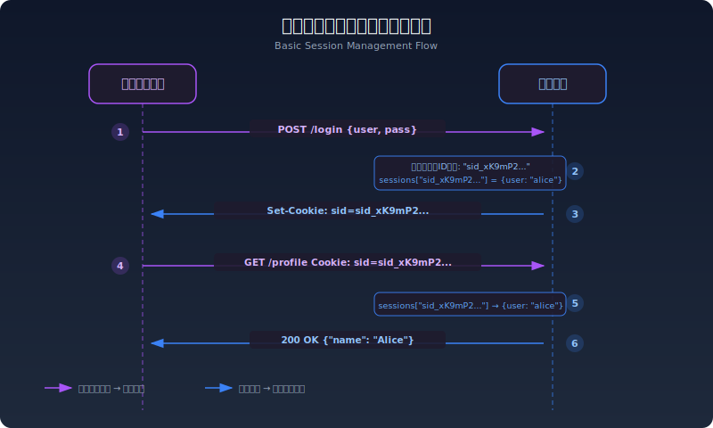
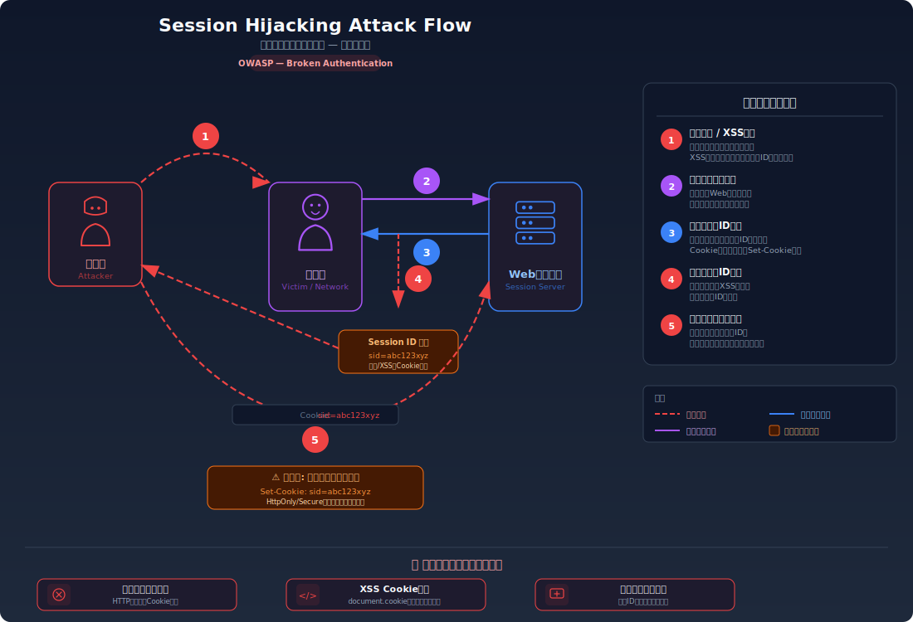
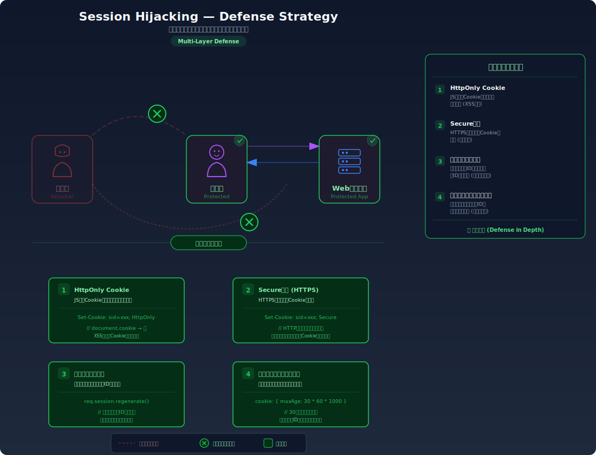

# セッション管理の基礎

> ステートレスなHTTPの上で「ログイン状態」を維持するためのセッション管理の仕組みと、Cookie、セッションID、hiddenパラメータのセキュリティ特性を解説します。

---

## ステートレスなHTTPとセッション管理の必要性

### HTTPはステートレス

HTTPプロトコルは<strong>ステートレス（状態を持たない）</strong>である。各リクエストは完全に独立しており、サーバーは前回のリクエストの情報を保持しない。

```http
# 1回目のリクエスト: ログインに成功
POST /api/login → 200 OK (認証成功)

# 2回目のリクエスト: サーバーは1回目のことを覚えていない
GET /api/profile → 401 Unauthorized (誰?)
```

HTTPがステートレスに設計されたのには理由がある:

- サーバーの実装がシンプルになる
- スケーラビリティが高い（どのサーバーでもリクエストを処理できる）
- 障害時の影響が限定的

しかし、Webアプリケーションでは「ログイン状態の維持」「ショッピングカート」「ユーザー設定」など、**状態の管理が不可欠**である。この矛盾を解決するのがセッション管理の仕組みである。

### セッション管理の基本的な流れ

```text
1. ユーザーがログインに成功する
2. サーバーが「セッションID」と呼ばれる一意の識別子を生成する
3. サーバーはセッションIDとユーザー情報を紐づけて保存する
4. セッションIDをクライアントに返す（通常はCookieで）
5. 以降のリクエストで、クライアントがセッションIDを送信する
6. サーバーはセッションIDからユーザーを特定し、状態を復元する
```



---

## Cookieの仕組み

Cookieは、サーバーがブラウザに保存させる小さなデータである。セッション管理の最も一般的な実装手段として使われる。

### Set-CookieとCookieヘッダ

```http
# サーバー → ブラウザ: Cookieを保存するよう指示
HTTP/1.1 200 OK
Set-Cookie: session_id=abc123; Path=/; HttpOnly; Secure; SameSite=Lax

# ブラウザ → サーバー: 保存したCookieを自動送信
GET /api/profile HTTP/1.1
Cookie: session_id=abc123
```

<div class="cookie-flow">
  <div class="cookie-flow__step cookie-flow__step--server">
    <strong>サーバー</strong><br/>Set-Cookie: sid=abc
  </div>
  <div class="cookie-flow__arrow">→</div>
  <div class="cookie-flow__step cookie-flow__step--browser">
    <strong>ブラウザ</strong><br/>Cookieを保存
  </div>
  <div class="cookie-flow__arrow">→</div>
  <div class="cookie-flow__step cookie-flow__step--auto">
    <strong>自動送信</strong><br/>Cookie: sid=abc
  </div>
</div>

重要なポイント: **ブラウザはCookieを自動的に送信する**。ユーザーがCookieの送信を意識する必要はなく、条件に合致するリクエストにはブラウザが自動的にCookieを付与する。この「自動送信」がCSRF攻撃の根本原因となる。

### Cookieの属性

| 属性 | 説明 | セキュリティへの影響 |
|------|------|----------------------|
| **Domain** | Cookieが送信されるドメインの範囲 | 広すぎると他のサブドメインにもCookieが送信される |
| **Path** | Cookieが送信されるパスの範囲 | セキュリティ境界としては不十分 |
| **Secure** | HTTPS接続時のみ送信 | HTTP通信でのCookie漏洩を防止 |
| **HttpOnly** | JavaScriptからアクセス不可 | XSSによるCookie窃取を防止 |
| **SameSite** | クロスサイトリクエストでの送信制御 | CSRF攻撃の緩和 |
| **Expires / Max-Age** | Cookieの有効期限 | 長すぎるとセッションハイジャックのリスク増大 |

### SameSite属性の詳細

SameSite属性はCSRF対策の重要な仕組みである。

| 値 | 動作 |
|----|------|
| **Strict** | クロスサイトリクエストでは一切Cookieを送信しない。最も安全だが、外部リンクからのアクセスでもCookieが送信されないため、ユーザー体験に影響する |
| **Lax** | GETリクエスト（トップレベルナビゲーション）にのみCookieを送信。POSTではCookieが送信されない。モダンブラウザのデフォルト値 |
| **None** | すべてのクロスサイトリクエストでCookieを送信する。`Secure` 属性が必須 |

```http
# 安全なCookie設定の例
Set-Cookie: session_id=abc123; Path=/; HttpOnly; Secure; SameSite=Lax; Max-Age=3600
```

```bash
# curlでCookieを送信する
curl -b "session_id=abc123" http://localhost:3000/api/profile

# Set-Cookieヘッダを確認する
curl -v http://localhost:3000/api/login \
  -H "Content-Type: application/json" \
  -d '{"username": "alice", "password": "secret123"}' 2>&1 | grep -i set-cookie
```

---

## セッションIDの役割と要件

セッションIDはサーバー側に保存されたセッション情報への「鍵」である。この鍵が推測されたり窃取されたりすると、攻撃者がそのユーザーになりすますことができてしまう（セッションハイジャック）。

### セッションIDに求められる要件

| 要件 | 理由 |
|------|------|
| **十分な長さ** | 短いIDは総当たり攻撃で推測可能。128ビット（32文字の16進数）以上が推奨 |
| **暗号論的に安全な乱数** | `Math.random()` は予測可能。`crypto.randomBytes()` 等を使用すること |
| **推測困難性** | 連番やタイムスタンプベースのIDは予測可能なため使ってはいけない |
| **一意性** | 異なるセッションに同じIDが割り当てられてはいけない |

### 安全でないセッションID生成の例

```typescript
// ⚠️ 危険: 連番ベースのセッションID
let counter = 1;
function generateSessionId() {
  return `session_${counter++}`;  // session_1, session_2, session_3...
  // → 攻撃者は次のIDを容易に推測できる
}

// ⚠️ 危険: Math.random()ベース
function generateSessionId() {
  return Math.random().toString(36).substring(2);
  // → Math.random()は暗号論的に安全ではなく、内部状態から予測可能
}

// ⚠️ 危険: タイムスタンプベース
function generateSessionId() {
  return `sid_${Date.now()}`;
  // → 時刻を知っていれば推測可能
}
```

### 安全なセッションID生成の例

```typescript
import { randomBytes } from 'crypto';

// ✅ 安全: 暗号論的に安全な乱数を使用
function generateSessionId(): string {
  return randomBytes(32).toString('hex');
  // → 64文字の16進数（256ビット）のランダムな文字列
  // 例: "a3f2b8c4d1e6f0987654321abcdef01234567890abcdef1234567890abcdef01"
}
```

---

## セッションIDの格納場所の比較

セッションIDをクライアントに保持させる方法は複数あり、それぞれセキュリティ特性が異なる。

### Cookie

```http
Set-Cookie: session_id=abc123; HttpOnly; Secure; SameSite=Lax
```

| 利点 | 欠点 |
|------|------|
| ブラウザが自動送信（実装が楽） | CSRF攻撃のリスク（SameSiteで緩和可能） |
| HttpOnlyでXSSからの窃取を防止可能 | サードパーティCookieの制限が進んでいる |
| Secureでhttps限定にできる | |

**最も推奨される方式**。適切な属性（HttpOnly, Secure, SameSite）を設定すれば、安全性と利便性のバランスが良い。

### URLパラメータ

```text
http://example.com/profile?session_id=abc123
```

| 利点 | 欠点 |
|------|------|
| Cookieが使えない環境で使用可能 | **Refererヘッダで外部に漏洩する** |
| | ブラウザ履歴に残る |
| | URLの共有やブックマークでセッションが漏洩する |
| | サーバーログに記録される |
| | ショルダーサーフィン（画面の覗き見）で漏洩 |

**セキュリティ上、URLでのセッションID送信は避けるべき**。やむを得ない場合は、Referer制御とセッションの短寿命化を徹底する。

### hiddenパラメータ

```html
<form action="/api/transfer" method="POST">
  <input type="hidden" name="session_id" value="abc123">
  <input type="hidden" name="amount" value="1000">
  <button type="submit">送金</button>
</form>
```

| 利点 | 欠点 |
|------|------|
| URLに露出しない | ページ遷移ごとにhiddenフィールドを含める必要がある |
| GETリクエストに含まれない | **HTMLソースを見れば値が分かる**（開発者ツールで確認可能） |
| | SPAでは使いにくい |

---

## hiddenパラメータの仕組みとセキュリティ上の注意点

hiddenパラメータはフォーム上でユーザーに見せずにデータを送信するための仕組みである。セッションIDの格納以外にも、CSRFトークンや各種IDの送信に広く使われる。

### 基本的な仕組み

```html
<!-- HTMLソース上にはあるが、ブラウザ画面には表示されない -->
<form action="/api/purchase" method="POST">
  <input type="hidden" name="product_id" value="42">
  <input type="hidden" name="price" value="1000">
  <input type="text" name="quantity" value="1">
  <button type="submit">購入</button>
</form>
```

### セキュリティ上の注意点

hiddenパラメータの値は「見えない」だけであり、**改ざんは容易**である。

```bash
# DevToolsのElementsタブでhiddenフィールドの値を変更可能
# 例: price を 1000 → 1 に変更して送信

# curlならhiddenフィールドの制約は無関係
curl -X POST http://localhost:3000/api/purchase \
  -H "Content-Type: application/x-www-form-urlencoded" \
  -d "product_id=42&price=1&quantity=100"
```

**原則**: hiddenパラメータはクライアント側の値であり、**信頼してはいけない**。サーバー側で必ず検証すること。

| 用途 | hiddenパラメータの適切さ |
|------|--------------------------|
| CSRFトークン | 適切（サーバー側で検証する） |
| 商品ID（参照用） | 適切（サーバー側で価格を再取得する） |
| 価格（そのまま使う） | **不適切**（改ざんされた値をそのまま課金に使ってしまう） |
| セッションID | 非推奨（Cookieの方が安全） |

---

## まとめ

HTTPとセッション管理の理解は、Webセキュリティの土台である。ここで紹介した概念は、以下のハンズオンラボで実際に手を動かして体験できる。

| 概念 | 関連する攻撃・問題 |
|------|---------------------|
| HTTPヘッダの公開性 | 情報漏洩（ヘッダリーク） |
| GETパラメータの可視性 | Referer経由の情報漏洩 |
| ステータスコードの違い | ユーザー列挙攻撃 |
| Cookieの自動送信 | CSRF攻撃 |
| セッションIDの推測可能性 | セッションハイジャック |
| hiddenパラメータの改ざん | 価格改ざん、権限バイパス |

---

## 攻撃フロー図

### セッションハイジャック攻撃



### セッションハイジャック対策



---

## セッション確立のシーケンス図


---

## 関連ラボ

以下のラボで、本ドキュメントの知識を実際に試すことができる:

### Step 04: セッション管理

| ラボ | 関連する知識 |
|------|--------------|
| [セッションハイジャック](../../step04-session/session-hijacking.mdx) | セッションIDの要件、Cookie属性 |
| [セッション固定攻撃](../../step04-session/session-fixation.mdx) | セッションIDの管理 |
| [Cookie操作](../../step04-session/cookie-manipulation.mdx) | Cookie属性の理解 |
| [CSRF](../../step04-session/csrf.mdx) | Cookieの自動送信、SameSite属性 |

---

## 理解度テスト

学んだ内容をクイズで確認してみましょう:

- [セッション管理の基礎 - 理解度テスト](./session-management-quiz)

---

## 参考資料

- [MDN - HTTP Cookie の使用](https://developer.mozilla.org/ja/docs/Web/HTTP/Cookies)
- [OWASP - Session Management Cheat Sheet](https://cheatsheetseries.owasp.org/cheatsheets/Session_Management_Cheat_Sheet.html)
- [RFC 6265 - HTTP State Management Mechanism (Cookie)](https://datatracker.ietf.org/doc/html/rfc6265)
