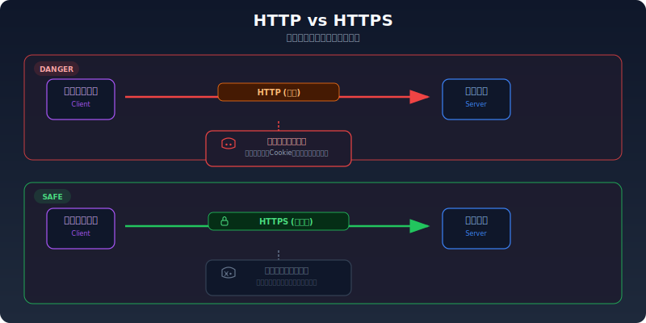
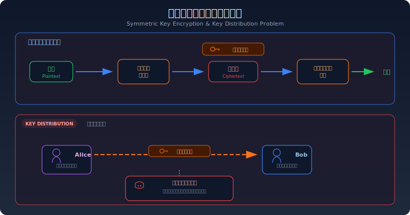
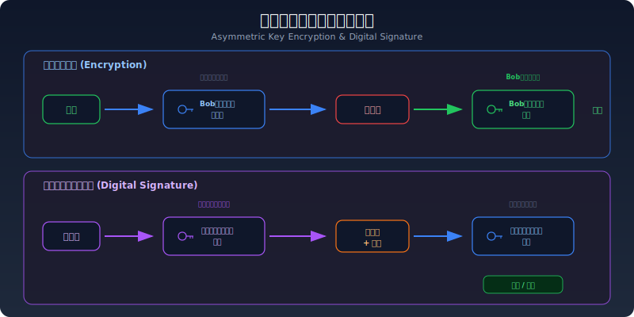
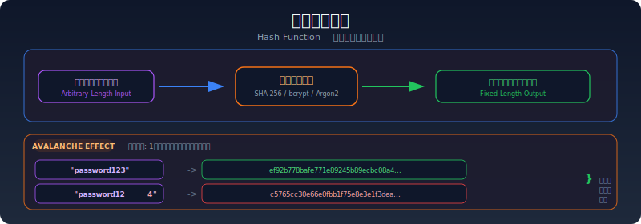
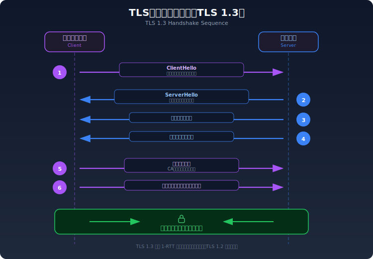
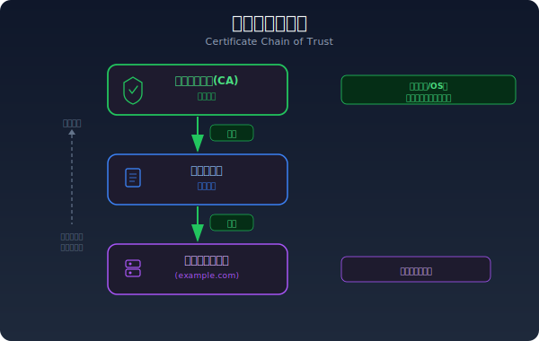
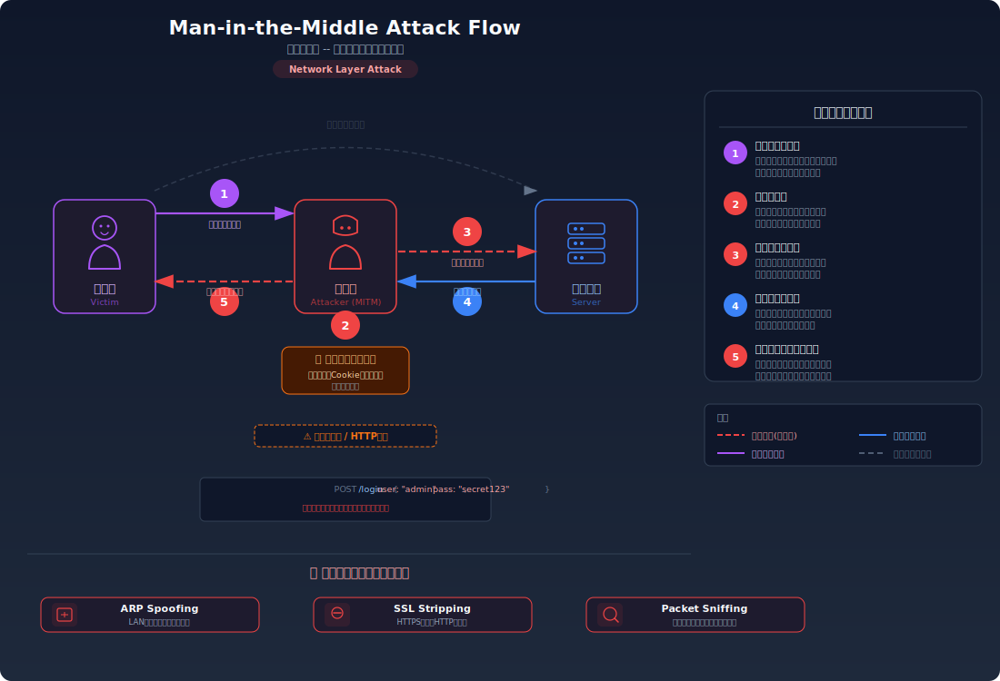
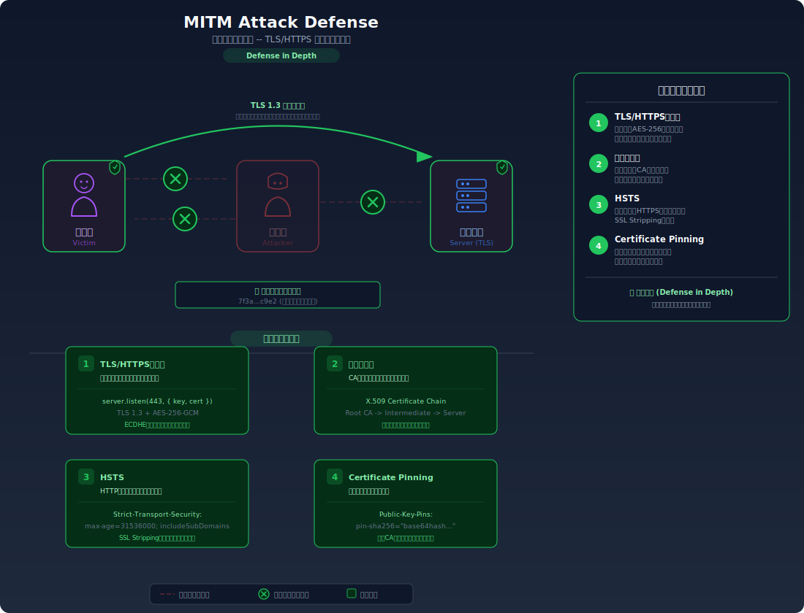
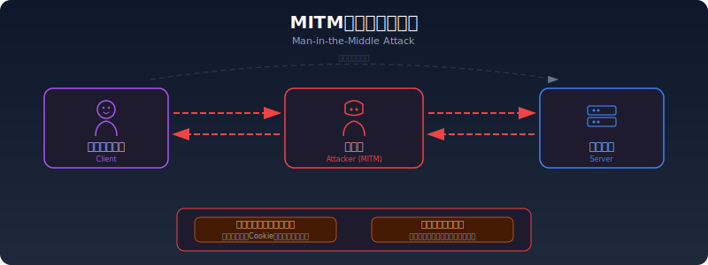

# 暗号化・ハッシュの基礎

> TLS/HTTPSの仕組み、ハッシュ関数の特性、共通鍵暗号と公開鍵暗号の違いを解説します。認証やJWT（JSON Web Token）を理解する上で不可欠な前提知識です。

---

## なぜ暗号化が必要か

HTTPはデフォルトで**平文通信**であり、ネットワーク上のデータは誰でも盗聴可能である。



---

## 共通鍵暗号（対称暗号）

暗号化と復号に**同じ鍵**を使う方式。



| 特性 | 内容 |
|------|------|
| 鍵の数 | 暗号化・復号で同一の鍵 |
| 速度 | 高速（大量データの暗号化に適する） |
| 代表的なアルゴリズム | AES-128, AES-256, ChaCha20 |
| 課題 | **鍵の配送問題**: 通信相手に安全に共通鍵を渡す方法がない |

---

## 公開鍵暗号（非対称暗号）

**公開鍵**と**秘密鍵**のペアを使う方式。鍵の配送問題を解決する。



| 特性 | 内容 |
|------|------|
| 鍵の数 | 公開鍵（暗号化用）と秘密鍵（復号用）のペア |
| 速度 | 低速（鍵交換や署名に使い、大量データの暗号化には不向き） |
| 代表的なアルゴリズム | RSA, ECDSA, Ed25519 |
| 利点 | 公開鍵は公開しても安全。鍵の配送問題が解消される |

### デジタル署名

公開鍵暗号の逆方向の操作で、**データの改ざん検知**と**送信者の証明**を行う。

JWTのRS256署名やSSH公開鍵認証はこの仕組みを利用している。

---

## ハッシュ関数

入力データを<strong>固定長の値（ハッシュ値）</strong>に変換する一方向関数。



### ハッシュ関数の特性

| 特性 | 説明 |
|------|------|
| **一方向性** | ハッシュ値から元のデータを復元できない |
| **衝突耐性** | 異なる入力から同じハッシュ値が生成されにくい |
| **雪崩効果** | 入力が1ビット変わるだけでハッシュ値が大きく変化する |
| **固定長出力** | 入力の長さに関係なく、出力は常に同じ長さ |

### 主要なハッシュアルゴリズム

| アルゴリズム | 出力長 | 安全性 | 用途 |
|-------------|--------|--------|------|
| MD5 | 128bit | **非推奨**（衝突攻撃が実用化） | レガシーシステムのみ |
| SHA-1 | 160bit | **非推奨**（衝突攻撃が実証済み） | Git（識別用途のみ） |
| SHA-256 | 256bit | 安全 | TLS証明書、ブロックチェーン |
| SHA-3 | 可変 | 安全 | SHA-2の代替 |
| bcrypt | 可変 | 安全 | **パスワードハッシュ専用** |
| Argon2 | 可変 | 安全 | **パスワードハッシュ専用**（最新推奨） |

### パスワードハッシュの注意点

パスワードの保存には**汎用ハッシュ関数（SHA-256等）を直接使ってはいけない**。

```text
⚠️ 危険: SHA-256でパスワードをハッシュ
"password123" → SHA-256 → ef92b778bafe...
→ レインボーテーブル（事前計算済みハッシュの辞書）で逆引き可能
→ 高速すぎるため総当たり攻撃が容易

✅ 安全: bcrypt/Argon2でパスワードをハッシュ
"password123" → bcrypt(cost=12) → $2b$12$LJ3m4ys...
→ ソルト（ランダム値）が自動付与されるためレインボーテーブル攻撃が無効
→ 意図的に低速に設計されており総当たり攻撃のコストが高い
```

---

## TLS/HTTPSの仕組み

TLS（Transport Layer Security）は、HTTP通信を暗号化するプロトコルである。HTTPSは「HTTP over TLS」の略称。

### TLSハンドシェイク

TLS接続の確立は以下の手順で行われる（TLS 1.3の簡略版）:



### 証明書チェーン

サーバー証明書の信頼性は、<strong>認証局（CA）</strong>による署名のチェーンで保証される。



ブラウザはサーバー証明書の署名を上位CAの公開鍵で検証し、最終的にルートCAまで辿ることで信頼性を確認する。

### MITM（中間者）攻撃フロー図





### MITM（中間者）攻撃

TLS/HTTPSがない場合、攻撃者がクライアントとサーバーの間に割り込んで通信を盗聴・改ざんできる。



TLSの証明書検証により、クライアントは通信相手が正当なサーバーであることを確認できる。証明書が不正な場合、ブラウザは警告を表示する。

---

## 暗号方式の比較

| 方式 | 鍵 | 速度 | 用途 |
|------|-----|------|------|
| 共通鍵暗号 | 暗号化=復号（同じ鍵） | 高速 | データの暗号化（AES） |
| 公開鍵暗号 | 暗号化≠復号（鍵ペア） | 低速 | 鍵交換、デジタル署名 |
| ハッシュ関数 | 鍵なし（一方向） | 高速 | 完全性検証、パスワード保存 |

TLSでは公開鍵暗号で安全に共通鍵を交換し、以降の通信は高速な共通鍵暗号で行う。この組み合わせを**ハイブリッド暗号**と呼ぶ。

---

## 関連ラボ

以下のラボで、本ドキュメントの知識を実際に試すことができる:

### Step 03: 認証

| ラボ | 関連する知識 |
|------|--------------|
| [平文パスワード保存](../../step03-auth/plaintext-password) | ハッシュ関数によるパスワード保護の重要性 |
| [デフォルト認証情報](../../step03-auth/default-credentials) | 認証とBasic認証の仕組み |

---

## 理解度テスト

学んだ内容をクイズで確認してみましょう:

- [暗号化・ハッシュの基礎 - 理解度テスト](./crypto-basics-quiz)

---

## 参考資料

- [MDN - Transport Layer Security (TLS)](https://developer.mozilla.org/ja/docs/Web/Security/Transport_Layer_Security)
- [OWASP - Password Storage Cheat Sheet](https://cheatsheetseries.owasp.org/cheatsheets/Password_Storage_Cheat_Sheet.html)
- [RFC 8446 - The Transport Layer Security (TLS) Protocol Version 1.3](https://datatracker.ietf.org/doc/html/rfc8446)
