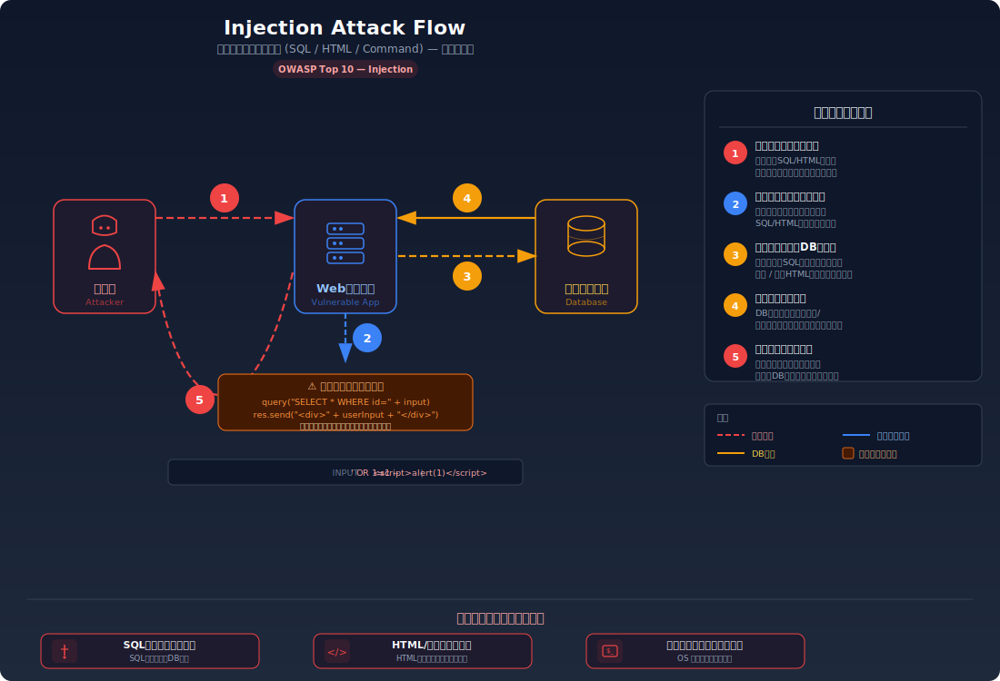
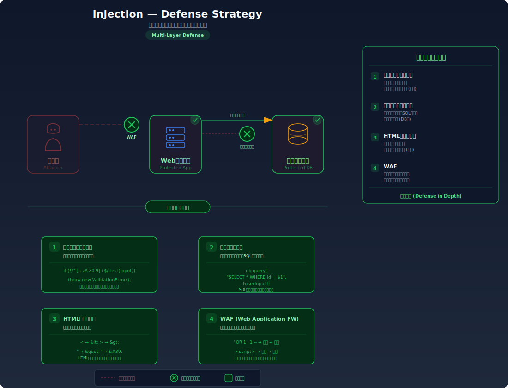

# 入力処理の基礎

> サニタイズ・エスケープ・バリデーションの違いと使い分けを解説します。インジェクション攻撃全般（XSS、SQLインジェクション等）を防ぐための根本的な知識です。

---

## 3つの入力処理の違い

Webアプリケーションのセキュリティにおいて、入力処理は最も重要な防御手段の一つである。よく混同される3つの概念を正確に区別する。

| 概念 | 英語 | 目的 | タイミング |
|------|------|------|-----------|
| **バリデーション** | Validation | 入力が期待する形式かチェック | **入力時** |
| **サニタイズ** | Sanitize | 危険な部分を除去・無害化 | **入力時 or 出力時** |
| **エスケープ** | Escape | 特殊文字を安全な表現に変換 | **出力時** |

<div class="input-processing">
  <div class="input-processing__card input-processing__card--validate">
    <div class="input-processing__icon">✅</div>
    <div class="input-processing__title">バリデーション</div>
    <div class="input-processing__desc">不正な入力を拒否する</div>
    <div class="input-processing__example">"abc" → ❌ 数値ではない</div>
  </div>
  <div class="input-processing__card input-processing__card--sanitize">
    <div class="input-processing__icon">🧹</div>
    <div class="input-processing__title">サニタイズ</div>
    <div class="input-processing__desc">危険な部分を除去する</div>
    <div class="input-processing__example">"&lt;script&gt;" → ""</div>
  </div>
  <div class="input-processing__card input-processing__card--escape">
    <div class="input-processing__icon">🔒</div>
    <div class="input-processing__title">エスケープ</div>
    <div class="input-processing__desc">特殊文字を無害化する</div>
    <div class="input-processing__example">"&lt;" → "&amp;lt;"</div>
  </div>
</div>

---

## バリデーション（Validation）

入力値が期待する形式・範囲であることを検証する。**不正な入力は拒否する**。

```typescript
// メールアドレスのバリデーション
function validateEmail(email: string): boolean {
  // 簡易チェック（厳密なRFC準拠チェックは複雑）
  return /^[^\s@]+@[^\s@]+\.[^\s@]+$/.test(email);
}

// 数値範囲のバリデーション
function validateAge(age: number): boolean {
  return Number.isInteger(age) && age >= 0 && age <= 150;
}

// 使用例
app.post('/api/register', async (c) => {
  const { email, age } = await c.req.json();

  if (!validateEmail(email)) {
    return c.json({ error: 'メールアドレスの形式が不正です' }, 400);
  }
  if (!validateAge(age)) {
    return c.json({ error: '年齢の値が不正です' }, 400);
  }

  // バリデーション通過後に処理を続行
});
```

### ホワイトリスト vs ブラックリスト

| 方式 | 説明 | 安全性 |
|------|------|--------|
| **ホワイトリスト**（許可リスト） | 許可する値のみ受け入れる | **推奨** |
| **ブラックリスト**（拒否リスト） | 危険な値を拒否する | 非推奨（漏れが生じやすい） |

```typescript
// ✅ ホワイトリスト: 許可するソート順のみ受け入れる
const ALLOWED_SORT = ['name', 'date', 'price'];
const sort = ALLOWED_SORT.includes(userInput) ? userInput : 'name';

// ⚠️ ブラックリスト: 危険な文字列を拒否する（抜け漏れリスクあり）
const BLOCKED = ['DROP', 'DELETE', '--', ';'];
if (BLOCKED.some(b => userInput.includes(b))) {
  throw new Error('不正な入力');
}
// → 大文字小文字の混合（DRoP）、エンコーディング(%44ROP)等で迂回される可能性
```

---

## サニタイズ（Sanitize）

入力から危険な部分を除去または無害化する。バリデーションが「拒否」であるのに対し、サニタイズは「浄化」である。

```typescript
// HTMLタグの除去（簡易版）
function stripHtmlTags(input: string): string {
  return input.replace(/<[^>]*>/g, '');
}

// 使用例
const userComment = '<script>alert(1)</script>こんにちは';
const safe = stripHtmlTags(userComment);
// → "alert(1)こんにちは"
```

### サニタイズの注意点

サニタイズは**正しく実装するのが難しい**。不完全なサニタイズはかえって危険:

```typescript
// ⚠️ 不完全なサニタイズ: <script>タグのみ除去
function badSanitize(input: string): string {
  return input.replace(/<script>/gi, '').replace(/<\/script>/gi, '');
}

// 迂回例1: imgタグのonerror
badSanitize('');
// → ''  ← 素通り!

// 迂回例2: ネスト
badSanitize('<scr<script>ipt>alert(1)</scr</script>ipt>');
// → '<script>alert(1)</script>'  ← 除去後にscriptタグが再構成!
```

リッチテキスト（HTMLの一部を許可する）が必要な場合は、**DOMPurify**などの検証済みライブラリを使用すべきである。

---

## エスケープ（Escape）

特殊文字を、その文脈で安全な表現に変換する。**出力先の文脈**に応じて異なるエスケープが必要。

### HTMLエスケープ

HTMLの特殊文字をHTMLエンティティに変換する。XSS対策の基本。

| 文字 | エンティティ | 理由 |
|------|-------------|------|
| `<` | `&lt;` | タグの開始と解釈されることを防ぐ |
| `>` | `&gt;` | タグの終了と解釈されることを防ぐ |
| `&` | `&amp;` | エンティティの開始と解釈されることを防ぐ |
| `"` | `&quot;` | 属性値の終了と解釈されることを防ぐ |
| `'` | `&#39;` | 属性値の終了と解釈されることを防ぐ |

```typescript
function escapeHtml(str: string): string {
  return str
    .replace(/&/g, '&amp;')
    .replace(/</g, '&lt;')
    .replace(/>/g, '&gt;')
    .replace(/"/g, '&quot;')
    .replace(/'/g, '&#39;');
}

// 使用例
const userInput = '<script>alert("XSS")</script>';
const safe = escapeHtml(userInput);
// → '&lt;script&gt;alert(&quot;XSS&quot;)&lt;/script&gt;'
// → ブラウザにはテキストとして表示される
```

### SQLエスケープ（プレースホルダ）

SQLインジェクション対策の最も確実な方法は<strong>プレースホルダ（パラメータ化クエリ）</strong>である。

```typescript
// ⚠️ 危険: 文字列連結でSQLを組み立て
const query = `SELECT * FROM users WHERE name = '${userInput}'`;
// userInput = "'; DROP TABLE users; --" → SQLインジェクション

// ✅ 安全: プレースホルダを使用
const result = await pool.query(
  'SELECT * FROM users WHERE name = $1',
  [userInput]
);
// → userInputがどんな値でもSQL構文として解釈されない
```

### URLエンコーディング

URL内の特殊文字をパーセントエンコーディングする。

```typescript
// JavaScriptでのURLエンコーディング
const param = encodeURIComponent('検索 & <script>');
// → '%E6%A4%9C%E7%B4%A2%20%26%20%3Cscript%3E'

const url = `https://example.com/search?q=${param}`;
```

---

## 文脈に応じたエスケープの必要性

**同じデータでも、出力先の文脈によって必要なエスケープが異なる**。

```text
ユーザー入力: O'Reilly & Sons <Inc>

出力先          必要なエスケープ           結果
─────────      ──────────────          ──────
HTML本文        HTMLエスケープ            O&#39;Reilly &amp; Sons &lt;Inc&gt;
HTML属性値      HTMLエスケープ + 引用符   "O&#39;Reilly &amp; Sons &lt;Inc&gt;"
JavaScript文字列 JSエスケープ             O\'Reilly & Sons <Inc>
URL パラメータ   URLエンコーディング       O%27Reilly%20%26%20Sons%20%3CInc%3E
SQL            プレースホルダ             （パラメータとして渡す）
```

---

## まとめ: 防御の多層戦略

入力処理はどれか一つではなく、**組み合わせて**使う:

```text
ユーザー入力
    ↓
[1. バリデーション] 形式チェック、不正な入力を拒否
    ↓
[2. サニタイズ]     危険な部分を除去（必要な場合のみ）
    ↓
ビジネスロジック処理
    ↓
[3. エスケープ]     出力先の文脈に応じて特殊文字を変換
    ↓
出力（HTML / SQL / URL / JavaScript）
```

| 原則 | 説明 |
|------|------|
| 入力はすべて信頼しない | クライアントからのデータは常にバリデーションする |
| 出力時にエスケープする | 入力時のサニタイズだけに頼らず、出力時にも防御する |
| 文脈に応じたエスケープ | HTML、SQL、URLなど、出力先ごとに適切なエスケープを使う |
| ホワイトリスト方式 | 許可するものを定義する方が、禁止するものを定義するより安全 |
| ライブラリを活用する | エスケープやサニタイズの自前実装は避け、検証済みライブラリを使う |

---

## 攻撃フロー図

### インジェクション攻撃のフロー



### インジェクション攻撃への対策



---

## 関連ラボ

以下のラボで、本ドキュメントの知識を実際に試すことができる:

### Step 02: インジェクション

| ラボ | 関連する知識 |
|------|--------------|
| [XSS](../../../step02-injection/xss/xss.mdx) | HTMLエスケープの不備によるスクリプト注入 |
| [SQLインジェクション](../../../step02-injection/sql-injection/sql-injection.mdx) | プレースホルダを使わないSQL組み立ての危険性 |

---

## 理解度テスト

学んだ内容をクイズで確認してみましょう:

- [入力処理の基礎 - 理解度テスト](./input-basics-quiz)

---

## 参考資料

- [OWASP - Input Validation Cheat Sheet](https://cheatsheetseries.owasp.org/cheatsheets/Input_Validation_Cheat_Sheet.html)
- [OWASP - Cross Site Scripting Prevention Cheat Sheet](https://cheatsheetseries.owasp.org/cheatsheets/Cross_Site_Scripting_Prevention_Cheat_Sheet.html)
- [OWASP - SQL Injection Prevention Cheat Sheet](https://cheatsheetseries.owasp.org/cheatsheets/SQL_Injection_Prevention_Cheat_Sheet.html)
