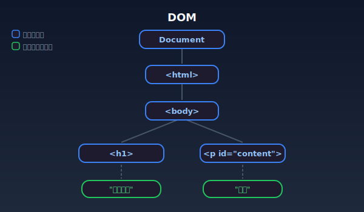
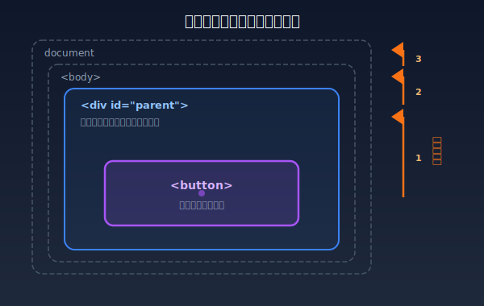
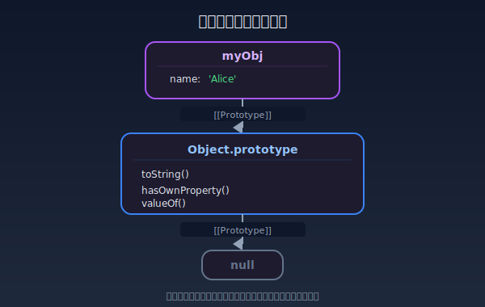

# JavaScript・DOMの基礎

> DOM操作の基礎、イベントハンドラ、`eval` の危険性、プロトタイプチェーンの仕組みを解説します。XSSやPrototype Pollutionを理解する上で不可欠な前提知識です。

---

## DOMとは

<strong>DOM（Document Object Model）</strong>は、HTMLドキュメントをプログラムから操作するためのAPIである。ブラウザはHTMLを解析してDOMツリー（木構造）を構築し、JavaScriptからこのツリーを読み書きできるようにする。

<div class="dom-tree">
  <div><span class="dom-tree__node dom-tree__node--element">Document</span></div>
  <div style="margin-left:1.5rem"><span class="dom-tree__node dom-tree__node--element">&lt;html&gt;</span></div>
  <div style="margin-left:3rem"><span class="dom-tree__node dom-tree__node--element">&lt;body&gt;</span></div>
  <div style="margin-left:4.5rem"><span class="dom-tree__node dom-tree__node--element">&lt;h1&gt;</span> → <span class="dom-tree__node dom-tree__node--text">"タイトル"</span></div>
  <div style="margin-left:4.5rem"><span class="dom-tree__node dom-tree__node--element">&lt;p id="content"&gt;</span> → <span class="dom-tree__node dom-tree__node--text">"本文"</span></div>
  <div style="margin-left:4.5rem"><span class="dom-tree__node dom-tree__node--danger">&lt;script&gt;</span> → <span class="dom-tree__node dom-tree__node--danger">innerHTML で注入された場合 XSS</span></div>
</div>



---

## DOM操作API

### 要素の取得

```javascript
// IDで取得（単一要素）
const el = document.getElementById('content');

// CSSセレクタで取得（最初の1つ）
const el = document.querySelector('.item');

// CSSセレクタで取得（すべて）
const items = document.querySelectorAll('.item');
```

### 要素の作成・追加

```javascript
// 安全: テキストノードの作成（HTMLとして解釈されない）
const p = document.createElement('p');
p.textContent = '<script>alert(1)</script>';  // テキストとして表示される

// ⚠️ 危険: innerHTMLはHTMLとして解釈される
element.innerHTML = userInput;  // XSSの原因になる
```

### innerHTML と textContent の違い

| プロパティ | 動作 | XSSリスク |
|-----------|------|-----------|
| `textContent` | テキストとして設定（HTMLタグは無効化） | **安全** |
| `innerText` | テキストとして設定（レンダリング結果を考慮） | **安全** |
| `innerHTML` | HTMLとして解析・レンダリング | **危険** |

```javascript
const userInput = '';

// ✅ 安全: textContentはHTMLを解釈しない
element.textContent = userInput;
// → 画面に「」というテキストが表示される

// ⚠️ 危険: innerHTMLはHTMLを解釈する
element.innerHTML = userInput;
// → imgタグが挿入され、onerrorイベントでalert(1)が実行される（XSS）
```

---

## イベントハンドラとイベント伝搬

### イベントハンドラの設定方法

```javascript
// 方法1: addEventListener（推奨）
element.addEventListener('click', (event) => {
  console.log('クリックされた');
});

// 方法2: onXxxプロパティ
element.onclick = (event) => {
  console.log('クリックされた');
};
```

```html
<!-- 方法3: HTMLインラインハンドラ（⚠️ XSSリスクが高い） -->
<button onclick="handleClick()">クリック</button>
```

### イベント伝搬（バブリング）

DOMイベントは子要素から親要素に<strong>バブリング（伝搬）</strong>する。



```javascript
// 親要素でイベントを委譲して処理する（イベントデリゲーション）
document.getElementById('parent').addEventListener('click', (e) => {
  if (e.target.matches('button')) {
    console.log('ボタンがクリックされた');
  }
});
```

---

## eval の危険性

`eval()` は文字列をJavaScriptコードとして実行する関数である。**ユーザー入力を `eval` に渡すことは、任意のコード実行を許可することと同義**。

```javascript
// ⚠️ 極めて危険: ユーザー入力をevalで実行
const userInput = "alert(document.cookie)";
eval(userInput);  // → Cookieが表示される（XSS）

// ⚠️ evalと同等の危険な関数
new Function(userInput)();           // Functionコンストラクタ
setTimeout(userInput, 0);            // 文字列引数のsetTimeout
setInterval(userInput, 1000);        // 文字列引数のsetInterval
```

### eval を避ける方法

```javascript
// ⚠️ 危険: evalでJSONをパース
const data = eval('(' + jsonString + ')');

// ✅ 安全: JSON.parseを使用
const data = JSON.parse(jsonString);
```

```javascript
// ⚠️ 危険: evalで動的プロパティアクセス
const value = eval('obj.' + propertyName);

// ✅ 安全: ブラケット記法を使用
const value = obj[propertyName];
```

---

## プロトタイプチェーン

JavaScriptのオブジェクトは、**プロトタイプ**と呼ばれる別のオブジェクトへの内部リンクを持つ。プロパティへのアクセス時、オブジェクト自身にプロパティがなければ、プロトタイプチェーンを辿って探索する。



```javascript
const myObj = { name: "Alice" };

// myObj自身のプロパティ
myObj.name;              // → "Alice"

// プロトタイプチェーンから継承
myObj.toString();        // → "[object Object]"（Object.prototypeから）

// プロパティの存在確認
myObj.hasOwnProperty('name');      // → true
myObj.hasOwnProperty('toString');  // → false（プロトタイプのプロパティ）
```

### Prototype Pollution 攻撃

**Prototype Pollution**は、`Object.prototype` などの共有プロトタイプを汚染する攻撃である。

```javascript
// ⚠️ 危険: ユーザー入力をそのままオブジェクトのキーに使用
function merge(target, source) {
  for (const key in source) {
    if (typeof source[key] === 'object') {
      target[key] = target[key] || {};
      merge(target[key], source[key]);
    } else {
      target[key] = source[key];
    }
  }
}

// 攻撃者が以下のJSONを送信
const malicious = JSON.parse('{"__proto__": {"isAdmin": true}}');
merge({}, malicious);

// すべてのオブジェクトに isAdmin プロパティが追加される
const user = {};
console.log(user.isAdmin);  // → true（認可バイパス）
```

### 対策

```javascript
// ✅ hasOwnPropertyでプロトタイプのプロパティを除外
function safeMerge(target, source) {
  for (const key of Object.keys(source)) {
    // __proto__, constructor, prototype を拒否
    if (key === '__proto__' || key === 'constructor' || key === 'prototype') {
      continue;
    }
    if (typeof source[key] === 'object' && source[key] !== null) {
      target[key] = target[key] || {};
      safeMerge(target[key], source[key]);
    } else {
      target[key] = source[key];
    }
  }
}

// ✅ Object.create(null)でプロトタイプのないオブジェクトを使用
const safeMap = Object.create(null);
// safeMap.__proto__ は undefined
```

---

## 関連ラボ

以下のラボで、本ドキュメントの知識を実際に試すことができる:

### Step 02: インジェクション

| ラボ | 関連する知識 |
|------|--------------|
| [XSS](../../../step02-injection/xss/xss.mdx) | DOM操作（innerHTML等）によるスクリプト注入、イベントハンドラの悪用 |

---

## 理解度テスト

学んだ内容をクイズで確認してみましょう:

- [JavaScript・DOMの基礎 - 理解度テスト](./js-dom-basics-quiz)

---

## 参考資料

- [MDN - Document Object Model (DOM)](https://developer.mozilla.org/ja/docs/Web/API/Document_Object_Model)
- [MDN - eval()](https://developer.mozilla.org/ja/docs/Web/JavaScript/Reference/Global_Objects/eval)
- [MDN - 継承とプロトタイプチェーン](https://developer.mozilla.org/ja/docs/Web/JavaScript/Inheritance_and_the_prototype_chain)
- [OWASP - Prototype Pollution](https://owasp.org/www-community/vulnerabilities/Prototype_Pollution)
