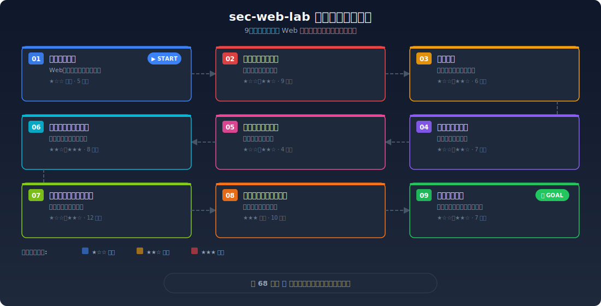
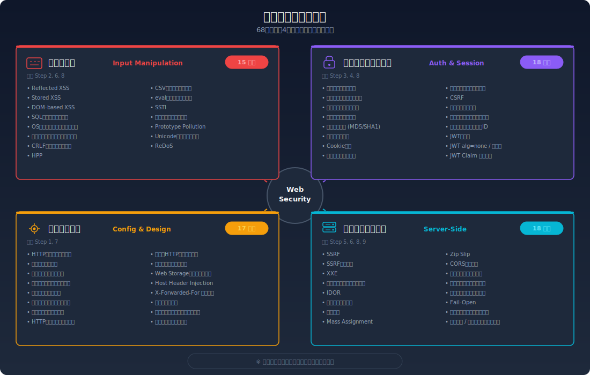

# sec-web-lab 学習ロードマップ

ローカル環境 (Hono + React + PostgreSQL) で実験可能な脆弱性を、学習しやすい順番に並べています。
前のステップの知識が後のステップで活きる構成になっているので、上から順に進めるのがおすすめです。

## 凡例

| 難易度 | レベル | 対象者 |
|--------|--------|--------|
| ★☆☆ | 入門 | Web開発の基本がわかる人 |
| ★★☆ | 中級 | Step 1〜3 を終えた人 |
| ★★★ | 上級 | セキュリティの基礎を理解した人 |

- 状態: `未実装` → `実装中` → `ラボ実装済`

---

## 攻撃カテゴリマップ

> 68のラボは大きく4つのカテゴリに分類できます。
> ステップ順に学ぶのが基本ですが、興味のあるカテゴリから探すこともできます。

---

## 基礎知識ドキュメント

> ラボに取り組む前に理解しておくべき基礎概念をまとめたドキュメントです。
> 手を動かすラボではなく、読み物として各ステップの前提知識を補います。

| # | トピック | 関連ステップ | ドキュメント |
|---|---------|-------------|-------------|
| F-1 | HTTPの仕組みとセッション管理 | Step 1〜4 の前提 | [http-and-sessions](foundations/http-and-sessions.md) |
| F-2 | 同一オリジンポリシーとCORS | Step 2, 4, 6 の前提 | [same-origin-policy](foundations/same-origin-policy.md) |
| F-3 | 文字エンコーディングとセキュリティ | Step 2 の補足 | [character-encoding](foundations/character-encoding.md) |

---

## Step 1: 偵察フェーズ — Webアプリの情報を集めよう

> まずは攻撃の前段階。Webアプリが意図せず公開している情報を見つける練習です。
> ブラウザの DevTools だけで試せるものが多く、最初のステップに最適です。

| # | ラボ名 | 難易度 | 状態 | ドキュメント |
|---|--------|--------|------|-------------|
| 1 | HTTPヘッダーからの情報漏洩 | ★☆☆ | ラボ実装済 | [header-leakage](step01-recon/header-leakage) |
| 2 | 機密ファイル露出 (.git/.env) | ★☆☆ | ラボ実装済 | [sensitive-file-exposure](step01-recon/sensitive-file-exposure) |
| 3 | エラーメッセージからの情報漏洩 | ★☆☆ | ラボ実装済 | [error-message-leakage](step01-recon/error-message-leakage) |
| 4 | ディレクトリリスティング | ★☆☆ | ラボ実装済 | [directory-listing](step01-recon/directory-listing) |
| 5 | 不要なヘッダー露出 | ★☆☆ | ラボ実装済 | [header-exposure](step01-recon/header-exposure) |

---

## Step 2: はじめてのインジェクション — 入力を操る基本技術

> Webセキュリティの核心スキル。ユーザー入力がサーバーやブラウザでどう処理されるかを理解し、
> 入力を通じてアプリの挙動を変える方法を学びます。XSS と SQLi は最も重要な脆弱性です。

| # | ラボ名 | 難易度 | 状態 | ドキュメント |
|---|--------|--------|------|-------------|
| 6 | Reflected XSS | ★☆☆ | ラボ実装済 | [xss](step02-injection/xss) |
| 7 | SQLインジェクション | ★☆☆ | ラボ実装済 | [sql-injection](step02-injection/sql-injection) |
| 8 | オープンリダイレクト | ★☆☆ | ラボ実装済 | [open-redirect](step02-injection/open-redirect) |
| 9 | Stored XSS | ★★☆ | ラボ実装済 | [xss](step02-injection/xss) |
| 10 | DOM-based XSS | ★★☆ | 未実装 | [xss](step02-injection/xss) |
| 11 | OSコマンドインジェクション | ★★☆ | ラボ実装済 | [command-injection](step02-injection/command-injection) |
| 12 | メールヘッダインジェクション | ★★☆ | ラボ実装済 | [mail-header-injection](step02-injection/mail-header-injection) |
| 13 | HTTP Parameter Pollution (HPP) | ★★☆ | ラボ実装済 | [hpp](step02-injection/hpp) |
| 14 | CSV Injection | ★★☆ | ラボ実装済 | [csv-injection](step02-injection/csv-injection) |

---

## Step 3: 認証を突破する — ログインの弱点を知る

> ログイン機能の弱点を学びます。パスワードの保存方法からブルートフォースまで、
> 認証の仕組みと典型的な実装ミスを理解します。

| # | ラボ名 | 難易度 | 状態 | ドキュメント |
|---|--------|--------|------|-------------|
| 15 | デフォルト認証情報 | ★☆☆ | ラボ実装済 | [default-credentials](step03-auth/default-credentials) |
| 16 | 弱いパスワードポリシー | ★☆☆ | ラボ実装済 | [weak-password-policy](step03-auth/weak-password-policy) |
| 17 | ブルートフォース攻撃 | ★☆☆ | ラボ実装済 | [brute-force](step03-auth/brute-force) |
| 18 | 平文パスワード保存 | ★☆☆ | ラボ実装済 | [plaintext-password](step03-auth/plaintext-password) |
| 19 | 弱いハッシュ (MD5/SHA1) | ★★☆ | ラボ実装済 | [weak-hash](step03-auth/weak-hash) |
| 20 | ユーザー名列挙 | ★☆☆ | ラボ実装済 | [username-enumeration](step03-auth/username-enumeration) |

---

## Step 4: セッションを奪う — なりすましの技術

> ログイン後の「セッション」がどう管理されているかを学び、
> Cookie の仕組みや CSRF 攻撃を通じて、なりすましの手法と防御策を体験します。

| # | ラボ名 | 難易度 | 状態 | ドキュメント |
|---|--------|--------|------|-------------|
| 21 | Cookie操作 | ★☆☆ | ラボ実装済 | [cookie-manipulation](step04-session/cookie-manipulation) |
| 22 | セッション固定攻撃 | ★★☆ | ラボ実装済 | [session-fixation](step04-session/session-fixation) |
| 23 | セッションハイジャック | ★★☆ | ラボ実装済 | [session-hijacking](step04-session/session-hijacking) |
| 24 | CSRF | ★★☆ | ラボ実装済 | [csrf](step04-session/csrf) |
| 25 | トークンリプレイ（失効不備） | ★★☆ | ラボ実装済 | [token-replay](step04-session/token-replay) |
| 26 | セッション有効期限の不備 | ★☆☆ | ラボ実装済 | [session-expiration](step04-session/session-expiration) |
| 27 | 推測可能なセッションID | ★★☆ | ラボ実装済 | [predictable-session-id](step04-session/predictable-session-id) |

---

## Step 5: アクセス制御を突破する — 権限の壁を超える

> 認証は通っているが、本来アクセスできないはずのリソースにアクセスする方法を学びます。
> IDの書き換えやパスの操作で「自分のもの以外」にアクセスする攻撃です。

| # | ラボ名 | 難易度 | 状態 | ドキュメント |
|---|--------|--------|------|-------------|
| 28 | IDOR (他ユーザーデータ参照) | ★☆☆ | ラボ実装済 | [idor](step05-access-control/idor) |
| 29 | パストラバーサル | ★☆☆ | ラボ実装済 | [path-traversal](step05-access-control/path-traversal) |
| 30 | 権限昇格 | ★★☆ | ラボ実装済 | [privilege-escalation](step05-access-control/privilege-escalation) |
| 31 | Mass Assignment | ★★☆ | ラボ実装済 | [mass-assignment](step05-access-control/mass-assignment) |

---

## Step 6: サーバーサイド攻撃 — サーバーの弱点を突く

> サーバー側の処理を悪用する攻撃を学びます。SSRF やファイルアップロードなど、
> サーバーの内部リソースに到達する手法です。Step 2 のインジェクションの応用編です。

| # | ラボ名 | 難易度 | 状態 | ドキュメント |
|---|--------|--------|------|-------------|
| 32 | SSRF | ★★☆ | ラボ実装済 | [ssrf](step06-server-side/ssrf) |
| 33 | XXE | ★★☆ | ラボ実装済 | [xxe](step06-server-side/xxe) |
| 34 | ファイルアップロード攻撃 | ★★☆ | ラボ実装済 | [file-upload](step06-server-side/file-upload) |
| 35 | CRLFインジェクション | ★★☆ | ラボ実装済 | [crlf-injection](step06-server-side/crlf-injection) |
| 36 | CORS設定ミス | ★★☆ | ラボ実装済 | [cors-misconfiguration](step06-server-side/cors-misconfiguration) |
| 37 | evalインジェクション | ★★☆ | ラボ実装済 | [eval-injection](step06-server-side/eval-injection) |
| 38 | SSRFバイパス | ★★★ | ラボ実装済 | [ssrf-bypass](step06-server-side/ssrf-bypass) |
| 39 | Zip Slip | ★★☆ | ラボ実装済 | [zip-slip](step06-server-side/zip-slip) |

---

## Step 7: 設計とロジックの問題 — 仕様の穴を見つける

> コードのバグではなく「設計」の問題を学びます。レート制限の欠如やビジネスロジックの欠陥など、
> ツールでは見つけにくい脆弱性を理解します。

| # | ラボ名 | 難易度 | 状態 | ドキュメント |
|---|--------|--------|------|-------------|
| 40 | レート制限なし | ★☆☆ | ラボ実装済 | [rate-limiting](step07-design/rate-limiting) |
| 41 | クリックジャッキング | ★☆☆ | ラボ実装済 | [clickjacking](step07-design/clickjacking) |
| 42 | HTTPでの機密データ送信 | ★☆☆ | ラボ実装済 | [sensitive-data-http](step07-design/sensitive-data-http) |
| 43 | 不要なHTTPメソッド許可 | ★☆☆ | ラボ実装済 | [http-methods](step07-design/http-methods) |
| 44 | 推測可能なパスワードリセット | ★★☆ | ラボ実装済 | [password-reset](step07-design/password-reset) |
| 45 | ビジネスロジックの欠陥 | ★★☆ | ラボ実装済 | [business-logic](step07-design/business-logic) |
| 46 | 署名なしデータの信頼 | ★★☆ | ラボ実装済 | [unsigned-data](step07-design/unsigned-data) |
| 47 | セキュリティレスポンスヘッダ未設定 | ★☆☆ | ラボ実装済 | [security-headers](step07-design/security-headers) |
| 48 | キャッシュ制御の不備 | ★★☆ | ラボ実装済 | [cache-control](step07-design/cache-control) |
| 49 | Web Storageの不適切な使用 | ★★☆ | ラボ実装済 | [web-storage-abuse](step07-design/web-storage-abuse) |
| 50 | Host Header Injection | ★★☆ | ラボ実装済 | [host-header-injection](step07-design/host-header-injection) |
| 51 | X-Forwarded-For 信頼ミス | ★★☆ | ラボ実装済 | [xff-trust](step07-design/xff-trust) |

---

## Step 8: 高度な攻撃テクニック — エキスパートへの道

> ここまでの知識を前提にした上級テクニックです。JWT の改ざんやテンプレートインジェクション、
> レースコンディションなど、実務でも発見が難しい脆弱性に挑戦します。

| # | ラボ名 | 難易度 | 状態 | ドキュメント |
|---|--------|--------|------|-------------|
| 52 | JWT改ざん | ★★★ | ラボ実装済 | [jwt-vulnerabilities](step08-advanced/jwt-vulnerabilities) |
| 53 | JWT alg=none / 弱い鍵 | ★★★ | ラボ実装済 | [jwt-vulnerabilities](step08-advanced/jwt-vulnerabilities) |
| 54 | JWT Claim 検証不備 | ★★★ | ラボ実装済 | [jwt-vulnerabilities](step08-advanced/jwt-vulnerabilities) |
| 55 | SSTI | ★★★ | ラボ実装済 | [ssti](step08-advanced/ssti) |
| 56 | レースコンディション | ★★★ | ラボ実装済 | [race-condition](step08-advanced/race-condition) |
| 57 | 安全でないデシリアライゼーション | ★★★ | ラボ実装済 | [deserialization](step08-advanced/deserialization) |
| 58 | Prototype Pollution | ★★★ | ラボ実装済 | [prototype-pollution](step08-advanced/prototype-pollution) |
| 59 | ReDoS (正規表現DoS) | ★★★ | ラボ実装済 | [redos](step08-advanced/redos) |
| 60 | postMessage脆弱性 | ★★★ | ラボ実装済 | [postmessage](step08-advanced/postmessage) |
| 61 | Unicode正規化バイパス | ★★★ | ラボ実装済 | [unicode-normalization](step08-advanced/unicode-normalization) |

---

## Step 9: 守りを固める — ログ・例外処理・防御設計

> 攻撃を学んだ最後に、防御側の視点を強化します。
> 適切なエラーハンドリングとログ記録がなぜ重要なのかを、攻撃者の視点から理解します。

| # | ラボ名 | 難易度 | 状態 | ドキュメント |
|---|--------|--------|------|-------------|
| 62 | 詳細エラーメッセージ露出 | ★☆☆ | ラボ実装済 | [error-messages](step09-defense/error-messages) |
| 63 | スタックトレース漏洩 | ★☆☆ | ラボ実装済 | [stack-trace](step09-defense/stack-trace) |
| 64 | ログなし / 不十分なログ | ★☆☆ | ラボ実装済 | [logging](step09-defense/logging) |
| 65 | ログインジェクション | ★★☆ | ラボ実装済 | [log-injection](step09-defense/log-injection) |
| 66 | Fail-Open | ★★☆ | ラボ実装済 | [fail-open](step09-defense/fail-open) |
| 67 | CSP (Content Security Policy) 導入 | ★★☆ | ラボ実装済 | [csp](step09-defense/csp) |
| 68 | 入力バリデーション設計 | ★★☆ | ラボ実装済 | [input-validation](step09-defense/input-validation) |

---

## ローカル再現が困難なため除外

以下はインフラ要件が合わないため対象外としています。

| 攻撃 | 除外理由 |
|------|---------|
| NoSQLインジェクション | MongoDB が必要 |
| LDAPインジェクション | LDAPサーバーが必要 |
| HTTPリクエストスマグリング | 特殊なリバースプロキシ構成が必要 |
| Webキャッシュポイズニング | キャッシュプロキシが必要 |
| サブドメインテイクオーバー | DNS制御が必要 |
| GraphQLインジェクション | GraphQLサーバーが必要 (将来追加可能) |
| WebSocketハイジャック | WebSocket構成が別途必要 (将来追加可能) |
| Software Supply Chain Failures | 概念的でローカル攻撃体験が困難 |
| OAuth/OIDC 認証フローの脆弱性 | 外部 IdP 連携が必要 (将来追加可能) |
| HTTP/2 固有の脆弱性 | HTTP/2 対応リバースプロキシが必要 |
