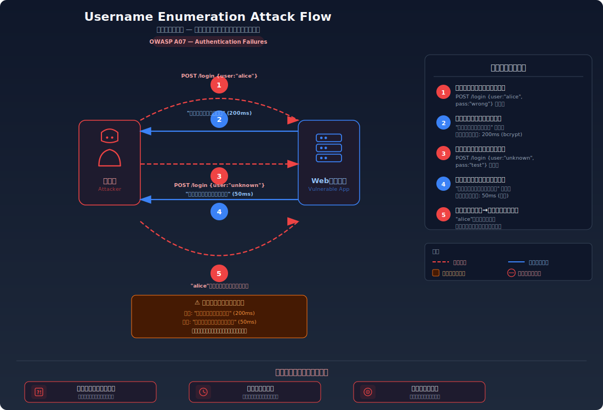
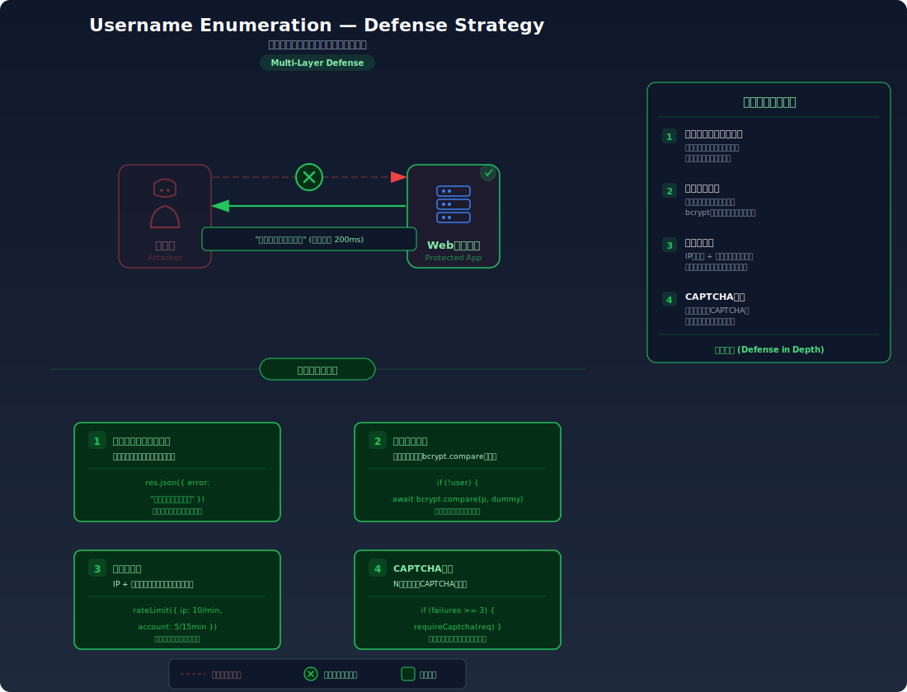

# Username Enumeration — ユーザー名の存在確認による情報漏洩

> ログインの失敗メッセージやレスポンス時間の違いから、そのユーザー名がシステムに登録されているかどうかを攻撃者が特定できてしまう脆弱性を学びます。

---

## 対象ラボ

### シナリオ 1: エラーメッセージによる列挙

| 項目 | 内容 |
|------|------|
| **概要** | ログイン失敗時に「ユーザーが見つかりません」と「パスワードが違います」で異なるエラーメッセージを返すため、攻撃者がユーザー名の存在を確認できる |
| **攻撃例** | `curl -X POST /api/labs/username-enumeration/vulnerable/login -d '{"username":"admin","password":"wrong"}'` → "パスワードが違います" / `curl -X POST ... -d '{"username":"nouser","password":"wrong"}'` → "ユーザーが見つかりません" |
| **技術スタック** | Hono API + PostgreSQL |
| **難易度** | ★☆☆ 入門 |
| **前提知識** | 認証の基本（ユーザー名 + パスワード）、HTTP レスポンスの観察 |

### シナリオ 2: タイミングによる列挙

| 項目 | 内容 |
|------|------|
| **概要** | 存在するユーザーの場合のみパスワードハッシュ比較が実行されるため、レスポンス時間の差で存在を推測できる |
| **攻撃例** | `time curl -X POST /api/labs/username-enumeration/vulnerable/login -d '{"username":"admin","password":"wrong"}'` → 応答に約 100ms / `time curl ... -d '{"username":"nouser","password":"wrong"}'` → 応答に約 5ms |
| **技術スタック** | Hono API + PostgreSQL |
| **難易度** | ★☆☆ 入門 |
| **前提知識** | 認証の基本、HTTP レスポンスの観察、パスワードハッシュの概念（bcrypt 等） |

---

## この脆弱性を理解するための前提

### ログイン認証の処理フロー

Web アプリケーションのログイン処理は、内部的に 2 つのステップで構成される:

1. **ユーザー検索**: 入力されたユーザー名でデータベースを検索し、該当するレコードがあるか確認する
2. **パスワード照合**: ユーザーが見つかった場合、入力されたパスワードと保存済みのパスワードハッシュを比較する

```
POST /api/login
{ "username": "alice", "password": "mypassword" }

→ Step 1: SELECT * FROM users WHERE username = 'alice'
  → ユーザーが見つかった場合 → Step 2 へ
  → ユーザーが見つからない場合 → 認証失敗

→ Step 2: bcrypt.compare("mypassword", user.password_hash)
  → 一致 → 200 OK: ログイン成功
  → 不一致 → 401 Unauthorized: 認証失敗
```

この 2 段階の処理は認証の基本であり正常な設計だが、「どのステップで失敗したか」が外部から観察可能な場合に問題が生じる。

### どこに脆弱性が生まれるのか

問題は、認証失敗の **原因を区別できるレスポンス** を返してしまうことにある。開発者は親切心から「ユーザー名が間違っているのか、パスワードが間違っているのか」を伝えようとするが、この情報は攻撃者にとって「そのユーザー名が存在するかどうか」を確認する手段になる。

**パターン 1: エラーメッセージの違い**

```typescript
// ⚠️ この部分が問題 — 失敗原因をそのまま返している
app.post('/login', async (c) => {
  const { username, password } = await c.req.json();
  const result = await pool.query(
    'SELECT * FROM users WHERE username = $1', [username]
  );

  if (result.rows.length === 0) {
    // ユーザーが見つからない → この事実を攻撃者に教えてしまう
    return c.json({ error: 'ユーザーが見つかりません' }, 401);
  }

  const user = result.rows[0];
  const valid = await bcrypt.compare(password, user.password_hash);
  if (!valid) {
    // パスワードが違う → つまりユーザー名は正しいと攻撃者が推測できる
    return c.json({ error: 'パスワードが違います' }, 401);
  }

  return c.json({ message: 'ログイン成功' });
});
```

攻撃者は「ユーザーが見つかりません」が返ったら別のユーザー名を試し、「パスワードが違います」が返ったらそのユーザー名が存在すると確定できる。

**パターン 2: レスポンス時間の違い**

```typescript
// ⚠️ この部分が問題 — 存在するユーザーのときだけ bcrypt.compare が実行される
app.post('/login', async (c) => {
  const { username, password } = await c.req.json();
  const result = await pool.query(
    'SELECT * FROM users WHERE username = $1', [username]
  );

  if (result.rows.length === 0) {
    // ユーザーが存在しない → bcrypt.compare をスキップして即座に返す
    // bcrypt の比較は約 50-100ms かかるため、レスポンス時間に明らかな差が出る
    return c.json({ error: '認証に失敗しました' }, 401);
  }

  const user = result.rows[0];
  // bcrypt.compare は意図的に低速（ストレッチング）で約 50-100ms かかる
  const valid = await bcrypt.compare(password, user.password_hash);
  if (!valid) {
    return c.json({ error: '認証に失敗しました' }, 401);
  }

  return c.json({ message: 'ログイン成功' });
});
```

エラーメッセージを統一しても、レスポンス時間が異なれば攻撃者は差分を計測して判別できる。bcrypt の比較処理は意図的に遅い（約 50-100ms）ため、存在しないユーザーへのリクエストは明らかに高速に返る。

---

## 攻撃の仕組み



### 攻撃のシナリオ

1. **攻撃者** がユーザー名の候補リスト（社員名簿、メールアドレスリスト、一般的なユーザー名辞書等）を準備する

   企業の公開情報（LinkedIn、企業サイト）から社員名を収集したり、`admin`、`test`、`info`、`support` 等のよくあるユーザー名をリストにする。メールアドレスをユーザー名として使うシステムでは、メールアドレスの収集がそのまま候補リストになる。

2. **攻撃者** がログインエンドポイントに各ユーザー名で認証リクエストを送信する（パスワードは適当な値で固定）

   ```bash
   # エラーメッセージ方式: 各ユーザー名でリクエストを送り、レスポンスの違いを観察
   for user in admin alice bob charlie test info support; do
     result=$(curl -s -X POST http://target/api/login \
       -H "Content-Type: application/json" \
       -d "{\"username\":\"$user\",\"password\":\"dummy\"}")
     echo "ユーザー: $user → $result"
   done
   ```

   パスワードは何でもよい。目的はパスワードの突破ではなく、ユーザー名の存在確認だけであるため、全リクエストで同じダミーパスワードを使う。

3. **サーバー** が各リクエストに対し、ユーザーの存在有無に応じて異なるレスポンスを返す

   **メッセージ方式の場合**:
   ```
   ユーザー: admin   → {"error": "パスワードが違います"}      ← 存在する！
   ユーザー: alice   → {"error": "パスワードが違います"}      ← 存在する！
   ユーザー: bob     → {"error": "ユーザーが見つかりません"}   ← 存在しない
   ユーザー: charlie → {"error": "ユーザーが見つかりません"}   ← 存在しない
   ユーザー: test    → {"error": "パスワードが違います"}      ← 存在する！
   ```

   **タイミング方式の場合**:
   ```
   ユーザー: admin   → 応答 105ms  ← bcrypt 比較あり = 存在する！
   ユーザー: alice   → 応答  98ms  ← bcrypt 比較あり = 存在する！
   ユーザー: bob     → 応答   3ms  ← bcrypt 比較なし = 存在しない
   ユーザー: charlie → 応答   4ms  ← bcrypt 比較なし = 存在しない
   ユーザー: test    → 応答 102ms  ← bcrypt 比較あり = 存在する！
   ```

4. **攻撃者** が存在が確認されたユーザー名のリストを使い、次のステップの攻撃に進む

   確認されたユーザー名（`admin`、`alice`、`test`）に対して、パスワードの総当たり攻撃（ブルートフォース）やクレデンシャルスタッフィング（流出パスワードの使い回し攻撃）を実行する。ユーザー名が確定しているため、攻撃の効率が飛躍的に向上する。

### なぜ成功するのか

| 条件 | 説明 |
|------|------|
| エラーメッセージが原因別に異なる | 「ユーザーが見つかりません」と「パスワードが違います」を区別して返すことで、ユーザー名の存在が直接漏洩する |
| パスワードハッシュ比較のコストが大きい | bcrypt 等のストレッチングアルゴリズムは意図的に低速（50-100ms）なため、比較の有無がレスポンス時間に顕著に反映される |
| 存在しないユーザーへのダミー処理がない | ユーザーが見つからない場合に bcrypt 比較をスキップするため、処理コストの差がタイミング情報として漏洩する |

### 被害の範囲

- **機密性**: システムに登録されているユーザー名（メールアドレス）の一覧が漏洩する。これは個人情報であり、「このサービスを使っている」という事実自体がプライバシーの侵害になる（例: 出会い系サイト、政治活動サイト）
- **完全性**: 直接的な改ざんは発生しないが、列挙で得たユーザーリストを基にしたフィッシング攻撃で、パスワードリセットやアカウント乗っ取りにつながる
- **可用性**: 大量のユーザー名を試行するスキャンにより、認証エンドポイントに負荷がかかる可能性がある。また、列挙された情報を使った後続攻撃（ブルートフォース等）でアカウントロックが発動し、正規ユーザーがログインできなくなるケースもある

---

## 対策



### 根本原因

認証処理の内部状態（ユーザーの存在有無）が **エラーメッセージの内容やレスポンス時間の差として外部に漏洩** していることが根本原因。認証の成否以外の情報を一切外部に出さない設計が必要。

### 安全な実装

認証失敗時のレスポンスを、原因にかかわらず **完全に同一** にする。メッセージの統一だけでなく、レスポンス時間も一定にするために、ユーザーが見つからない場合でもダミーのハッシュ比較を実行する。

ユーザーが存在しない場合にもダミーの bcrypt 比較を実行することで、bcrypt のストレッチング処理にかかる時間が常に発生し、存在するユーザーへのリクエストと同等のレスポンス時間になる。攻撃者はメッセージの内容からもレスポンス時間からも、ユーザーの存在を判別できなくなる。

```typescript
import bcrypt from 'bcrypt';

// ✅ 安全な実装 — メッセージもレスポンス時間も統一
// アプリ起動時にダミーハッシュを生成しておく
// 存在しないユーザーへのリクエストでもこのハッシュと比較することで
// bcrypt の処理時間を一定にする
const DUMMY_HASH = await bcrypt.hash('dummy-placeholder', 10);

app.post('/login', async (c) => {
  const { username, password } = await c.req.json();
  const result = await pool.query(
    'SELECT * FROM users WHERE username = $1', [username]
  );

  // ✅ ユーザーが見つからない場合もダミーハッシュと比較する
  // これにより bcrypt.compare の処理時間が常に発生し、
  // タイミング攻撃でユーザーの存在を推測できなくなる
  const user = result.rows[0];
  const hashToCompare = user ? user.password_hash : DUMMY_HASH;
  const valid = await bcrypt.compare(password, hashToCompare);

  if (!user || !valid) {
    // ✅ ユーザーが存在しない場合もパスワードが違う場合も
    // 同一のエラーメッセージを返す
    return c.json({ error: '認証に失敗しました' }, 401);
  }

  return c.json({ message: 'ログイン成功' });
});
```

#### 脆弱 vs 安全: コード比較

```diff
+ const DUMMY_HASH = await bcrypt.hash('dummy-placeholder', 10);
+
  app.post('/login', async (c) => {
    const { username, password } = await c.req.json();
    const result = await pool.query(
      'SELECT * FROM users WHERE username = $1', [username]
    );

-   if (result.rows.length === 0) {
-     return c.json({ error: 'ユーザーが見つかりません' }, 401);
-   }
-
-   const user = result.rows[0];
-   const valid = await bcrypt.compare(password, user.password_hash);
-   if (!valid) {
-     return c.json({ error: 'パスワードが違います' }, 401);
+   const user = result.rows[0];
+   const hashToCompare = user ? user.password_hash : DUMMY_HASH;
+   const valid = await bcrypt.compare(password, hashToCompare);
+
+   if (!user || !valid) {
+     return c.json({ error: '認証に失敗しました' }, 401);
    }

    return c.json({ message: 'ログイン成功' });
  });
```

脆弱なコードでは「ユーザーが存在しない」と「パスワードが違う」を分岐し、異なるメッセージを返していた。さらに、ユーザーが存在しない場合は bcrypt 比較をスキップしていた。安全なコードでは、(1) ダミーハッシュとの比較により処理時間を一定にし、(2) 単一の条件分岐で統一されたエラーメッセージを返す。この 2 つの変更により、メッセージとタイミングの両方から情報漏洩を防ぐ。

### その他の防御策

| 対策 | 種類 | 説明 |
|------|------|------|
| 統一エラーメッセージ + ダミーハッシュ比較 | 根本対策 | エラーメッセージを原因に関わらず統一し、ダミーハッシュ比較で処理時間を一定にする。これが必須 |
| レート制限 | 多層防御 | 大量のユーザー名を高速に試行することを防ぐ。根本対策と組み合わせることで列挙の実行自体を困難にする |
| CAPTCHA | 多層防御 | 自動化ツールによる大量リクエストを防ぐ。人間が手動で少数のユーザー名を試す場合には効果が薄い |
| ログイン試行の監視・アラート | 検知 | 同一 IP から多数のユーザー名でログイン試行がある場合にアラートを発する。列挙攻撃の兆候を早期検知する |
| ユーザー名にメールアドレスを使わない | 多層防御 | メールアドレスが推測しやすい場合、ランダムなユーザー ID を使うことで候補リストの作成を困難にする |

---

## 実装メモ

| 項目 | パス |
|------|------|
| 脆弱エンドポイント | `/api/labs/username-enumeration/vulnerable/login` |
| 安全エンドポイント | `/api/labs/username-enumeration/secure/login` |
| バックエンド | `backend/src/labs/step03-auth/username-enumeration.ts` |
| フロントエンド | `frontend/src/labs/step03-auth/pages/UsernameEnumeration.tsx` |
| DB | `.devcontainer/db/init.sql` の `users` テーブルを使用 |

- 脆弱版（メッセージ方式）: ユーザーが見つからない場合は「ユーザーが見つかりません」、パスワード不一致の場合は「パスワードが違います」と異なるメッセージを返す
- 脆弱版（タイミング方式）: ユーザーが見つからない場合は bcrypt 比較をスキップして即座に返す。メッセージは統一しているが、レスポンス時間に差がある
- 安全版: エラーメッセージを「認証に失敗しました」に統一し、ダミーハッシュ（`DUMMY_HASH`）との比較を行うことで処理時間を一定にする
- `DUMMY_HASH` はアプリケーション起動時に 1 回だけ生成し、全リクエストで再利用する

---

## 現実世界での事例

| 年 | インシデント | 概要 |
|----|-------------|------|
| 2019 | Airbnb ユーザー名列挙 | パスワードリセット機能で「このメールアドレスは登録されていません」と返していたため、登録済みメールアドレスの確認が可能だった |
| 2021 | Facebook 電話番号流出（5億件） | 電話番号からユーザーを逆引きできる機能が悪用され、約 5 億 3,300 万ユーザーの電話番号とプロフィール情報が流出した |
| 2022 | Twitter メールアドレス列挙 | アカウント作成時のメールアドレス確認エンドポイントが悪用され、約 540 万アカウントのメールアドレスが収集された。API のレスポンスがメールアドレスの登録有無を区別していたことが原因 |

---

## 関連ラボ

| ラボ | 関連性 |
|------|--------|
| [ブルートフォース攻撃](./brute-force) | ユーザー名列挙で確認されたユーザー名に対してブルートフォース攻撃を実行することで、攻撃効率が飛躍的に向上する。列挙はブルートフォースの「偵察フェーズ」に位置づけられる |
| [弱いパスワードポリシー](./weak-password-policy) | ユーザー名が判明し、かつパスワードポリシーが弱い場合、少数のパスワード候補で突破される可能性が高まる |
| [デフォルト認証情報](./default-credentials) | ユーザー名列挙で `admin` 等のデフォルトアカウントの存在が確認された場合、デフォルトパスワードの試行で即座にログインされる |

---

## 参考資料

- [OWASP - Testing for User Enumeration and Guessable User Account](https://owasp.org/www-project-web-security-testing-guide/latest/4-Web_Application_Security_Testing/03-Identity_Management_Testing/04-Testing_for_Account_Enumeration_and_Guessable_User_Account)
- [OWASP - Authentication Cheat Sheet](https://cheatsheetseries.owasp.org/cheatsheets/Authentication_Cheat_Sheet.html)
- [CWE-203: Observable Discrepancy](https://cwe.mitre.org/data/definitions/203.html)
- [CWE-204: Observable Response Discrepancy](https://cwe.mitre.org/data/definitions/204.html)

---

## 実際に試す

このラボの攻撃と防御を実際に体験できます。

[→ 実際に試す](./username-enumeration-tryit)

---

## 理解度テスト

学んだ内容をクイズで確認してみましょう:

- [ユーザー名列挙 - 理解度テスト](./username-enumeration-quiz)
