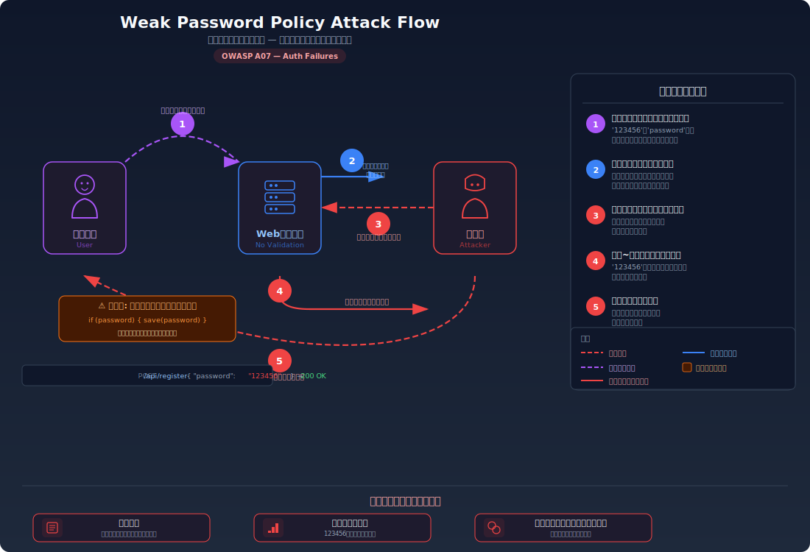
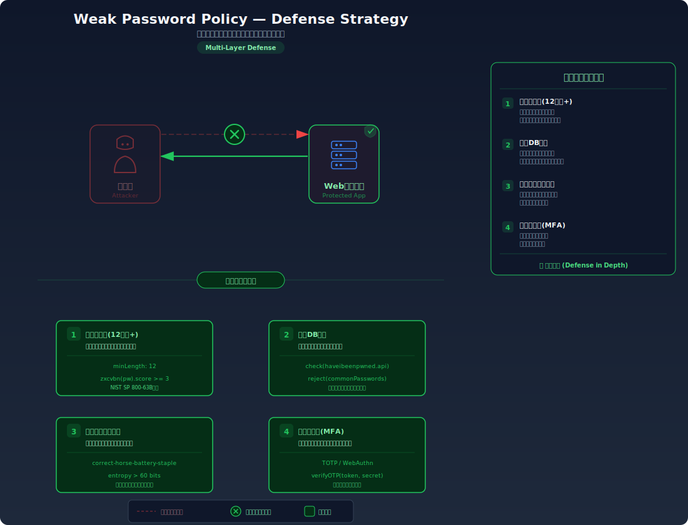

# Weak Password Policy — 弱いパスワードの登録を許してしまう

> パスワードの強度チェックがないアプリケーションでは、ユーザーが `123456` や `password` のような極めて弱いパスワードを登録でき、ブルートフォース攻撃で数秒〜数分のうちに突破されてしまう脆弱性を学びます。

---

## 対象ラボ

| 項目 | 内容 |
|------|------|
| **概要** | パスワード登録時に強度チェック（最低文字数、文字種、ブラックリスト照合等）がなく、`123456` や `password` 等の推測されやすいパスワードがそのまま受理される |
| **攻撃例** | `123456` で登録 → ブルートフォース辞書の最上位で即座に突破 |
| **技術スタック** | Hono API（バリデーション） |
| **難易度** | ★☆☆ 入門 |
| **前提知識** | HTTP リクエストの基本（POST）、[ブルートフォース攻撃](./brute-force)ラボの理解 |

---

## この脆弱性を理解するための前提

### ユーザー登録時のパスワード設定

Web アプリケーションのユーザー登録フローでは、ユーザーが自分でパスワードを選択する。多くのユーザーは覚えやすさを優先し、短くて単純なパスワードを設定しがちである。

```
POST /api/register
{ "username": "alice", "password": "123456" }

→ 200 OK: 登録成功
```

よく使われるパスワードのトップ 10 は毎年ほぼ同じであり、`123456`、`password`、`123456789`、`qwerty`、`abc123` 等が上位を占める。

### どこに脆弱性が生まれるのか

問題は、サーバー側でパスワードの **強度を一切検証しない** こと。パスワードフィールドに何か入力されていれば、その内容が 1 文字であっても、`aaa` であっても、そのまま受理してしまう。

```typescript
// ⚠️ この部分が問題 — パスワードの強度チェックが一切ない
app.post('/register', async (c) => {
  const { username, password } = await c.req.json();
  // パスワードの存在チェックはするが、強度は確認しない
  if (!password) {
    return c.json({ error: 'パスワードは必須です' }, 400);
  }
  // "123456" も "a" も受け入れてしまう
  await pool.query(
    'INSERT INTO users (username, password) VALUES ($1, $2)',
    [username, password]
  );
  return c.json({ message: '登録成功' });
});
```

`123456` は世界で最も多く使用されているパスワードであり、あらゆるブルートフォース辞書の最上位に含まれている。このパスワードが登録できてしまうということは、攻撃者に「最初の 1 回で突破してください」と言っているに等しい。

---

## 攻撃の仕組み



### 攻撃のシナリオ

1. **ユーザー** が弱いパスワード `123456` でアカウントを登録する

   覚えやすさを優先し、短くて単純なパスワードを選択する。アプリケーションは強度チェックを行わないため、そのまま受理される。

2. **サーバー** がバリデーションなしでパスワードを保存する

   パスワードフィールドに値が入っていることだけを確認し、その内容が十分に強力かどうかは検証しない。

   ```typescript
   // パスワードが空でなければ何でもOK
   if (password) {
     await saveUser(username, password);
   }
   ```

3. **攻撃者** がブルートフォース攻撃を開始する

   よく使われるパスワードの辞書（rockyou.txt 等）を使って、ユーザー名に対するログイン試行を行う。辞書の最上位には `123456`、`password`、`123456789` 等が並んでいる。

4. **攻撃者** が数秒でパスワードを突破する

   `123456` は辞書の 1 番目か 2 番目に位置するため、文字通り最初の数回の試行で突破される。たとえレート制限があっても、5 回以内の試行で成功してしまう。

### なぜ成功するのか

| 条件 | 説明 |
|------|------|
| パスワード強度チェックの不在 | 短すぎる・単純すぎる・よく使われるパスワードを拒否する仕組みがない |
| 人間の行動パターン | ユーザーは覚えやすさを優先し、強制されなければ弱いパスワードを選ぶ傾向がある |
| 攻撃辞書の予測可能性 | よく使われるパスワードのリストは公開されており、攻撃者はこれらを最初に試す |

### 被害の範囲

- **機密性**: 弱いパスワードのアカウントは容易に乗っ取られ、個人情報やプライベートデータが漏洩する
- **完全性**: 乗っ取られたアカウントでデータの改ざん、投稿の偽装、設定の変更が行われる
- **可用性**: 大量のアカウントが弱いパスワードで登録されている場合、ボットによる大規模なアカウント乗っ取りが発生し、サービスの信頼性が損なわれる

---

## 対策



### 根本原因

パスワード登録時に **強度の検証を行っていない** ことが根本原因。アプリケーションがユーザーの選択を無条件に受け入れ、「弱すぎるパスワードは拒否する」という防衛線を持っていない。

### 安全な実装

パスワード登録時に複数の強度チェックを実装する。最低文字数、文字種の要件に加え、よく使われるパスワードのブラックリスト照合を行うことで、推測されやすいパスワードの登録を防ぐ。

単に「8 文字以上」とするだけでは `password` や `12345678` を防げない。ブラックリスト照合により、辞書攻撃で真っ先に試されるパスワードを登録段階で排除する。

```typescript
// ✅ パスワード強度チェック — 複数の要件とブラックリストで検証
const COMMON_PASSWORDS = new Set([
  '123456', 'password', '123456789', 'qwerty', 'abc123',
  'password1', 'admin', 'letmein', 'welcome', 'admin123',
]);

function validatePassword(password: string): { valid: boolean; reason?: string } {
  if (password.length < 8) {
    return { valid: false, reason: 'パスワードは8文字以上必要です' };
  }
  if (!/[A-Z]/.test(password)) {
    return { valid: false, reason: '大文字を1文字以上含めてください' };
  }
  if (!/[a-z]/.test(password)) {
    return { valid: false, reason: '小文字を1文字以上含めてください' };
  }
  if (!/[0-9]/.test(password)) {
    return { valid: false, reason: '数字を1文字以上含めてください' };
  }
  if (COMMON_PASSWORDS.has(password.toLowerCase())) {
    return { valid: false, reason: 'よく使われるパスワードは使用できません' };
  }
  return { valid: true };
}

app.post('/register', async (c) => {
  const { username, password } = await c.req.json();
  const check = validatePassword(password);
  if (!check.valid) {
    return c.json({ error: check.reason }, 400);
  }
  await pool.query(
    'INSERT INTO users (username, password) VALUES ($1, $2)',
    [username, password]
  );
  return c.json({ message: '登録成功' });
});
```

#### 脆弱 vs 安全: コード比較

```diff
  app.post('/register', async (c) => {
    const { username, password } = await c.req.json();
-   if (!password) {
-     return c.json({ error: 'パスワードは必須です' }, 400);
-   }
+   const check = validatePassword(password);
+   if (!check.valid) {
+     return c.json({ error: check.reason }, 400);
+   }
    await pool.query(...);
  });
```

脆弱なコードでは「パスワードが空でないこと」しか確認しない。安全なコードでは `validatePassword()` で文字数、文字種、ブラックリストの 3 段階チェックを行い、弱いパスワードを登録段階で拒否する。

### その他の防御策

| 対策 | 種類 | 説明 |
|------|------|------|
| パスワード強度チェック | 根本対策 | 最低文字数・文字種・ブラックリストで弱いパスワードを拒否する。最も基本的で必須の対策 |
| Have I Been Pwned API 連携 | 根本対策 | 過去に漏洩したパスワードとの照合を行い、既知の漏洩パスワードの使用を防ぐ |
| パスワード強度メーター | 多層防御 | zxcvbn 等のライブラリで登録フォームにリアルタイムの強度インジケーターを表示し、ユーザーに強いパスワードの設定を促す |
| パスフレーズの推奨 | 多層防御 | 「correct-horse-battery-staple」のような長い文章形式のパスワードを推奨する。覚えやすく推測されにくい |
| 定期的なパスワード監査 | 検知 | 既存アカウントのパスワード強度を定期的に評価し、弱いパスワードのユーザーに変更を促す |

---

## 実装メモ

| 項目 | パス |
|------|------|
| 脆弱エンドポイント (登録) | `/api/labs/weak-password-policy/vulnerable/register` |
| 脆弱エンドポイント (ログイン) | `/api/labs/weak-password-policy/vulnerable/login` |
| 安全エンドポイント (登録) | `/api/labs/weak-password-policy/secure/register` |
| 安全エンドポイント (ログイン) | `/api/labs/weak-password-policy/secure/login` |
| バックエンド | `backend/src/labs/weak-password-policy.ts` |
| フロントエンド | `frontend/src/pages/WeakPasswordPolicy.tsx` |
| DB | `.devcontainer/db/init.sql` の `users` テーブルを使用 |

- 脆弱版ではパスワードの空チェックのみ（`if (!password)` だけ）
- 安全版では `validatePassword()` 関数で文字数・文字種・ブラックリストの 3 段階チェック
- フロントエンドには zxcvbn ベースのパスワード強度メーターを実装

---

## 現実世界での事例

| 年 | インシデント | 概要 |
|----|-------------|------|
| 2009 | RockYou | 3,200 万件のパスワードが平文で漏洩。最多パスワードは `123456`（29 万件）。このリストが現在もブルートフォース辞書として広く使用されている |
| 2019 | NCSC 報告書 | 英国 National Cyber Security Centre が分析した漏洩データで、最も多いパスワードは `123456`（2,300 万件以上のアカウントで使用）であることが判明 |

---

## 関連ラボ

| ラボ | 関連性 |
|------|--------|
| [ブルートフォース攻撃](./brute-force) | 弱いパスワードはブルートフォースの辞書上位に含まれるため、レート制限があっても許可された回数内で突破される。弱いパスワードポリシーはブルートフォース対策の効果を大幅に低下させる |
| [デフォルト認証情報](./default-credentials) | デフォルトパスワード（`admin123` 等）も弱いパスワードの一種。変更を強制しても変更先が弱ければ同じ問題 |
| [平文パスワード保存](./plaintext-password) | 弱いパスワードをハッシュ化しても、bcrypt の保護を受けても、辞書上位のパスワードは比較的早く突破される。パスワードの強度自体が重要 |

---

## 参考資料

- [OWASP - Testing for Weak Password Policy](https://owasp.org/www-project-web-security-testing-guide/latest/4-Web_Application_Security_Testing/04-Authentication_Testing/07-Testing_for_Weak_Password_Policy)
- [NIST SP 800-63B: Digital Identity Guidelines - Authentication](https://pages.nist.gov/800-63-3/sp800-63b.html)
- [CWE-521: Weak Password Requirements](https://cwe.mitre.org/data/definitions/521.html)

---

## 実際に試す

このラボの攻撃と防御を実際に体験できます。

[→ 実際に試す](./weak-password-policy-tryit)

---

## 理解度テスト

学んだ内容をクイズで確認してみましょう:

- [弱いパスワードポリシー - 理解度テスト](./weak-password-policy-quiz)

