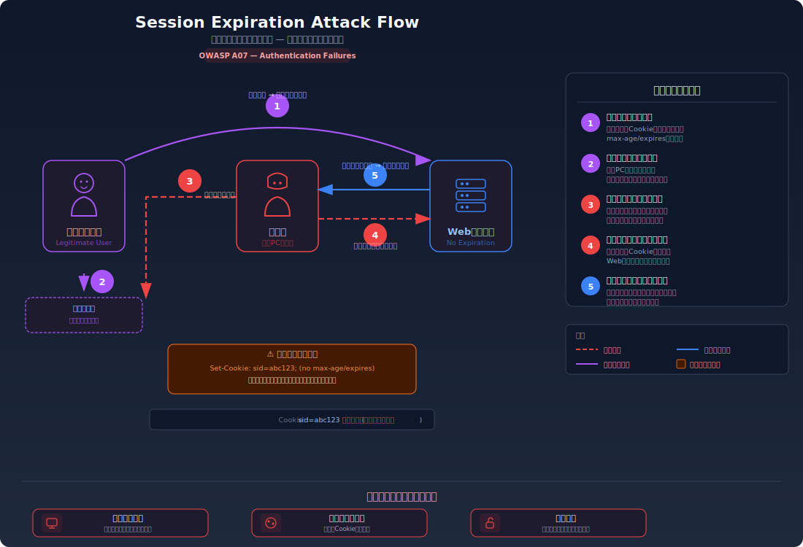
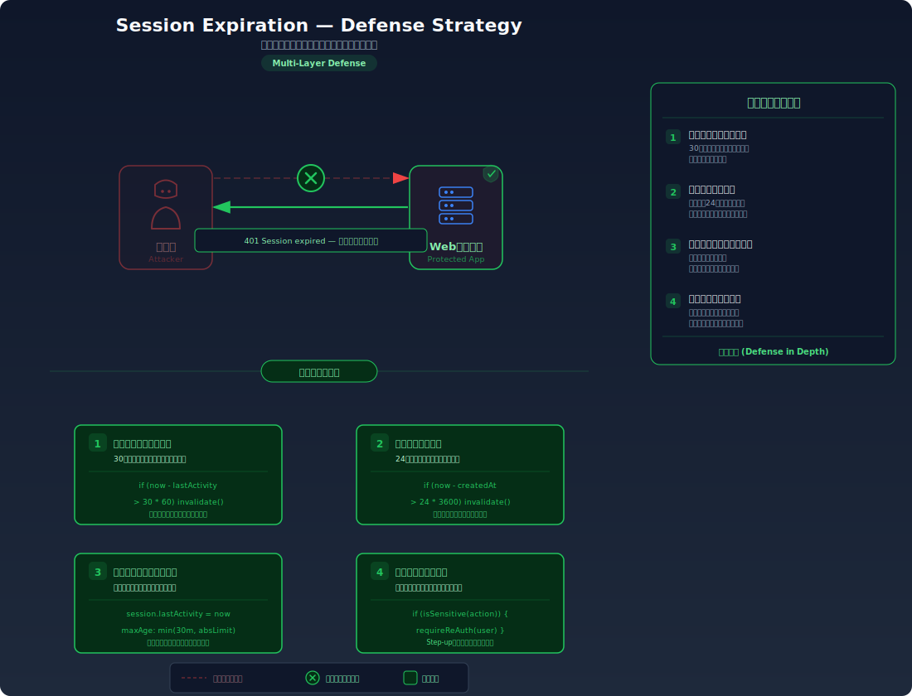

# Session Expiration — セッション有効期限の不備

> セッションに有効期限が設定されていない、または極端に長いために、放置されたセッションが永久に有効な状態となり、再認証なしでアクセスされ続ける脆弱性を学びます。

---

## 対象ラボ

| 項目 | 内容 |
|------|------|
| **概要** | セッション Cookie や JWT に適切な有効期限が設定されておらず、一度ログインすると永久にセッションが有効になるため、放置端末や漏洩トークンで無期限にアクセスできる |
| **攻撃例** | `curl -b "session_id=leaked-session-from-months-ago" http://localhost:3000/api/labs/session-expiration/vulnerable/profile` |
| **技術スタック** | Hono API + Cookie セッション管理 |
| **難易度** | ★☆☆ 入門 |
| **前提知識** | セッション管理の基本、Cookie 属性 |

---

## この脆弱性を理解するための前提

### セッションの有効期限管理の仕組み

Web アプリケーションでは、ユーザーがログインするとサーバーがセッションを作成し、そのセッション ID を Cookie としてブラウザに返す。適切に設計されたセッションには2種類の有効期限が設定される:

- **アイドルタイムアウト**: 最後のアクティビティから一定時間操作がなければセッションを失効させる（例: 30分）
- **絶対タイムアウト**: セッション作成から一定時間が経過したら、アクティビティの有無にかかわらず失効させる（例: 8時間）

```
適切なセッション管理:
Set-Cookie: session_id=abc123; Path=/; HttpOnly; Max-Age=1800

サーバー側のセッションレコード:
{
  sessionId: "abc123",
  userId: 1,
  createdAt: "2025-01-01T09:00:00Z",    // 絶対タイムアウトの基準
  lastAccessedAt: "2025-01-01T09:25:00Z", // アイドルタイムアウトの基準
  idleTimeout: 1800,     // 30分
  absoluteTimeout: 28800 // 8時間
}
```

この仕組みにより、ユーザーが離席したまま放置された端末や、過去に漏洩したセッション ID は、一定時間後に自動的に無効化される。

### どこに脆弱性が生まれるのか

開発者がセッションの有効期限管理を実装しない場合、セッションは永久に有効になる。これは「機能が動いているから問題ない」と見落とされやすい脆弱性の典型である。

```typescript
// ⚠️ この部分が問題 — 有効期限が一切設定されていない
app.post('/login', async (c) => {
  const sessionId = crypto.randomUUID();

  // セッションをサーバー側に保存するが、有効期限がない
  sessions.set(sessionId, {
    userId: user.id,
    username: user.username,
    createdAt: new Date(),
    // ⚠️ idleTimeout がない — 放置しても失効しない
    // ⚠️ absoluteTimeout がない — 永久に有効
  });

  // Cookie にも Max-Age / Expires が設定されていない
  setCookie(c, 'session_id', sessionId, {
    path: '/',
    httpOnly: true,
    // ⚠️ maxAge が未設定 — ブラウザを閉じるまで有効（セッションCookie）
    // しかしブラウザのセッション復元機能で永続化される場合もある
  });

  return c.json({ message: 'ログイン成功' });
});
```

`Max-Age` を設定しない Cookie は「セッション Cookie」としてブラウザを閉じるまで有効とされるが、現代のブラウザにはセッション復元機能があり、実質的に永続化される。さらにサーバー側でタイムアウトを管理しなければ、セッション ID が有効かどうかは一切チェックされない。

---

## 攻撃の仕組み



### 攻撃のシナリオ

1. **被害者** がアプリケーションにログインし、そのまま離席する

   被害者が共有端末（カフェのPC、図書館のPC等）でログインし、ブラウザを閉じずにその場を離れる。または、自宅のPCでログインしたまま数日〜数週間アクセスしない。

   ```
   ログイン時に発行されたセッション:
   session_id=a1b2c3d4-e5f6-7890-abcd-ef1234567890
   createdAt: 2025-01-01T09:00:00Z
   有効期限: なし（永久に有効）
   ```

2. **攻撃者** が放置された端末にアクセスする

   数時間〜数日後、攻撃者が同じ端末にアクセスする。ブラウザにはセッション Cookie が残っており、アプリケーションにアクセスすると自動的に被害者として認証される。

   ```bash
   # 数日前のセッションIDがまだ有効
   curl http://localhost:3000/api/labs/session-expiration/vulnerable/profile \
     -b "session_id=a1b2c3d4-e5f6-7890-abcd-ef1234567890"
   # → 200 OK: { "username": "alice", "email": "alice@example.com" }
   ```

   サーバーはセッション ID の有効性のみを確認し、いつ作成されたか、最後のアクセスからどれだけ時間が経ったかは一切検証しない。

3. **攻撃者** が被害者のアカウントを操作する

   攻撃者は被害者として任意の操作を行う。パスワード変更、メールアドレス変更、データの閲覧・変更・削除が可能。被害者が再度アクセスしない限り、不正アクセスに気づくことはない。

   ```bash
   # 攻撃者がパスワードを変更
   curl -X POST http://localhost:3000/api/labs/session-expiration/vulnerable/change-password \
     -H "Content-Type: application/json" \
     -b "session_id=a1b2c3d4-e5f6-7890-abcd-ef1234567890" \
     -d '{"newPassword": "hacked123"}'
   # → 200 OK: { "message": "パスワードを変更しました" }
   ```

### なぜ成功するのか

| 条件 | 説明 |
|------|------|
| セッションに有効期限がない | サーバー側でアイドルタイムアウトも絶対タイムアウトも実装されていないため、セッションが永久に有効である |
| Cookie に `Max-Age` / `Expires` がない | ブラウザ側でもCookieの自動削除が行われないため、ブラウザを閉じてもセッション復元機能で Cookie が残る場合がある |
| ログアウトを強制しない | 一定期間操作がないユーザーを自動的にログアウトさせる仕組みがないため、放置されたセッションがそのまま残り続ける |

### 被害の範囲

- **機密性**: 放置された端末から被害者のアカウント情報に完全にアクセスできる。セッションが数か月前のものであっても有効なため、時間が経つほど被害対象が拡大する
- **完全性**: 被害者のアカウントでデータ変更、パスワード変更、設定変更が可能。古いセッションが使われるため、通常のアクセスログでは異常を検知しにくい
- **可用性**: パスワードやリカバリー情報を変更されると、被害者はアカウントを永続的に失う。長期間アクセスしないユーザーほど被害に気づくのが遅れる

---

## 対策



### 根本原因

セッションのライフサイクル管理が実装されていないことが根本原因である。セッションの「作成」は実装するが、「失効」の仕組みを実装しない開発者が多い。結果として、一度発行されたセッションはサーバーのメモリが解放されるか、明示的にログアウトされるまで永久に有効になる。

### 安全な実装

セッションにアイドルタイムアウトと絶対タイムアウトの両方を実装する。アイドルタイムアウトは「操作しないまま放置された場合」、絶対タイムアウトは「長時間使い続けた場合（盗まれたセッションの継続利用を防止）」に対応する。

```typescript
// ✅ セッションにアイドルタイムアウトと絶対タイムアウトを実装

const IDLE_TIMEOUT_MS = 30 * 60 * 1000;      // 30分: 操作なしで失効
const ABSOLUTE_TIMEOUT_MS = 8 * 60 * 60 * 1000; // 8時間: 作成から失効

app.post('/login', async (c) => {
  const sessionId = crypto.randomUUID();
  const now = Date.now();

  sessions.set(sessionId, {
    userId: user.id,
    username: user.username,
    createdAt: now,        // ✅ 絶対タイムアウトの基準
    lastAccessedAt: now,   // ✅ アイドルタイムアウトの基準
  });

  // ✅ Cookie にも Max-Age を設定 — ブラウザ側でも期限を管理
  setCookie(c, 'session_id', sessionId, {
    path: '/',
    httpOnly: true,
    secure: true,
    sameSite: 'Strict',
    maxAge: ABSOLUTE_TIMEOUT_MS / 1000, // 秒単位で指定
  });

  return c.json({ message: 'ログイン成功' });
});

// ✅ 認証ミドルウェアでタイムアウトをチェック
const authMiddleware = async (c, next) => {
  const sessionId = getCookie(c, 'session_id');
  const session = sessions.get(sessionId);

  if (!session) {
    return c.json({ error: 'セッションが存在しません' }, 401);
  }

  const now = Date.now();

  // ✅ アイドルタイムアウトチェック — 最終アクセスからの経過時間
  if (now - session.lastAccessedAt > IDLE_TIMEOUT_MS) {
    sessions.delete(sessionId);
    return c.json({ error: 'セッションがタイムアウトしました（操作なし）' }, 401);
  }

  // ✅ 絶対タイムアウトチェック — セッション作成からの経過時間
  if (now - session.createdAt > ABSOLUTE_TIMEOUT_MS) {
    sessions.delete(sessionId);
    return c.json({ error: 'セッションの有効期限が切れました' }, 401);
  }

  // ✅ スライディング有効期限 — アクセスのたびにアイドルタイマーをリセット
  session.lastAccessedAt = now;

  c.set('user', session);
  await next();
};
```

#### 脆弱 vs 安全: コード比較

```diff
  app.post('/login', async (c) => {
    const sessionId = crypto.randomUUID();
+   const now = Date.now();

    sessions.set(sessionId, {
      userId: user.id,
      username: user.username,
-     createdAt: new Date(),
+     createdAt: now,
+     lastAccessedAt: now,
    });

    setCookie(c, 'session_id', sessionId, {
      path: '/',
      httpOnly: true,
+     secure: true,
+     sameSite: 'Strict',
+     maxAge: 28800,  // 8時間
    });
  });

  const authMiddleware = async (c, next) => {
    const sessionId = getCookie(c, 'session_id');
    const session = sessions.get(sessionId);
-   // セッションの存在確認のみ — 期限チェックなし
+   const now = Date.now();
+   if (now - session.lastAccessedAt > IDLE_TIMEOUT_MS) {
+     sessions.delete(sessionId);
+     return c.json({ error: 'タイムアウト' }, 401);
+   }
+   if (now - session.createdAt > ABSOLUTE_TIMEOUT_MS) {
+     sessions.delete(sessionId);
+     return c.json({ error: '有効期限切れ' }, 401);
+   }
+   session.lastAccessedAt = now;
    c.set('user', session);
    await next();
  };
```

脆弱なコードではセッションの存在確認だけで認証が通るが、安全なコードでは `lastAccessedAt` と `createdAt` の両方を現在時刻と比較し、一定時間を超えたセッションを自動的に削除・拒否する。`lastAccessedAt` のリセット（スライディング有効期限）により、アクティブなユーザーは快適に使い続けられる。

### その他の防御策

| 対策 | 種類 | 説明 |
|------|------|------|
| アイドルタイムアウト + 絶対タイムアウト | 根本対策 | 操作なしのタイムアウトと、セッション作成からの絶対的なタイムアウトを両方実装する。これが最も重要 |
| Cookie の `Max-Age` 設定 | 根本対策 | ブラウザ側でも Cookie の有効期限を設定し、クライアント側でも古いセッションが自動削除されるようにする |
| 重要操作時の再認証 | 多層防御 | パスワード変更やメールアドレス変更などの重要操作時に、現在のパスワード入力を求める。セッションが盗まれても被害を限定できる |
| 同時セッション数の制限 | 多層防御 | 1ユーザーあたりのアクティブセッション数を制限し、新しいログイン時に古いセッションを無効化する |
| セッション活動ログの監視 | 検知 | 長期間放置後に突然アクティブになったセッションを異常として検知し、アラートを発する |

---

## ハンズオン手順

### Step 1: 脆弱バージョンで攻撃を体験

**ゴール**: セッションに有効期限がなく、古いセッション ID でいつまでもアクセスできることを確認する

1. 開発サーバーを起動する

   ```bash
   cd backend && pnpm dev
   ```

2. ユーザー（alice）でログインし、セッション ID を取得する

   ```bash
   # ログイン
   curl -X POST http://localhost:3000/api/labs/session-expiration/vulnerable/login \
     -H "Content-Type: application/json" \
     -d '{"username": "alice", "password": "password123"}' \
     -c cookies.txt
   ```

3. プロフィールにアクセスできることを確認する

   ```bash
   curl http://localhost:3000/api/labs/session-expiration/vulnerable/profile \
     -b cookies.txt
   # → { "username": "alice", "email": "alice@example.com" }
   ```

4. Cookie からセッション ID を取り出し、時間が経過してもアクセスできることを確認する

   ```bash
   # セッションIDを変数に保存
   SESSION_ID=$(grep session_id cookies.txt | awk '{print $NF}')

   # 時間経過をシミュレートするため、一度ブラウザを閉じた想定で直接アクセス
   curl http://localhost:3000/api/labs/session-expiration/vulnerable/profile \
     -b "session_id=$SESSION_ID"
   # → 200 OK: まだアクセスできる（期限がないため）
   ```

5. DevTools で Cookie の属性を確認する

   - Application → Cookies → `session_id` を選択
   - `Expires / Max-Age` が `Session` または空欄であることを確認
   - **この結果が意味すること**: サーバー側もクライアント側も有効期限を管理していないため、このセッションは事実上永久に有効

### Step 2: 安全バージョンで防御を確認

**ゴール**: セッションにタイムアウトが設定されており、一定時間後にアクセスが拒否されることを確認する

1. 安全なエンドポイントでログインする

   ```bash
   curl -X POST http://localhost:3000/api/labs/session-expiration/secure/login \
     -H "Content-Type: application/json" \
     -d '{"username": "alice", "password": "password123"}' \
     -c cookies-secure.txt
   ```

2. DevTools で Cookie の属性を確認する

   - `Max-Age` が適切な値（例: 1800秒 = 30分）に設定されていることを確認

3. セッションのタイムアウトを体験する（ラボではタイムアウトを短く設定）

   ```bash
   # 安全バージョンではアイドルタイムアウトが短く設定されている（デモ用: 30秒）
   # 30秒以上待ってからアクセス
   sleep 35

   curl http://localhost:3000/api/labs/session-expiration/secure/profile \
     -b cookies-secure.txt
   # → 401 Unauthorized: { "error": "セッションがタイムアウトしました" }
   ```

4. コードの差分を確認する

   - `backend/src/labs/step04-session/session-expiration.ts` の脆弱版と安全版を比較
   - **どの行が違いを生んでいるか** に注目: `IDLE_TIMEOUT_MS` と `ABSOLUTE_TIMEOUT_MS` の定義、および認証ミドルウェアでのタイムアウトチェック

### 確認ポイント

以下を自分の言葉で説明できれば、このラボは完了です:

- [ ] セッションの有効期限を設定しない場合、どのようなリスクがあるか
- [ ] アイドルタイムアウトと絶対タイムアウトの違いは何か、なぜ両方必要なのか
- [ ] Cookie の `Max-Age` だけでは不十分で、サーバー側でもタイムアウトを管理すべき理由は何か
- [ ] スライディング有効期限が「なぜ」ユーザー体験とセキュリティの両立に有効なのか

---

## 実装メモ

| 項目 | パス |
|------|------|
| 脆弱エンドポイント | `/api/labs/session-expiration/vulnerable/login`, `/api/labs/session-expiration/vulnerable/profile`, `/api/labs/session-expiration/vulnerable/change-password` |
| 安全エンドポイント | `/api/labs/session-expiration/secure/login`, `/api/labs/session-expiration/secure/profile`, `/api/labs/session-expiration/secure/change-password` |
| バックエンド | `backend/src/labs/step04-session/session-expiration.ts` |
| フロントエンド | `frontend/src/labs/step04-session/pages/SessionExpiration.tsx` |

- 脆弱版ではセッションオブジェクトに `createdAt` のみ保持し、タイムアウトチェックを行わない
- 安全版ではアイドルタイムアウト（デモ用: 30秒、説明上は30分）と絶対タイムアウト（デモ用: 120秒、説明上は8時間）を実装
- デモ用に短いタイムアウト値を使用し、ハンズオンで体験しやすくする
- Cookie の `Max-Age` は安全版でのみ設定する
- `change-password` エンドポイントは放置セッションの被害を具体的に示すために用意する

---

## 現実世界での事例

| 年 | インシデント | 概要 |
|----|-------------|------|
| 2012 | GitHub OAuth トークン無期限問題 | GitHub の OAuth トークンに有効期限が設定されておらず、一度発行されたトークンが永久に有効だった。トークンが漏洩した場合のリスクが指摘され、後にトークンの有効期限管理が強化された |
| 2018 | Facebook セッション無期限ログイン | Facebook の「ログイン状態を維持する」機能でセッションが実質的に無期限に設定されており、端末を紛失した場合やアクセストークンが漏洩した場合に長期間不正アクセスが可能な状態だった |

---

## 関連ラボ

| ラボ | 関連性 |
|------|--------|
| [Token Replay](./token-replay.md) | トークン再利用攻撃は、セッション有効期限が長いほど攻撃ウィンドウが広がる。有効期限管理はトークン再利用対策の基盤となる |
| [Session Hijacking](./session-hijacking) | 窃取されたセッション ID に有効期限がなければ、攻撃者は永久にそのセッションを使い続けられる。適切な有効期限はハイジャック被害を限定する |
| [Cookie 操作](./cookie-manipulation) | Cookie の `Max-Age`、`Expires` 属性はセッション有効期限管理のクライアント側実装。サーバー側タイムアウトと合わせて二重の防御になる |

---

## 参考資料

- [OWASP - Session Management Cheat Sheet](https://cheatsheetseries.owasp.org/cheatsheets/Session_Management_Cheat_Sheet.html)
- [CWE-613: Insufficient Session Expiration](https://cwe.mitre.org/data/definitions/613.html)
