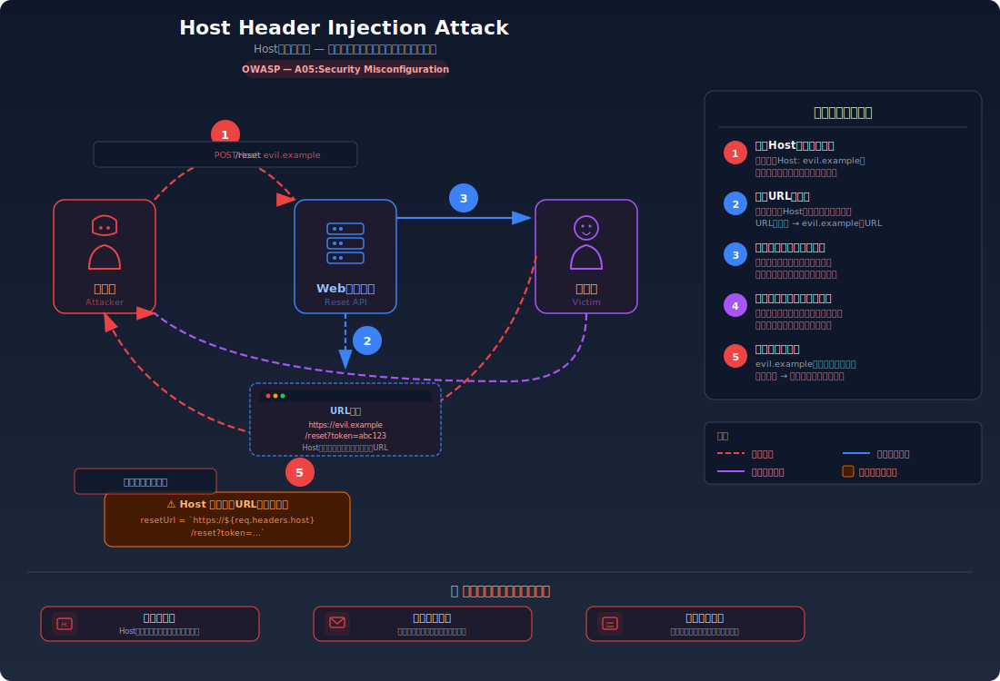
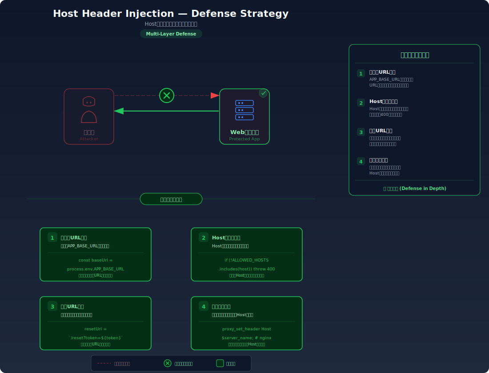

import { HostHeaderInjectionLab } from '@site/src/components/labs/step07/HostHeaderInjectionLab';

# Host Header Injection — Hostヘッダ汚染によるリンク詐称

> サーバーがHTTPリクエストの Host ヘッダをそのまま信頼してURLを組み立てると、攻撃者が偽のドメインを含むパスワードリセットリンクを生成させ、被害者のリセットトークンを盗み取れてしまう問題です。

---

## 対象ラボ

| 項目 | 内容 |
|------|------|
| **概要** | サーバーが `Host` ヘッダの値を検証せずに絶対URLの生成に使用しており、攻撃者が `Host: evil.example` を送信するとパスワードリセットメールに `https://evil.example/reset?token=xxx` が含まれる |
| **攻撃例** | `curl -X POST http://localhost:3000/api/labs/host-header-injection/vulnerable/reset-request -H "Host: evil.example" -H "Content-Type: application/json" -d '{"email": "victim@example.com"}'` |
| **技術スタック** | Hono API + PostgreSQL |
| **難易度** | ★★☆ 中級 |
| **前提知識** | HTTPヘッダーの基本、パスワードリセットフロー |

---

## この脆弱性を理解するための前提

### HTTP Host ヘッダの仕組み

HTTP/1.1 では、クライアントはリクエストに `Host` ヘッダを含めて送信する。これは同一IPアドレスで複数のドメインをホストする「バーチャルホスト」の仕組みを支えるためのものであり、サーバーがどのドメイン宛のリクエストかを判別するために使用される。

```
GET /reset?token=abc123 HTTP/1.1
Host: myapp.example.com
```

Webアプリケーションは、パスワードリセットメールやリダイレクトURL、OGPタグなど、**絶対URL**（スキーム＋ドメイン＋パスの完全なURL）を生成する必要がある場面がある。このとき、開発者は「自分のアプリがどのドメインで動いているか」を知る必要があり、手軽な方法として `Host` ヘッダの値を参照するパターンが広く使われている。

```
# 正常なリクエストでは Host ヘッダはブラウザが自動的に設定する
POST /api/reset-request HTTP/1.1
Host: myapp.example.com
Content-Type: application/json

{"email": "alice@example.com"}
```

正常な場合、ブラウザが自動で正しい `Host` ヘッダを設定するため、サーバーは `Host` の値を使って `https://myapp.example.com/reset?token=xxx` という正しいリセットリンクを生成する。

### どこに脆弱性が生まれるのか

問題は、`Host` ヘッダがクライアント（リクエスト送信者）によって**自由に書き換えられる**という点にある。ブラウザは正しい値を設定するが、攻撃者は `curl` やスクリプトを使って任意の値を `Host` ヘッダに設定できる。サーバーが `Host` ヘッダの値を検証せずにURL生成に使用すると、攻撃者が指定した偽ドメインがリセットリンクに埋め込まれてしまう。

```typescript
// ⚠️ この部分が問題 — Host ヘッダの値を検証せずにURL生成に使用
app.post("/reset-request", async (c) => {
  const { email } = await c.req.json();
  const user = await db.query("SELECT id FROM users WHERE email = $1", [email]);
  if (user.rows.length === 0) {
    return c.json({ message: "リセットメールを送信しました" });
  }

  const token = randomUUID();
  await db.query(
    "INSERT INTO reset_tokens(token, user_id, expires_at) VALUES($1, $2, $3)",
    [token, user.rows[0].id, new Date(Date.now() + 30 * 60 * 1000)]
  );

  // ⚠️ Host ヘッダをそのまま信頼してリセットリンクを生成
  const host = c.req.header("host"); // 攻撃者が "evil.example" に差し替え可能
  const resetLink = `https://${host}/reset?token=${token}`;

  await sendEmail(email, `パスワードリセット: ${resetLink}`);
  return c.json({ message: "リセットメールを送信しました" });
});
```

この実装では、たとえトークン自体が `crypto.randomUUID()` で安全に生成されていたとしても、リセットリンクのドメイン部分が攻撃者に制御されてしまう。被害者がリンクをクリックすると、トークンが攻撃者のサーバーに送信される。

---

## 攻撃の仕組み



### 攻撃のシナリオ

1. **攻撃者** が被害者のメールアドレスを指定し、`Host` ヘッダを自分が管理するドメインに差し替えてパスワードリセットをリクエストする

   攻撃者は `curl` やスクリプトを使って `Host` ヘッダを自由に設定できる。ブラウザ経由ではなく直接HTTPリクエストを送信するため、ブラウザの自動的な `Host` ヘッダ設定を回避できる。

   ```bash
   curl -X POST http://localhost:3000/api/labs/host-header-injection/vulnerable/reset-request \
     -H "Host: evil.example" \
     -H "Content-Type: application/json" \
     -d '{"email": "victim@example.com"}'
   ```

2. **サーバー** がリクエストの `Host` ヘッダの値を検証せずにリセットリンクを組み立てる

   サーバーは `c.req.header("host")` で取得した値 `evil.example` をそのまま使用して絶対URLを生成する。結果として、以下のようなリセットリンクが生成される:

   ```
   https://evil.example/reset?token=f47ac10b-58cc-4372-a567-0e02b2c3d479
   ```

   この偽リンクが被害者のメールアドレスに送信される。メール自体は正規のサーバーから送信されているため、メールの送信元アドレスやSPF/DKIM署名は正当なものとなり、被害者がフィッシングと見抜くのは困難。

3. **被害者** がメール内のリセットリンクをクリックする

   被害者はパスワードリセットを自分で要求していないにもかかわらず、正規のサービスからメールが届いたと認識する（実際に正規のサーバーから送信されている）。不審に思いつつもリンクをクリックすると、ブラウザは `https://evil.example/reset?token=f47ac10b-...` にアクセスする。

4. **攻撃者のサーバー** がトークンを受け取る

   `evil.example` は攻撃者が管理するドメインであり、URLのクエリパラメータに含まれるトークンがアクセスログやリクエスト処理で攻撃者に渡る。

   ```
   # 攻撃者のサーバーのアクセスログ
   GET /reset?token=f47ac10b-58cc-4372-a567-0e02b2c3d479 HTTP/1.1
   ```

5. **攻撃者** が盗んだトークンを使って被害者のパスワードを変更する

   攻撃者は正規のサーバーのエンドポイントに対して、盗み取ったトークンで直接パスワードリセットを実行する。

   ```bash
   curl -X POST http://localhost:3000/api/labs/host-header-injection/vulnerable/reset-password \
     -H "Content-Type: application/json" \
     -d '{"token": "f47ac10b-58cc-4372-a567-0e02b2c3d479", "newPassword": "attackerPassword123"}'
   ```

### なぜ成功するのか

| 条件 | 説明 |
|------|------|
| Host ヘッダの無検証利用 | サーバーが `Host` ヘッダの値を一切検証せずにURL生成に使用しているため、攻撃者が任意のドメインをリンクに埋め込める |
| メールの正当性 | リセットメールは正規のサーバーから送信されるため、SPF/DKIMなどのメール認証をパスし、被害者はフィッシングと見抜きにくい |
| トークンがURLに露出 | リセットトークンがURLのクエリパラメータに含まれているため、被害者がリンクをクリックするだけで攻撃者のサーバーにトークンが送信される |
| クライアントの信頼 | 被害者は正規サービスからのメールを信頼し、リンクのドメインを注意深く確認しないことが多い |

### 被害の範囲

- **機密性**: 被害者のパスワードリセットトークンが攻撃者に漏洩する。トークンを使って被害者のアカウントに不正アクセスし、個人情報・メッセージ・決済情報などを閲覧できる
- **完全性**: アカウント乗っ取りにより、被害者になりすました投稿・メッセージ送信・設定変更・送金操作が可能になる。メールアドレスや二要素認証設定の変更でアカウントの完全な奪取も可能
- **可用性**: パスワードと回復用メールアドレスの変更により、正規ユーザーがアカウントを回復できなくなる。大規模に悪用された場合、サービス全体の信頼性が損なわれる

---

## 対策



### 根本原因

サーバーが **クライアントから送信される Host ヘッダをURL生成のための信頼できる情報源として扱っている** ことが根本原因。`Host` ヘッダはクライアントが自由に設定できるリクエストヘッダであり、「自アプリのドメイン」を知るための信頼できる手段ではない。URL生成に使用するドメイン名はサーバー側の設定で定義すべきであり、リクエストヘッダから取得してはならない。

### 安全な実装

最も確実な対策は、URL生成に使用するベースURLを **環境変数やアプリケーション設定でハードコード** し、`Host` ヘッダに依存しないことである。これにより、攻撃者がどのような `Host` ヘッダを送信しても、生成されるリンクは常に正しいドメインを指す。

追加の防御として、`Host` ヘッダの値を許可リストと照合する検証を行うことで、不正な `Host` ヘッダを含むリクエスト自体を早期にブロックできる。

```typescript
import { randomUUID } from "crypto";
import { Hono } from "hono";

const app = new Hono();

// ✅ ベースURLを環境変数から取得（Host ヘッダに依存しない）
const BASE_URL = process.env.BASE_URL || "https://myapp.example.com";

// ✅ 許可するホスト名のリスト
const ALLOWED_HOSTS = new Set(
  (process.env.ALLOWED_HOSTS || "myapp.example.com").split(",")
);

// ✅ Host ヘッダ検証ミドルウェア
app.use("*", async (c, next) => {
  const host = c.req.header("host")?.split(":")[0]; // ポート番号を除去
  if (host && !ALLOWED_HOSTS.has(host)) {
    return c.json({ error: "不正なHostヘッダです" }, 400);
  }
  await next();
});

app.post("/reset-request", async (c) => {
  const { email } = await c.req.json();
  const user = await db.query("SELECT id FROM users WHERE email = $1", [email]);
  if (user.rows.length === 0) {
    // ユーザーが存在しない場合も同じレスポンスを返す（列挙防止）
    return c.json({ message: "リセットメールを送信しました" });
  }

  const token = randomUUID();
  await db.query(
    "INSERT INTO reset_tokens(token, user_id, expires_at) VALUES($1, $2, $3)",
    [token, user.rows[0].id, new Date(Date.now() + 30 * 60 * 1000)]
  );

  // ✅ 環境変数のベースURLを使用 — Host ヘッダを一切参照しない
  const resetLink = `${BASE_URL}/reset?token=${token}`;

  await sendEmail(email, `パスワードリセット: ${resetLink}`);
  return c.json({ message: "リセットメールを送信しました" });
});
```

リバースプロキシ環境では `X-Forwarded-Host` ヘッダが使用されることがあるが、これも信頼できるプロキシからのリクエストでのみ参照すべきである。最も安全な方法は、プロキシの設定で `X-Forwarded-Host` を上書きし、クライアントが送信した値を無視させることである。

```typescript
// ✅ 信頼できるプロキシからのX-Forwarded-Hostのみ使用する場合
const TRUSTED_PROXIES = new Set(["10.0.0.1", "10.0.0.2"]);

app.use("*", async (c, next) => {
  const remoteIp = c.req.header("x-real-ip") || c.env?.remoteAddr;

  // 信頼できるプロキシからのリクエストの場合のみX-Forwarded-Hostを参照
  if (remoteIp && TRUSTED_PROXIES.has(remoteIp)) {
    const forwardedHost = c.req.header("x-forwarded-host");
    if (forwardedHost && !ALLOWED_HOSTS.has(forwardedHost)) {
      return c.json({ error: "不正なHostヘッダです" }, 400);
    }
  }

  await next();
});
```

#### 脆弱 vs 安全: コード比較

```diff
  app.post("/reset-request", async (c) => {
    const { email } = await c.req.json();
    // ...トークン生成処理...

-   // ⚠️ Host ヘッダをそのまま信頼してURL生成
-   const host = c.req.header("host");
-   const resetLink = `https://${host}/reset?token=${token}`;
+   // ✅ 環境変数のベースURLを使用（Host ヘッダに依存しない）
+   const BASE_URL = process.env.BASE_URL || "https://myapp.example.com";
+   const resetLink = `${BASE_URL}/reset?token=${token}`;

    await sendEmail(email, `パスワードリセット: ${resetLink}`);
  });
```

脆弱なコードでは `c.req.header("host")` の値がそのままリセットリンクのドメイン部分に使われるため、攻撃者が `Host: evil.example` を送信するとリンクが `https://evil.example/reset?token=...` になる。安全なコードでは環境変数 `BASE_URL` からドメインを取得するため、リクエストの `Host` ヘッダがどのような値であっても、リンクは常に `https://myapp.example.com/reset?token=...` となる。

### その他の防御策

| 対策 | 種類 | 説明 |
|------|------|------|
| ベースURLのハードコード/環境変数化 | 根本対策 | URL生成に使用するドメインをアプリケーション設定で定義し、`Host` ヘッダに一切依存しない。最も重要で必須の対策 |
| Host ヘッダの許可リスト検証 | 根本対策 | リクエストの `Host` ヘッダを許可されたホスト名のリストと照合し、不一致の場合はリクエストを拒否する。不正なリクエストを早期にブロックする |
| リバースプロキシでの Host 上書き | 多層防御 | Nginx や CloudFront などのリバースプロキシで `Host` ヘッダを強制的に正しい値に上書きし、クライアントの指定した値をアプリに到達させない |
| X-Forwarded-Host の信頼範囲制限 | 多層防御 | `X-Forwarded-Host` を参照する場合、送信元IPが信頼できるプロキシであることを検証してから使用する |
| 異常な Host ヘッダの検知 | 検知 | 許可リストに含まれない `Host` ヘッダのリクエストをログに記録し、攻撃の試みを監視する |

---

<HostHeaderInjectionLab />

## ハンズオン手順

### Step 1: 脆弱バージョンで攻撃を体験

**ゴール**: `Host` ヘッダを偽装して、パスワードリセットリンクが攻撃者のドメインを含むように操作できることを確認する

1. 開発サーバーを起動する

   ```bash
   cd backend && pnpm dev
   ```

2. 正常なリクエストでリセットリンクの内容を確認する

   ```bash
   # 正常な Host ヘッダでリセットを要求
   curl -X POST http://localhost:3000/api/labs/host-header-injection/vulnerable/reset-request \
     -H "Content-Type: application/json" \
     -d '{"email": "victim@example.com"}'
   ```

   レスポンスに含まれるリセットリンクが `http://localhost:3000/reset?token=...` であることを確認する。

3. `Host` ヘッダを偽装してリクエストを送信する

   ```bash
   # Host ヘッダを攻撃者のドメインに差し替え
   curl -X POST http://localhost:3000/api/labs/host-header-injection/vulnerable/reset-request \
     -H "Host: evil.example" \
     -H "Content-Type: application/json" \
     -d '{"email": "victim@example.com"}'
   ```

4. 結果を確認する

   - レスポンスに含まれるリセットリンクが `https://evil.example/reset?token=...` になっていることを確認する
   - DevTools の Network タブでリクエストとレスポンスを確認する
   - **この結果が意味すること**: このリンクがメールで被害者に送信された場合、被害者がクリックするとトークンが `evil.example`（攻撃者のサーバー）に送信される。メール自体は正規サーバーから送信されるため、被害者はフィッシングと気づきにくい

5. トークンの窃取をシミュレーションする

   ```bash
   # レスポンスからトークンを取得（実際にはメールに含まれるリンクから取得される）
   TOKEN="レスポンスに含まれるトークン値"

   # 攻撃者は盗んだトークンで正規サーバーにパスワードリセットを要求
   curl -X POST http://localhost:3000/api/labs/host-header-injection/vulnerable/reset-password \
     -H "Content-Type: application/json" \
     -d "{\"token\": \"${TOKEN}\", \"newPassword\": \"attackerPassword123\"}"
   ```

   パスワードが変更されることを確認する。

### Step 2: 安全バージョンで防御を確認

**ゴール**: 同じ `Host` ヘッダ偽装がベースURL固定化と許可リスト検証により無効化されることを確認する

1. 安全なエンドポイントに不正な `Host` ヘッダを送信する

   ```bash
   # 不正な Host ヘッダでリクエスト — Host ヘッダ検証で拒否される
   curl -v -X POST http://localhost:3000/api/labs/host-header-injection/secure/reset-request \
     -H "Host: evil.example" \
     -H "Content-Type: application/json" \
     -d '{"email": "victim@example.com"}'
   ```

   `400 Bad Request` が返り、「不正なHostヘッダです」というエラーメッセージが表示されることを確認する。

2. 正常な `Host` ヘッダでリクエストする

   ```bash
   # 正常な Host ヘッダでリセットを要求
   curl -X POST http://localhost:3000/api/labs/host-header-injection/secure/reset-request \
     -H "Content-Type: application/json" \
     -d '{"email": "victim@example.com"}'
   ```

   リセットリンクが環境変数で設定されたベースURL（例: `https://myapp.example.com/reset?token=...`）を使用していることを確認する。`Host` ヘッダの値がリンクに反映されていないことがポイント。

3. コードの差分を確認する

   - `backend/src/labs/step07-design/host-header-injection.ts` の脆弱版と安全版を比較
   - **どの行が違いを生んでいるか** に注目: `c.req.header("host")` → `process.env.BASE_URL`、Host ヘッダ許可リスト検証の追加

### 確認ポイント

以下を自分の言葉で説明できれば、このラボは完了です:

- [ ] `Host` ヘッダはなぜクライアントが自由に設定できるのか、そしてなぜサーバーがそれを信頼してはいけないのか
- [ ] 攻撃者が `Host` ヘッダを偽装したとき、サーバー内部でどのようにリセットリンクが組み立てられ、被害者にどのようなメールが届くか
- [ ] ベースURLのハードコード（環境変数化）がなぜこの攻撃を無効化するのか（「安全だから安全」ではダメ）
- [ ] リバースプロキシ環境で `X-Forwarded-Host` を使用する場合、何に注意すべきか

---

## 実装メモ

| 項目 | パス |
|------|------|
| 脆弱エンドポイント (リセット要求) | `/api/labs/host-header-injection/vulnerable/reset-request` |
| 脆弱エンドポイント (パスワード変更) | `/api/labs/host-header-injection/vulnerable/reset-password` |
| 安全エンドポイント (リセット要求) | `/api/labs/host-header-injection/secure/reset-request` |
| 安全エンドポイント (パスワード変更) | `/api/labs/host-header-injection/secure/reset-password` |
| バックエンド | `backend/src/labs/step07-design/host-header-injection.ts` |
| フロントエンド | `frontend/src/labs/step07-design/pages/HostHeaderInjection.tsx` |
| DB | `.devcontainer/db/init.sql` の `users`, `reset_tokens` テーブルを使用 |

- 脆弱版では `c.req.header("host")` の値をそのままリセットリンクのドメインに使用する
- 安全版では環境変数 `BASE_URL` からドメインを取得し、Host ヘッダ許可リストによる検証ミドルウェアを追加する
- リセットトークン自体は両バージョンとも `crypto.randomUUID()` で安全に生成する（このラボの焦点はトークン生成ではなくURL生成の問題）
- メール送信はシミュレーション（レスポンスにリセットリンクを含めて返す）で代替する

---

## 現実世界での事例

| 年 | インシデント | 概要 |
|----|-------------|------|
| 2013 | Django（CVE-2012-4520） | Djangoのパスワードリセット機能が `Host` ヘッダの値を使用してリセットリンクを生成しており、攻撃者がHostヘッダを偽装することでリセットトークンを窃取可能だった。Django は `ALLOWED_HOSTS` 設定による検証を強化して対応した |
| 2017 | 複数のWordPressプラグイン | パスワードリセット機能において `$_SERVER['HTTP_HOST']` を使用してリセットリンクを生成するプラグインが複数報告され、Host ヘッダインジェクションによるアカウント乗っ取りが可能だった |

---

## 関連ラボ

| ラボ | 関連性 |
|------|--------|
| [パスワードリセットトークン推測](password-reset.mdx) | 同じパスワードリセットフローを対象とした脆弱性。トークン推測はトークン生成の問題、Host ヘッダインジェクションはURL生成の問題であり、両方が揃うとリセット機能全体が危殆化する |
| [X-Forwarded-For Trust](xff-trust.mdx) | 同じくHTTPヘッダをサーバーが無条件に信頼する問題。`Host` ヘッダと `X-Forwarded-For` ヘッダはどちらもクライアントが操作可能であり、「リクエストヘッダを信頼しない」という共通の教訓がある |

---

## 理解度テスト

学んだ内容をクイズで確認してみましょう:

- [Hostヘッダインジェクション - 理解度テスト](./host-header-injection-quiz)

---

## 参考資料

- [OWASP - Host Header Injection](https://owasp.org/www-project-web-security-testing-guide/latest/4-Web_Application_Security_Testing/07-Input_Validation_Testing/17-Testing_for_Host_Header_Injection)
- [CWE-644: Improper Neutralization of HTTP Headers for Scripting Syntax](https://cwe.mitre.org/data/definitions/644.html)
- [PortSwigger - HTTP Host Header Attacks](https://portswigger.net/web-security/host-header)
