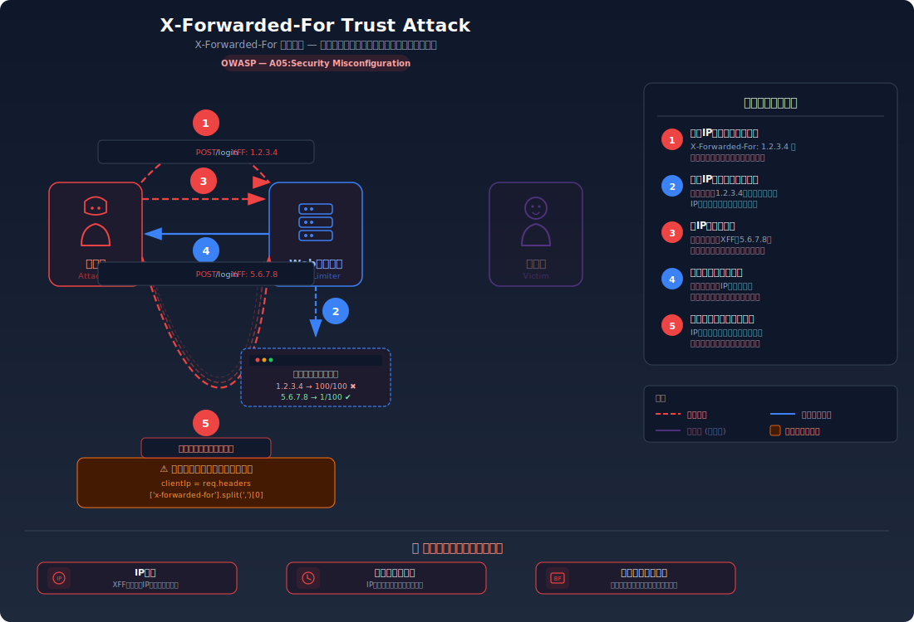
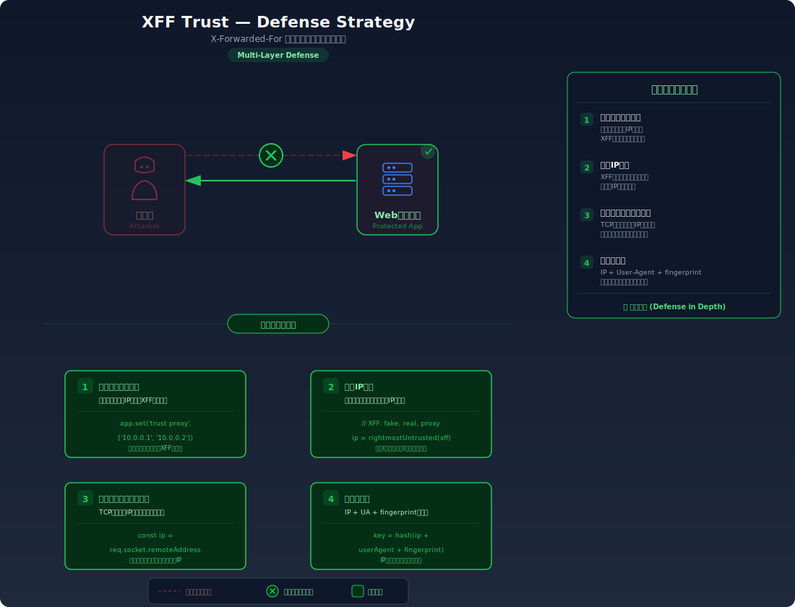

# X-Forwarded-For Trust — プロキシヘッダ信頼ミスによるレート制限回避

> サーバーがクライアントIPの特定に `X-Forwarded-For` ヘッダをそのまま信頼すると、攻撃者がヘッダの値を毎回変えることでIPベースのレート制限を回避したり、監査ログに偽のIPアドレスを記録させることができてしまう問題です。

---

## 対象ラボ

| 項目 | 内容 |
|------|------|
| **概要** | サーバーが `X-Forwarded-For` ヘッダの値を検証せずにクライアントIPとして使用しており、攻撃者がヘッダを毎回変更することでIPベースのレート制限を回避できる |
| **攻撃例** | `curl -H "X-Forwarded-For: 1.2.3.4" ...` → `curl -H "X-Forwarded-For: 5.6.7.8" ...` とIPを変えて連続リクエスト |
| **技術スタック** | Hono API |
| **難易度** | ★★☆ 中級 |
| **前提知識** | HTTPヘッダーの基本、リバースプロキシの概念、レート制限の仕組み |

---

## この脆弱性を理解するための前提

### X-Forwarded-For ヘッダとリバースプロキシの仕組み

Webアプリケーションは通常、クライアントから直接接続を受けるのではなく、Nginx、AWS ALB、Cloudflare などの**リバースプロキシ**を経由してリクエストを受け取る。このとき、リバースプロキシがアプリケーションサーバーに接続するため、アプリケーションから見た接続元IPは**プロキシのIP**になり、本来のクライアントIPが分からなくなる。

この問題を解決するために `X-Forwarded-For`（XFF）ヘッダが使われる。各プロキシは、リクエストを転送する際に送信元IPをこのヘッダに追記していく。

```
# クライアント(203.0.113.50) → プロキシA(10.0.0.1) → プロキシB(10.0.0.2) → アプリ
X-Forwarded-For: 203.0.113.50, 10.0.0.1
```

ヘッダの左側が最初の送信元（クライアント）、右に行くほどプロキシに近くなる。アプリケーションはこのヘッダを解析してクライアントの実IPを取得し、以下のような目的に使用する:

- **レート制限**: 同一IPからのリクエスト数を制限してブルートフォース攻撃を防ぐ
- **アクセスログ/監査ログ**: セキュリティインシデント調査のためにクライアントIPを記録する
- **地理的制限**: IPアドレスに基づくアクセス制御を行う
- **不正検知**: 異常なアクセスパターンを検出する

### どこに脆弱性が生まれるのか

問題は、`X-Forwarded-For` ヘッダが **クライアントによって自由に設定・追加できる** という点にある。プロキシが追記する前に、クライアント自身が偽の値をヘッダに含めて送信できるため、サーバーが先頭の値を無条件にクライアントIPとして信頼すると、攻撃者はリクエストごとに異なるIPを名乗ることができる。

```typescript
// ⚠️ この部分が問題 — X-Forwarded-For の先頭値を無条件に信頼
const rateLimitMap = new Map<string, { count: number; resetAt: number }>();

app.use("*", async (c, next) => {
  // クライアントが送信した X-Forwarded-For の先頭値をそのまま使用
  const clientIp = c.req.header("x-forwarded-for")?.split(",")[0]?.trim()
    || "unknown";

  const now = Date.now();
  const entry = rateLimitMap.get(clientIp) || { count: 0, resetAt: now + 60000 };

  if (now > entry.resetAt) {
    entry.count = 0;
    entry.resetAt = now + 60000;
  }

  entry.count++;
  rateLimitMap.set(clientIp, entry);

  if (entry.count > 10) {
    return c.json({ error: "レート制限に達しました" }, 429);
  }

  await next();
});
```

この実装では、攻撃者が `X-Forwarded-For: 1.2.3.4` で10回リクエストを送った後、`X-Forwarded-For: 5.6.7.8` に変更すると、サーバーは新しいIPからのリクエストと認識し、レート制限のカウントがリセットされる。攻撃者はIPを変えるたびに新しい10回分の枠を得られるため、レート制限が事実上無効化される。

---

## 攻撃の仕組み



### 攻撃のシナリオ

1. **攻撃者** がログインエンドポイントに対してパスワード総当たり攻撃を開始する

   攻撃者はターゲットアカウントのパスワードを推測するため、ログインエンドポイントに大量のリクエストを送信する。最初は `X-Forwarded-For` ヘッダなしで、または自分のIPで送信する。

   ```bash
   # 最初の10回のリクエスト（自分のIPで送信）
   for i in $(seq 1 10); do
     curl -s -X POST http://localhost:3000/api/labs/xff-trust/vulnerable/login \
       -H "Content-Type: application/json" \
       -d "{\"username\": \"admin\", \"password\": \"guess${i}\"}"
   done
   ```

2. **サーバー** がレート制限を適用し、攻撃者のIPからのリクエストをブロックする

   10回の試行後、サーバーは攻撃者のIPアドレスに対してレート制限を適用し、`429 Too Many Requests` を返す。通常であればこの時点で攻撃者はブロックされる。

   ```
   HTTP/1.1 429 Too Many Requests
   {"error": "レート制限に達しました。1分後に再試行してください"}
   ```

3. **攻撃者** が `X-Forwarded-For` ヘッダに偽のIPを指定してレート制限を回避する

   攻撃者は `X-Forwarded-For` ヘッダに偽のIPアドレスを設定してリクエストを再送する。サーバーはヘッダの先頭値をクライアントIPとして信頼するため、新しいIPからの新規アクセスと認識してレート制限のカウントをリセットする。

   ```bash
   # X-Forwarded-For を偽装してレート制限を回避
   for i in $(seq 1 100); do
     # リクエストごとにランダムなIPを生成
     FAKE_IP="$((RANDOM % 256)).$((RANDOM % 256)).$((RANDOM % 256)).$((RANDOM % 256))"
     curl -s -X POST http://localhost:3000/api/labs/xff-trust/vulnerable/login \
       -H "X-Forwarded-For: ${FAKE_IP}" \
       -H "Content-Type: application/json" \
       -d "{\"username\": \"admin\", \"password\": \"guess${i}\"}"
   done
   ```

   各リクエストで異なるIPを名乗るため、サーバーはすべてを別々のクライアントからのリクエストと認識し、レート制限が一切適用されない。

4. **攻撃者** が制限なくパスワード総当たりを完了し、正しいパスワードを発見する

   レート制限が無効化されたことで、攻撃者は数千〜数万回の試行を短時間で実行でき、辞書攻撃やブルートフォース攻撃が現実的になる。さらに、監査ログにも偽のIPが記録されるため、攻撃の追跡が困難になる。

   ```
   # サーバーの監査ログ（偽のIPが記録されている）
   [2026-03-01 10:00:01] Login attempt from 142.73.28.195 - Failed
   [2026-03-01 10:00:01] Login attempt from 58.201.144.87 - Failed
   [2026-03-01 10:00:02] Login attempt from 223.45.67.12 - Failed
   [2026-03-01 10:00:02] Login attempt from 91.168.33.241 - Success
   # → すべて異なるIPに見え、同一攻撃者からの攻撃と判別できない
   ```

### なぜ成功するのか

| 条件 | 説明 |
|------|------|
| XFF ヘッダの無検証信頼 | サーバーが `X-Forwarded-For` ヘッダの先頭値を無条件にクライアントIPとして使用しているため、攻撃者が任意のIPを名乗れる |
| プロキシチェーンの未検証 | サーバーがリクエストの送信元が信頼できるプロキシかどうかを検証していないため、クライアントが直接送信した偽ヘッダも受け入れてしまう |
| IPのみに依存したレート制限 | レート制限がIPアドレスのみに基づいており、他のフィンガープリント（ユーザーエージェント、セッション等）と組み合わせていないため、IPさえ変えれば回避できる |
| ヘッダの自由な設定 | HTTPの仕様上、クライアントは任意のヘッダを送信でき、`X-Forwarded-For` もその例外ではない |

### 被害の範囲

- **機密性**: レート制限の回避によりパスワード総当たり攻撃が成功し、ユーザーアカウントが不正にアクセスされる。監査ログに偽のIPが記録されるため、攻撃者の特定と事後調査が困難になる
- **完全性**: 偽のIPアドレスが監査ログに記録されることで、ログの信頼性が損なわれる。不正ログイン後のデータ改ざんや設定変更も追跡困難になる
- **可用性**: レート制限の回避により大量のリクエストがサーバーに到達し、正規ユーザーへのサービス品質が低下する。大規模な総当たり攻撃による計算リソースの枯渇も問題になりうる

---

## 対策



### 根本原因

サーバーが **クライアントから送信される X-Forwarded-For ヘッダを、送信元の検証なしにクライアントIPの信頼できる情報源として扱っている** ことが根本原因。`X-Forwarded-For` はクライアントが自由に設定できるリクエストヘッダであり、信頼できるプロキシが付加した値のみを参照すべきである。プロキシチェーンのうち「どの部分が信頼でき、どの部分がクライアントの自己申告か」を区別せずに先頭値を採用することで、IP偽装が可能になる。

### 安全な実装

安全な実装では、以下の原則に従う:

1. **信頼できるプロキシのIPアドレスを明示的に定義** し、それ以外からの `X-Forwarded-For` は無視する
2. **右端の信頼できないIP** を採用する（右端は最後に追記したプロキシの1つ手前、つまり最も外側のクライアントIPに相当する）
3. **直接接続の場合はソケットのリモートアドレス** を使用する

```typescript
import { Hono } from "hono";

const app = new Hono();

// ✅ 信頼できるプロキシのIPアドレスリスト
const TRUSTED_PROXIES = new Set(
  (process.env.TRUSTED_PROXIES || "").split(",").filter(Boolean)
);

/**
 * ✅ 安全なクライアントIP取得関数
 *
 * X-Forwarded-For ヘッダのIP列を右から走査し、
 * 信頼できるプロキシではない最初のIPを返す。
 * これにより、クライアントが先頭に偽のIPを挿入しても無視される。
 *
 * 例: X-Forwarded-For: <偽IP>, <本当のクライアントIP>, <信頼プロキシA>
 * → 右から走査: 信頼プロキシA（スキップ）→ 本当のクライアントIP（返却）
 */
function getClientIp(c: Context): string {
  // X-Forwarded-For ヘッダが存在する場合
  const xff = c.req.header("x-forwarded-for");
  if (xff) {
    const ips = xff.split(",").map((ip) => ip.trim());

    // 右端から走査し、信頼できるプロキシでない最初のIPを返す
    for (let i = ips.length - 1; i >= 0; i--) {
      if (!TRUSTED_PROXIES.has(ips[i])) {
        return ips[i];
      }
    }
  }

  // ✅ X-Forwarded-For がない場合、ソケットのリモートアドレスを使用
  // Hono では環境によって取得方法が異なる
  return c.env?.remoteAddr || c.req.header("x-real-ip") || "unknown";
}

// ✅ レート制限ミドルウェア（安全なIP取得を使用）
const rateLimitMap = new Map<string, { count: number; resetAt: number }>();

app.use("*", async (c, next) => {
  const clientIp = getClientIp(c);
  const now = Date.now();
  const entry = rateLimitMap.get(clientIp) || { count: 0, resetAt: now + 60000 };

  if (now > entry.resetAt) {
    entry.count = 0;
    entry.resetAt = now + 60000;
  }

  entry.count++;
  rateLimitMap.set(clientIp, entry);

  if (entry.count > 10) {
    return c.json({ error: "レート制限に達しました" }, 429);
  }

  // ✅ ログにも信頼できるIPを記録
  console.log(`[${new Date().toISOString()}] Request from ${clientIp}`);

  await next();
});
```

#### 脆弱 vs 安全: コード比較

```diff
+ const TRUSTED_PROXIES = new Set(["10.0.0.1", "10.0.0.2"]);
+
+ function getClientIp(c: Context): string {
+   const xff = c.req.header("x-forwarded-for");
+   if (xff) {
+     const ips = xff.split(",").map((ip) => ip.trim());
+     // ✅ 右端から走査し、信頼できるプロキシでない最初のIPを返す
+     for (let i = ips.length - 1; i >= 0; i--) {
+       if (!TRUSTED_PROXIES.has(ips[i])) return ips[i];
+     }
+   }
+   return c.env?.remoteAddr || "unknown";
+ }

  app.use("*", async (c, next) => {
-   // ⚠️ X-Forwarded-For の先頭値を無条件に信頼
-   const clientIp = c.req.header("x-forwarded-for")?.split(",")[0]?.trim()
-     || "unknown";
+   // ✅ 信頼できるプロキシチェーンを考慮した安全なIP取得
+   const clientIp = getClientIp(c);

    // ...レート制限処理...
  });
```

脆弱なコードでは `X-Forwarded-For` ヘッダの先頭値（左端）を無条件に採用するため、クライアントが先頭に偽のIPを挿入すればそのまま信頼される。安全なコードでは信頼できるプロキシのリストを定義し、右端から走査して信頼できないIPを見つけることで、クライアントが挿入した偽のIPを無視できる。

### その他の防御策

| 対策 | 種類 | 説明 |
|------|------|------|
| 信頼プロキシの明示的定義と右端IP採用 | 根本対策 | `TRUSTED_PROXIES` を環境変数で定義し、XFF ヘッダの右端から信頼できないIPを特定する。最も重要で必須の対策 |
| 直接接続時のソケットアドレス使用 | 根本対策 | プロキシを経由しない環境（開発環境・直接公開）では、TCP接続のリモートアドレスをクライアントIPとして使用する。ヘッダに一切依存しない |
| 複合フィンガープリントによるレート制限 | 多層防御 | IPアドレスだけでなく、ユーザーエージェント・セッションID・アカウント名など複数の要素を組み合わせてレート制限を行う。IPが変わっても他の要素で同一攻撃者を特定できる |
| リバースプロキシでのヘッダ上書き | 多層防御 | Nginx 等で `proxy_set_header X-Forwarded-For $remote_addr;` を設定し、クライアントが送信した XFF ヘッダをプロキシが上書きする。クライアントの自己申告値がアプリに到達しない |
| 異常な XFF パターンの検知 | 検知 | 通常のプロキシチェーンよりIPの数が多い、プライベートIPが含まれる、リクエストごとにIPが変わるなどの異常パターンをログに記録し、攻撃の試みを監視する |

---

## 実装メモ

| 項目 | パス |
|------|------|
| 脆弱エンドポイント (ログイン) | `/api/labs/xff-trust/vulnerable/login` |
| 脆弱エンドポイント (IP確認) | `/api/labs/xff-trust/vulnerable/whoami` |
| 安全エンドポイント (ログイン) | `/api/labs/xff-trust/secure/login` |
| 安全エンドポイント (IP確認) | `/api/labs/xff-trust/secure/whoami` |
| バックエンド | `backend/src/labs/step07-design/xff-trust.ts` |
| フロントエンド | `frontend/src/labs/step07-design/pages/XffTrust.tsx` |

- 脆弱版では `c.req.header("x-forwarded-for")?.split(",")[0]` でヘッダの先頭値をそのまま使用する
- 安全版では `TRUSTED_PROXIES` を定義し、右端から走査して信頼できないIPを返す `getClientIp()` 関数を使用する
- `/whoami` エンドポイントはサーバーがどのIPをクライアントIPとして認識しているかを確認するデバッグ用エンドポイント
- レート制限はインメモリの `Map` で実装し、1分間に10回の試行を上限とする
- DBは使用しない（レート制限のカウンターはインメモリ管理）

---

## 現実世界での事例

| 年 | インシデント | 概要 |
|----|-------------|------|
| 2020 | Cloudflare のレート制限バイパス | 一部のWebアプリケーションが Cloudflare の背後で `X-Forwarded-For` ヘッダの先頭値を直接信頼しており、攻撃者がヘッダを偽装してWAFのレート制限やIP制限を回避する事例が複数報告された |
| 2021 | GitLab（CVE-2021-22175） | GitLab の一部機能で `X-Forwarded-For` ヘッダの検証が不十分であり、IPベースのアクセス制御を回避して内部リソースにアクセス可能な脆弱性が発見された（SSRF と組み合わせた攻撃） |

---

## 関連ラボ

| ラボ | 関連性 |
|------|--------|
| [Host Header Injection](../host-header-injection/host-header-injection.mdx) | 同じくHTTPヘッダをサーバーが無条件に信頼する問題。`Host` ヘッダはURL生成、`X-Forwarded-For` はIP特定に悪用されるが、「リクエストヘッダを信頼しない」という共通の教訓がある |
| [レート制限なし](../rate-limiting/rate-limiting.mdx) | このラボはレート制限が実装されているが回避される問題。レート制限なしのラボと組み合わせて、「レート制限の有無」と「レート制限の正しい実装」の両面から理解を深められる |
| [パスワードリセットトークン推測](../password-reset/password-reset.mdx) | レート制限の回避はブルートフォース攻撃を可能にし、推測可能なトークンと組み合わさるとパスワードリセット機能の完全な突破につながる |

---

## 実際に試す

このラボの攻撃と防御を実際に体験できます。

[→ 実際に試す](./xff-trust-tryit.mdx)

---

## 理解度テスト

学んだ内容をクイズで確認してみましょう:

- [X-Forwarded-For信頼の問題 - 理解度テスト](./xff-trust-quiz.mdx)

---

## 参考資料

- [OWASP - HTTP Request Headers](https://owasp.org/www-project-web-security-testing-guide/latest/4-Web_Application_Security_Testing/06-Session_Management_Testing/12-Testing_for_HTTP_Request_Header_Abuse)
- [CWE-346: Origin Validation Error](https://cwe.mitre.org/data/definitions/346.html)
- [CWE-290: Authentication Bypass by Spoofing](https://cwe.mitre.org/data/definitions/290.html)
- [MDN - X-Forwarded-For](https://developer.mozilla.org/en-US/docs/Web/HTTP/Headers/X-Forwarded-For)
