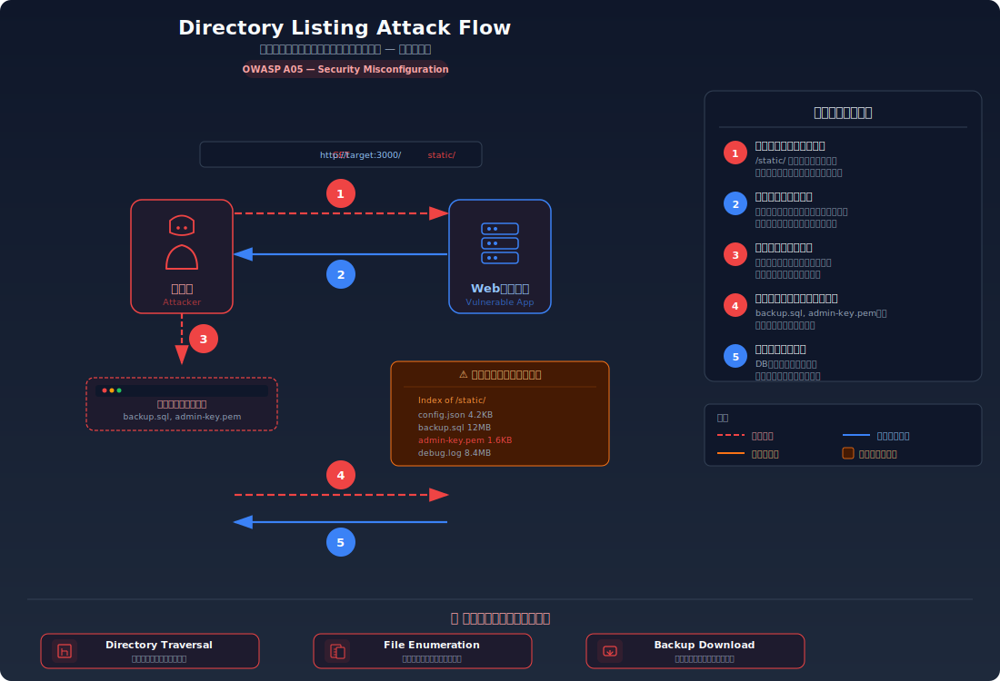
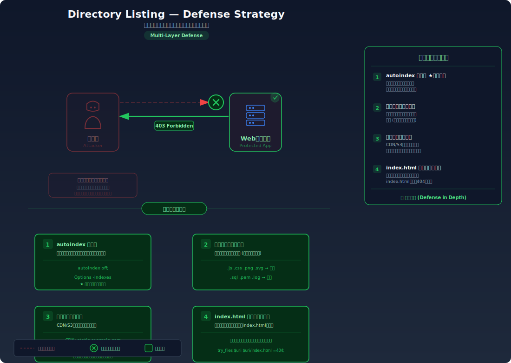

# Directory Listing — ディレクトリリスティングによる情報漏洩

> **一言で言うと**: Webサーバーのディレクトリにアクセスしたとき、そのディレクトリ内のファイル一覧が表示されてしまい、攻撃者にファイル構成や隠しファイルの存在を教えてしまう問題です。

---

## 対象ラボ

| 項目 | 内容 |
|------|------|
| **概要** | Webサーバーのディレクトリ一覧表示が有効になっており、ファイル構成・バックアップファイル・隠しファイルの存在が外部から確認可能 |
| **攻撃例** | `http://localhost:3000/static/` にアクセスしてサーバー上のファイル一覧を取得 |
| **技術スタック** | Hono 静的ファイル配信 |
| **難易度** | ★☆☆ 入門 |
| **前提知識** | HTTPリクエストの基本、Webサーバーの静的ファイル配信の概念 |

---

## この脆弱性を理解するための前提

### 静的ファイル配信とインデックスページの仕組み

Webサーバーがディレクトリへのリクエストを受けたとき、通常は2つの動作が考えられる:

1. **インデックスファイルを返す**: `index.html` が存在すればそれを返す
2. **ディレクトリ一覧を返す**: `index.html` が存在しなければ、ディレクトリ内のファイル一覧をHTMLとして生成して返す

```
GET /static/
  → index.html があれば → index.html を返す
  → index.html がなければ → ファイル一覧を表示（Directory Listing）
```

Apache や Nginx ではデフォルトでディレクトリ一覧表示が有効になっている場合がある。

### どこに脆弱性が生まれるのか

ディレクトリ一覧表示が有効になっていると、攻撃者はブラウザでディレクトリにアクセスするだけで、そこに存在するすべてのファイルを把握できる。バックアップファイル、設定ファイル、一時ファイルなど、直接URLを知らなければアクセスできなかったファイルの存在が明らかになる。

```typescript
// ⚠️ ディレクトリ一覧表示が有効な静的ファイル配信
// index.html がないディレクトリにアクセスするとファイル一覧が表示される

import { serveStatic } from "hono/serve-static";

app.use("/static/*", serveStatic({
  root: "./",
  // ディレクトリにアクセスした際にファイル一覧を表示してしまう
}));

// /static/ にアクセスすると以下のようなファイル一覧が表示される:
// - config.bak      ← バックアップファイルの存在が判明
// - database.sql     ← DBダンプの存在が判明
// - upload/          ← アップロードディレクトリの存在が判明
```

---

## 攻撃の仕組み



### 攻撃のシナリオ

1. **攻撃者** がWebサーバーのディレクトリURLにアクセスする

   `/static/`, `/uploads/`, `/backup/` など、一般的なディレクトリ名を順番に試す。特別なツールは不要で、ブラウザだけで実行できる。

   ```bash
   $ curl http://target:3000/static/
   ```

2. **Webサーバー** がディレクトリ内のファイル一覧をHTMLとして返す

   `index.html` が存在しないため、サーバーはディレクトリ内容を自動生成したHTMLとして返却する。ファイル名、サイズ、更新日時が含まれる。

   ```html
   <html>
   <title>Index of /static/</title>
   <body>
   <h1>Index of /static/</h1>
   <ul>
     <li><a href="config.bak">config.bak</a>       2024-01-15 1.2K</li>
     <li><a href="database.sql">database.sql</a>    2024-01-10 45M</li>
     <li><a href="upload/">upload/</a>               2024-01-20</li>
     <li><a href=".htpasswd">.htpasswd</a>           2024-01-01 256</li>
   </ul>
   </body>
   </html>
   ```

3. **攻撃者** が一覧から攻撃対象のファイルを特定する

   バックアップファイル (`config.bak`)、DBダンプ (`database.sql`)、認証情報ファイル (`.htpasswd`) など、直接URLを推測するのは困難だったファイルの存在が一覧から判明する。

4. **攻撃者** が特定したファイルに直接アクセスして内容を取得する

   ファイル名がわかれば、あとは直接URLでアクセスするだけ。バックアップファイルから設定情報を、DBダンプからユーザーデータを取得できる。

   ```bash
   $ curl http://target:3000/static/database.sql
   $ curl http://target:3000/static/.htpasswd
   ```

### なぜ成功するのか

| 条件 | 説明 |
|------|------|
| ディレクトリ一覧表示の有効化 | Webサーバーの設定でディレクトリリスティングが無効化されていない |
| 不要ファイルの存在 | バックアップ、ダンプ、一時ファイル等がWebサーバーの公開ディレクトリに置かれている |
| アクセス制御の欠如 | ファイル一覧もファイル自体も、認証なしでアクセス可能 |

### 被害の範囲

- **機密性**: バックアップファイルや設定ファイルからDB認証情報、APIキー等が漏洩する。ファイル構成そのものが攻撃計画の材料になる
- **完全性**: DBダンプの取得により、データの構造と内容が攻撃者に把握される。これを基にした改ざん攻撃が容易になる
- **可用性**: 大量のファイルスキャンによるサーバー負荷、または取得した情報を基にした攻撃によるサービス停止の可能性

---

## 対策



### 根本原因

Webサーバーが「ディレクトリへのリクエストに対してファイル一覧を返す」設定になっていること。これはWebサーバーのデフォルト設定に依存する問題であり、明示的に無効化する必要がある。

### 安全な実装

ディレクトリ一覧表示を無効化し、`index.html` が存在しないディレクトリへのアクセスには 403 または 404 を返す。

```typescript
// ✅ ディレクトリ一覧表示を無効化し、
//    ディレクトリへのアクセスには 403 を返す
// ファイルの存在を推測させないために 404 ではなく 403 を返す選択もある

app.use("/static/*", async (c, next) => {
  const path = new URL(c.req.url).pathname;
  // パスがスラッシュで終わる場合（ディレクトリアクセス）は拒否
  if (path.endsWith("/")) {
    return c.text("Forbidden", 403);
  }
  await next();
});

app.use("/static/*", serveStatic({ root: "./" }));
```

**なぜ安全か**: ディレクトリへのアクセスを一律拒否することで、ファイル一覧が外部に表示されなくなる。攻撃者はファイル名を推測するしかなくなるため、バックアップファイルや設定ファイルの発見が格段に困難になる。

#### 脆弱 vs 安全: コード比較

```diff
+ app.use("/static/*", async (c, next) => {
+   const path = new URL(c.req.url).pathname;
+   if (path.endsWith("/")) {
+     return c.text("Forbidden", 403);
+   }
+   await next();
+ });
  app.use("/static/*", serveStatic({ root: "./" }));
```

安全版ではディレクトリへのリクエスト（パスが `/` で終わる）を検知し、ファイル一覧を返す前に 403 で拒否している。

### その他の防御策

| 対策 | 種類 | 説明 |
|------|------|------|
| ディレクトリ一覧の無効化 | 根本対策 | アプリケーション/Webサーバー設定でディレクトリリスティングを明示的に無効化する |
| 不要ファイルの除去 | 根本対策 | バックアップ、ダンプ、一時ファイルを公開ディレクトリに置かない。CIでチェックする |
| Nginx `autoindex off` | 多層防御 | Webサーバーレベルで `autoindex off;` を設定し、二重にブロックする |
| アクセスログ監視 | 検知 | ディレクトリへの大量アクセス（スキャン行為）をログから検知する |

---

## ハンズオン手順

### Step 1: 脆弱バージョンで攻撃を体験

**ゴール**: ディレクトリにアクセスしてファイル一覧が表示されることを確認する

1. 開発サーバーを起動する

2. ディレクトリURLにアクセスする

   ```bash
   # ブラウザまたは curl でディレクトリにアクセス
   curl http://localhost:3000/api/labs/directory-listing/vulnerable/static/
   ```

3. ファイル一覧を確認する

   - どのようなファイルが表示されるか
   - バックアップファイルや設定ファイルが含まれていないか
   - ブラウザで開いてリンクをクリックし、ファイルの中身も確認してみる
   - **この結果が意味すること**: 攻撃者はURLを推測する必要なく、存在するすべてのファイルを把握できる

### Step 2: 安全バージョンで防御を確認

**ゴール**: 同じディレクトリへのアクセスが拒否されることを確認する

1. 安全なエンドポイントに同じリクエストを送る

   ```bash
   # 同じディレクトリに安全なバージョンでアクセス
   curl http://localhost:3000/api/labs/directory-listing/secure/static/
   ```

2. 403 Forbidden が返ることを確認する

3. コードの差分を確認する

   - `backend/src/labs/directory-listing.ts` の脆弱版と安全版を比較
   - **どの行が違いを生んでいるか** に注目（ディレクトリアクセスの制御部分）

### 確認ポイント

以下を自分の言葉で説明できれば、このラボは完了です:

- [ ] ディレクトリ一覧が表示される条件は何か（`index.html` がない + 一覧表示が有効）
- [ ] 攻撃者はファイル一覧から何を得て、どう悪用するか
- [ ] ディレクトリ一覧の無効化が「なぜ」攻撃を困難にするのか（ファイル名推測の強制）
- [ ] 不要ファイルの除去が根本対策として重要な理由

---

## 実装メモ

| 項目 | パス |
|------|------|
| 脆弱エンドポイント | `/api/labs/directory-listing/vulnerable/static/` |
| 安全エンドポイント | `/api/labs/directory-listing/secure/static/` |
| バックエンド | `backend/src/labs/directory-listing.ts` |
| フロントエンド | `frontend/src/pages/DirectoryListing.tsx` |

- 脆弱版: ディレクトリ一覧表示を有効にし、バックアップファイル等のダミーファイルを配置
- 安全版: ディレクトリへのアクセスを 403 で拒否

---

## 現実世界での事例

| 年 | インシデント | 概要 |
|----|-------------|------|
| 2019 | Oklahoma Department of Securities | Webサーバーのディレクトリリスティングが有効で、数百万件の個人情報を含むファイルが公開状態になっていた |
| 継続的 | Apache デフォルト設定 | Apache HTTP Server はデフォルトで `Options +Indexes` が有効な場合があり、設定を変更しなければディレクトリ一覧が公開される |

---

## 関連ラボ

| ラボ | 関連性 |
|------|--------|
| [機密ファイル露出](sensitive-file-exposure.md) | ディレクトリリスティングで機密ファイルの存在を確認した後、直接アクセスで内容を取得する |
| [HTTPヘッダーからの情報漏洩](header-leakage.md) | ヘッダー漏洩で技術スタック、ディレクトリ一覧でファイル構成。組み合わせると偵察情報が網羅的になる |

---

## 参考資料

- [OWASP - Directory Listing](https://owasp.org/www-project-web-security-testing-guide/latest/4-Web_Application_Security_Testing/02-Configuration_and_Deployment_Management_Testing/04-Review_Old_Backup_and_Unreferenced_Files_for_Sensitive_Information)
- [CWE-548: Exposure of Information Through Directory Listing](https://cwe.mitre.org/data/definitions/548.html)
