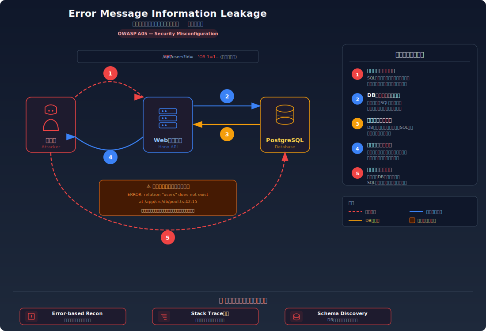
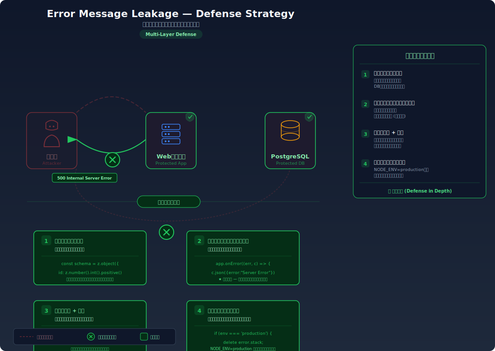

# Improper Error Handling — エラーメッセージからの情報漏洩

> **一言で言うと**: アプリケーションがエラーを起こしたとき、SQL文やテーブル名、ファイルパスなどの内部情報がそのままユーザーに表示されてしまい、攻撃者にシステムの内部構造を教えてしまう問題です。

---

## 対象ラボ

| 項目 | 内容 |
|------|------|
| **概要** | エラーメッセージにSQL文、テーブル名、カラム名、ファイルパス等の内部情報が含まれ、攻撃者にDB構造やアプリ構成が漏洩する |
| **攻撃例** | 不正なSQL入力を送信 → レスポンスに `ERROR: relation "users" does not exist` やスタックトレースが表示される |
| **技術スタック** | Hono API + PostgreSQL |
| **難易度** | ★☆☆ 入門 |
| **前提知識** | HTTPリクエスト/レスポンスの基本、SQLの基本概念 |

---

## この脆弱性を理解するための前提

### エラーハンドリングの仕組み

Webアプリケーションは様々な理由でエラーを起こす。存在しないリソースへのアクセス、不正な入力値、DB接続の失敗など。エラーが発生したとき、アプリケーションは何らかのエラーレスポンスをクライアントに返す必要がある。

```
正常なリクエスト:
  GET /api/users/1  →  200 OK  { "name": "田中太郎" }

エラーになるリクエスト:
  GET /api/users/abc  →  ??? どんなレスポンスを返すべきか
```

開発中は、エラーの詳細（スタックトレース、SQL文、ファイルパス等）が表示されるとデバッグに便利なため、多くのフレームワークはデフォルトで詳細なエラー情報を返す。

### どこに脆弱性が生まれるのか

開発時に便利だった「詳細なエラーメッセージ」をそのまま本番環境で返してしまうと、攻撃者にシステムの内部構造を教えることになる。

```typescript
// ⚠️ データベースエラーの詳細をそのままクライアントに返している
// エラーメッセージにはテーブル名、カラム名、SQL文が含まれる

app.get("/api/users/:id", async (c) => {
  try {
    const result = await pool.query(
      `SELECT * FROM users WHERE id = ${c.req.param("id")}`
    );
    return c.json(result.rows[0]);
  } catch (err) {
    // エラーの全文をそのまま返す
    return c.json({ error: (err as Error).message }, 500);
  }
});

// レスポンス例:
// {
//   "error": "error: invalid input syntax for type integer: \"abc\"\n
//             at Query.run (/app/node_modules/pg/lib/query.js:83:19)\n
//             SELECT * FROM users WHERE id = abc"
// }
```

---

## 攻撃の仕組み



### 攻撃のシナリオ

1. **攻撃者** が意図的に不正な入力を送信してエラーを誘発する

   正常な値ではなく、型が合わない値や特殊文字を入力することで、アプリケーションにエラーを起こさせる。これは技術的なスキルをほとんど必要としない。

   ```bash
   # 数値が期待されるパラメータに文字列を送る
   $ curl http://target:3000/api/users/abc

   # SQLの構文を壊す入力を送る
   $ curl http://target:3000/api/users/%27
   ```

2. **Webサーバー** がエラーの詳細をそのままレスポンスに含めて返す

   アプリケーションは入力を処理しようとしてエラーになり、キャッチしたエラーメッセージをフィルタリングせずクライアントに返す。

   ```json
   {
     "error": "error: invalid input syntax for type integer: \"abc\"",
     "stack": "at Query.run (/app/node_modules/pg/lib/query.js:83:19)",
     "query": "SELECT * FROM users WHERE id = abc"
   }
   ```

3. **攻撃者** がエラーメッセージから内部構造を分析する

   返されたエラーから以下の情報が得られる:
   - **テーブル名**: `users` テーブルの存在が判明
   - **SQL構文**: クエリの構造がわかり、SQLインジェクションの足がかりになる
   - **ファイルパス**: `/app/node_modules/pg/` からNode.js + pg ドライバの使用が判明
   - **DB種別**: PostgreSQL 固有のエラーメッセージから DB の種類が確定

4. **攻撃者** が収集した情報を基に、より高度な攻撃を計画する

   テーブル名とSQL構文がわかれば SQLインジェクション攻撃の精度が大幅に向上する。ファイルパスからは追加のパストラバーサル攻撃が可能になる。

### なぜ成功するのか

| 条件 | 説明 |
|------|------|
| エラーメッセージの未フィルタリング | アプリケーションがエラーの詳細をそのままクライアントに返している |
| 開発設定の本番利用 | 開発モードのエラーハンドリング（詳細表示）を本番環境でも使い続けている |
| エラー誘発の容易さ | 不正な入力を送るだけでエラーを起こせるため、攻撃者にとってコストが低い |

### 被害の範囲

- **機密性**: DB構造（テーブル名、カラム名）、ファイルパス、使用ライブラリとバージョンが漏洩する
- **完全性**: エラーメッセージ自体でデータは改ざんされないが、漏洩した情報を基にSQLインジェクション等の攻撃が容易になる
- **可用性**: エラーの誘発自体はサービスに大きな影響を与えないが、得られた情報を基にした後続攻撃でサービス停止を招く可能性がある

---

## 対策



### 根本原因

エラーハンドリングが「開発者向け」と「ユーザー向け」で区別されていないこと。開発中はデバッグのために詳細なエラーを表示するべきだが、本番環境では内部情報を一切含まない汎用メッセージを返す必要がある。

### 安全な実装

グローバルなエラーハンドラで全てのエラーをキャッチし、クライアントには汎用メッセージだけを返す。詳細なエラー情報はサーバー側のログにのみ出力する。

```typescript
// ✅ エラーの詳細はサーバー側のログに出力し、
//    クライアントには汎用メッセージだけを返す
// これにより開発者はデバッグ可能だが、攻撃者には情報が漏れない

app.onError((err, c) => {
  // サーバーログには詳細を記録（開発者はログで確認できる）
  console.error("Internal error:", err.message, err.stack);

  // クライアントには汎用メッセージのみ返す
  return c.json(
    { error: "処理中にエラーが発生しました。" },
    500
  );
});
```

**なぜ安全か**: エラーの詳細はサーバー側のログにのみ記録されるため、開発者はデバッグに必要な情報を失わない。一方、クライアントには内部情報を含まない汎用メッセージだけが返るため、攻撃者はエラーを誘発してもシステムの内部構造を知ることができない。

#### 脆弱 vs 安全: コード比較

```diff
  app.onError((err, c) => {
+   console.error("Internal error:", err.message, err.stack);
-   return c.json({ error: err.message, stack: err.stack }, 500);
+   return c.json({ error: "処理中にエラーが発生しました。" }, 500);
  });
```

脆弱版ではエラーメッセージとスタックトレースをそのまま返している。安全版ではログに詳細を記録し、クライアントには汎用メッセージだけを返している。

### その他の防御策

| 対策 | 種類 | 説明 |
|------|------|------|
| 汎用エラーレスポンス | 根本対策 | 全てのエラーに対して内部情報を含まない統一的なレスポンスを返す |
| 環境別エラーハンドリング | 根本対策 | `NODE_ENV=production` 時はエラー詳細を一切返さない設計にする |
| 構造化ログ | 多層防御 | サーバー側で構造化ログを出力し、エラー追跡をクライアント返却に依存しないようにする |
| WAF (Web Application Firewall) | 検知 | エラーを意図的に誘発する不正リクエストパターンを検知・遮断する |

---

## ハンズオン手順

### Step 1: 脆弱バージョンで攻撃を体験

**ゴール**: 不正な入力でエラーを誘発し、内部情報がレスポンスに含まれることを確認する

1. 開発サーバーを起動する

2. 不正な入力でエラーを誘発する

   ```bash
   # 数値が期待されるパラメータに文字列を送信
   curl http://localhost:3000/api/labs/error-message-leakage/vulnerable/users/abc

   # SQL構文を壊す入力を送信
   curl http://localhost:3000/api/labs/error-message-leakage/vulnerable/users/%27
   ```

3. レスポンスに含まれる内部情報を確認する

   - エラーメッセージにテーブル名やカラム名が含まれているか
   - スタックトレースにファイルパスが含まれているか
   - SQL文の断片が見えるか
   - **この結果が意味すること**: 攻撃者はこの情報でDB構造を把握し、SQLインジェクションの精度を大幅に向上させられる

### Step 2: 安全バージョンで防御を確認

**ゴール**: 同じ不正入力に対して汎用メッセージだけが返ることを確認する

1. 安全なエンドポイントに同じリクエストを送る

   ```bash
   # 同じ不正入力を安全なバージョンに対して実行
   curl http://localhost:3000/api/labs/error-message-leakage/secure/users/abc
   curl http://localhost:3000/api/labs/error-message-leakage/secure/users/%27
   ```

2. レスポンスが汎用メッセージのみであることを確認する

3. コードの差分を確認する

   - `backend/src/labs/error-message-leakage.ts` の脆弱版と安全版を比較
   - **どの行が違いを生んでいるか** に注目（エラーハンドラの違い）

### 確認ポイント

以下を自分の言葉で説明できれば、このラボは完了です:

- [ ] エラーメッセージに内部情報が含まれるのはなぜか（開発設定の放置、フィルタリング欠如）
- [ ] 攻撃者はエラーメッセージからどんな情報を得られるか（テーブル名、パス、DB種別）
- [ ] 汎用エラーメッセージを返すことで攻撃がどう困難になるか
- [ ] サーバーログとクライアントレスポンスを分離する設計の重要性

---

## 実装メモ

| 項目 | パス |
|------|------|
| 脆弱エンドポイント | `/api/labs/error-message-leakage/vulnerable/users/:id` |
| 安全エンドポイント | `/api/labs/error-message-leakage/secure/users/:id` |
| バックエンド | `backend/src/labs/error-message-leakage.ts` |
| フロントエンド | `frontend/src/pages/ErrorMessageLeakage.tsx` |
| DB | `docker/db/init.sql` に `users` テーブルを追加 |

- A02 (Security Misconfiguration) / CWE-209 に分類される脆弱性
- 脆弱版: エラー詳細をそのまま返す
- 安全版: 汎用メッセージに置換し、詳細はサーバーログに記録する

---

## 現実世界での事例

| 年 | インシデント | 概要 |
|----|-------------|------|
| 2023 | Microsoft Power Pages | エラーメッセージから内部APIのスキーマ情報が漏洩し、さらなる攻撃の足がかりとなった |
| 継続的 | フレームワークのデフォルトエラーページ | Laravel, Django, Rails 等のフレームワークが本番でデバッグモードのまま運用され、ソースコードやDB接続文字列が公開される事例が後を絶たない |

---

## 関連ラボ

| ラボ | 関連性 |
|------|--------|
| [HTTPヘッダーからの情報漏洩](header-leakage.md) | ヘッダーから技術スタック、エラーメッセージからDB構造。両方合わせると偵察情報が大幅に充実する |
| [SQLインジェクション](../step02-injection/sql-injection.md) | エラーメッセージから得たテーブル名・SQL構文を利用して、SQLインジェクション攻撃の精度を向上させる |

---

## 参考資料

- [OWASP - Improper Error Handling](https://owasp.org/www-community/Improper_Error_Handling)
- [CWE-209: Generation of Error Message Containing Sensitive Information](https://cwe.mitre.org/data/definitions/209.html)
