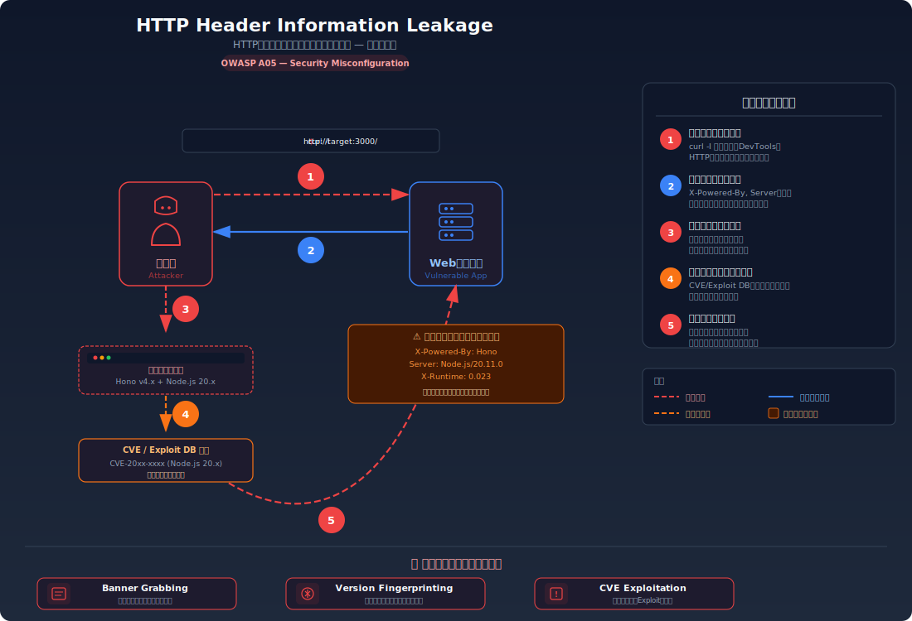
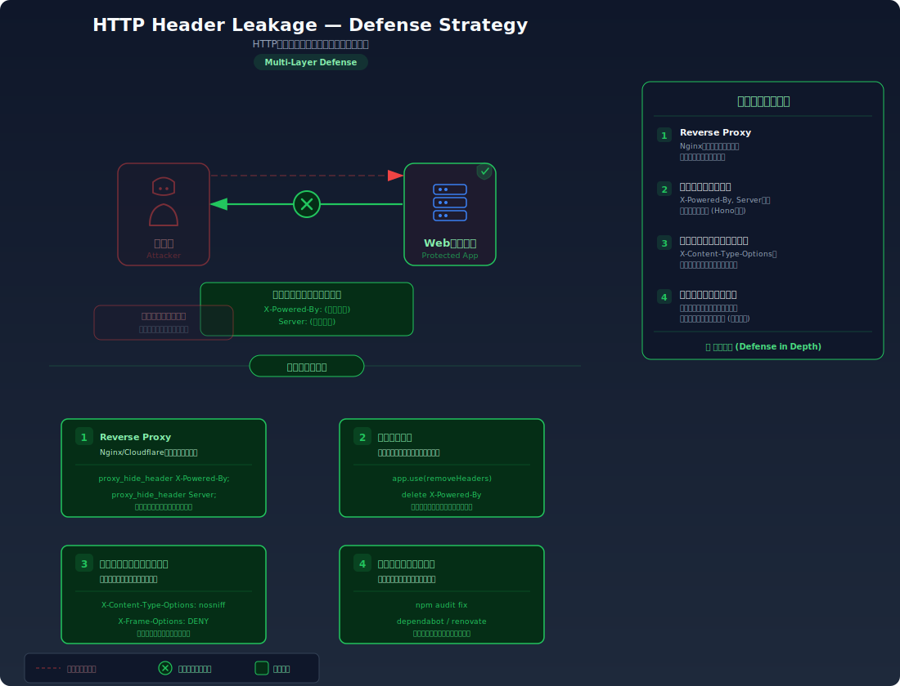

# 不要なヘッダー露出

## 攻撃・対策フロー図

> HTTPヘッダー情報漏洩と共通の図を参照

| 攻撃図 | 対策図 |
|--------|--------|
|  |  |

## 対象ラボ

### 1. レスポンスヘッダーの過剰な情報公開

- **概要**: X-Powered-By 等でサーバー技術情報が漏洩
- **攻撃例**: レスポンスヘッダーからフレームワーク・バージョンを特定
- **技術スタック**: Hono API
- **難易度**: ★☆☆

## 参考資料

- [OWASP - HTTP Headers](https://owasp.org/www-project-secure-headers/)
