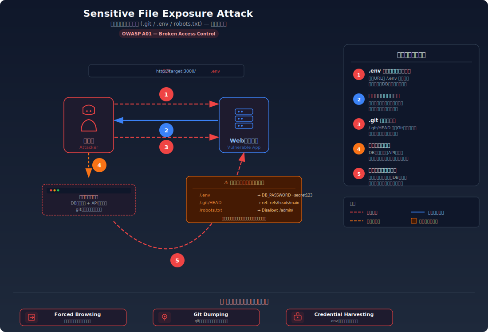
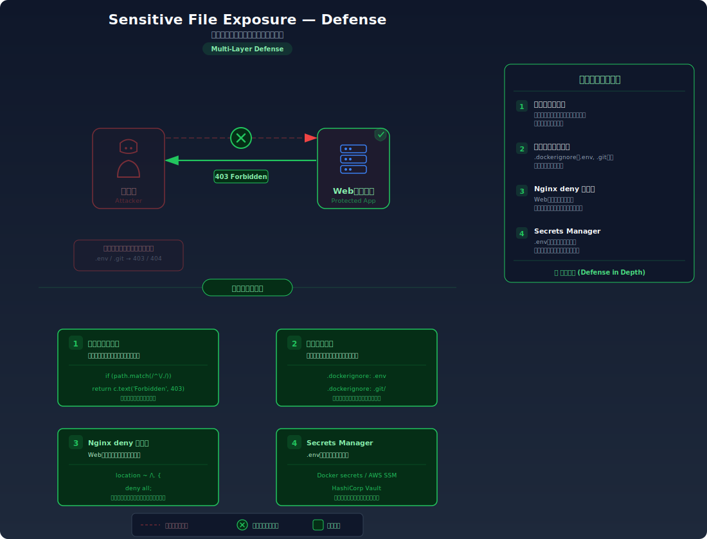

# 機密ファイルの露出 (.git / .env / robots.txt)

## 攻撃・対策フロー図

| 攻撃図 | 対策図 |
|--------|--------|
|  |  |

## 対象ラボ

### 1. 設定ファイル・Git履歴の公開

- **概要**: `.env`, `.git/`, `robots.txt` 等がWebから直接アクセス可能
- **攻撃例**:
  - `http://localhost:3000/.env` → DB接続情報・APIキー取得
  - `http://localhost:3000/.git/HEAD` → Git履歴からソースコード復元
- **技術スタック**: Hono API (静的ファイル配信)
- **難易度**: ★☆☆

## 実装メモ

- 静的ファイル配信でドットファイルも含める (脆弱) → ドットファイルを除外 (安全)

## 参考資料

- [OWASP - Information Disclosure](https://owasp.org/www-project-web-security-testing-guide/latest/4-Web_Application_Security_Testing/01-Information_Gathering/)
