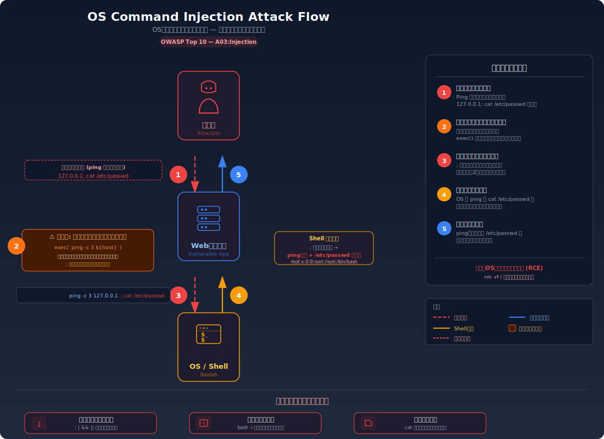
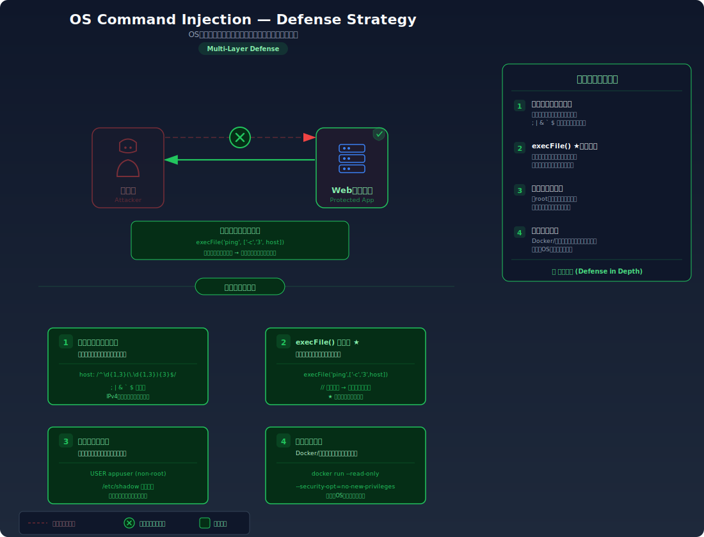

# OS Command Injection — ユーザー入力でサーバーのコマンドを操る

> Webアプリの入力欄に特殊な文字列を入力することで、サーバー上で任意のOSコマンドを実行できてしまう脆弱性を学びます。ファイルの読み取りやシステム情報の取得、さらにはサーバーの完全な乗っ取りにまで発展し得る攻撃です。

---

## 対象ラボ

| 項目 | 内容 |
|------|------|
| **概要** | ネットワーク診断ツール（ping）のホスト名入力欄にシェルのメタ文字を挿入し、意図しないOSコマンドを実行させる |
| **攻撃例** | `127.0.0.1; cat /etc/passwd` を ping ツールの入力欄に入力 |
| **技術スタック** | Hono API + Node.js `child_process` (`exec`) |
| **難易度** | ★★☆ 中級 |
| **前提知識** | シェル（bash）の基本、`;` や `&&` 等のコマンド連結演算子、SQL インジェクションの概念 |

---

## この脆弱性を理解するための前提

### シェルコマンドの実行の仕組み

Web アプリケーションがサーバー上で外部コマンドを実行するとき、一般的に以下の流れで動作する:

1. ユーザーがフォームにホスト名や IP アドレスを入力
2. サーバーがその値を使ってシェルコマンドを組み立てる
3. `child_process.exec()` 等で OS のシェルを介してコマンドを実行する
4. 実行結果をユーザーに返す

```typescript
// 正常な使用例: ユーザーが "127.0.0.1" を入力
exec(`ping -c 3 127.0.0.1`, (err, stdout) => {
  // stdout にはping結果が入る
});
```

シェルは `ping -c 3 127.0.0.1` というコマンドを受け取り、ping を実行して結果を返す。

### どこに脆弱性が生まれるのか

問題は、`exec()` がコマンド文字列をシェルに渡す際、シェルのメタ文字（`;`, `&&`, `||`, `|`, `` ` ``, `$()` 等）が**そのまま解釈される**ことにある。開発者はユーザーが IP アドレスだけを入力することを前提にしているが、攻撃者はシェルの区切り文字を使って複数のコマンドを連結する。

```typescript
// ⚠️ この部分が問題 — ユーザー入力をシェルコマンドに直接埋め込んでいる
const host = req.body.host; // "127.0.0.1; cat /etc/passwd"
exec(`ping -c 3 ${host}`, (err, stdout) => {
  res.send(stdout);
});
```

`host` に `127.0.0.1; cat /etc/passwd` が入力されると、シェルは `;` を**コマンド区切り**として解釈し、`ping -c 3 127.0.0.1` の後に `cat /etc/passwd` を実行する。

---

## 攻撃の仕組み



### 攻撃のシナリオ

1. **攻撃者** が ping ツールの入力欄に `127.0.0.1; cat /etc/passwd` と入力して送信する

   `;` はシェルにおいてコマンドの区切りを意味する。入力欄のバリデーションがなければ、この文字列はそのままサーバーに送信される。

2. **サーバー** がこの入力を文字列結合でシェルコマンドに組み込む

   `exec()` に渡されるコマンドは以下のようになる:

   ```bash
   ping -c 3 127.0.0.1; cat /etc/passwd
   ```

   シェルは `;` を認識し、これを2つの独立したコマンドとして解釈する。

3. **OS** が2つのコマンドを順番に実行する

   まず `ping -c 3 127.0.0.1` が実行され（正常なコマンド）、次に `cat /etc/passwd` が実行される（攻撃者が注入したコマンド）。両方の出力がサーバーに返される。

4. **攻撃者** がサーバーの `/etc/passwd` ファイルの内容を取得する

   レスポンスに ping 結果と `/etc/passwd` の内容が混在して返される。攻撃者はこの情報からシステムのユーザー一覧、ホームディレクトリ、シェル情報等を取得できる。

### なぜ成功するのか

| 条件 | 説明 |
|------|------|
| `exec()` の使用 | `child_process.exec()` はコマンド文字列をシェル経由で実行するため、シェルのメタ文字がすべて解釈される。`execFile()` とは異なりシェルを介する |
| 入力値のバリデーションがない | `;`, `&&`, `|` 等のシェルメタ文字がフィルタリングされずにそのまま通過する |
| 実行ユーザーの権限が過大 | アプリケーションが高い権限で実行されている場合、攻撃者もその権限でコマンドを実行できる |

### 被害の範囲

- **機密性**: `/etc/passwd`, `/etc/shadow`（権限があれば）、環境変数（API キー等）、ソースコード等のサーバー上の任意のファイルが読み取れる
- **完全性**: ファイルの書き込み・削除、バックドアの設置（`echo 'malicious_cron' >> /etc/crontab`）、他のシステムへの攻撃の踏み台化
- **可用性**: `rm -rf /`、`:(){ :|:& };:` (fork bomb)等でサーバーを停止・破壊できる。OS コマンドインジェクションはサーバーの**完全な乗っ取り**を意味する

---

## 対策



### 根本原因

ユーザー入力が **OS シェルの構文（コマンド）** として解釈される設計になっていることが根本原因。SQL インジェクションと同じ構造で、入力が「データ」ではなく「命令」として処理されてしまう。

### 安全な実装

`exec()` の代わりに `execFile()` を使用する。`execFile()` はシェルを介さずにコマンドを直接実行するため、`;` や `&&` などのメタ文字がシェルの構文として解釈されることがない。引数は配列として渡されるため、入力値は常に1つの引数として扱われる。

```typescript
import { execFile } from 'node:child_process';

// ✅ execFile — シェルを介さずにコマンドを直接実行
execFile('ping', ['-c', '3', host], (err, stdout) => {
  // host に "127.0.0.1; cat /etc/passwd" が入力されても
  // "127.0.0.1; cat /etc/passwd" 全体が ping の引数として渡される
  // シェルメタ文字は解釈されない → ping は "unknown host" エラーを返す
  res.send(stdout);
});
```

`host` に `127.0.0.1; cat /etc/passwd` が入力されても、`execFile` はこれを **ping の第4引数** として渡すだけである。シェルが介在しないため `;` はただの文字として扱われ、ping は「`127.0.0.1; cat /etc/passwd` というホスト名は見つかりません」というエラーを返す。

#### 脆弱 vs 安全: コード比較

```diff
- import { exec } from 'node:child_process';
- exec(`ping -c 3 ${host}`, callback);
+ import { execFile } from 'node:child_process';
+ execFile('ping', ['-c', '3', host], callback);
```

`exec()` はコマンド全体を1つの文字列としてシェルに渡すため、シェルのメタ文字が有効になる。`execFile()` はコマンドと引数を分離して直接実行するため、入力値がシェルの構文として解釈される余地がない。

### その他の防御策

| 対策 | 種類 | 説明 |
|------|------|------|
| `execFile()` の使用 | 根本対策 | シェルを介さずにコマンドを実行する。これが最も効果的で必須の対策 |
| 入力値のバリデーション | 多層防御 | IP アドレスや FQDN のフォーマットに制限する。正規表現 `/^[\d.]+$/` 等で英数字とドットのみ許可 |
| 外部コマンドの回避 | 根本対策 | 可能であれば OS コマンドの代わりにライブラリを使う（例: `dns.lookup()` で ping の代替） |
| 最小権限での実行 | 多層防御 | アプリケーションを最小権限のユーザーで実行し、万一のコマンド実行時の被害を限定する |
| コンテナ/サンドボックス | 多層防御 | Docker 等でアプリケーションを隔離し、ホスト OS への影響を防ぐ |

---

## ハンズオン手順

### Step 1: 脆弱バージョンで攻撃を体験

**ゴール**: ping ツールの入力欄からサーバー上の `/etc/passwd` ファイルを読み取れることを確認する

1. 開発サーバーを起動する

   ```bash
   cd backend && pnpm dev
   ```

2. 正常な入力を試す

   ```bash
   curl -X POST http://localhost:3000/api/labs/command-injection/vulnerable/ping \
     -H "Content-Type: application/json" \
     -d '{"host": "127.0.0.1"}'
   ```

   正常な ping 結果が返される。

3. コマンドインジェクションを試す — `;` でコマンドを連結

   ```bash
   curl -X POST http://localhost:3000/api/labs/command-injection/vulnerable/ping \
     -H "Content-Type: application/json" \
     -d '{"host": "127.0.0.1; cat /etc/passwd"}'
   ```

4. 結果を確認する

   - ping の結果に加えて、`/etc/passwd` の内容が表示される
   - **この結果が意味すること**: サーバー上で任意の OS コマンドを実行できる状態。`cat /etc/passwd` を `whoami`, `ls -la /`, `env` 等に変えれば、さらに多くの情報が取得できる

5. 他のメタ文字も試す

   ```bash
   # && を使った連結
   curl -X POST http://localhost:3000/api/labs/command-injection/vulnerable/ping \
     -H "Content-Type: application/json" \
     -d '{"host": "127.0.0.1 && whoami"}'

   # $() を使ったコマンド置換
   curl -X POST http://localhost:3000/api/labs/command-injection/vulnerable/ping \
     -H "Content-Type: application/json" \
     -d '{"host": "$(whoami)"}'
   ```

### Step 2: 安全バージョンで防御を確認

**ゴール**: 同じ攻撃が失敗することを確認する

1. 同じペイロードを安全なエンドポイントに送信する

   ```bash
   curl -X POST http://localhost:3000/api/labs/command-injection/secure/ping \
     -H "Content-Type: application/json" \
     -d '{"host": "127.0.0.1; cat /etc/passwd"}'
   ```

2. 結果を確認する

   - ping が失敗する（「`127.0.0.1; cat /etc/passwd` はホスト名として無効」等のエラー）
   - `/etc/passwd` の内容は返されない
   - `execFile()` がシェルを介さずに ping を実行しているため、`;` はただの文字として引数に渡される

3. コードの差分を確認する

   - `backend/src/labs/command-injection.ts` の脆弱版と安全版を比較
   - **どの行が違いを生んでいるか** に注目: `exec()` → `execFile()` + 引数の配列化

### 確認ポイント

以下を自分の言葉で説明できれば、このラボは完了です:

- [ ] `exec()` と `execFile()` の違いは何か（シェルの介在有無）
- [ ] シェルのメタ文字（`;`, `&&`, `|`, `$()`）が何をするのか
- [ ] なぜ `execFile()` でメタ文字が無害化されるのか
- [ ] SQL インジェクションとの共通パターンは何か（入力がコードとして解釈される問題）

---

## 実装メモ

| 項目 | パス |
|------|------|
| 脆弱エンドポイント | `/api/labs/command-injection/vulnerable/ping` |
| 安全エンドポイント | `/api/labs/command-injection/secure/ping` |
| バックエンド | `backend/src/labs/command-injection.ts` |
| フロントエンド | `frontend/src/pages/CommandInjection.tsx` |

- 脆弱版では `child_process.exec()` に文字列テンプレートリテラルでコマンドを構築
- 安全版では `child_process.execFile()` に引数を配列として分離して渡す
- さらに安全版では入力値のバリデーション（IP アドレスフォーマット）も追加

---

## 現実世界での事例

| 年 | インシデント | 概要 |
|----|-------------|------|
| 2014 | Shellshock (CVE-2014-6271) | bash のコマンドインジェクション脆弱性。環境変数経由で任意のコマンドを実行可能。CGI スクリプト等を通じて大規模に悪用された |
| 2021 | Codecov Supply Chain | CI/CDスクリプト内のコマンドインジェクションにより、多数の企業の CI 環境変数（シークレット含む）が流出 |

---

## 関連ラボ

| ラボ | 関連性 |
|------|--------|
| [SQL インジェクション](./sql-injection.md) | 同じ「入力値がコードとして解釈される」パターン。シェルの代わりに SQL が対象 |
| [XSS](./xss.md) | 同じインジェクション系。ブラウザ側の JavaScript コンテキストが対象 |
| [SSRF](../step06-server-side/ssrf.md) | サーバーサイドのリソースにアクセスする攻撃。コマンドインジェクションで curl を実行すれば SSRF と同等の攻撃が可能 |

---

## 参考資料

- [OWASP - OS Command Injection](https://owasp.org/www-community/attacks/Command_Injection)
- [CWE-78: Improper Neutralization of Special Elements used in an OS Command](https://cwe.mitre.org/data/definitions/78.html)
