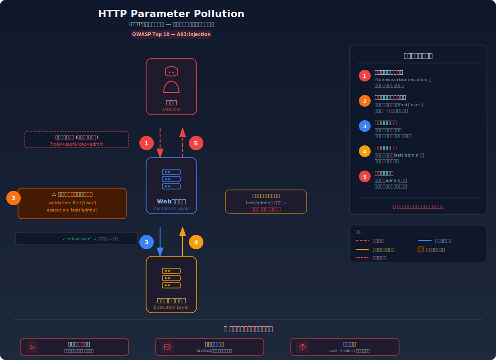
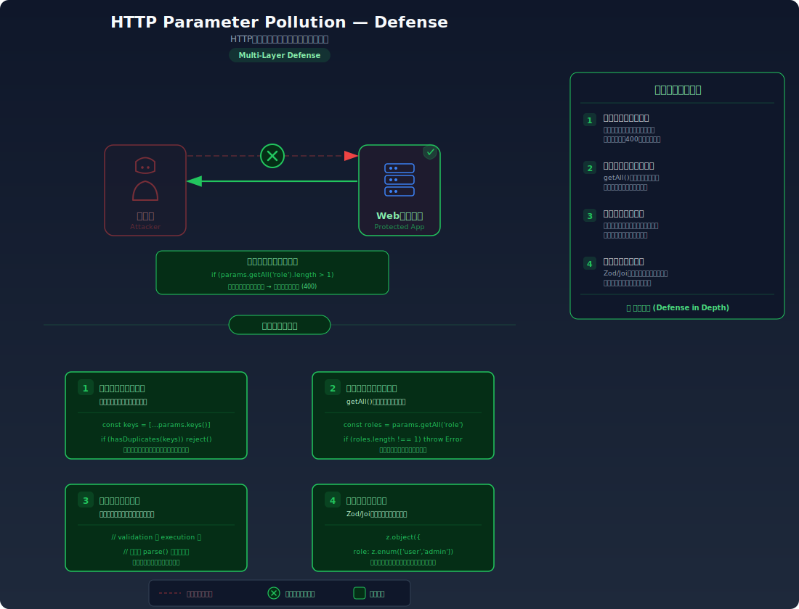

# HTTP Parameter Pollution (HPP) — 同じパラメータの重複で検証をすり抜ける

> 同じ名前のクエリパラメータを複数送ることで、入力値の検証をすり抜けて意図しない値をサーバーに処理させてしまう脆弱性を学びます。

---

## 対象ラボ

| 項目 | 内容 |
|------|------|
| **概要** | 重複するクエリパラメータの処理方法がバリデーション層と実行層で異なることを悪用し、権限チェックをバイパスして管理者権限を取得できてしまう |
| **攻撃例** | `?role=user&role=admin` — バリデーションは最初の `user` を検証するが、実行層は最後の `admin` を使用する |
| **技術スタック** | Hono API (Node.js) |
| **難易度** | ★★☆ 中級 |
| **前提知識** | HTTP リクエストの基本、クエリパラメータの仕組み、URL の構造 |

---

## この脆弱性を理解するための前提

### クエリパラメータの処理の仕組み

HTTP のクエリパラメータは URL の `?` 以降に `key=value` の形式で指定される。複数のパラメータは `&` で区切る:

```
GET /api/users?name=alice&age=30
```

ここで重要なのは、**HTTP の仕様はパラメータ名の重複を禁止していない** ということだ。つまり以下のような URL も完全に合法である:

```
GET /api/users?role=user&role=admin
```

この場合、`role` というパラメータが2つ存在する。問題は、**フレームワークやパーサーごとに重複パラメータの扱いが異なる** ことにある:

| フレームワーク / パーサー | `?role=user&role=admin` の結果 |
|---------------------------|-------------------------------|
| Express (req.query) | `{ role: ['user', 'admin'] }` — 配列として返す |
| Hono (c.req.query()) | `'user'` — **最初の値** を返す |
| Hono (c.req.queries()) | `['user', 'admin']` — 全値を配列で返す |
| PHP ($_GET) | `'admin'` — **最後の値** で上書き |
| Python Flask (request.args) | `'user'` — **最初の値** を返す |
| URLSearchParams.get() | `'user'` — **最初の値** を返す |
| URLSearchParams.getAll() | `['user', 'admin']` — 全値を配列で返す |

正常な使い方では、同じパラメータを重複して送ることはない。サーバーは `?role=user` のように1つの値だけが来ることを前提にコードを書く:

```typescript
// 正常なリクエスト: GET /api/register?username=alice&role=user
app.get('/register', (c) => {
  const username = c.req.query('username'); // 'alice'
  const role = c.req.query('role');         // 'user'
  // ... 登録処理
});
```

### どこに脆弱性が生まれるのか

脆弱性が生まれるのは、**バリデーション（検証）と実行が別々のレイヤーで行われ、それぞれが重複パラメータの「別の値」を参照してしまう** 場合だ。

典型的なパターンは以下のようなケースである:

1. バリデーション層が `c.req.query('role')` で **最初の値** (`user`) を取り出してチェックする
2. 実行層が URL のクエリ文字列を自前でパースし、**最後の値** (`admin`) を使って処理する

```typescript
// ⚠️ この部分が問題 — バリデーションと実行で異なるパラメータ抽出方法を使っている
app.post('/register', async (c) => {
  // バリデーション: c.req.query() は最初の値 'user' を返す
  const role = c.req.query('role');
  if (role !== 'user' && role !== 'editor') {
    return c.json({ error: '不正なロールです' }, 403);
  }

  // 実行: URL を自前でパースして最後の値 'admin' を取得してしまう
  const url = new URL(c.req.url);
  const params = url.searchParams;
  const allRoles = params.getAll('role');
  const effectiveRole = allRoles[allRoles.length - 1]; // 'admin'

  await createUser(username, effectiveRole);
  return c.json({ message: `ユーザーを${effectiveRole}として登録しました` });
});
```

攻撃者が `?role=user&role=admin` を送ると、バリデーションは `user` を見て通過させるが、実際の登録処理では `admin` が使用される。検証をすり抜けて管理者アカウントが作成されてしまう。

---

## 攻撃の仕組み



### 攻撃のシナリオ

1. **攻撃者** がユーザー登録リクエストに重複パラメータを含めて送信する

   ```
   POST /api/labs/hpp/vulnerable/register?role=user&role=admin
   ```

   HTTP の仕様ではパラメータ名の重複は禁止されていないため、このリクエストは正常な HTTP リクエストとして受け入れられる。WAF やプロキシも通常は重複パラメータをブロックしない。

2. **バリデーション層** が最初の値 `user` をチェックして通過させる

   サーバーのバリデーションコードは `c.req.query('role')` を使って `role` パラメータを取得する。Hono の `query()` メソッドは重複パラメータがある場合に **最初の値** を返すため、`'user'` が返される。バリデーションは「`user` は許可されたロールである」と判定し、リクエストを通過させる。

   ```typescript
   // バリデーション層の処理
   const role = c.req.query('role'); // → 'user' (最初の値)
   if (role !== 'user' && role !== 'editor') {
     return c.json({ error: '不正なロールです' }, 403);
   }
   // ✅ バリデーション通過 — 'user' は許可されたロール
   ```

3. **実行層** が最後の値 `admin` を使ってユーザーを登録する

   バリデーションを通過した後、実際のユーザー登録処理ではクエリ文字列を別の方法でパースする。このとき `getAll()` で全値を取得し、最後の値を使うロジックになっていると、`'admin'` が使用される。

   ```typescript
   // 実行層の処理
   const url = new URL(c.req.url);
   const allRoles = url.searchParams.getAll('role'); // → ['user', 'admin']
   const effectiveRole = allRoles[allRoles.length - 1]; // → 'admin'

   await db.query(
     'INSERT INTO users (username, role) VALUES ($1, $2)',
     [username, effectiveRole] // effectiveRole = 'admin'
   );
   ```

4. **攻撃者** が管理者権限を持つアカウントを取得する

   登録されたアカウントのロールは `admin` になっている。攻撃者はこのアカウントでログインすることで、管理者専用の機能（ユーザー管理、データ閲覧、システム設定変更など）にアクセスできる。

### なぜ成功するのか

| 条件 | 説明 |
|------|------|
| パラメータの重複が許可されている | HTTP の仕様がパラメータ名の重複を禁止していないため、`?role=user&role=admin` が有効なリクエストとして処理される |
| バリデーション層と実行層で異なるパーサーを使用 | バリデーションが `c.req.query()` で最初の値を、実行が `URLSearchParams.getAll()` の最後の値を参照するため、チェックと実行の対象が異なる |
| 重複パラメータの存在チェックがない | 同じパラメータ名が複数回出現した場合にリクエストを拒否するロジックがない |

### 被害の範囲

- **機密性**: 管理者権限を取得されることで、全ユーザーの個人情報や非公開データにアクセスされる
- **完全性**: 管理者として他のユーザーのデータやアカウント設定を改ざんされる。システム設定を変更されることで、アプリケーション全体の動作が操作される
- **可用性**: 管理者権限を使ってユーザーアカウントの大量削除やシステム設定の破壊が行われ、サービスが利用不能になる可能性がある

---

## 対策



### 根本原因

バリデーション（検証）と実行で **同じパラメータの異なる値を参照してしまう設計** が根本原因。重複パラメータが送られた場合にフレームワークやパーサーがどの値を返すかは統一されておらず、レイヤーごとに異なる値が使われることで「検証済みの値」と「実際に使われる値」が乖離する。

### 安全な実装

安全な実装では、以下の2つの原則を守る:

1. **パラメータの取得を1箇所に統一する**: バリデーションと実行で同一の抽出結果を使う
2. **重複パラメータを検出して拒否する**: 同じパラメータ名が複数存在する場合はリクエストをエラーにする

```typescript
// ✅ 安全な実装 — パラメータ抽出の統一と重複検出
app.post('/register', async (c) => {
  const url = new URL(c.req.url);

  // ✅ 重複パラメータの検出: 同じ名前のパラメータが複数あれば拒否
  const allRoles = url.searchParams.getAll('role');
  if (allRoles.length !== 1) {
    return c.json(
      { error: 'パラメータ "role" は1つだけ指定してください' },
      400
    );
  }

  // ✅ 検証と実行で同じ値を使用する
  const role = allRoles[0];

  // ✅ 許可リストによるバリデーション
  const allowedRoles = ['user', 'editor'];
  if (!allowedRoles.includes(role)) {
    return c.json({ error: '不正なロールです' }, 403);
  }

  // ✅ バリデーション済みの同一変数を使って登録
  await db.query(
    'INSERT INTO users (username, role) VALUES ($1, $2)',
    [username, role]
  );

  return c.json({ message: `ユーザーを${role}として登録しました` });
});
```

この実装では、`getAll()` で全値を配列として取得し、長さが1でない場合は即座にエラーを返す。これにより重複パラメータ自体がリクエストレベルで拒否される。さらに、バリデーションと実行の両方で同じ変数 `role` を参照するため、値の乖離が起こり得ない。

#### 脆弱 vs 安全: コード比較

```diff
  app.post('/register', async (c) => {
-   // バリデーション: 最初の値だけをチェック
-   const role = c.req.query('role');
-   if (role !== 'user' && role !== 'editor') {
-     return c.json({ error: '不正なロールです' }, 403);
-   }
-
-   // 実行: 別の方法でパースして最後の値を使用
-   const url = new URL(c.req.url);
-   const allRoles = url.searchParams.getAll('role');
-   const effectiveRole = allRoles[allRoles.length - 1];
-   await createUser(username, effectiveRole);
+   // 重複パラメータを検出して拒否
+   const url = new URL(c.req.url);
+   const allRoles = url.searchParams.getAll('role');
+   if (allRoles.length !== 1) {
+     return c.json({ error: 'パラメータ "role" は1つだけ指定してください' }, 400);
+   }
+
+   // 検証と実行で同一の値を使用
+   const role = allRoles[0];
+   const allowedRoles = ['user', 'editor'];
+   if (!allowedRoles.includes(role)) {
+     return c.json({ error: '不正なロールです' }, 403);
+   }
+   await createUser(username, role);
  });
```

脆弱なコードではバリデーション時に `c.req.query()` で最初の値を取得し、実行時に `getAll()` の最後の値を取得するという2段階のパラメータ抽出を行っている。安全なコードでは `getAll()` で全値を一度に取得し、重複があれば拒否した上で、同じ変数を最後まで使い回す。パラメータ抽出のパスが1本化されることで、値の乖離が構造的に排除される。

### その他の防御策

| 対策 | 種類 | 説明 |
|------|------|------|
| パラメータ抽出の一元化 | 根本対策 | バリデーションと実行で同じ抽出結果を使い、重複パラメータが存在する場合は拒否する。これが最も効果的で必須の対策 |
| ミドルウェアによる重複パラメータ検出 | 多層防御 | 全リクエストに対して重複パラメータを検出するミドルウェアを導入し、アプリケーション全体で一貫した防御を行う |
| リクエストボディの使用 | 多層防御 | 機密性の高いパラメータ（ロール等）をクエリパラメータではなく POST ボディで受け取る。ボディは通常パーサーが1つの値に統一するため、重複の問題が起きにくい |
| サーバーサイドでのロール決定 | 根本対策 | ユーザーからロール指定を受け付けず、サーバー側のロジックでロールを決定する。そもそもクライアントにロールを指定させない設計が最も安全 |
| WAF ルール | 検知 | 重複パラメータを含むリクエストをログ記録・ブロックする WAF ルールを設定する |

---

## ハンズオン手順

### Step 1: 脆弱バージョンで攻撃を体験

**ゴール**: 重複パラメータを使って、一般ユーザーとしての登録リクエストで管理者アカウントの作成が成功することを確認する

1. 開発サーバーを起動する

   ```bash
   cd backend && pnpm dev
   ```

2. まず正常なリクエストを送って通常の動作を確認する

   ```bash
   # 正常なユーザー登録
   curl -X POST "http://localhost:3000/api/labs/hpp/vulnerable/register?username=alice&role=user" \
     -H "Content-Type: application/json"
   ```

   - `role=user` でユーザーが登録される（正常な動作）

3. 管理者ロールを直接指定してみる

   ```bash
   # admin ロールで登録を試みる（バリデーションでブロックされるはず）
   curl -X POST "http://localhost:3000/api/labs/hpp/vulnerable/register?username=bob&role=admin" \
     -H "Content-Type: application/json"
   ```

   - `403 Forbidden` が返され、`admin` ロールでの登録が拒否される

4. HPP 攻撃を実行する — 重複パラメータを使ってバリデーションをバイパス

   ```bash
   # パラメータを重複させて送信
   curl -X POST "http://localhost:3000/api/labs/hpp/vulnerable/register?username=eve&role=user&role=admin" \
     -H "Content-Type: application/json"
   ```

5. 結果を確認する

   - ユーザー `eve` が `admin` ロールで登録されたことを示すレスポンスが返される
   - バリデーションは `role=user`（最初の値）を見て通過させたが、実際の登録処理では `role=admin`（最後の値）が使われた
   - **この結果が意味すること**: バリデーション層と実行層が「同じパラメータの異なる値」を参照しているため、検証を完全にバイパスできた

6. 登録されたユーザー一覧を確認する

   ```bash
   curl http://localhost:3000/api/labs/hpp/vulnerable/users
   ```

   - `eve` のロールが `admin` になっていることを確認する

### Step 2: 安全バージョンで防御を確認

**ゴール**: 同じ攻撃が失敗することを確認する

1. 同じ HPP 攻撃を安全なエンドポイントに送信する

   ```bash
   # 安全なエンドポイントに同じ攻撃を実行
   curl -X POST "http://localhost:3000/api/labs/hpp/secure/register?username=eve&role=user&role=admin" \
     -H "Content-Type: application/json"
   ```

2. 結果を確認する

   - `400 Bad Request` が返され、「パラメータ "role" は1つだけ指定してください」というエラーメッセージが表示される
   - 重複パラメータが検出された時点でリクエストが拒否されている

3. 正常なリクエストが引き続き動作することを確認する

   ```bash
   # 正常なリクエスト（重複なし）は通る
   curl -X POST "http://localhost:3000/api/labs/hpp/secure/register?username=alice&role=user" \
     -H "Content-Type: application/json"
   ```

   - `role=user` での登録が正常に完了する

4. コードの差分を確認する

   - `backend/src/labs/step02-injection/hpp.ts` の脆弱版と安全版を比較
   - **どの行が違いを生んでいるか** に注目: パラメータ抽出方法の統一と重複チェックの有無

### 確認ポイント

以下を自分の言葉で説明できれば、このラボは完了です:

- [ ] HTTP の仕様において、同じ名前のクエリパラメータが複数存在することはなぜ許可されているのか
- [ ] `?role=user&role=admin` が送られたとき、フレームワークごとにどの値が返されるか違いを説明できるか
- [ ] バリデーション層と実行層で異なるパーサーを使うことがなぜ危険なのか
- [ ] 安全な実装は「なぜ」この攻撃を無効化するのか（パラメータ抽出の一元化と重複検出がどう機能するか説明できるか）

---

## 実装メモ

| 項目 | パス |
|------|------|
| 脆弱エンドポイント (登録) | `/api/labs/hpp/vulnerable/register` |
| 脆弱エンドポイント (ユーザー一覧) | `/api/labs/hpp/vulnerable/users` |
| 安全エンドポイント (登録) | `/api/labs/hpp/secure/register` |
| 安全エンドポイント (ユーザー一覧) | `/api/labs/hpp/secure/users` |
| バックエンド | `backend/src/labs/step02-injection/hpp.ts` |
| フロントエンド | `frontend/src/labs/step02-injection/pages/Hpp.tsx` |

- 脆弱版では `c.req.query('role')` でバリデーションし、`URLSearchParams.getAll()` の最後の値で実行する
- 安全版では `getAll()` で全値を取得し、長さチェックで重複を検出した上で同一変数を使い回す
- DB テーブルは不要（インメモリの配列で十分）。学習の焦点はパラメータの処理方法にある

---

## 現実世界での事例

| 年 | インシデント | 概要 |
|----|-------------|------|
| 2009 | HPP 攻撃の初期研究 (Balduzzi et al.) | OWASP EU 2009 で HPP 攻撃が体系的に発表され、主要 Web アプリケーション（Google, Yahoo, Microsoft 等）で重複パラメータの不適切な処理が確認された |
| 2015 | HackerOne バグバウンティ多数報告 | 複数の企業の認証・認可フローにおいて HPP によるアクセス制御バイパスが報告され、バグバウンティプログラムで報酬が支払われた |

---

## 関連ラボ

| ラボ | 関連性 |
|------|--------|
| [SQL Injection](./sql-injection.md) | 同じ「入力値の不適切な処理」カテゴリ。SQLi は入力がコードとして解釈される問題、HPP は入力の参照先が検証と実行で異なる問題 |
| [オープンリダイレクト](./open-redirect.md) | HPP でリダイレクト先 URL パラメータを汚染し、オープンリダイレクトを誘発するケースがある |

---

## 参考資料

- [OWASP - HTTP Parameter Pollution](https://owasp.org/www-project-web-security-testing-guide/latest/4-Web_Application_Security_Testing/07-Input_Validation_Testing/04-Testing_for_HTTP_Parameter_Pollution)
- [CWE-235: Improper Handling of Extra Parameters](https://cwe.mitre.org/data/definitions/235.html)
- [Luca Carettoni & Stefano di Paola - HTTP Parameter Pollution (OWASP EU 2009)](https://owasp.org/www-pdf-archive/AppsecEU09_CarettonidiPaola_v0.8.pdf)
