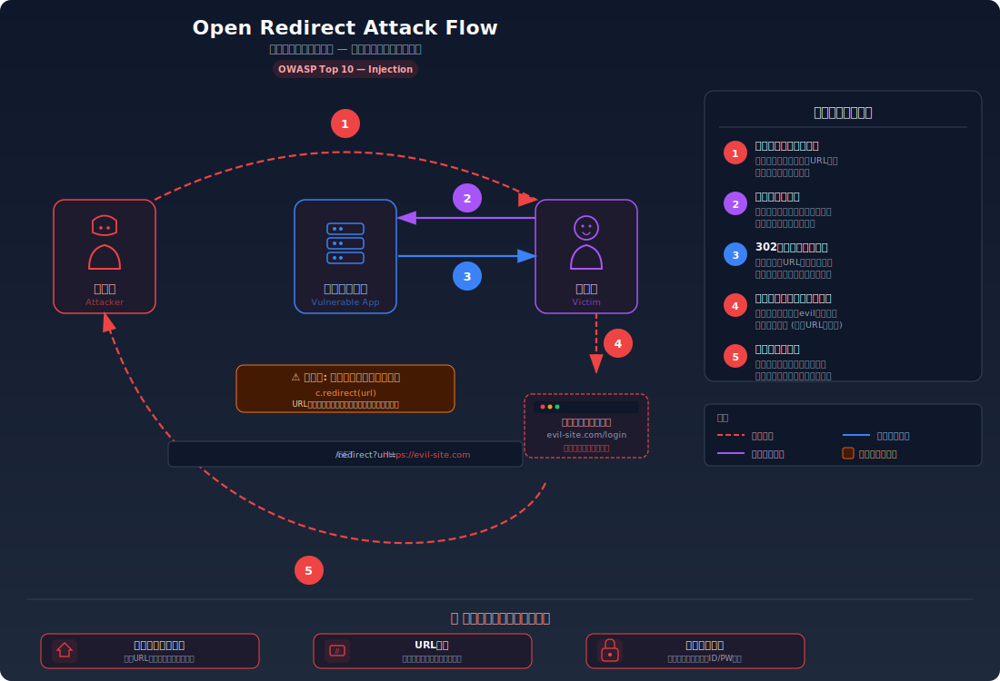
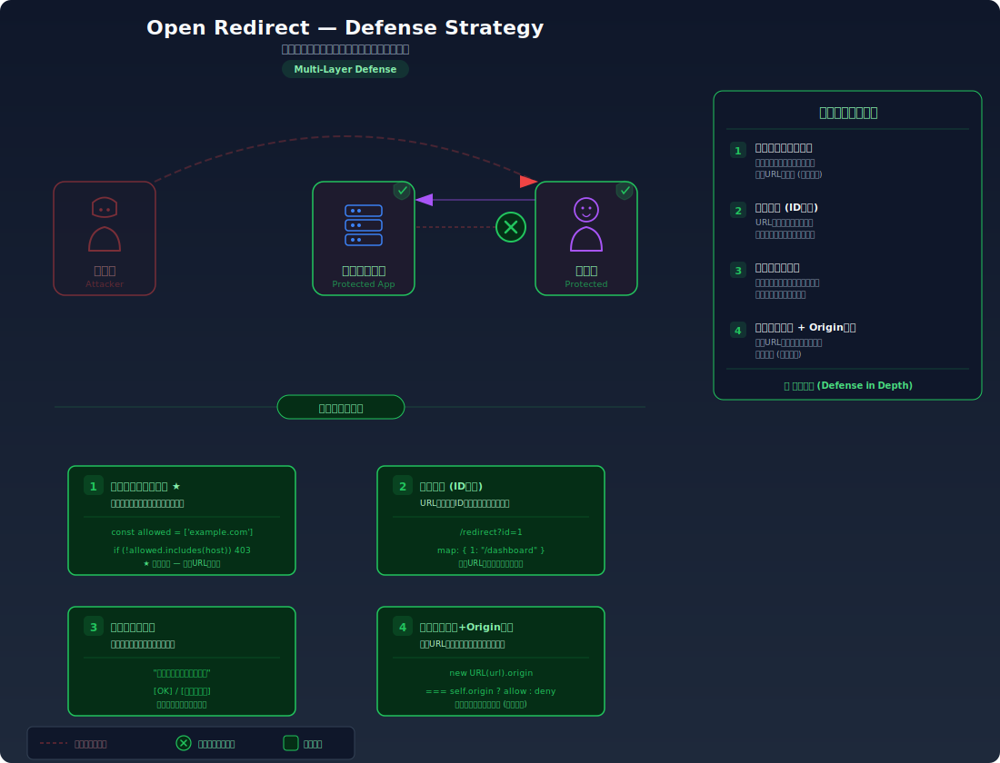

# Open Redirect — 信頼されたURLからフィッシングサイトへ誘導する

> 正規のWebサイトのリダイレクト機能を悪用して、ユーザーを攻撃者が用意したフィッシングサイトへ誘導する脆弱性を学びます。URLのドメインが正規のものなので、被害者は気づかずにフィッシングサイトにアクセスしてしまいます。

---

## 対象ラボ

| 項目 | 内容 |
|------|------|
| **概要** | リダイレクト先 URL をクエリパラメータで指定できるエンドポイントで、外部サイトへのリダイレクトが検証なしに行われる |
| **攻撃例** | `/api/redirect?url=https://evil.example.com` |
| **技術スタック** | Hono API |
| **難易度** | ★☆☆ 入門 |
| **前提知識** | HTTP リダイレクト（301/302）の仕組み、URL の構造（スキーム・ホスト・パス） |

---

## この脆弱性を理解するための前提

### HTTP リダイレクトの仕組み

Web アプリケーションでは、ログイン後に元のページに戻す、短縮 URL を展開する等の目的でリダイレクトが使われる。サーバーは HTTP レスポンスに `Location` ヘッダーを設定し、ブラウザはそのURLに自動的に遷移する。

```
HTTP/1.1 302 Found
Location: /dashboard

→ ブラウザは自動的に /dashboard に遷移する
```

リダイレクト先を動的に指定するために、URL パラメータを使うことがある:

```
/api/redirect?url=/dashboard
→ Location: /dashboard

/login?return_to=/settings
→ ログイン後に /settings に遷移
```

### どこに脆弱性が生まれるのか

問題は、リダイレクト先の URL を**クライアントから受け取ったパラメータの値をそのまま使用する**場合に発生する。開発者は内部パスだけが指定されることを前提にしているが、攻撃者は外部の URL を指定する。

```typescript
// ⚠️ この部分が問題 — リダイレクト先を検証せずにそのまま使用
app.get('/redirect', (c) => {
  const url = c.req.query('url');
  // 外部URLも含めてどんなURLにもリダイレクトしてしまう
  return c.redirect(url!);
});
```

`url` に `https://evil.example.com` が指定されると、ブラウザは外部の悪意あるサイトに自動で遷移する。URL の冒頭が正規のドメイン（`example.com/redirect?url=...`）であるため、被害者は不審に思いにくい。

---

## 攻撃の仕組み



### 攻撃のシナリオ

1. **攻撃者** が正規サイトのリダイレクトエンドポイントを利用して、フィッシングサイトへのリンクを作成する

   ```
   https://trusted-site.com/redirect?url=https://evil-site.com/login
   ```

   このURLの冒頭は `trusted-site.com` であるため、メールのURLフィルタやユーザーの目視確認をすり抜けやすい。攻撃者はこのリンクをメール、SNS、掲示板等で被害者に送信する。

2. **被害者** がリンクをクリックし、`trusted-site.com` にリクエストを送信する

   ブラウザのアドレスバーには一瞬 `trusted-site.com` が表示されるため、被害者は正規のサイトにアクセスしていると認識する。

3. **サーバー** が `url` パラメータの値を検証せずに `Location` ヘッダーに設定してリダイレクトする

   ```
   HTTP/1.1 302 Found
   Location: https://evil-site.com/login
   ```

   サーバーはパラメータの値が自サイトの内部パスか外部 URL かを確認していないため、攻撃者が指定した任意の URL にリダイレクトしてしまう。

4. **ブラウザ** が自動的にフィッシングサイトに遷移する

   遷移先の `evil-site.com/login` は `trusted-site.com` のログインページを精巧に模倣しており、被害者は正規のサイトだと思い込んでユーザー名とパスワードを入力する。

5. **攻撃者** が被害者の認証情報を取得する

   フィッシングサイトは入力された認証情報を攻撃者のサーバーに送信し、被害者を本物のサイトにリダイレクトする。被害者は何も起きていないように感じるが、認証情報は窃取されている。

### なぜ成功するのか

| 条件 | 説明 |
|------|------|
| リダイレクト先の検証がない | サーバーがパラメータの値を検証せずに `Location` ヘッダーに設定する。ホワイトリストも正規表現チェックもない |
| 正規ドメインの URL で始まる | メールフィルタやセキュリティツールは `trusted-site.com` ドメインを安全と判定し、ブロックしない |
| ブラウザの自動遷移 | `302 Found` レスポンスに対してブラウザは自動的にリダイレクトするため、ユーザーが遷移先を確認する余地がない |

### 被害の範囲

- **機密性**: フィッシングサイトでの認証情報（ユーザー名・パスワード）の窃取。クレジットカード情報や個人情報の詐取
- **完全性**: 窃取した認証情報を使って正規サイトのアカウントにログインし、設定変更やデータ改ざんが可能
- **可用性**: 直接的な影響は少ないが、マルウェア配布サイトへのリダイレクトにより被害者の端末が感染する可能性がある

---

## 対策



### 根本原因

リダイレクト先の URL を **外部からのパラメータで自由に指定できる** 設計になっていることが根本原因。サーバーが「信頼できるリダイレクト先」を定義・検証していない。

### 安全な実装

リダイレクト先を許可リスト（ホワイトリスト）で検証する。パラメータの値が自サイトの内部パスか、明示的に許可されたドメインかをチェックし、それ以外はデフォルトのページにリダイレクトする。

```typescript
// ✅ ホワイトリスト検証 — 許可されたURLのみリダイレクト
const ALLOWED_HOSTS = ['trusted-site.com', 'sub.trusted-site.com'];

app.get('/redirect', (c) => {
  const url = c.req.query('url') ?? '/';

  // 相対パス（内部リダイレクト）は許可
  if (url.startsWith('/') && !url.startsWith('//')) {
    return c.redirect(url);
  }

  // 絶対URLの場合はホストをチェック
  try {
    const parsed = new URL(url);
    if (ALLOWED_HOSTS.includes(parsed.hostname)) {
      return c.redirect(url);
    }
  } catch {
    // 不正なURL
  }

  // 許可されていないURLはトップページにリダイレクト
  return c.redirect('/');
});
```

外部 URL が指定された場合、`parsed.hostname` がホワイトリストに含まれていなければリダイレクトを拒否し、安全なデフォルトページに遷移させる。`//evil.com` のようなプロトコル相対URLによるバイパスも `!url.startsWith('//')` で防止している。

#### 脆弱 vs 安全: コード比較

```diff
- return c.redirect(url!);
+ if (url.startsWith('/') && !url.startsWith('//')) {
+   return c.redirect(url);
+ }
+ // ... ホスト名のホワイトリスト検証
+ return c.redirect('/');
```

脆弱なコードでは任意の URL にリダイレクトする。安全なコードでは内部パスか許可されたホストのみ受け入れ、それ以外はデフォルトにフォールバックする。

### その他の防御策

| 対策 | 種類 | 説明 |
|------|------|------|
| ホワイトリスト検証 | 根本対策 | 許可されたパスまたはドメインのみリダイレクトを許可する。最も効果的 |
| 間接参照の使用 | 根本対策 | URL を直接パラメータにせず、ID（`?redirect=dashboard`）を使って内部でマッピングする |
| リダイレクト前の確認ページ | 多層防御 | 「外部サイトに移動します」と表示してユーザーの明示的な確認を求める |
| Referer チェック | 検知 | リダイレクトリクエストの Referer ヘッダーを確認し、意図しないソースからのリクエストを検知 |

---

## ハンズオン手順

### Step 1: 脆弱バージョンで攻撃を体験

**ゴール**: 正規サイトの URL から外部サイトにリダイレクトされることを確認する

1. 開発サーバーを起動する

   ```bash
   cd backend && pnpm dev
   ```

2. 正常なリダイレクトを試す

   ```bash
   # 内部パスへのリダイレクト（正常な使い方）
   curl -v "http://localhost:3000/api/labs/open-redirect/vulnerable/redirect?url=/dashboard" 2>&1 | grep -i location
   ```

   `Location: /dashboard` が返される（正常動作）。

3. オープンリダイレクトを試す — 外部 URL を指定

   ```bash
   # 外部URLへのリダイレクト（攻撃）
   curl -v "http://localhost:3000/api/labs/open-redirect/vulnerable/redirect?url=https://evil.example.com" 2>&1 | grep -i location
   ```

4. 結果を確認する

   - `Location: https://evil.example.com` が返される
   - ブラウザで開くと外部サイトに自動的に遷移してしまう
   - **この結果が意味すること**: `http://localhost:3000/api/labs/...` という正規のURLを使って、任意の外部サイトにユーザーを誘導できる

### Step 2: 安全バージョンで防御を確認

**ゴール**: 同じ攻撃が失敗することを確認する

1. 同じペイロードを安全なエンドポイントに送信する

   ```bash
   curl -v "http://localhost:3000/api/labs/open-redirect/secure/redirect?url=https://evil.example.com" 2>&1 | grep -i location
   ```

2. 結果を確認する

   - `Location: /` が返される（トップページにフォールバック）
   - 外部 URL が拒否され、安全なデフォルトページにリダイレクトされる

3. 内部パスは許可されることを確認する

   ```bash
   curl -v "http://localhost:3000/api/labs/open-redirect/secure/redirect?url=/dashboard" 2>&1 | grep -i location
   ```

   `Location: /dashboard` が返される（内部パスは許可）。

4. コードの差分を確認する

   - `backend/src/labs/open-redirect.ts` の脆弱版と安全版を比較
   - **どの行が違いを生んでいるか** に注目: 無条件の `redirect()` → ホワイトリスト検証付き

### 確認ポイント

以下を自分の言葉で説明できれば、このラボは完了です:

- [ ] オープンリダイレクトがフィッシング攻撃にどう利用されるか
- [ ] なぜ正規ドメインの URL で始まることが攻撃を成功させるのか
- [ ] ホワイトリスト検証は「なぜ」この攻撃を防ぐのか
- [ ] `//evil.com` や `javascript:` スキーム等のバイパス手法にはどう対処すべきか

---

## 実装メモ

| 項目 | パス |
|------|------|
| 脆弱エンドポイント | `/api/labs/open-redirect/vulnerable/redirect` |
| 安全エンドポイント | `/api/labs/open-redirect/secure/redirect` |
| バックエンド | `backend/src/labs/open-redirect.ts` |
| フロントエンド | `frontend/src/pages/OpenRedirect.tsx` |

- 脆弱版では `c.redirect(url)` にパラメータの値をそのまま渡す
- 安全版では許可リストによるホスト名検証を行い、不許可の URL はデフォルトにフォールバック
- `//evil.com`（プロトコル相対 URL）や `javascript:` スキームによるバイパスにも対応

---

## 関連ラボ

| ラボ | 関連性 |
|------|--------|
| [XSS](./xss.md) | XSS で `document.location` を変更すればオープンリダイレクトと同等のことが可能。オープンリダイレクトは「サーバー側のリダイレクト」版 |
| [SSRF](../step06-server-side/ssrf.md) | サーバーサイドでの URL パラメータ操作。オープンリダイレクトがクライアント向けの誘導なのに対し、SSRF はサーバーに内部リソースへのアクセスを強制する |

---

## 参考資料

- [OWASP - Open Redirect](https://owasp.org/www-project-web-security-testing-guide/latest/4-Web_Application_Security_Testing/11-Client-side_Testing/04-Testing_for_Client-side_URL_Redirect)
- [CWE-601: URL Redirection to Untrusted Site ('Open Redirect')](https://cwe.mitre.org/data/definitions/601.html)
