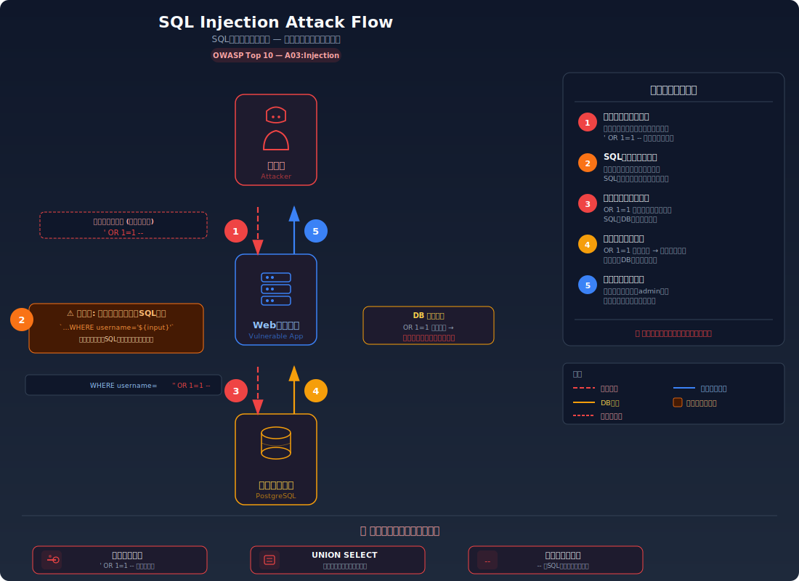
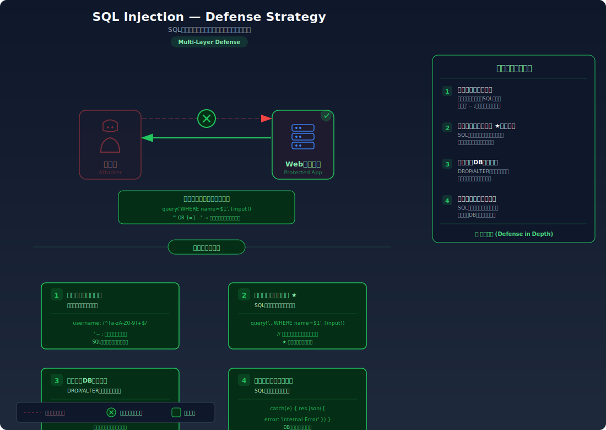

# SQL Injection — ユーザー入力でデータベースを操る

> アプリに入力した文字がそのままデータベースへの命令文に組み込まれてしまうことで、本来見えないはずのデータを盗み出したり、認証をすり抜けたりできてしまう脆弱性を学びます。

---

## 対象ラボ

### 1. 認証バイパス (Authentication Bypass)

| 項目 | 内容 |
|------|------|
| **概要** | ログインフォームに特殊な文字列を入力することで、パスワードを知らなくても管理者としてログインできてしまう |
| **攻撃例** | `' OR 1=1 --` をユーザー名に入力 |
| **技術スタック** | Hono API + PostgreSQL (pg ドライバ) |
| **難易度** | ★☆☆ 入門 |
| **前提知識** | HTTP リクエストの基本（POST）、SQL の SELECT 文の基本構文 |

### 2. データ抽出 (UNION-based Extraction)

| 項目 | 内容 |
|------|------|
| **概要** | 検索フォームに UNION SELECT を注入し、本来アクセスできないテーブルからデータを抽出する |
| **攻撃例** | `' UNION SELECT username, password FROM users --` を検索欄に入力 |
| **技術スタック** | Hono API + PostgreSQL (pg ドライバ) |
| **難易度** | ★★☆ 中級 |
| **前提知識** | SQL の UNION 構文、認証バイパスラボの完了 |

---

## この脆弱性を理解するための前提

### SQL によるデータ取得の仕組み

Web アプリケーションがユーザーのログインを処理するとき、一般的に以下の流れで動作する:

1. ユーザーがフォームにユーザー名とパスワードを入力
2. サーバーがその値を使って SQL クエリを組み立てる
3. データベースがクエリを実行し、結果を返す
4. サーバーが結果に基づいてログイン成否を判定する

```sql
-- 正常なログインクエリの例
SELECT * FROM users WHERE username = 'admin' AND password = 'admin123';
```

このクエリは `users` テーブルから `username` が `admin` かつ `password` が `admin123` であるレコードを探す。レコードが見つかればログイン成功、見つからなければ失敗となる。

### どこに脆弱性が生まれるのか

問題は、アプリケーションがユーザーの入力値を **文字列結合** で SQL 文に埋め込んでいる場合に発生する。開発者はユーザーが「普通の文字列」を入力することを前提にしているが、攻撃者は SQL の構文として解釈される特殊な文字列を意図的に入力する。

```typescript
// ⚠️ この部分が問題 — ユーザー入力を文字列結合でSQL文に埋め込んでいる
const query = `SELECT * FROM users WHERE username = '${username}' AND password = '${password}'`;
const result = await pool.query(query);
```

ここで `username` に `' OR 1=1 --` が入力されると、組み立てられる SQL は以下のようになる:

```sql
SELECT * FROM users WHERE username = '' OR 1=1 --' AND password = 'anything'
```

`--` 以降はコメントとして無視されるため、実質的なクエリは `WHERE username = '' OR 1=1` となる。`1=1` は常に真なので、テーブルの全レコードが返される。

---

## 攻撃の仕組み



### 攻撃のシナリオ

#### シナリオ 1: 認証バイパス

1. **攻撃者** がログインフォームのユーザー名欄に `' OR 1=1 --` と入力し、パスワード欄には適当な値を入れて送信する

   ログインフォームは通常のテキスト入力であり、入力内容に制限がないため、SQL の特殊文字（シングルクォート `'` やコメント `--`）もそのまま送信できる。

2. **サーバー** がこの入力を文字列結合で SQL 文に組み込む

   サーバー側のコードは入力値の検証やエスケープを行わず、そのまま SQL 文に結合する。結果として以下のクエリが生成される:

   ```sql
   SELECT * FROM users
   WHERE username = '' OR 1=1 --' AND password = 'anything'
   ```

   `--` 以降は SQL のコメントとして扱われるため、パスワードの条件は完全に無視される。`OR 1=1` が常に真であるため、WHERE 句全体が真となる。

3. **データベース** が全ユーザーのレコードを返す

   `OR 1=1` により条件が常に真になるため、`users` テーブルの **全レコード** が返される。アプリケーションは通常、返された最初のレコードでログイン成功と判定するため、多くの場合 `id = 1` の管理者アカウントとしてログインが成立する。

#### シナリオ 2: UNION による他テーブルのデータ抽出

1. **攻撃者** が検索フォームに `' UNION SELECT username, password FROM users --` と入力する

   まず正規のクエリのカラム数を推測し（エラーメッセージや試行錯誤で特定）、その数に合わせた UNION SELECT を組み立てる。

2. **サーバー** が結合された SQL を実行する

   ```sql
   SELECT title, content FROM posts WHERE title LIKE '%' UNION SELECT username, password FROM users --%'
   ```

   UNION により、本来の `posts` テーブルの検索結果に加えて `users` テーブルの `username` と `password` が結合される。

3. **攻撃者** が検索結果に含まれるユーザー名とパスワードを取得する

   検索結果の一覧にユーザー情報が混入して表示されるため、全ユーザーの認証情報が漏洩する。

### なぜ成功するのか

| 条件 | 説明 |
|------|------|
| 文字列結合による SQL 組み立て | ユーザー入力がそのまま SQL 構文の一部として解釈されてしまう。パラメータ化クエリを使っていれば、入力は常にリテラル値として扱われる |
| 入力値のバリデーションがない | シングルクォート `'` やダブルダッシュ `--` などの SQL 特殊文字がフィルタリングされずにそのまま通過する |
| 詳細なエラーメッセージ | SQL エラーがそのままクライアントに返される場合、攻撃者はテーブル構造やカラム数を推測する手がかりを得られる |

### 被害の範囲

- **機密性**: 全ユーザーのユーザー名・パスワード・メールアドレスが取得される。このラボではパスワードが平文で保存されているため、取得されたパスワードは他のサービスへの攻撃にも直接使用できる
- **完全性**: `'; DROP TABLE users; --` や `'; UPDATE users SET role='admin' WHERE username='attacker'; --` のようなペイロードにより、データの削除・改ざんが可能
- **可用性**: テーブル削除や大量データ操作により、サービス全体が停止する可能性がある

---

## 対策



### 根本原因

ユーザー入力が **SQL の構文（コード）** として解釈される設計になっていることが根本原因。入力値が「データ」として扱われるべきところを、「命令」として処理してしまっている。

### 安全な実装

パラメータ化クエリ（プリペアドステートメント）を使用すると、ユーザー入力は常に **リテラル値** として扱われ、SQL 構文として解釈されることがない。

データベースドライバは、SQL 文の構造（`SELECT ... WHERE username = $1`）とデータ（`' OR 1=1 --`）を **別々に** データベースに送信する。データベースエンジンはまず SQL 文の構造を解析・コンパイルし、その後にデータを値としてバインドする。このため、データ内にどんな SQL 構文が含まれていても、それが命令として実行されることはない。

```typescript
// ✅ パラメータ化クエリ — 入力値は常にリテラル値として扱われる
const result = await pool.query(
  'SELECT * FROM users WHERE username = $1 AND password = $2',
  [username, password]
);
```

`' OR 1=1 --` が入力されても、データベースは「`' OR 1=1 --` という文字列に完全一致するユーザー名」を探すだけになる。当然そんなユーザーは存在しないため、ログインは失敗する。

#### 脆弱 vs 安全: コード比較

```diff
- const query = `SELECT * FROM users WHERE username = '${username}' AND password = '${password}'`;
- const result = await pool.query(query);
+ const result = await pool.query(
+   'SELECT * FROM users WHERE username = $1 AND password = $2',
+   [username, password]
+ );
```

脆弱なコードでは入力値が SQL 文の文字列に直接結合されるため、`'` でクォートを閉じて任意の SQL を注入できる。安全なコードでは `$1`, `$2` がプレースホルダとして機能し、入力値はクエリのコンパイル後にバインドされるため、構文として解釈される余地がない。

### その他の防御策

| 対策 | 種類 | 説明 |
|------|------|------|
| パラメータ化クエリ | 根本対策 | SQL 文の構造とデータを分離する。これが最も効果的で必須の対策 |
| 入力値のバリデーション | 多層防御 | ユーザー名に使える文字を英数字に制限する等。根本対策ではないが、攻撃の難易度を上げる |
| 最小権限の DB ユーザー | 多層防御 | アプリの DB 接続ユーザーに DROP / ALTER 等の権限を与えない。SQLi が成功しても被害を限定できる |
| WAF (Web Application Firewall) | 検知 | SQL 構文パターンを含むリクエストを検知・ブロックする。バイパス手法も多いため根本対策にはならない |
| エラーメッセージの抑制 | 多層防御 | SQL エラーの詳細をクライアントに返さない。攻撃者がテーブル構造を推測するヒントを減らす |

---

## ハンズオン手順

### Step 1: 脆弱バージョンで攻撃を体験

**ゴール**: パスワードを知らずに admin としてログインが成功することを確認する

1. 開発サーバーを起動する

   ```bash
   cd backend && pnpm dev
   ```

2. 認証バイパスを試す — ユーザー名に `' OR 1=1 --` を入力

   ```bash
   # 脆弱なログインエンドポイントに攻撃ペイロードを送信
   curl -X POST http://localhost:3000/api/labs/sql-injection/vulnerable/login \
     -H "Content-Type: application/json" \
     -d '{"username": "'\'' OR 1=1 --", "password": "anything"}'
   ```

3. 結果を確認する

   - admin ユーザーとしてログインが成功し、ユーザー情報が返される
   - パスワードに `anything` というでたらめな値を入れたにもかかわらず認証が通っている
   - **この結果が意味すること**: SQL の WHERE 句が `OR 1=1` により常に真となり、パスワード検証が完全にバイパスされた

4. UNION によるデータ抽出を試す

   ```bash
   # 脆弱な検索エンドポイントで UNION SELECT を注入
   curl "http://localhost:3000/api/labs/sql-injection/vulnerable/search?q=' UNION SELECT username, password FROM users --"
   ```

5. 結果を確認する

   - 検索結果に全ユーザーのユーザー名とパスワードが表示される
   - **この結果が意味すること**: UNION により、本来の posts テーブルの結果に users テーブルのデータが結合された

### Step 2: 安全バージョンで防御を確認

**ゴール**: 同じ攻撃が失敗することを確認する

1. 同じペイロードを安全なエンドポイントに送信する

   ```bash
   # 安全なログインエンドポイントに同じ攻撃を実行
   curl -X POST http://localhost:3000/api/labs/sql-injection/secure/login \
     -H "Content-Type: application/json" \
     -d '{"username": "'\'' OR 1=1 --", "password": "anything"}'
   ```

2. 結果を確認する

   - ログインが失敗する（「ユーザーが見つかりません」等のメッセージ）
   - データベースは `' OR 1=1 --` という文字列をユーザー名として**文字通り**検索している

3. UNION 攻撃も安全なエンドポイントで試す

   ```bash
   curl "http://localhost:3000/api/labs/sql-injection/secure/search?q=' UNION SELECT username, password FROM users --"
   ```

4. コードの差分を確認する

   - `backend/src/labs/sql-injection.ts` の脆弱版と安全版を比較
   - **どの行が違いを生んでいるか** に注目: `${input}` → `$1` + パラメータ配列

### 確認ポイント

以下を自分の言葉で説明できれば、このラボは完了です:

- [ ] SQL インジェクションが発生するための条件は何か
- [ ] `' OR 1=1 --` が入力されたとき、サーバー内部でどんな SQL が生成され、なぜ全レコードが返されるのか
- [ ] 根本原因は「文字列結合」のどこにあるか（なぜ `'` が SQL の構文を壊せるのか）
- [ ] パラメータ化クエリは「なぜ」この攻撃を無効化するのか（「安全だから安全」ではダメ — SQL 文の構造とデータが分離される仕組みを説明できるか）

---

## 実装メモ

| 項目 | パス |
|------|------|
| 脆弱エンドポイント (ログイン) | `/api/labs/sql-injection/vulnerable/login` |
| 脆弱エンドポイント (検索) | `/api/labs/sql-injection/vulnerable/search` |
| 安全エンドポイント (ログイン) | `/api/labs/sql-injection/secure/login` |
| 安全エンドポイント (検索) | `/api/labs/sql-injection/secure/search` |
| バックエンド | `backend/src/labs/sql-injection.ts` |
| フロントエンド | `frontend/src/pages/SqlInjection.tsx` |
| DB | `docker/db/init.sql` の `users`, `posts` テーブルを使用 |

- 脆弱版では `pool.query()` に文字列テンプレートリテラルで入力値を結合する
- 安全版では `pool.query()` の第2引数にパラメータ配列を渡す
- パスワードは学習目的で平文保存（Step 3 で bcrypt 対応を学ぶ）

---

## 現実世界での事例

| 年 | インシデント | 概要 |
|----|-------------|------|
| 2008 | Heartland Payment Systems | SQL インジェクションにより 1 億 3,000 万件以上のクレジットカード情報が漏洩。当時史上最大のデータ侵害 |
| 2011 | Sony PlayStation Network | SQL インジェクション攻撃により 7,700 万件のアカウント情報が漏洩し、サービスが 23 日間停止 |
| 2015 | TalkTalk | SQL インジェクションにより約 15 万人の顧客データが漏洩。40 万ポンドの罰金を科された |

---

## 関連ラボ

| ラボ | 関連性 |
|------|--------|
| [平文パスワード保存](../step03-auth/plaintext-password.md) | SQL インジェクションで取得したパスワードが平文の場合、即座に悪用可能。ハッシュ化されていれば被害を軽減できる |
| [エラーメッセージからの情報漏洩](../step01-recon/error-message-leakage.md) | 詳細な SQL エラーメッセージが攻撃者にテーブル構造の手がかりを与える |
| [OS コマンドインジェクション](./command-injection.md) | 同じ「入力値がコードとして解釈される」パターンの別の攻撃。SQL の代わりにシェルコマンドが対象 |

---

## 参考資料

- [OWASP - SQL Injection](https://owasp.org/www-community/attacks/SQL_Injection)
- [CWE-89: Improper Neutralization of Special Elements used in an SQL Command](https://cwe.mitre.org/data/definitions/89.html)
