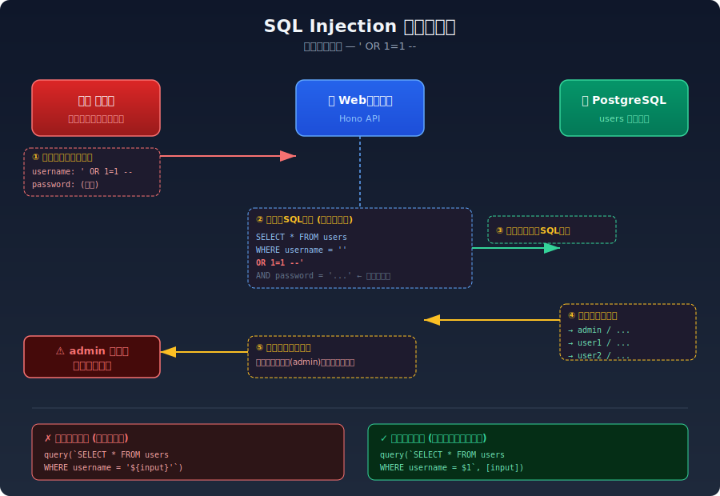

# SQLインジェクション

## 対象ラボ

### 1. SQLインジェクションによる認証バイパス・データ抽出

- **概要**: ユーザー入力がSQL文にそのまま結合され、任意のSQLを実行可能
- **攻撃例**: ログインフォームに `' OR 1=1 --` を入力して認証バイパス
- **攻撃例2**: `' UNION SELECT username, password FROM users --` でデータ抽出
- **技術スタック**: Hono API + PostgreSQL (pg ドライバ)
- **難易度**: ★☆☆
- **優先度**: 最優先 (最も代表的な脆弱性)

## 攻撃フロー図

以下の図は、`' OR 1=1 --` を使った認証バイパスの流れを示しています。

### フローの説明

1. **攻撃者** がログインフォームに `' OR 1=1 --` を入力して送信
2. **Webサーバー** が文字列結合でSQL文を構築（脆弱なコード）
3. 改ざんされたSQL `WHERE username = '' OR 1=1 --` がDBに送られる
4. `OR 1=1` が常に真になるため、**全ユーザーのレコード** が返却される
5. 最初のレコード（通常は admin）で認証が成功してしまう

### 根本原因と対策

| | コード例 |
|---|---|
| ✗ **脆弱** | `` query(`SELECT * FROM users WHERE username = '${input}'`) `` |
| ✓ **安全** | `` query(`SELECT * FROM users WHERE username = $1`, [input]) `` |

パラメータ化クエリ（プレースホルダ）を使うことで、ユーザー入力がSQL構文として解釈されることを防ぎます。

## 参考資料

- [OWASP - SQL Injection](https://owasp.org/www-community/attacks/SQL_Injection)
