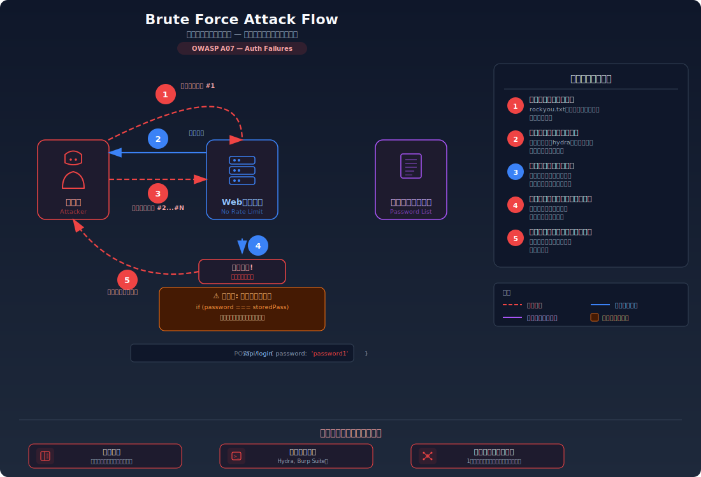

# Brute Force Attack — パスワード総当たりでログインを突破する

> ログイン試行に回数制限がないアプリケーションに対して、パスワードの候補を片っ端から試すことで、正しいパスワードを見つけ出してしまう攻撃を学びます。

---

## 対象ラボ

| 項目 | 内容 |
|------|------|
| **概要** | ログインエンドポイントにレート制限やアカウントロックがなく、攻撃者がパスワード辞書を使って無制限にログイン試行を繰り返せる |
| **攻撃例** | `for pw in $(cat rockyou.txt); do curl -X POST /api/login -d "{\"password\":\"$pw\"}"; done` |
| **技術スタック** | Hono API + PostgreSQL |
| **難易度** | ★☆☆ 入門 |
| **前提知識** | HTTP リクエストの基本（POST）、認証の仕組み（ユーザー名 + パスワード） |

---

## この脆弱性を理解するための前提

### パスワード認証の仕組み

Web アプリケーションの一般的なログイン処理は以下の流れで動作する:

1. ユーザーがログインフォームにユーザー名とパスワードを入力
2. サーバーがデータベースから該当ユーザーのパスワードを取得
3. 入力されたパスワードと保存されたパスワードを比較
4. 一致すればログイン成功、不一致ならエラーを返す

```
POST /api/login
{ "username": "admin", "password": "admin123" }

→ 200 OK: ログイン成功
→ 401 Unauthorized: パスワードが違います
```

この仕組み自体は正常だが、「何回失敗しても、何度でもやり直せる」場合に問題が発生する。

### どこに脆弱性が生まれるのか

問題は、ログイン試行の回数に **何の制限もない** 場合に発生する。攻撃者は数万〜数百万のパスワード候補を自動化ツールで高速に試行でき、いずれ正しいパスワードに到達する。

```typescript
// ⚠️ この部分が問題 — ログイン失敗に対するペナルティが一切ない
app.post('/login', async (c) => {
  const { username, password } = await c.req.json();
  const user = await pool.query(
    'SELECT * FROM users WHERE username = $1 AND password = $2',
    [username, password]
  );
  if (user.rows.length === 0) {
    // 失敗しても何も記録せず、次の試行をそのまま受け付ける
    return c.json({ error: '認証失敗' }, 401);
  }
  return c.json({ message: 'ログイン成功', user: user.rows[0] });
});
```

1 秒に 100 回の試行が可能な場合、10,000 語のパスワード辞書なら約 100 秒で全パターンを試せる。

---

## 攻撃の仕組み



### 攻撃のシナリオ

1. **攻撃者** がパスワード辞書（rockyou.txt 等の流出パスワードリスト）を準備する

   過去のデータ漏洩事件で流出したパスワードリストには数百万〜数十億のエントリが含まれている。実際のユーザーが使っていたパスワードであるため、命中率が高い。

2. **攻撃者** が自動化ツール（スクリプト、Hydra、Burp Suite 等）でログインエンドポイントに連続リクエストを送信する

   ```bash
   # パスワード辞書の各行を順に試行
   while read password; do
     curl -s -X POST http://target/api/login \
       -H "Content-Type: application/json" \
       -d "{\"username\":\"admin\",\"password\":\"$password\"}"
   done < rockyou.txt
   ```

   ツールは 1 秒に数十〜数百のリクエストを送信できる。サーバーは各リクエストを独立に処理し、前回の失敗を記憶していない。

3. **サーバー** が各試行に対して成功/失敗を返す

   レート制限がないため、1 万回目の失敗も 1 回目と同じように処理される。アカウントロックも発動せず、攻撃者は好きなだけ試行を繰り返せる。

4. **攻撃者** が辞書内のパスワードが一致した時点でログインに成功する

   `admin123` のような弱いパスワードは辞書の上位に含まれているため、数秒〜数分で突破される。

### なぜ成功するのか

| 条件 | 説明 |
|------|------|
| レート制限がない | 1 秒に何百回でもログイン試行が可能。攻撃速度に制約がない |
| アカウントロックがない | 連続失敗してもアカウントが一時停止されず、攻撃を中断させる仕組みがない |
| 弱いパスワードの使用 | `123456`、`password`、`admin123` 等のよく使われるパスワードは辞書の上位にあり、短時間で発見される |

### 被害の範囲

- **機密性**: 攻撃者が正規ユーザーとしてログインし、個人情報や機密データにアクセスできる。管理者アカウントが突破された場合、全ユーザーのデータが漏洩する
- **完全性**: 乗っ取ったアカウントでデータの改ざん、投稿の編集・削除、設定の変更が可能
- **可用性**: 大量のログイン試行によりサーバーに負荷がかかり、正規ユーザーのログインが遅延・失敗する可能性がある

---

## 対策


### 根本原因

ログイン試行の **回数と速度に制約がない** ことが根本原因。サーバーが「同じ送信元から短時間に大量の認証リクエストが来ている」という異常を検知・遮断する仕組みを持っていない。

### 安全な実装

レート制限を実装し、一定時間内のログイン試行回数を制限する。さらにアカウントロック機能を組み合わせることで、特定アカウントへの集中攻撃も防ぐ。

レート制限により、攻撃者は 1 秒あたりの試行回数が大幅に制限される。例えば「15 分間に 5 回まで」の制限では、10,000 語の辞書を試すのに約 20 日かかり、攻撃が現実的でなくなる。

```typescript
// ✅ レート制限 — 同一IPからの試行回数を制限
const loginAttempts = new Map<string, { count: number; lastAttempt: number }>();

app.post('/login', async (c) => {
  const ip = c.req.header('x-forwarded-for') || 'unknown';
  const attempts = loginAttempts.get(ip);

  // 15分以内に5回以上失敗していたら拒否
  if (attempts && attempts.count >= 5 &&
      Date.now() - attempts.lastAttempt < 15 * 60 * 1000) {
    return c.json({ error: '試行回数の上限に達しました。しばらく待ってください' }, 429);
  }

  const { username, password } = await c.req.json();
  const user = await pool.query(
    'SELECT * FROM users WHERE username = $1 AND password = $2',
    [username, password]
  );

  if (user.rows.length === 0) {
    // 失敗回数を記録
    const current = loginAttempts.get(ip) || { count: 0, lastAttempt: 0 };
    loginAttempts.set(ip, { count: current.count + 1, lastAttempt: Date.now() });
    return c.json({ error: '認証失敗' }, 401);
  }

  // 成功したらカウントをリセット
  loginAttempts.delete(ip);
  return c.json({ message: 'ログイン成功', user: user.rows[0] });
});
```

#### 脆弱 vs 安全: コード比較

```diff
  app.post('/login', async (c) => {
+   const ip = c.req.header('x-forwarded-for') || 'unknown';
+   const attempts = loginAttempts.get(ip);
+   if (attempts && attempts.count >= 5 &&
+       Date.now() - attempts.lastAttempt < 15 * 60 * 1000) {
+     return c.json({ error: '試行回数の上限です' }, 429);
+   }
    const { username, password } = await c.req.json();
    // ... 認証処理 ...
    if (user.rows.length === 0) {
+     // 失敗を記録
+     const current = loginAttempts.get(ip) || { count: 0, lastAttempt: 0 };
+     loginAttempts.set(ip, { count: current.count + 1, lastAttempt: Date.now() });
      return c.json({ error: '認証失敗' }, 401);
    }
+   loginAttempts.delete(ip);  // 成功時にリセット
    return c.json({ message: 'ログイン成功' });
  });
```

脆弱なコードでは失敗を一切記録しないため無制限に試行できる。安全なコードでは失敗回数を IP ごとに追跡し、閾値を超えたらリクエストを拒否（HTTP 429）する。

### その他の防御策

| 対策 | 種類 | 説明 |
|------|------|------|
| レート制限 | 根本対策 | IP アドレスごとの試行回数を制限する。最も基本的で必須の対策 |
| アカウントロック | 根本対策 | 連続失敗でアカウントを一時停止する。IP を変えた攻撃にも対応できる |
| CAPTCHA | 多層防御 | reCAPTCHA 等で自動化ツールによる試行を防ぐ。人間による攻撃には効果が薄い |
| 多要素認証 (MFA) | 多層防御 | パスワードが突破されても第二要素（TOTP、SMS 等）で阻止する |
| ログイン試行のログ記録 | 検知 | 異常な量のログイン失敗を検知してアラートを発する |
| 応答遅延 (Exponential Backoff) | 多層防御 | 失敗するたびに応答時間を指数的に増やし、攻撃速度を低下させる |

---

## ハンズオン手順

### Step 1: 脆弱バージョンで攻撃を体験

**ゴール**: レート制限がない状態で、パスワード辞書による総当たりが成功することを確認する

1. 開発サーバーを起動する

   ```bash
   cd backend && pnpm dev
   ```

2. まず誤ったパスワードで複数回ログインを試みる

   ```bash
   # 間違ったパスワードを連続で送信 — 何回でも受け付けられる
   for pw in wrong1 wrong2 wrong3 wrong4 wrong5 wrong6 wrong7 wrong8 wrong9 wrong10; do
     curl -s -X POST http://localhost:3000/api/labs/brute-force/vulnerable/login \
       -H "Content-Type: application/json" \
       -d "{\"username\": \"admin\", \"password\": \"$pw\"}"
     echo
   done
   ```

3. 結果を確認する

   - 10 回連続で失敗しても、すべて同じ `401` レスポンスが返される
   - ロックやペナルティは一切発生しない
   - **この結果が意味すること**: 攻撃者は好きなだけ試行を繰り返せる状態

4. 辞書攻撃で正しいパスワードを見つける

   ```bash
   # 小さな辞書で総当たり
   for pw in password 123456 admin admin123 letmein; do
     result=$(curl -s -X POST http://localhost:3000/api/labs/brute-force/vulnerable/login \
       -H "Content-Type: application/json" \
       -d "{\"username\": \"admin\", \"password\": \"$pw\"}")
     echo "パスワード: $pw → $result"
     echo "$result" | grep -q "成功" && break
   done
   ```

5. 結果を確認する

   - `admin123` でログインが成功する
   - わずか数回の試行で正しいパスワードが見つかった

### Step 2: 安全バージョンで防御を確認

**ゴール**: 同じ攻撃がレート制限により阻止されることを確認する

1. 安全なエンドポイントに対して同じ連続試行を実行する

   ```bash
   # 安全なエンドポイントに連続試行
   for pw in wrong1 wrong2 wrong3 wrong4 wrong5 wrong6; do
     result=$(curl -s -X POST http://localhost:3000/api/labs/brute-force/secure/login \
       -H "Content-Type: application/json" \
       -d "{\"username\": \"admin\", \"password\": \"$pw\"}")
     echo "試行: $pw → $result"
   done
   ```

2. 結果を確認する

   - 5 回目の失敗後、6 回目以降は `429 Too Many Requests` が返される
   - 正しいパスワードを含む試行もブロックされる

3. コードの差分を確認する

   - `backend/src/labs/brute-force.ts` の脆弱版と安全版を比較
   - **どの行が違いを生んでいるか** に注目: 失敗回数の記録と閾値チェック

### 確認ポイント

以下を自分の言葉で説明できれば、このラボは完了です:

- [ ] ブルートフォース攻撃が成立するための条件は何か
- [ ] なぜ弱いパスワードほどブルートフォースに脆弱なのか
- [ ] レート制限は「なぜ」この攻撃を無効化するのか（試行速度と辞書サイズの関係を説明できるか）
- [ ] レート制限だけでは不十分な場合がある理由と、多要素認証が「最終防衛線」になる理由

---

## 実装メモ

| 項目 | パス |
|------|------|
| 脆弱エンドポイント | `/api/labs/brute-force/vulnerable/login` |
| 安全エンドポイント | `/api/labs/brute-force/secure/login` |
| バックエンド | `backend/src/labs/brute-force.ts` |
| フロントエンド | `frontend/src/pages/BruteForce.tsx` |
| DB | `docker/db/init.sql` の `users` テーブルを使用 |

- 脆弱版ではログイン失敗を一切記録しない
- 安全版では IP ごとの失敗回数を `Map` で追跡し、閾値超過時に 429 を返す
- 本番では Redis 等の外部ストアを使用してレート制限を実装する

---

## 現実世界での事例

| 年 | インシデント | 概要 |
|----|-------------|------|
| 2014 | iCloud セレブリティ写真流出 | iCloud の「Find My iPhone」API にレート制限がなく、ブルートフォースでセレブリティのアカウントが突破され、プライベート写真が大量に流出した |
| 2016 | Alibaba | ブルートフォース攻撃により 2,000 万以上のアカウントへの不正アクセスが試みられた。流出した認証情報リストを使った大規模なクレデンシャルスタッフィング |
| 2019 | Dunkin' Donuts | ブルートフォース攻撃により顧客アカウントが不正アクセスされ、リワードポイントが窃取された |

---

## 関連ラボ

| ラボ | 関連性 |
|------|--------|
| [弱いパスワードポリシー](./weak-password-policy.md) | 弱いパスワードの登録を許可すると、ブルートフォースの成功確率が劇的に上がる |
| [デフォルト認証情報](./default-credentials.md) | デフォルトパスワードは辞書の最上位に含まれ、ブルートフォースで最初に突破される |
| [平文パスワード保存](./plaintext-password.md) | ブルートフォースで突破されたアカウントのパスワードが平文で保存されていると、他サービスへの攻撃にも直接使用される |

---

## 参考資料

- [OWASP - Brute Force Attack](https://owasp.org/www-community/attacks/Brute_force_attack)
- [OWASP - Credential Stuffing](https://owasp.org/www-community/attacks/Credential_stuffing)
- [CWE-307: Improper Restriction of Excessive Authentication Attempts](https://cwe.mitre.org/data/definitions/307.html)
