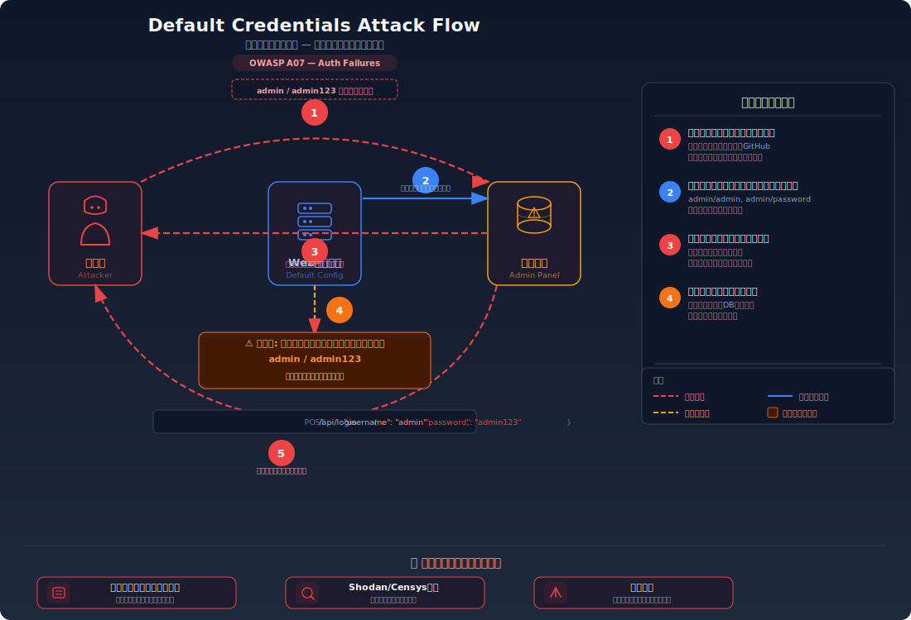
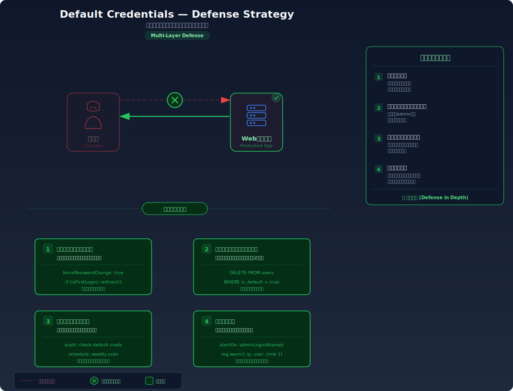

# Default Credentials — 初期パスワードのまま運用されたシステムに侵入する

> アプリケーションやサーバーに設定されている初期パスワード（admin/admin 等）が変更されないまま運用されていると、攻撃者が公開情報からパスワードを入手して即座に管理者権限を取得できてしまう脆弱性を学びます。

---

## 対象ラボ

| 項目 | 内容 |
|------|------|
| **概要** | `admin/admin123` 等のデフォルト認証情報が変更されておらず、公開されたデフォルトパスワードリストで管理者としてログインできる |
| **攻撃例** | `curl -X POST /api/login -d '{"username":"admin","password":"admin123"}'` |
| **技術スタック** | Hono API + PostgreSQL |
| **難易度** | ★☆☆ 入門 |
| **前提知識** | HTTP リクエストの基本（POST）、管理者権限の概念 |

---

## この脆弱性を理解するための前提

### アプリケーションの初期セットアップ

多くの Web アプリケーションやシステムは、インストール直後に管理者アカウントが自動的に作成される。この初期アカウントには「すぐ使い始められるように」デフォルトのパスワードが設定されている。

```sql
-- よくある初期データ投入
INSERT INTO users (username, password, role)
VALUES ('admin', 'admin123', 'admin');
```

本来、管理者はデプロイ後すぐにこのパスワードを変更すべきだが、実際には変更されないまま運用されるケースが極めて多い。

### どこに脆弱性が生まれるのか

問題は 2 つある。第一に、アプリケーションが **初回ログイン時にパスワード変更を強制しない** こと。第二に、デフォルトの認証情報が **マニュアルやソースコード、GitHub 等から誰でも入手可能** であること。

```typescript
// ⚠️ この部分が問題 — デフォルトパスワードが公開されたまま、変更を強制しない
// seed.ts でこのまま本番にデプロイされる
await pool.query(`
  INSERT INTO users (username, password, role)
  VALUES ('admin', 'admin123', 'admin')
  ON CONFLICT DO NOTHING
`);

// ログイン処理にもパスワード変更チェックがない
app.post('/login', async (c) => {
  const { username, password } = await c.req.json();
  const user = await pool.query(
    'SELECT * FROM users WHERE username = $1 AND password = $2',
    [username, password]
  );
  // デフォルトパスワードかどうかを一切チェックしない
  return user.rows.length > 0
    ? c.json({ message: 'ログイン成功', user: user.rows[0] })
    : c.json({ error: '認証失敗' }, 401);
});
```

攻撃者は公開されたマニュアルやソースコード（GitHub 等）からデフォルトパスワードを入手し、そのまま試すだけでログインできる。

---

## 攻撃の仕組み



### 攻撃のシナリオ

1. **攻撃者** がターゲットのアプリケーションを特定し、デフォルト認証情報を調査する

   製品名やフレームワーク名で検索すれば、公式ドキュメントや GitHub リポジトリからデフォルトのユーザー名とパスワードが見つかる。`admin/admin`、`admin/password`、`root/root` 等の一般的な組み合わせのリストも広く公開されている。

2. **攻撃者** がデフォルトの認証情報でログインを試行する

   ```bash
   # よくあるデフォルト認証情報を順に試す
   curl -X POST http://target/api/login \
     -H "Content-Type: application/json" \
     -d '{"username": "admin", "password": "admin123"}'
   ```

   ブルートフォースのように大量の試行が不要で、数回の試行で突破できることが多い。

3. **サーバー** がデフォルトパスワードで認証を通す

   パスワードが初期設定のままなので、攻撃者の入力と完全に一致する。パスワード変更の強制がないため、デフォルトのまま動作し続ける。

4. **攻撃者** が管理者権限でシステムを完全に制御する

   管理画面にアクセスし、ユーザー管理、システム設定、データベース操作など、すべての機能が利用可能になる。

### なぜ成功するのか

| 条件 | 説明 |
|------|------|
| デフォルトパスワードの未変更 | 初期セットアップ後にパスワードを変更していない。最も根本的な問題 |
| デフォルト認証情報の公開性 | マニュアル、GitHub、Shodan 等からデフォルトパスワードが容易に入手できる |
| パスワード変更の非強制 | 初回ログイン時にパスワード変更を要求する仕組みがない |

### 被害の範囲

- **機密性**: 管理者権限により全ユーザーの個人情報（メールアドレス、パスワード等）が閲覧可能。データベースのバックアップやエクスポートも実行できる
- **完全性**: システム設定の変更、ユーザーアカウントの作成・削除、データの改ざんが自由に行える。バックドアの設置も可能
- **可用性**: 管理者権限でサービスの停止、データの削除、アカウントのロックアウトが可能

---

## 対策



### 根本原因

デフォルトの認証情報が **変更されないまま本番環境で使用されている** ことが根本原因。アプリケーションがパスワード変更を強制せず、「初期状態のまま使える」設計になっている。

### 安全な実装

初回ログイン時にパスワード変更を強制する仕組みを実装する。デフォルトパスワードでのログインを検知し、新しいパスワードの設定を要求することで、デフォルトのままの運用を防ぐ。

この実装では、ユーザーテーブルに `must_change_password` フラグを追加し、デフォルトアカウントにはこのフラグを `true` に設定する。ログイン時にこのフラグを確認し、パスワード変更が完了するまで通常の操作を許可しない。

```typescript
// ✅ パスワード変更強制 — デフォルトパスワードでのログインを検知
app.post('/login', async (c) => {
  const { username, password } = await c.req.json();
  const user = await pool.query(
    'SELECT * FROM users WHERE username = $1 AND password = $2',
    [username, password]
  );
  if (user.rows.length === 0) {
    return c.json({ error: '認証失敗' }, 401);
  }

  // デフォルトパスワードかどうかをチェック
  if (user.rows[0].must_change_password) {
    return c.json({
      message: 'パスワード変更が必要です',
      requirePasswordChange: true,
    }, 403);
  }

  return c.json({ message: 'ログイン成功', user: user.rows[0] });
});
```

#### 脆弱 vs 安全: コード比較

```diff
  if (user.rows.length === 0) {
    return c.json({ error: '認証失敗' }, 401);
  }
+ // デフォルトパスワードの場合は変更を強制
+ if (user.rows[0].must_change_password) {
+   return c.json({ requirePasswordChange: true }, 403);
+ }
  return c.json({ message: 'ログイン成功', user: user.rows[0] });
```

脆弱なコードではデフォルトパスワードで即座にログイン成功となる。安全なコードでは `must_change_password` フラグを確認し、パスワード変更が完了するまでアクセスを許可しない。

### その他の防御策

| 対策 | 種類 | 説明 |
|------|------|------|
| 初回パスワード変更強制 | 根本対策 | デフォルトパスワードでのログイン時にパスワード変更を必須化する。最も効果的 |
| デフォルトアカウントの削除 | 根本対策 | デプロイ時にデフォルトの管理者アカウントを削除し、初期セットアップウィザードで管理者を作成させる |
| 環境変数での初期パスワード | 多層防御 | 初期パスワードをソースコードにハードコードせず、環境変数から読み込む |
| セキュリティ監査 | 検知 | デフォルト認証情報が残っていないか定期的にスキャンする。CI/CD パイプラインに組み込むと効果的 |

---

## ハンズオン手順

### Step 1: 脆弱バージョンで攻撃を体験

**ゴール**: デフォルトパスワードで管理者としてログインが成功することを確認する

1. 開発サーバーを起動する

   ```bash
   cd backend && pnpm dev
   ```

2. デフォルトの認証情報でログインを試す

   ```bash
   # デフォルトパスワード admin123 でログイン
   curl -X POST http://localhost:3000/api/labs/default-credentials/vulnerable/login \
     -H "Content-Type: application/json" \
     -d '{"username": "admin", "password": "admin123"}'
   ```

3. 結果を確認する

   - 管理者としてログインが成功し、`role: "admin"` を含むユーザー情報が返される
   - パスワード変更の要求は一切表示されない
   - **この結果が意味すること**: 公開情報から入手したパスワードだけで、何の障壁もなく管理者権限が取得できた

4. 他のデフォルト認証情報も試す

   ```bash
   # よくあるデフォルト認証情報のリスト
   for cred in "admin:admin" "admin:password" "root:root" "admin:admin123"; do
     user=$(echo $cred | cut -d: -f1)
     pass=$(echo $cred | cut -d: -f2)
     echo -n "$user:$pass → "
     curl -s -X POST http://localhost:3000/api/labs/default-credentials/vulnerable/login \
       -H "Content-Type: application/json" \
       -d "{\"username\": \"$user\", \"password\": \"$pass\"}" | head -c 60
     echo
   done
   ```

### Step 2: 安全バージョンで防御を確認

**ゴール**: 同じデフォルトパスワードではログインが完了せず、パスワード変更を求められることを確認する

1. 安全なエンドポイントでデフォルトパスワードを試す

   ```bash
   curl -X POST http://localhost:3000/api/labs/default-credentials/secure/login \
     -H "Content-Type: application/json" \
     -d '{"username": "admin", "password": "admin123"}'
   ```

2. 結果を確認する

   - ログインは拒否され、`requirePasswordChange: true` が返される
   - デフォルトパスワードでは通常の操作にアクセスできない

3. コードの差分を確認する

   - `backend/src/labs/default-credentials.ts` の脆弱版と安全版を比較
   - **どの行が違いを生んでいるか** に注目: `must_change_password` フラグのチェック

### 確認ポイント

以下を自分の言葉で説明できれば、このラボは完了です:

- [ ] デフォルト認証情報が危険な理由は何か（ブルートフォースとの違い）
- [ ] 攻撃者はどこからデフォルトパスワードの情報を入手するか
- [ ] 「初回パスワード変更強制」が根本対策になる理由は何か
- [ ] なぜソースコードにデフォルトパスワードをハードコードすべきでないのか

---

## 実装メモ

| 項目 | パス |
|------|------|
| 脆弱エンドポイント | `/api/labs/default-credentials/vulnerable/login` |
| 安全エンドポイント | `/api/labs/default-credentials/secure/login` |
| バックエンド | `backend/src/labs/default-credentials.ts` |
| フロントエンド | `frontend/src/pages/DefaultCredentials.tsx` |
| DB | `docker/db/init.sql` の `users` テーブル（`must_change_password` カラムを追加） |

- 脆弱版ではデフォルトパスワードでそのままログインが完了する
- 安全版では `must_change_password` フラグをチェックし、パスワード変更を強制する
- `users` テーブルに `must_change_password BOOLEAN DEFAULT false` カラムを追加し、デフォルトアカウントには `true` を設定する

---

## 現実世界での事例

| 年 | インシデント | 概要 |
|----|-------------|------|
| 2016 | Mirai ボットネット | IoT デバイス（カメラ、ルーター等）のデフォルト認証情報（admin/admin 等）を利用して 60 万台以上を乗っ取り、史上最大規模の DDoS 攻撃を実行。DNS プロバイダ Dyn がダウンし、Twitter や Netflix 等が利用不能に |
| 2020 | SolarWinds | ビルドサーバーのパスワードが `solarwinds123` というデフォルトに近い弱いパスワードで、攻撃者がサプライチェーン攻撃の足がかりとした |

---

## 関連ラボ

| ラボ | 関連性 |
|------|--------|
| [ブルートフォース攻撃](./brute-force.md) | デフォルトパスワードはブルートフォースの辞書に真っ先に含まれるため、レート制限があっても数回の試行で突破される |
| [弱いパスワードポリシー](./weak-password-policy.md) | パスワード変更を強制しても、変更先が弱いパスワードでは意味がない。強度ポリシーとの組み合わせが必要 |

---

## 参考資料

- [OWASP - Testing for Default Credentials](https://owasp.org/www-project-web-security-testing-guide/latest/4-Web_Application_Security_Testing/04-Authentication_Testing/02-Testing_for_Default_Credentials)
- [CWE-1392: Use of Default Credentials](https://cwe.mitre.org/data/definitions/1392.html)
