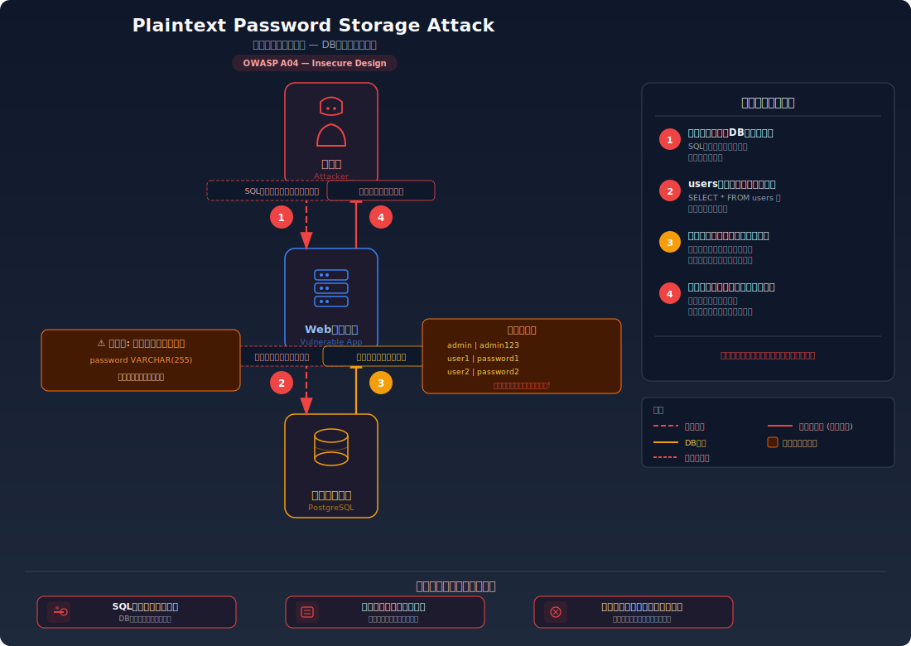
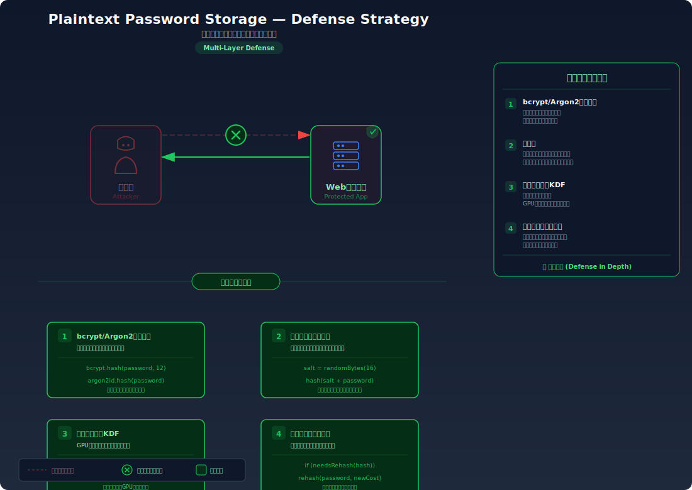

# Plaintext Password Storage — パスワードを平文で保存する危険性

> データベースにパスワードをそのまま（平文で）保存していると、データベースが漏洩した瞬間に全ユーザーのパスワードが攻撃者に丸見えになり、即座に全アカウントが乗っ取られてしまう脆弱性を学びます。

---

## 対象ラボ

| 項目 | 内容 |
|------|------|
| **概要** | パスワードをハッシュ化せず平文で DB に保存しているため、SQL インジェクション等で DB が漏洩するとパスワードがそのまま読み取れる |
| **攻撃例** | `SELECT username, password FROM users;` → `admin | admin123` がそのまま表示 |
| **技術スタック** | PostgreSQL（users テーブル） |
| **難易度** | ★☆☆ 入門 |
| **前提知識** | データベースの基本（テーブル、SELECT 文）、Step 2: SQL インジェクションの理解 |

---

## この脆弱性を理解するための前提

### パスワードの保存方法

ユーザー登録時、サーバーはパスワードをデータベースに保存する必要がある。ログイン時にユーザーが入力したパスワードと、保存されたパスワードを比較するためだ。

```sql
-- ユーザー登録時のデータ保存
INSERT INTO users (username, password, email)
VALUES ('alice', 'mySecret123', 'alice@example.com');

-- ログイン時のパスワード検証
SELECT * FROM users WHERE username = 'alice' AND password = 'mySecret123';
```

この流れ自体は正しいが、**パスワードをどのような形式で保存するか** が安全性を決定する。

### どこに脆弱性が生まれるのか

問題は、パスワードを **そのままの文字列（平文）** でデータベースに保存していること。データベースが何らかの方法で漏洩した場合（SQL インジェクション、バックアップの流出、内部犯行等）、パスワードが即座に読み取れる。

```typescript
// ⚠️ この部分が問題 — パスワードを平文のまま保存
app.post('/register', async (c) => {
  const { username, password, email } = await c.req.json();
  // パスワードをハッシュ化せずにそのままDBに挿入
  await pool.query(
    'INSERT INTO users (username, password, email) VALUES ($1, $2, $3)',
    [username, password, email]  // password がそのまま保存される
  );
  return c.json({ message: '登録成功' });
});
```

```sql
-- DBの中身を見ると、パスワードがそのまま読める
SELECT username, password FROM users;
-- admin    | admin123
-- user1    | password1
-- user2    | password2
```

---

## 攻撃の仕組み



### 攻撃のシナリオ

1. **攻撃者** が SQL インジェクションやその他の脆弱性を利用してデータベースにアクセスする

   Step 2 で学んだ SQL インジェクション、あるいは設定ミスによる DB の外部公開、バックアップファイルの漏洩など、DB にアクセスする手段は複数ある。

2. **攻撃者** が users テーブルの全データをダンプする

   ```sql
   SELECT username, password, email FROM users;
   ```

   データベースへのアクセスが成功すれば、`SELECT *` で全レコードを取得できる。

3. **攻撃者** がパスワードをそのまま読み取る

   パスワードが平文で保存されているため、ダンプ結果に **そのままのパスワード** が表示される:

   ```
   username | password  | email
   ---------+-----------+---------------------
   admin    | admin123  | admin@example.com
   user1    | password1 | user1@example.com
   user2    | password2 | user2@example.com
   ```

   ハッシュ化されていれば `$2b$12$K...` のような解読不能な文字列が表示されるが、平文の場合は一目でパスワードがわかる。

4. **攻撃者** が取得したパスワードで全アカウントにログインする

   パスワードがそのまま使えるため、解析やクラッキングの作業が一切不要。さらに、多くのユーザーは同じパスワードを複数のサービスで使い回しているため、メールアドレスとパスワードの組み合わせで他のサービス（Gmail、SNS、銀行等）への攻撃にも使用される。

### なぜ成功するのか

| 条件 | 説明 |
|------|------|
| パスワードの平文保存 | パスワードがハッシュ化されておらず、DB に格納された値がそのまま元のパスワード。漏洩 = 即座に悪用可能 |
| DB へのアクセス手段の存在 | SQL インジェクション、設定ミス、バックアップ漏洩など、DB にアクセスする方法が何かしら存在する |
| パスワードの使い回し | ユーザーが複数サービスで同じパスワードを使用している場合、1 つの漏洩が他サービスへの攻撃に連鎖する |

### 被害の範囲

- **機密性**: 全ユーザーのユーザー名・パスワード・メールアドレスが即座に漏洩する。パスワードが平文のため、取得した瞬間から悪用可能
- **完全性**: 取得した認証情報で各アカウントにログインし、データの改ざん・削除が自由に行える
- **可用性**: 管理者アカウントが乗っ取られた場合、サービス全体の停止やデータの完全削除が可能。パスワードの使い回しにより、被害が他サービスにまで拡大する

---

## 対策



### 根本原因

パスワードが **可逆的な形式（平文）** のままデータベースに保存されていることが根本原因。保存するデータの形式を「元に戻せない形」に変換すれば、DB が漏洩してもパスワードは復元できない。

### 安全な実装

bcrypt 等のパスワード専用ハッシュ関数を使用して、パスワードを **不可逆的に変換** してからデータベースに保存する。

bcrypt は入力されたパスワードに対してランダムなソルト（salt）を自動的に付与し、コスト係数（work factor）で指定された回数だけハッシュ計算を繰り返す。結果として生成されるハッシュ値は、元のパスワードからは逆算できない。ログイン時は、入力されたパスワードを同じソルトとコスト係数でハッシュ化し、保存されたハッシュ値と比較する。

```typescript
import bcrypt from 'bcrypt';

// ✅ bcryptでハッシュ化 — パスワードを不可逆変換してから保存
app.post('/register', async (c) => {
  const { username, password, email } = await c.req.json();
  // コスト係数12でハッシュ化（ソルトは自動生成）
  const hashedPassword = await bcrypt.hash(password, 12);
  await pool.query(
    'INSERT INTO users (username, password, email) VALUES ($1, $2, $3)',
    [username, hashedPassword, email]  // ハッシュ値のみ保存
  );
  return c.json({ message: '登録成功' });
});

// ✅ ログイン時はbcrypt.compareで比較
app.post('/login', async (c) => {
  const { username, password } = await c.req.json();
  const user = await pool.query(
    'SELECT * FROM users WHERE username = $1',
    [username]
  );
  if (user.rows.length === 0) {
    return c.json({ error: '認証失敗' }, 401);
  }
  // 入力パスワードと保存ハッシュを比較
  const match = await bcrypt.compare(password, user.rows[0].password);
  if (!match) {
    return c.json({ error: '認証失敗' }, 401);
  }
  return c.json({ message: 'ログイン成功' });
});
```

#### 脆弱 vs 安全: コード比較

```diff
  // 登録時
- await pool.query(
-   'INSERT INTO users (username, password, email) VALUES ($1, $2, $3)',
-   [username, password, email]
- );
+ const hashedPassword = await bcrypt.hash(password, 12);
+ await pool.query(
+   'INSERT INTO users (username, password, email) VALUES ($1, $2, $3)',
+   [username, hashedPassword, email]
+ );

  // ログイン時
- const user = await pool.query(
-   'SELECT * FROM users WHERE username = $1 AND password = $2',
-   [username, password]
- );
+ const user = await pool.query(
+   'SELECT * FROM users WHERE username = $1',
+   [username]
+ );
+ const match = await bcrypt.compare(password, user.rows[0].password);
```

脆弱なコードではパスワードをそのまま保存・比較する。安全なコードでは `bcrypt.hash()` でハッシュ化してから保存し、`bcrypt.compare()` で検証する。DB にはハッシュ値のみが保存されるため、漏洩しても元のパスワードは復元できない。

### その他の防御策

| 対策 | 種類 | 説明 |
|------|------|------|
| bcrypt / Argon2 によるハッシュ化 | 根本対策 | パスワード専用のハッシュ関数で不可逆変換する。最も重要で必須の対策 |
| ソルトの使用 | 根本対策 | bcrypt はソルトを自動生成するが、独自実装の場合はユーザーごとに固有のランダムなソルトを付与する |
| DB アクセス制御 | 多層防御 | DB ユーザーの権限を最小限にし、アプリケーションからの不正クエリの影響を限定する |
| DB 暗号化 (at rest) | 多層防御 | ストレージレベルでの暗号化により、物理的なディスク漏洩にも対応する |
| 漏洩検知 | 検知 | Have I Been Pwned API 等で既知の漏洩パスワードとの照合を行う |

---

## ハンズオン手順

### Step 1: 脆弱バージョンで攻撃を体験

**ゴール**: データベースの内容を取得し、パスワードが平文で読めることを確認する

1. 開発サーバーを起動する

   ```bash
   cd backend && pnpm dev
   ```

2. 脆弱なエンドポイントでユーザー一覧を取得する

   ```bash
   # 管理者用のユーザー一覧API（脆弱版はパスワードも返す）
   curl http://localhost:3000/api/labs/plaintext-password/vulnerable/users
   ```

3. 結果を確認する

   - レスポンスに `password: "admin123"` 等の平文パスワードがそのまま含まれている
   - **この結果が意味すること**: DB にアクセスできれば、全ユーザーのパスワードが即座に入手できる

4. 取得したパスワードでログインする

   ```bash
   # 平文パスワードでそのままログイン
   curl -X POST http://localhost:3000/api/labs/plaintext-password/vulnerable/login \
     -H "Content-Type: application/json" \
     -d '{"username": "user1", "password": "password1"}'
   ```

5. パスワードの使い回しの危険性を考える

   - user1 が Gmail でも `password1` を使っていた場合、攻撃者は Gmail にもログインできる
   - 1 つの漏洩が連鎖被害を生む

### Step 2: 安全バージョンで防御を確認

**ゴール**: 同じ情報を取得しても、パスワードがハッシュ化されていて解読できないことを確認する

1. 安全なエンドポイントでユーザー一覧を取得する

   ```bash
   curl http://localhost:3000/api/labs/plaintext-password/secure/users
   ```

2. 結果を確認する

   - パスワードが `$2b$12$K...` のようなハッシュ値で表示される
   - 元のパスワードを推測することはできない

3. コードの差分を確認する

   - `backend/src/labs/plaintext-password.ts` の脆弱版と安全版を比較
   - **どの行が違いを生んでいるか** に注目: `bcrypt.hash()` と `bcrypt.compare()` の使用

### 確認ポイント

以下を自分の言葉で説明できれば、このラボは完了です:

- [ ] 平文パスワード保存が危険な理由（DB 漏洩の前提で考える）
- [ ] bcrypt のハッシュ化が「なぜ」安全なのか（不可逆性、ソルト、コスト係数の役割）
- [ ] MD5 や SHA1 ではなく bcrypt を使うべき理由（Step 3 の weak-hash ラボと関連）
- [ ] パスワードの使い回しがなぜ被害を拡大するのか

---

## 実装メモ

| 項目 | パス |
|------|------|
| 脆弱エンドポイント (ユーザー一覧) | `/api/labs/plaintext-password/vulnerable/users` |
| 脆弱エンドポイント (ログイン) | `/api/labs/plaintext-password/vulnerable/login` |
| 安全エンドポイント (ユーザー一覧) | `/api/labs/plaintext-password/secure/users` |
| 安全エンドポイント (ログイン) | `/api/labs/plaintext-password/secure/login` |
| バックエンド | `backend/src/labs/plaintext-password.ts` |
| フロントエンド | `frontend/src/pages/PlaintextPassword.tsx` |
| DB | `docker/db/init.sql` の `users` テーブルを使用 |

- 脆弱版ではパスワードを平文のまま `INSERT` し、`WHERE password = $1` で直接比較する
- 安全版では `bcrypt.hash(password, 12)` でハッシュ化してから保存し、`bcrypt.compare()` で検証する
- `bcrypt` パッケージを `pnpm add bcrypt @types/bcrypt` で追加

---

## 現実世界での事例

| 年 | インシデント | 概要 |
|----|-------------|------|
| 2012 | LinkedIn | 650 万件のパスワードハッシュが漏洩。SHA1（ソルトなし）で保存されていたため大半が解読された。平文同然の脆弱なハッシュの教訓 |
| 2013 | Adobe | 1 億 5,300 万件のユーザーデータが漏洩。パスワードは 3DES（ECB モード）で暗号化されていたが、同じパスワードが同じ暗号文になるため実質的に平文と変わらなかった |
| 2019 | Facebook | 数億件のパスワードが社内ログに平文で記録されていたことが発覚。外部漏洩はなかったが、内部犯行のリスクが指摘された |

---

## 関連ラボ

| ラボ | 関連性 |
|------|--------|
| [SQL インジェクション](../step02-injection/sql-injection.md) | SQL インジェクションで DB にアクセスされた場合、平文パスワードは即座に悪用される。ハッシュ化されていれば被害を軽減できる |
| [弱いハッシュアルゴリズム](./weak-hash.md) | 平文よりはマシだが、MD5/SHA1 の弱いハッシュではレインボーテーブルで簡単に解読される。bcrypt 等の専用関数を使うべき理由を学ぶ |
| [ブルートフォース攻撃](./brute-force.md) | 漏洩したパスワードが平文の場合、攻撃者はブルートフォースすら不要で即座にログインできる |

---

## 参考資料

- [OWASP - Password Storage Cheat Sheet](https://cheatsheetseries.owasp.org/cheatsheets/Password_Storage_Cheat_Sheet.html)
- [CWE-256: Plaintext Storage of a Password](https://cwe.mitre.org/data/definitions/256.html)
- [CWE-257: Storing Passwords in a Recoverable Format](https://cwe.mitre.org/data/definitions/257.html)
