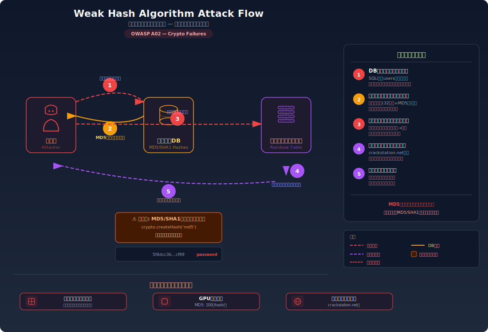
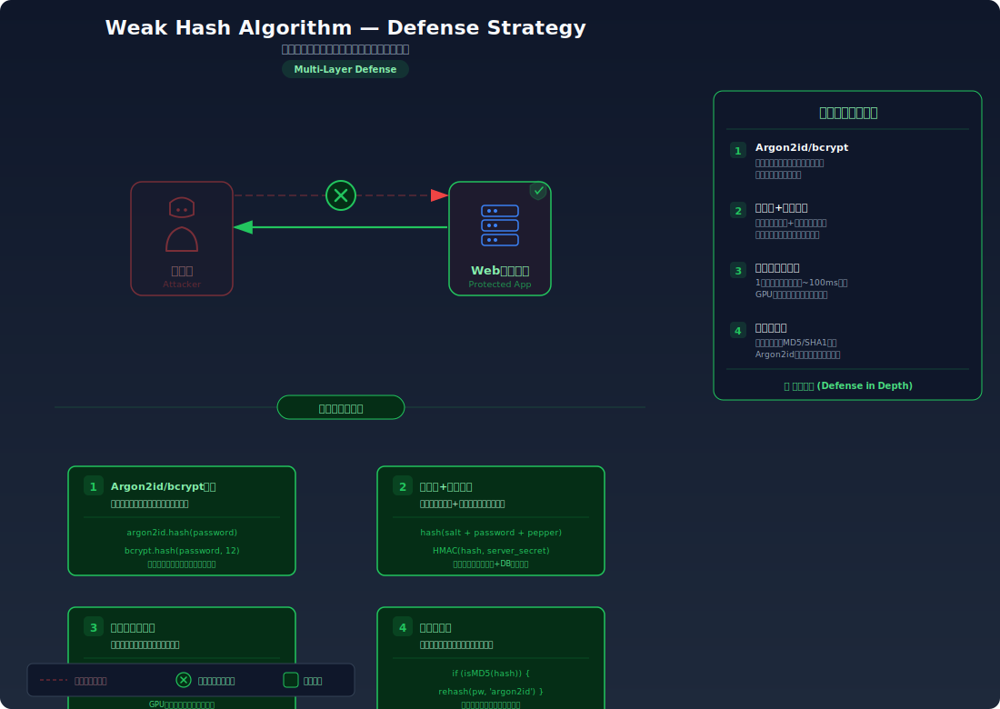

# Weak Hash Algorithm — MD5/SHA1 でハッシュしても安全ではない理由

> パスワードを MD5 や SHA1 でハッシュ化して保存しても、レインボーテーブル（事前計算済みハッシュ対応表）を使えば数秒で元のパスワードに戻せてしまう脆弱性を学びます。

---

## 対象ラボ

### 1. レインボーテーブルによるハッシュ逆引き

| 項目 | 内容 |
|------|------|
| **概要** | MD5 や SHA1 でパスワードをハッシュ化して保存しているが、高速すぎるハッシュ関数とソルト未使用により、レインボーテーブルや GPU を使った総当たりで容易に元のパスワードが復元される |
| **攻撃例** | ハッシュ値 `5f4dcc3b5aa765d61d8327deb882cf99` を CrackStation 等で検索 → `password` と判明 |
| **技術スタック** | Node.js crypto + PostgreSQL |
| **難易度** | ★★☆ 中級 |
| **前提知識** | ハッシュ関数の基本概念（一方向関数）、[平文パスワード保存](./plaintext-password.md)ラボの完了 |

---

## この脆弱性を理解するための前提

### ハッシュ関数の仕組み

ハッシュ関数は任意の入力を固定長の出力（ハッシュ値）に変換する **一方向関数** である。同じ入力からは常に同じハッシュ値が生成されるが、ハッシュ値から元の入力を数学的に逆算することはできない。

```
入力: "password"
MD5:  5f4dcc3b5aa765d61d8327deb882cf99
SHA1: 5baa61e4c9b93f3f0682250b6cf8331b7ee68fd8

入力: "password1"
MD5:  7c6a180b36896a65c4c202c1114f1d90
SHA1: e38ad214943daad1d64c102faec29de4afe9da3d
```

「逆算できない」なら安全に見えるが、問題は **全探索（力ずく）が可能** であること。

### どこに脆弱性が生まれるのか

MD5 や SHA1 は **汎用のハッシュ関数** であり、パスワードの保存用に設計されていない。最大の問題は以下の 2 点:

1. **高速すぎる**: GPU を使えば MD5 は 1 秒に 100 億回以上計算可能。全パスワード候補を片っ端からハッシュ化して比較できる
2. **ソルトがない**: 同じパスワードは常に同じハッシュ値になるため、事前計算した「ハッシュ→パスワード」対応表（レインボーテーブル）で一発検索できる

```typescript
// ⚠️ この部分が問題 — MD5/SHA1はパスワードハッシュに適さない
import { createHash } from 'crypto';

app.post('/register', async (c) => {
  const { username, password } = await c.req.json();
  // MD5は高速すぎて総当たりが容易、かつソルトがない
  const hash = createHash('md5').update(password).digest('hex');
  await pool.query(
    'INSERT INTO users (username, password) VALUES ($1, $2)',
    [username, hash]
  );
  return c.json({ message: '登録成功' });
});
```

---

## 攻撃の仕組み



### 攻撃のシナリオ

1. **攻撃者** が SQL インジェクション等でデータベースからハッシュ値を取得する

   ```sql
   SELECT username, password FROM users;
   -- admin | 0192023a7bbd73250516f069df18b500
   -- user1 | 7c6a180b36896a65c4c202c1114f1d90
   ```

2. **攻撃者** がハッシュの長さからアルゴリズムを特定する

   MD5 は 32 文字（128 ビット）、SHA1 は 40 文字（160 ビット）の 16 進数文字列。長さだけでアルゴリズムがほぼ特定できる。

3. **攻撃者** がレインボーテーブルサービスでハッシュ値を検索する

   CrackStation や md5decrypt 等のオンラインサービスに貼り付けるだけで、一般的なパスワードなら即座に元のパスワードが返される。

   ```
   0192023a7bbd73250516f069df18b500 → admin123
   7c6a180b36896a65c4c202c1114f1d90 → password1
   ```

   レインボーテーブルには数十億のハッシュ→パスワード対応が事前計算されている。

4. **攻撃者** がオフラインで GPU を使った総当たりも実行する

   レインボーテーブルに載っていないパスワードでも、Hashcat 等のツールと GPU を使えば MD5 は 1 秒に 100 億回以上試行可能。8 文字以下のパスワードなら数分〜数時間で全パターンを試せる。

5. **攻撃者** が復元したパスワードで全アカウントにログインする

   平文パスワードが判明したため、直接ログインが可能。パスワードの使い回しがあれば他サービスへの攻撃にも使用される。

### なぜ成功するのか

| 条件 | 説明 |
|------|------|
| 高速なハッシュ関数 | MD5/SHA1 はデータの整合性チェック用に設計されており、パスワードハッシュに必要な「計算の遅さ」がない。GPU で毎秒数十億回計算可能 |
| ソルト未使用 | 同じパスワードが常に同じハッシュ値になるため、レインボーテーブル（事前計算済み対応表）で一発検索できる |
| レインボーテーブルの存在 | 数十億エントリの「ハッシュ→パスワード」対応表が無料で公開されており、検索するだけでパスワードが判明する |

### 被害の範囲

- **機密性**: よく使われるパスワード（辞書に含まれるもの）は数秒で復元される。8 文字以下の全パスワードは GPU を使えば現実的な時間で全探索可能
- **完全性**: 復元されたパスワードで各アカウントへの不正アクセスが可能。データの改ざんや削除ができる
- **可用性**: 同じパスワードを使用する全ユーザーが同一のハッシュ値を持つため、1 つのパスワードの復元が同じパスワードを持つ全ユーザーに影響する

---

## 対策



### 根本原因

パスワード保存に **汎用ハッシュ関数（MD5/SHA1）** を使用し、**ソルトを付与していない** ことが根本原因。汎用ハッシュ関数は「速さ」が利点だが、パスワードハッシュでは「遅さ」が必要。ソルトがなければ同じパスワードが同じハッシュ値になり、事前計算攻撃が有効になる。

### 安全な実装

bcrypt や Argon2 等のパスワード専用ハッシュ関数を使用する。これらの関数は以下の特性を持つ:

- **自動ソルト生成**: ユーザーごとに固有のランダムなソルトを付与。同じパスワードでも異なるハッシュ値になり、レインボーテーブルが無効化される
- **コスト係数**: ハッシュ計算を意図的に遅くする。1 回の計算に ~100ms かかるよう調整でき、GPU 攻撃のコストを劇的に増大させる
- **将来の計算機性能に対応**: コスト係数を上げるだけで、ハードウェアの進歩に対応できる

```typescript
import bcrypt from 'bcrypt';

// ✅ bcryptでハッシュ化 — ソルト自動生成 + コスト係数で計算を遅延
app.post('/register', async (c) => {
  const { username, password } = await c.req.json();
  // コスト係数12: 約250msかかる。MD5の100億倍遅い
  const hash = await bcrypt.hash(password, 12);
  await pool.query(
    'INSERT INTO users (username, password) VALUES ($1, $2)',
    [username, hash]
  );
  return c.json({ message: '登録成功' });
});
```

#### 脆弱 vs 安全: コード比較

```diff
- import { createHash } from 'crypto';
- const hash = createHash('md5').update(password).digest('hex');
+ import bcrypt from 'bcrypt';
+ const hash = await bcrypt.hash(password, 12);
```

MD5 では `createHash('md5').update(password).digest('hex')` が数ナノ秒で完了する。bcrypt では `bcrypt.hash(password, 12)` が約 250 ミリ秒かかる。この速度差が、GPU 攻撃のコストを数十億倍に引き上げる。さらにソルトが自動的に付与されるため、同じパスワードでも毎回異なるハッシュ値が生成される。

### その他の防御策

| 対策 | 種類 | 説明 |
|------|------|------|
| bcrypt / Argon2 | 根本対策 | パスワード専用ハッシュ関数を使用する。ソルト + コスト係数で事前計算攻撃と総当たりの両方を防ぐ |
| ソルト | 根本対策 | bcrypt は自動生成するが、独自実装の場合はユーザーごとに最低 16 バイトのランダムソルトを付与する |
| Pepper | 多層防御 | DB に保存しないサーバー側の秘密鍵をハッシュに追加する。DB 漏洩だけでは攻撃できない |
| ハッシュのアップグレード | 多層防御 | 既存の MD5/SHA1 ハッシュを段階的に bcrypt に移行する。ログイン時に再ハッシュする戦略が一般的 |
| 弱いハッシュの検知 | 検知 | DB 内のパスワードハッシュのフォーマットを定期的に監査し、MD5/SHA1 が残っていないか確認する |

---

## ハンズオン手順

### Step 1: 脆弱バージョンで攻撃を体験

**ゴール**: MD5 でハッシュ化されたパスワードがレインボーテーブルで逆引きできることを確認する

1. 開発サーバーを起動する

   ```bash
   cd backend && pnpm dev
   ```

2. MD5 でハッシュ化されたパスワードを確認する

   ```bash
   # MD5ハッシュが保存されたユーザー一覧を取得
   curl http://localhost:3000/api/labs/weak-hash/vulnerable/users
   ```

3. 結果を確認する

   - パスワードが `0192023a7bbd73250516f069df18b500` のような 32 文字の 16 進数で表示される
   - 一見すると安全に見えるが…

4. ハッシュ値の逆引きを体験する

   ```bash
   # アプリ内のレインボーテーブル検索エンドポイントを使用
   curl "http://localhost:3000/api/labs/weak-hash/vulnerable/crack?hash=0192023a7bbd73250516f069df18b500"
   ```

5. 結果を確認する

   - `admin123` という元のパスワードが返される
   - **この結果が意味すること**: MD5 ハッシュは事前計算済みの対応表で即座に逆引き可能

### Step 2: 安全バージョンで防御を確認

**ゴール**: bcrypt でハッシュ化されたパスワードがレインボーテーブルで逆引きできないことを確認する

1. bcrypt ハッシュが保存されたユーザー一覧を取得する

   ```bash
   curl http://localhost:3000/api/labs/weak-hash/secure/users
   ```

2. 結果を確認する

   - パスワードが `$2b$12$K...` という bcrypt 形式で表示される
   - 同じパスワード `admin123` でも MD5 とはまったく異なるハッシュ値
   - さらに、同じパスワードを持つ別ユーザーでもハッシュ値が異なる（ソルトのため）

3. 逆引きを試みる

   ```bash
   curl "http://localhost:3000/api/labs/weak-hash/secure/crack?hash=\$2b\$12\$K..."
   ```

   - 逆引きが失敗する（対応表に存在しない）

4. コードの差分を確認する

   - `backend/src/labs/weak-hash.ts` の脆弱版と安全版を比較
   - **どの行が違いを生んでいるか** に注目: `createHash('md5')` → `bcrypt.hash()`

### 確認ポイント

以下を自分の言葉で説明できれば、このラボは完了です:

- [ ] MD5/SHA1 がパスワードハッシュに不適切な理由（「速すぎる」とはどういう意味か）
- [ ] レインボーテーブルはなぜ MD5 には有効で bcrypt には無効なのか
- [ ] ソルトの役割は何か（「同じパスワードでも異なるハッシュ」がなぜ重要か）
- [ ] コスト係数（ストレッチング）は GPU 攻撃に対してどう防御するのか

---

## 実装メモ

| 項目 | パス |
|------|------|
| 脆弱エンドポイント (ユーザー一覧) | `/api/labs/weak-hash/vulnerable/users` |
| 脆弱エンドポイント (逆引き) | `/api/labs/weak-hash/vulnerable/crack` |
| 安全エンドポイント (ユーザー一覧) | `/api/labs/weak-hash/secure/users` |
| 安全エンドポイント (逆引き) | `/api/labs/weak-hash/secure/crack` |
| バックエンド | `backend/src/labs/weak-hash.ts` |
| フロントエンド | `frontend/src/pages/WeakHash.tsx` |
| DB | `docker/db/init.sql` の `users` テーブルを使用 |

- 脆弱版では `crypto.createHash('md5')` でハッシュ化し、簡易レインボーテーブル（Map）で逆引き機能を実装
- 安全版では `bcrypt.hash(password, 12)` でハッシュ化
- レインボーテーブルのデモ用に、よく使われるパスワードの MD5 ハッシュをハードコードした Map を用意

---

## 現実世界での事例

| 年 | インシデント | 概要 |
|----|-------------|------|
| 2012 | LinkedIn | 650 万件の SHA1 ハッシュ（ソルトなし）が漏洩。大半のパスワードが数時間で解読された |
| 2016 | LinkedIn (再公開) | 2012 年の漏洩が実は 1 億 1,700 万件であったことが判明。ソルトなし SHA1 の危険性が再認識された |
| 2013 | Adobe | 3DES（ECB モード）で暗号化されたパスワードが漏洩。同じパスワードが同じ暗号文になる欠陥により、頻出パスワードが容易に特定された |

---

## 関連ラボ

| ラボ | 関連性 |
|------|--------|
| [平文パスワード保存](./plaintext-password.md) | 平文保存の次のステップとして「ハッシュ化すれば安全か？」を学ぶ。MD5/SHA1 では不十分であることを理解する |
| [ブルートフォース攻撃](./brute-force.md) | MD5 の高速性はオンラインブルートフォースだけでなく、オフラインでの総当たりも容易にする |

---

## 参考資料

- [OWASP - Password Storage Cheat Sheet](https://cheatsheetseries.owasp.org/cheatsheets/Password_Storage_Cheat_Sheet.html)
- [CWE-328: Use of Weak Hash](https://cwe.mitre.org/data/definitions/328.html)
- [CWE-916: Use of Password Hash With Insufficient Computational Effort](https://cwe.mitre.org/data/definitions/916.html)
