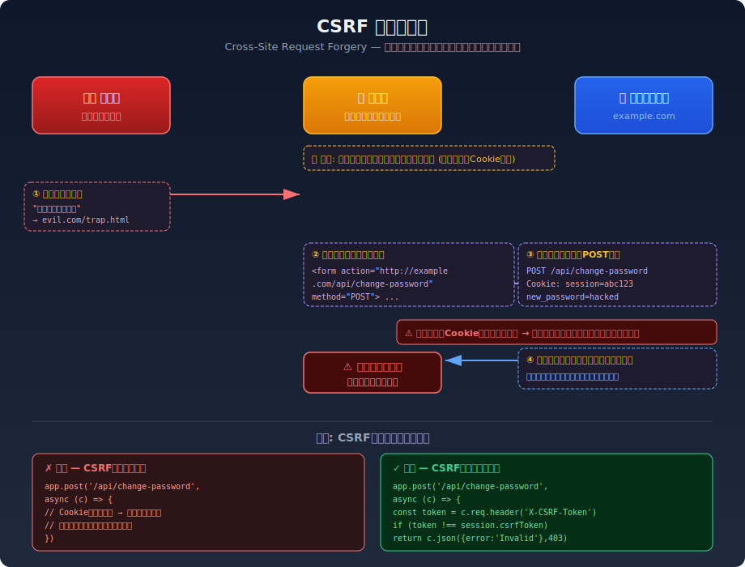

# CSRF (Cross-Site Request Forgery) — クロスサイトリクエストフォージェリ

## 対象ラボ

### 1. CSRF によるパスワード変更

- **概要**: 被害者がログイン中に、攻撃者のページを開くとパスワードが変更される
- **攻撃例**: 攻撃者サイトに `<form action="http://localhost:3000/api/change-password" method="POST">` を設置
- **技術スタック**: Hono API + React (攻撃者ページも用意)
- **難易度**: ★★☆

## 攻撃フロー図

以下の図は、CSRFによるパスワード変更攻撃の流れを示しています。

### フローの説明

1. **攻撃者** が罠ページ（`evil.com/trap.html`）を用意し、被害者にリンクを送る
2. **被害者** がリンクをクリックして罠ページを開く（対象サーバーにはログイン済み）
3. 罠ページ内の `<form>` が自動で対象サーバーへ **POST リクエスト** を送信する
4. ブラウザが **Cookie を自動的に付与** するため、サーバーは正規リクエストと区別できない
5. サーバーがリクエストを処理し、**パスワードが攻撃者の指定値に変更** されてしまう

### なぜ成功するのか

| 要素 | 説明 |
|---|---|
| Cookie の自動送信 | ブラウザは同一ドメインへのリクエストに Cookie を自動付与する |
| Origin の未検証 | サーバーがリクエストの送信元を確認していない |
| トークンなし | リクエストが正規ページから送信されたことを検証する仕組みがない |

### 根本原因と対策

| | 方法 |
|---|---|
| ✗ **脆弱** | Cookie のみで認証 → 外部サイトからのリクエストも受け入れる |
| ✓ **安全** | CSRFトークンをフォームに埋め込み、サーバー側で検証する |

CSRFトークンは攻撃者が事前に知ることができないランダムな値であるため、外部サイトからの不正リクエストを防ぐことができます。

## 実装メモ

- 攻撃者用の別HTMLページ (`frontend/public/attacker/` 等) を用意して、CSRF攻撃を再現する
- CSRFトークンなし (脆弱) → CSRFトークンあり (安全) の比較

## 参考資料

- [OWASP - CSRF](https://owasp.org/www-community/attacks/csrf)
