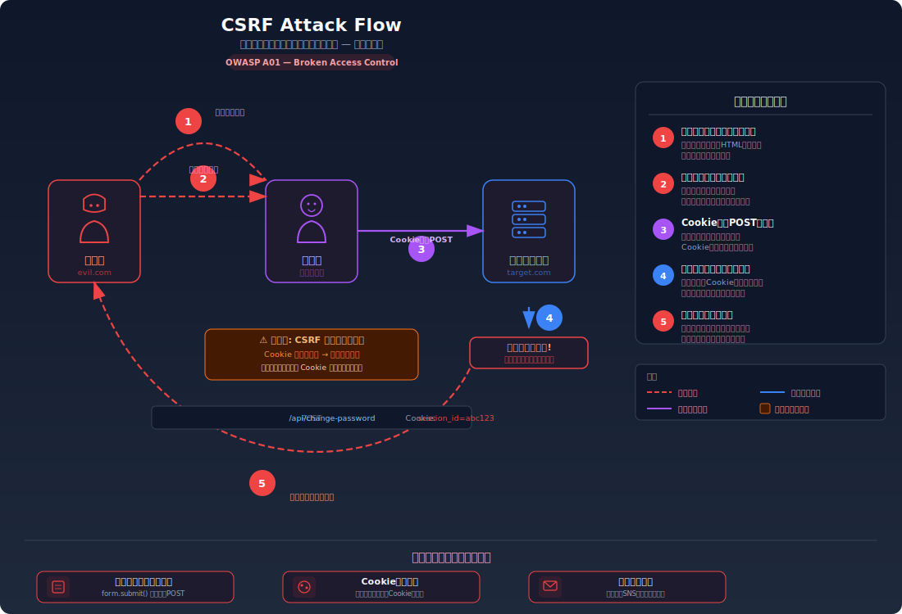
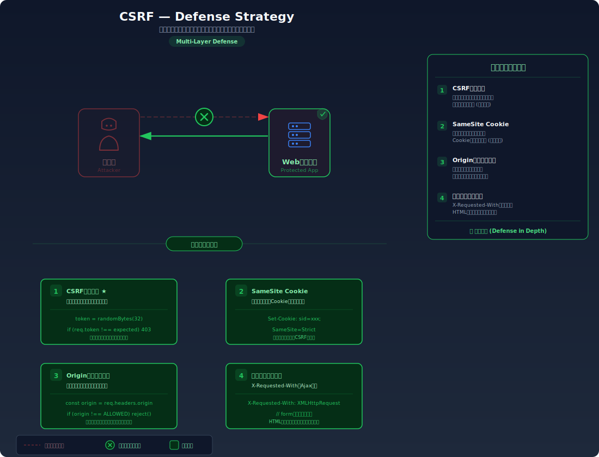

# Cross-Site Request Forgery (CSRF) — 被害者のブラウザを使って勝手にリクエストを送る

> ログイン中のユーザーが攻撃者の用意した罠ページを開くだけで、パスワード変更や送金などの操作が本人の意図なく実行されてしまう脆弱性を学びます。

---

## 対象ラボ

| 項目 | 内容 |
|------|------|
| **概要** | CSRFトークンによるリクエスト検証がなく、外部サイトからのPOSTリクエストでパスワードが変更されてしまう |
| **攻撃例** | 攻撃者サイトに `<form action="http://localhost:3000/api/change-password" method="POST">` を設置し、被害者に踏ませる |
| **技術スタック** | Hono API + React + Cookie ベースセッション |
| **難易度** | ★★☆ 中級 |
| **前提知識** | HTTP リクエストの基本（GET/POST）、Cookie によるセッション管理の仕組み、Same-Origin Policy の概念 |

---

## この脆弱性を理解するための前提

### Cookie ベースのセッション管理の仕組み

Web アプリケーションでは、ログイン後のセッション管理に Cookie を使うのが一般的。流れは以下の通り:

1. ユーザーがログインフォームから認証情報を送信する
2. サーバーがセッション ID を発行し、`Set-Cookie` ヘッダーでブラウザに返す
3. 以降のリクエストで、ブラウザは Cookie を **自動的に** 付与する
4. サーバーは Cookie 内のセッション ID で「誰からのリクエストか」を判別する

```
POST /api/login
→ Set-Cookie: session_id=abc123; Path=/

GET /api/profile
Cookie: session_id=abc123  ← ブラウザが自動付与
→ 200 OK: { "username": "alice" }
```

この仕組みで重要なのは、**ブラウザが Cookie を自動的に送る** という点。ユーザーが意識的に Cookie を付与しているわけではない。

### どこに脆弱性が生まれるのか

問題は、サーバーが「このリクエストは本当に自分のサイト上のフォームから送られたものか」を **検証していない** 場合に発生する。ブラウザは、**どのサイトからリクエストが送信されても**、対象ドメインの Cookie を自動的に付与する。つまり攻撃者のサイト `evil.com` から `target.com` へのリクエストにも、`target.com` の Cookie がそのまま付く。

```typescript
// ⚠️ この部分が問題 — リクエストの送信元を一切検証していない
app.post('/api/change-password', async (c) => {
  const sessionId = getCookie(c, 'session_id');
  const user = sessions.get(sessionId);
  if (!user) return c.json({ error: '未認証' }, 401);

  // Cookie が正しければ無条件にパスワードを変更してしまう
  // → 外部サイトからのリクエストでも Cookie は自動送信されるため、
  //   攻撃者のサイトからでも「正規のリクエスト」と区別できない
  const { newPassword } = await c.req.json();
  await updatePassword(user.id, newPassword);
  return c.json({ message: 'パスワードを変更しました' });
});
```

---

## 攻撃の仕組み



### 攻撃のシナリオ

1. **攻撃者** が罠ページ（`evil.com/trap.html`）を用意する

   罠ページには、対象サイトのパスワード変更 API に対して自動送信されるフォームが仕込まれている。ページを開くだけで JavaScript が自動的にフォームを送信する。

   ```html
   <!-- 攻撃者が用意する罠ページ -->
   <form id="trap" action="http://localhost:3000/api/change-password" method="POST">
     <input type="hidden" name="newPassword" value="hacked123" />
   </form>
   <script>document.getElementById('trap').submit();</script>
   ```

2. **攻撃者** が被害者にリンクを送る（メール、SNS、掲示板投稿等）

   被害者が対象サイトにログイン中であることが前提。リンクの見た目を偽装したり、画像タグに仕込んだりする手法もある。

3. **被害者** がリンクをクリックして罠ページを開く

   被害者のブラウザが罠ページを読み込むと、隠しフォームが自動送信される。このとき、**ブラウザは対象サイト（localhost:3000）の Cookie を自動的に付与する**。

   ```
   POST /api/change-password HTTP/1.1
   Host: localhost:3000
   Cookie: session_id=abc123    ← 被害者のセッション Cookie が自動付与
   Content-Type: application/x-www-form-urlencoded

   newPassword=hacked123
   ```

4. **サーバー** が正規のリクエストとして処理する

   サーバーから見ると、正しいセッション Cookie が付いた正常なパスワード変更リクエストにしか見えない。リクエストが自サイトのフォームから送られたのか、外部の罠ページから送られたのかを区別する手段がないため、パスワードが `hacked123` に変更されてしまう。

5. **攻撃者** が変更後のパスワードでログインし、アカウントを乗っ取る

   被害者はパスワードが変更されたことに気づかない。次回ログインしようとしたときに初めて異変に気づくが、すでにアカウントは攻撃者の支配下にある。

### なぜ成功するのか

| 条件 | 説明 |
|------|------|
| Cookie の自動送信 | ブラウザは Same-Origin かどうかに関係なく、対象ドメインへのリクエストに Cookie を自動付与する。SameSite 属性が未設定の場合、クロスサイトリクエストにも Cookie が送られる |
| リクエスト送信元の未検証 | サーバーが `Origin` / `Referer` ヘッダーを確認しておらず、CSRF トークンも使っていないため、リクエストが自サイトからのものか外部からのものか判別できない |
| トークンによる検証がない | 正規のフォームだけが持つ秘密の値（CSRF トークン）がリクエストに含まれていないため、攻撃者が同一のリクエストを容易に再現できる |

### 被害の範囲

- **機密性**: 攻撃者がパスワードを変更してアカウントを乗っ取ることで、個人情報やプライベートなデータに不正アクセスできる
- **完全性**: 被害者になりすまして投稿の編集・削除、プロフィール変更、送金操作など、あらゆる状態変更操作が実行可能
- **可用性**: パスワード変更やアカウント削除により、正規ユーザーがサービスを利用できなくなる

---

## 対策



### 根本原因

サーバーが「リクエストが自サイトの正規のフォームから送られたものか」を **検証する手段を持っていない** ことが根本原因。Cookie はリクエストの送信元に関係なく自動送信されるため、Cookie だけではリクエストの正当性を保証できない。

### 安全な実装

CSRF トークンを使った対策では、サーバーがリクエストごとに予測不可能なランダムトークンを生成し、正規のフォームに埋め込む。サーバーはリクエスト受信時にトークンの一致を検証する。

攻撃者は被害者のブラウザからリクエストを送信させることはできるが、**CSRF トークンの値を事前に知ることはできない**。トークンは HTML のフォームに埋め込まれており、Same-Origin Policy により外部サイトからはページの内容を読み取れないためである。

```typescript
// ✅ CSRF トークンでリクエストの正当性を検証
import { randomBytes } from 'crypto';

// セッション作成時にCSRFトークンも生成
app.get('/api/csrf-token', (c) => {
  const sessionId = getCookie(c, 'session_id');
  const token = randomBytes(32).toString('hex');
  csrfTokens.set(sessionId, token);
  return c.json({ token });
});

app.post('/api/change-password', async (c) => {
  const sessionId = getCookie(c, 'session_id');
  const user = sessions.get(sessionId);
  if (!user) return c.json({ error: '未認証' }, 401);

  // CSRF トークンを検証 — 正規フォームから送信されたことを確認
  const { newPassword, csrfToken } = await c.req.json();
  const expectedToken = csrfTokens.get(sessionId);
  if (!csrfToken || csrfToken !== expectedToken) {
    return c.json({ error: '不正なリクエストです' }, 403);
  }

  await updatePassword(user.id, newPassword);
  return c.json({ message: 'パスワードを変更しました' });
});
```

#### 脆弱 vs 安全: コード比較

```diff
  app.post('/api/change-password', async (c) => {
    const sessionId = getCookie(c, 'session_id');
    const user = sessions.get(sessionId);
    if (!user) return c.json({ error: '未認証' }, 401);

-   // Cookie が正しければ無条件に処理
-   const { newPassword } = await c.req.json();
+   // CSRF トークンを検証してからのみ処理
+   const { newPassword, csrfToken } = await c.req.json();
+   const expectedToken = csrfTokens.get(sessionId);
+   if (!csrfToken || csrfToken !== expectedToken) {
+     return c.json({ error: '不正なリクエストです' }, 403);
+   }

    await updatePassword(user.id, newPassword);
    return c.json({ message: 'パスワードを変更しました' });
  });
```

脆弱なコードでは Cookie の存在だけでリクエストを信頼するため、外部サイトからの自動送信も受け入れてしまう。安全なコードでは CSRF トークンの一致を必須としており、トークンを知らない攻撃者は有効なリクエストを組み立てられない。

### その他の防御策

| 対策 | 種類 | 説明 |
|------|------|------|
| CSRF トークン (Synchronizer Token Pattern) | 根本対策 | リクエストごとにサーバーが生成したトークンを検証する。最も確実な対策 |
| SameSite Cookie 属性 | 根本対策 | `SameSite=Strict` または `Lax` を設定すると、クロスサイトリクエストに Cookie が付与されなくなる。モダンブラウザでは `Lax` がデフォルト |
| Origin / Referer ヘッダーの検証 | 多層防御 | リクエストの送信元ドメインを確認する。ヘッダーが省略される場合があるため単独では不十分 |
| カスタムヘッダーの要求 | 多層防御 | `X-Requested-With` 等のカスタムヘッダーを必須にする。フォーム送信ではカスタムヘッダーを付与できないため、CSRF を防止できる |
| 重要操作での再認証 | 多層防御 | パスワード変更や送金などの重要操作時に、現在のパスワードの再入力を求める |

---

## ハンズオン手順

### Step 1: 脆弱バージョンで攻撃を体験

**ゴール**: 罠ページを経由して、被害者のパスワードが攻撃者の指定した値に変更されることを確認する

1. 開発サーバーを起動する

   ```bash
   cd backend && pnpm dev
   ```

2. ブラウザで `http://localhost:5173` にアクセスし、テストユーザーでログインする

3. 別タブで攻撃者の罠ページ（`http://localhost:5173/attacker/csrf-trap.html`）を開く

   ```html
   <!-- この罠ページが自動的にパスワード変更リクエストを送信する -->
   <form id="trap" action="http://localhost:3000/api/labs/csrf/vulnerable/change-password" method="POST">
     <input type="hidden" name="newPassword" value="hacked123" />
   </form>
   <script>document.getElementById('trap').submit();</script>
   ```

4. 結果を確認する

   - パスワードが `hacked123` に変更されている
   - 被害者は罠ページを開いただけで、パスワード変更フォームに触れていない
   - DevTools の Network タブで、Cookie が自動的に付与されたリクエストを確認できる
   - **この結果が意味すること**: Cookie は送信元サイトに関係なく自動付与されるため、サーバーは「誰が送ったか」は分かっても「どこから送られたか」は分からない

### Step 2: 安全バージョンで防御を確認

**ゴール**: 同じ攻撃が CSRF トークン検証により失敗することを確認する

1. 安全なエンドポイントに対して同じ罠ページで攻撃を試みる

   ```bash
   # CSRF トークンなしでパスワード変更を試行
   curl -X POST http://localhost:3000/api/labs/csrf/secure/change-password \
     -H "Content-Type: application/json" \
     -b "session_id=valid-session" \
     -d '{"newPassword": "hacked123"}'
   ```

2. 結果を確認する

   - `403 Forbidden` が返され、「不正なリクエストです」とエラーになる
   - CSRF トークンが含まれていないため、サーバーがリクエストを拒否している

3. 正規のフォームからは変更が成功することを確認する

   - 正規ページでは CSRF トークンが自動的にフォームに埋め込まれている
   - CSRF トークン付きのリクエストは正常に処理される

4. コードの差分を確認する

   - `backend/src/labs/step04-session/csrf.ts` の脆弱版と安全版を比較
   - **どの行が違いを生んでいるか** に注目: CSRF トークンの生成・埋め込み・検証

### 確認ポイント

以下を自分の言葉で説明できれば、このラボは完了です:

- [ ] CSRF 攻撃が成立するための条件は何か（3つの条件を挙げられるか）
- [ ] 罠ページから送信されたリクエストに、なぜ被害者の Cookie が付くのか
- [ ] CSRF トークンは「なぜ」この攻撃を無効化するのか（攻撃者がトークンを取得できない理由を説明できるか）
- [ ] `SameSite=Lax` が設定されている場合、CSRF 攻撃の成立条件はどう変わるか

---

## 実装メモ

| 項目 | パス |
|------|------|
| 脆弱エンドポイント | `/api/labs/csrf/vulnerable/change-password` |
| 安全エンドポイント | `/api/labs/csrf/secure/change-password` |
| バックエンド | `backend/src/labs/step04-session/csrf.ts` |
| フロントエンド | `frontend/src/features/step04-session/pages/CSRF.tsx` |
| 攻撃者用罠ページ | `frontend/public/attacker/csrf-trap.html` |

- 脆弱版では Cookie のみで認証し、CSRF トークンを検証しない
- 安全版では CSRF トークンをセッションに紐づけて生成し、リクエスト時に検証する
- 攻撃者用の別 HTML ページを用意し、フォーム自動送信で CSRF 攻撃を再現する
- `SameSite` Cookie 属性の効果も合わせて確認できるようにする

---

## 現実世界での事例

| 年 | インシデント | 概要 |
|----|-------------|------|
| 2008 | Netflix | CSRF 脆弱性により、ユーザーのアカウント情報（メールアドレス、住所等）を攻撃者が変更可能だった |
| 2012 | YouTube | CSRF により、攻撃者が被害者のアカウントで動画の「いいね」やプレイリスト追加などの操作を実行できた |
| 2019 | Facebook | CSRF 脆弱性を利用してアカウント乗っ取りが可能であることが発見され、バグバウンティで報告された |

---

## 関連ラボ

| ラボ | 関連性 |
|------|--------|
| [Cookie 操作](./cookie-manipulation.md) | `SameSite` 属性が未設定の Cookie は CSRF 攻撃のクロスサイトリクエストでも送信されるため、CSRF の成立条件に直結する |
| [セッションハイジャック](./session-hijacking.md) | CSRF がセッションの「悪用」であるのに対し、セッションハイジャックはセッションの「窃取」。どちらも Cookie ベースのセッション管理の弱点を突く |
| [XSS (Stored XSS)](../step02-injection/xss.md) | XSS が成立する場合、攻撃者は JavaScript で CSRF トークンを読み取れるため、CSRF 対策がバイパスされる |

---

## 参考資料

- [OWASP - Cross-Site Request Forgery (CSRF)](https://owasp.org/www-community/attacks/csrf)
- [CWE-352: Cross-Site Request Forgery (CSRF)](https://cwe.mitre.org/data/definitions/352.html)
