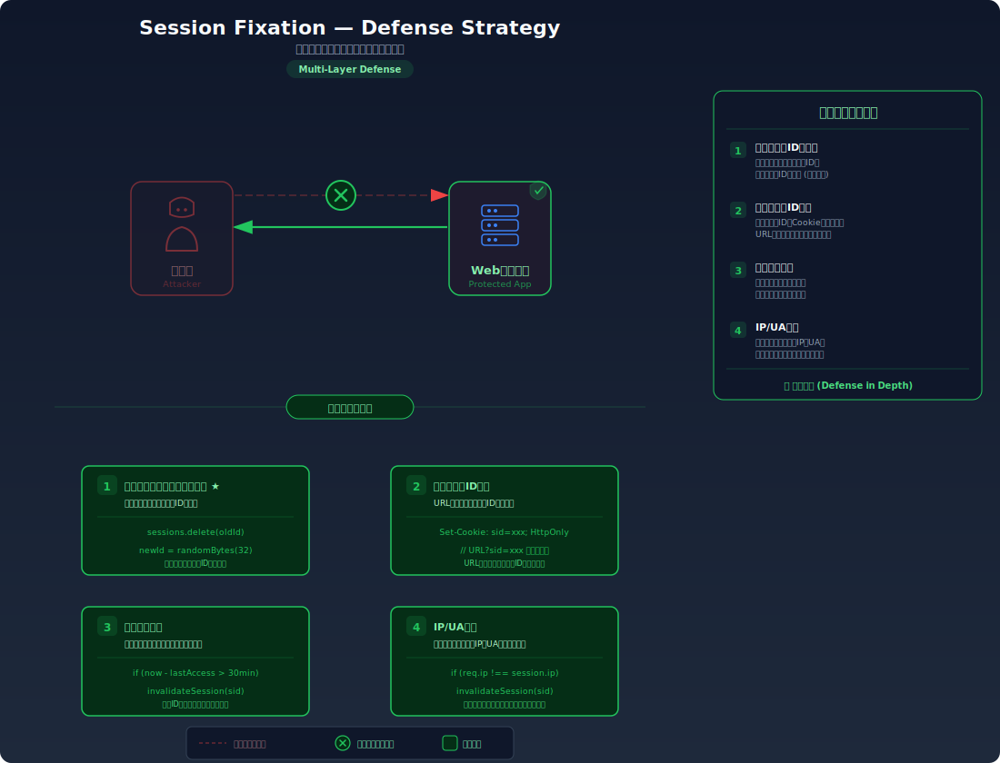

# Session Fixation — 攻撃者が仕込んだセッションIDで被害者をログインさせる

> 攻撃者があらかじめ用意したセッションIDを被害者に使わせることで、被害者がログインした瞬間にそのセッションを乗っ取ってしまう攻撃を学びます。

---

## 対象ラボ

| 項目 | 内容 |
|------|------|
| **概要** | ログイン時にセッション ID が再生成されず、攻撃者が事前に指定したセッション ID のまま認証が成立してしまう |
| **攻撃例** | `http://target.com/login?session_id=attacker-known-id` を被害者に踏ませ、被害者がログインすると攻撃者が同じセッション ID でアクセス可能になる |
| **技術スタック** | Hono API + Cookie ベースセッション |
| **難易度** | ★★☆ 中級 |
| **前提知識** | HTTP Cookie の基本、セッション管理の仕組み（セッション ID の発行と検証） |

---

## この脆弱性を理解するための前提

### セッション ID のライフサイクル

Cookie ベースのセッション管理では、セッション ID は以下のライフサイクルで管理される:

1. ユーザーがサイトにアクセスすると、サーバーがセッション ID を発行する
2. ユーザーがログインすると、そのセッション ID に認証情報が紐づく
3. 以降のリクエストでは、Cookie のセッション ID で認証済みユーザーを特定する
4. ログアウト時にセッション ID を無効化する

```
GET /login (未認証)
→ Set-Cookie: session_id=random123

POST /login (username=alice, password=...)
→ session_id=random123 に alice の認証情報を紐づけ

GET /profile
Cookie: session_id=random123
→ 200 OK: alice のプロフィール
```

正常な実装では、ログイン成功時にセッション ID が **新しい値に再生成** される。これにより、ログイン前に使われていた古いセッション ID は無効になる。

### どこに脆弱性が生まれるのか

問題は、ログイン成功時にセッション ID を再生成せず、**ログイン前のセッション ID をそのまま使い続ける** 場合に発生する。さらに、外部から指定されたセッション ID を受け入れてしまう実装であれば、攻撃者が自分の知っているセッション ID を被害者に使わせることが可能になる。

```typescript
// ⚠️ この部分が問題 — ログイン後もセッションIDを再生成していない
app.post('/login', async (c) => {
  const { username, password } = await c.req.json();
  const user = await authenticate(username, password);
  if (!user) return c.json({ error: '認証失敗' }, 401);

  // 既存のセッションIDをそのまま使用
  // → 攻撃者が事前に設定したセッションIDが認証済みになってしまう
  const sessionId = getCookie(c, 'session_id');
  sessions.set(sessionId, { userId: user.id, username: user.username });
  return c.json({ message: 'ログイン成功' });
});
```

---

## 攻撃の仕組み


### 攻撃のシナリオ

1. **攻撃者** がターゲットのサイトにアクセスし、セッション ID を取得する（または任意のセッション ID を生成する）

   サーバーが URL パラメータやリクエストヘッダーからセッション ID を受け入れる場合、攻撃者は自分で決めた値をセッション ID として使える。

   ```
   GET /login
   → Set-Cookie: session_id=attacker-known-id
   ```

2. **攻撃者** がこのセッション ID を含む URL を被害者に送る

   メール、SNS、掲示板等で「パスワードリセットが必要です」のようなフィッシングメッセージとともにリンクを送る。

   ```
   http://target.com/login?session_id=attacker-known-id
   ```

3. **被害者** がリンクをクリックし、ログインページでログインする

   被害者のブラウザには攻撃者が指定したセッション ID がセットされる。被害者が正しいユーザー名とパスワードでログインすると、**サーバーはこのセッション ID に認証情報を紐づける**。

   ```
   POST /login
   Cookie: session_id=attacker-known-id
   { "username": "alice", "password": "correct-password" }

   → サーバーが attacker-known-id に alice の認証情報を紐づけ
   ```

4. **攻撃者** が同じセッション ID でアクセスし、被害者のアカウントを使う

   攻撃者はセッション ID `attacker-known-id` を知っているため、それを Cookie にセットしてリクエストを送るだけで、alice としてログイン済みの状態でサイトにアクセスできる。

   ```bash
   curl http://target.com/api/profile \
     -b "session_id=attacker-known-id"
   # → { "username": "alice", "email": "alice@example.com" }
   ```

### なぜ成功するのか

| 条件 | 説明 |
|------|------|
| ログイン時にセッション ID が再生成されない | ログイン前後で同じセッション ID が使い続けられるため、ログイン前にセッション ID を知っていた攻撃者がログイン後もアクセスできる |
| 外部からのセッション ID 指定を受け入れる | URL パラメータや Cookie 経由で任意のセッション ID をセットできるため、攻撃者が自分の知っている値を被害者のブラウザに注入できる |
| セッション ID の出所を検証しない | サーバーがセッション ID の発行元を追跡しておらず、自分が発行したものか外部から注入されたものかを区別できない |

### 被害の範囲

- **機密性**: 攻撃者が被害者のアカウントで個人情報、メッセージ、取引履歴等にアクセスできる
- **完全性**: 被害者のアカウントでデータの変更・削除、設定の変更、投稿の編集が可能
- **可用性**: 攻撃者がパスワードを変更すると、被害者がアカウントにアクセスできなくなる

---

## 対策



### 根本原因

ログイン成功時にセッション ID を **再生成しない** ことが根本原因。ログイン前後で同じセッション ID を使い続けるため、ログイン前にセッション ID を知っていた第三者が、ログイン後もそのセッション ID で認証済みアクセスを得られてしまう。

### 安全な実装

ログイン成功時に必ず新しいセッション ID を生成し、古いセッション ID を無効化する。これにより、攻撃者がログイン前にセッション ID を知っていたとしても、ログイン後にはその値は無効になるため使えない。

```typescript
// ✅ ログイン成功時にセッションIDを再生成
import { randomBytes } from 'crypto';

app.post('/login', async (c) => {
  const { username, password } = await c.req.json();
  const user = await authenticate(username, password);
  if (!user) return c.json({ error: '認証失敗' }, 401);

  // 古いセッションIDを無効化
  const oldSessionId = getCookie(c, 'session_id');
  if (oldSessionId) sessions.delete(oldSessionId);

  // 新しいセッションIDを生成して認証情報を紐づけ
  const newSessionId = randomBytes(32).toString('hex');
  sessions.set(newSessionId, { userId: user.id, username: user.username });
  setCookie(c, 'session_id', newSessionId, {
    httpOnly: true,
    secure: true,
    sameSite: 'Strict',
    path: '/',
  });

  return c.json({ message: 'ログイン成功' });
});
```

#### 脆弱 vs 安全: コード比較

```diff
  app.post('/login', async (c) => {
    const { username, password } = await c.req.json();
    const user = await authenticate(username, password);
    if (!user) return c.json({ error: '認証失敗' }, 401);

-   // 既存のセッションIDをそのまま使用
-   const sessionId = getCookie(c, 'session_id');
-   sessions.set(sessionId, { userId: user.id, username: user.username });
+   // 古いセッションIDを無効化し、新しいIDを生成
+   const oldSessionId = getCookie(c, 'session_id');
+   if (oldSessionId) sessions.delete(oldSessionId);
+   const newSessionId = randomBytes(32).toString('hex');
+   sessions.set(newSessionId, { userId: user.id, username: user.username });
+   setCookie(c, 'session_id', newSessionId, {
+     httpOnly: true, secure: true, sameSite: 'Strict', path: '/',
+   });

    return c.json({ message: 'ログイン成功' });
  });
```

脆弱なコードではログイン前のセッション ID がそのまま認証済みになるため、その値を知っていた攻撃者がアクセスできる。安全なコードではログイン時に新しいセッション ID が発行されるため、古い ID を知っていても無意味になる。

### その他の防御策

| 対策 | 種類 | 説明 |
|------|------|------|
| ログイン時のセッション ID 再生成 | 根本対策 | ログイン成功時に新しいセッション ID を発行し、古いセッション ID を破棄する。最も効果的で必須の対策 |
| URL パラメータからのセッション ID 受け入れ拒否 | 根本対策 | セッション ID は Cookie のみで管理し、URL パラメータやフォームデータからの指定を受け入れない |
| Cookie 属性の適切な設定 | 多層防御 | `HttpOnly`、`Secure`、`SameSite=Strict` を設定し、セッション Cookie の漏洩・注入経路を制限する |
| セッションの有効期限設定 | 多層防御 | セッションに適切なタイムアウトを設定し、長時間放置されたセッションを自動無効化する |
| セッション ID とクライアント情報の紐づけ | 検知 | セッション ID を IP アドレスや User-Agent と紐づけ、異なる環境からのアクセスを検知する |

---

## ハンズオン手順

### Step 1: 脆弱バージョンで攻撃を体験

**ゴール**: 攻撃者が指定したセッション ID で被害者がログインすると、攻撃者が同じ ID でアクセスできることを確認する

1. 開発サーバーを起動する

   ```bash
   cd backend && pnpm dev
   ```

2. 攻撃者としてセッション ID を準備する

   ```bash
   # 攻撃者が知っているセッションIDを設定して被害者にURLを送る想定
   curl -v http://localhost:3000/api/labs/session-fixation/vulnerable/login-page \
     -b "session_id=attacker-fixed-session"
   ```

3. 被害者としてそのセッション ID でログインする

   ```bash
   # 被害者が攻撃者の指定したセッションIDでログイン
   curl -X POST http://localhost:3000/api/labs/session-fixation/vulnerable/login \
     -H "Content-Type: application/json" \
     -b "session_id=attacker-fixed-session" \
     -d '{"username": "alice", "password": "alice123"}'
   ```

4. 攻撃者が同じセッション ID でアクセスする

   ```bash
   # 攻撃者が同じセッションIDで被害者のプロフィールにアクセス
   curl http://localhost:3000/api/labs/session-fixation/vulnerable/profile \
     -b "session_id=attacker-fixed-session"
   ```

5. 結果を確認する

   - 攻撃者が alice のプロフィール情報を取得できる
   - セッション ID はログイン前後で変わっていない
   - **この結果が意味すること**: ログイン前にセッション ID を知っていた攻撃者が、被害者のログイン後にそのセッションを利用できてしまう

### Step 2: 安全バージョンで防御を確認

**ゴール**: 同じ攻撃がセッション ID の再生成により失敗することを確認する

1. 安全なエンドポイントで同じ手順を試みる

   ```bash
   # 被害者が攻撃者の指定したセッションIDでログイン（安全版）
   curl -v -X POST http://localhost:3000/api/labs/session-fixation/secure/login \
     -H "Content-Type: application/json" \
     -b "session_id=attacker-fixed-session" \
     -d '{"username": "alice", "password": "alice123"}'
   ```

2. レスポンスの `Set-Cookie` ヘッダーを確認する

   - 新しいセッション ID が発行されている（`attacker-fixed-session` とは異なる値）
   - 古いセッション ID は無効化されている

3. 攻撃者が古いセッション ID でアクセスを試みる

   ```bash
   # 攻撃者が元のセッションIDでアクセスを試みる → 失敗する
   curl http://localhost:3000/api/labs/session-fixation/secure/profile \
     -b "session_id=attacker-fixed-session"
   ```

4. コードの差分を確認する

   - `backend/src/labs/step04-session/session-fixation.ts` の脆弱版と安全版を比較
   - **どの行が違いを生んでいるか** に注目: ログイン時の `randomBytes()` による新 ID 生成と古い ID の `delete()`

### 確認ポイント

以下を自分の言葉で説明できれば、このラボは完了です:

- [ ] セッション固定攻撃が成立するための条件は何か（セッション ID の再生成がない + 外部からの ID 注入が可能）
- [ ] 攻撃者はどのようにして被害者のブラウザにセッション ID を注入するのか
- [ ] セッション ID の再生成は「なぜ」この攻撃を無効化するのか（古い ID と新しい ID の関係を説明できるか）
- [ ] セッション固定とセッションハイジャックの違いは何か

---

## 実装メモ

| 項目 | パス |
|------|------|
| 脆弱エンドポイント | `/api/labs/session-fixation/vulnerable/login` |
| 安全エンドポイント | `/api/labs/session-fixation/secure/login` |
| バックエンド | `backend/src/labs/step04-session/session-fixation.ts` |
| フロントエンド | `frontend/src/features/step04-session/pages/SessionFixation.tsx` |
| DB | `docker/db/init.sql` の `users` テーブルを使用 |

- 脆弱版ではログイン成功時にセッション ID を再生成しない
- 安全版ではログイン成功時に `crypto.randomBytes()` で新しいセッション ID を生成し、古い ID を `sessions.delete()` で破棄する
- セッション管理はインメモリの `Map` で実装（学習目的）

---

## 現実世界での事例

| 年 | インシデント | 概要 |
|----|-------------|------|
| 2002 | 複数の Web フレームワーク | 初期の PHP、JSP アプリケーションの多くがセッション固定に脆弱で、URL にセッション ID を含む実装（`JSESSIONID`、`PHPSESSID`）が標的にされた |
| 2013 | 複数の CMS プラットフォーム | WordPress、Joomla 等のプラグインでセッション固定脆弱性が報告され、管理者アカウントの乗っ取りが可能だった |

---

## 関連ラボ

| ラボ | 関連性 |
|------|--------|
| [セッションハイジャック](./session-hijacking.md) | セッション固定が「攻撃者の知っている ID を被害者に使わせる」のに対し、ハイジャックは「被害者の ID を攻撃者が盗む」。攻撃のアプローチは逆だが、セッション ID の乗っ取りという結果は同じ |
| [Cookie 操作](./cookie-manipulation.md) | Cookie 属性（`HttpOnly`、`Secure`、`SameSite`）が適切に設定されていないと、セッション ID の注入・漏洩の経路が広がる |
| [CSRF](./csrf.md) | セッション固定で乗っ取ったセッションを使ってCSRF的な操作を行うことが可能。セッション管理の堅牢性が両方の対策に重要 |

---

## 参考資料

- [OWASP - Session Fixation](https://owasp.org/www-community/attacks/Session_fixation)
- [CWE-384: Session Fixation](https://cwe.mitre.org/data/definitions/384.html)
