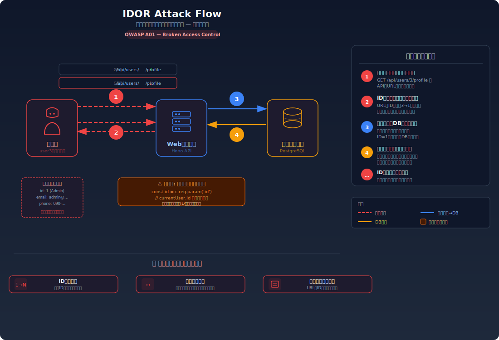
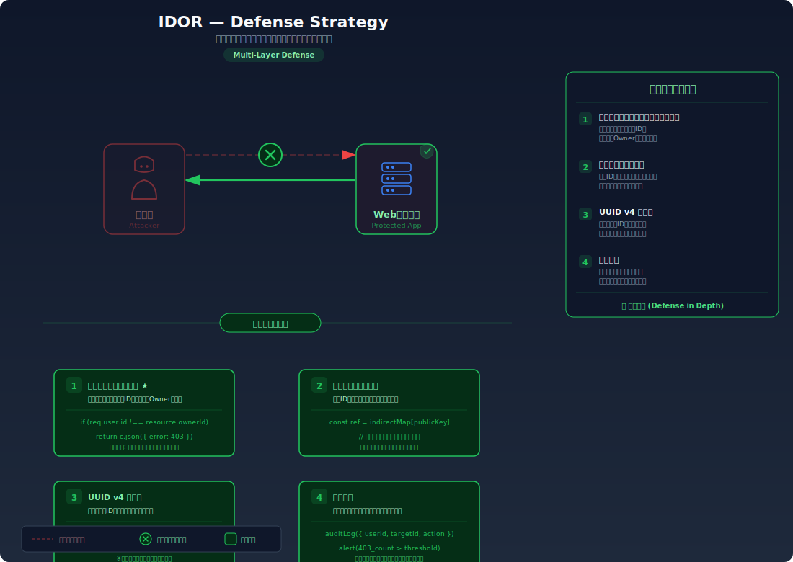

# IDOR (Insecure Direct Object Reference) — IDを書き換えるだけで他人のデータが見える

> URLやリクエストに含まれるユーザーIDやリソースIDを別の値に変えるだけで、本来アクセスできないはずの他人のデータを閲覧・変更できてしまう脆弱性を学びます。

---

## 対象ラボ

| 項目 | 内容 |
|------|------|
| **概要** | APIがリクエスト中のリソースIDをそのまま信頼し、「このリソースにアクセスする権限があるか」を検証しないため、IDを書き換えるだけで他ユーザーのデータにアクセスできる |
| **攻撃例** | `/api/users/1/profile` → `/api/users/2/profile` にIDを書き換えるだけでアクセス可能 |
| **技術スタック** | Hono API + PostgreSQL |
| **難易度** | ★☆☆ 入門 |
| **前提知識** | HTTPリクエストの基本（GET/POST）、REST APIのURL設計、認証と認可の違い |

---

## この脆弱性を理解するための前提

### REST API におけるリソースアクセスの仕組み

REST API では、リソースをURLのパスパラメータやクエリパラメータで識別するのが一般的。例えばユーザープロフィールを取得する場合:

1. クライアントが `GET /api/users/1/profile` をリクエスト
2. サーバーがパスパラメータ `1` からユーザーIDを取得
3. データベースから該当ユーザーのプロフィールを取得して返す

```
GET /api/users/1/profile
Cookie: session_id=abc123
→ 200 OK: { "id": 1, "name": "Alice", "email": "alice@example.com" }
```

このとき、サーバーは Cookie のセッション ID で「誰がリクエストしたか（認証）」を確認している。しかし「リクエストしたユーザーが、ID=1 のプロフィールにアクセスする権限があるか（認可）」は別の問題である。

### どこに脆弱性が生まれるのか

問題は、サーバーが **認証（誰か）** は確認しても **認可（何にアクセスしてよいか）** を検証しない場合に発生する。開発者は「ログイン済みのユーザーは自分のIDしかリクエストしないだろう」と暗黙的に仮定してしまうが、攻撃者はURLのIDを自由に書き換えてリクエストできる。

```typescript
// ⚠️ この部分が問題 — リクエストしたユーザーがこのリソースにアクセスする権限があるか検証していない
app.get('/api/users/:id/profile', async (c) => {
  const sessionId = getCookie(c, 'session_id');
  const currentUser = sessions.get(sessionId);
  if (!currentUser) return c.json({ error: '未認証' }, 401);

  // パスパラメータのIDをそのまま信頼してDBから取得
  // → ログイン済みであれば誰のIDでも指定できてしまう
  const targetId = c.req.param('id');
  const profile = await pool.query('SELECT * FROM users WHERE id = $1', [targetId]);
  return c.json(profile.rows[0]);
});
```

ここで `currentUser.id` が `1` であっても、URLに `/api/users/2/profile` を指定すれば、ID=2 のユーザーのプロフィールがそのまま返される。

---

## 攻撃の仕組み



### 攻撃のシナリオ

1. **攻撃者** が正規のユーザーとしてログインし、自分のプロフィールページにアクセスする

   DevTools の Network タブや URL バーで、プロフィール取得のリクエストが `GET /api/users/3/profile` のような形式であることを確認する。`3` は攻撃者自身のユーザーID。

2. **攻撃者** がURLのIDを `1` や `2` に書き換えてリクエストを送信する

   ```
   GET /api/users/1/profile
   Cookie: session_id=attacker-session
   ```

   IDは連番であることが多いため、1から順にインクリメントするだけで全ユーザーのデータを列挙できる。

3. **サーバー** が認可チェックなしでデータを返す

   サーバーは Cookie で攻撃者が「ログイン済み」であることだけを確認し、パスパラメータのIDが攻撃者自身のものかどうかは検証しない。結果として他ユーザーのプロフィール情報がそのまま返される:

   ```json
   {
     "id": 1,
     "name": "Admin User",
     "email": "admin@example.com",
     "phone": "090-1234-5678",
     "address": "東京都..."
   }
   ```

4. **攻撃者** がIDを連番で繰り返し、全ユーザーのデータを収集する

   自動化スクリプトでIDを1から順に試行すれば、全ユーザーの個人情報を短時間で取得できる。同様の手法でデータの変更（PUT/DELETE）も可能な場合がある。

### なぜ成功するのか

| 条件 | 説明 |
|------|------|
| 認可チェックの欠如 | サーバーが「ログイン済みか」だけを検証し、「このユーザーがこのリソースにアクセスしてよいか」を検証していない。認証と認可を混同している |
| 予測可能なリソースID | 連番の整数IDは推測が容易。攻撃者は1から順にIDを試すだけで全リソースを列挙できる |
| クライアント側のIDに依存 | サーバーがリクエスト中のIDをそのまま信頼し、セッション情報と照合していない |

### 被害の範囲

- **機密性**: 全ユーザーの個人情報（名前、メールアドレス、電話番号、住所等）が取得される。プロフィールだけでなく、注文履歴やメッセージなど関連データも同じパターンで漏洩しうる
- **完全性**: PUT/PATCH/DELETE エンドポイントにも同じ脆弱性がある場合、他ユーザーのデータを改ざん・削除できる。例えばメールアドレスを攻撃者のものに変更し、パスワードリセットでアカウントを乗っ取る
- **可用性**: 大量のデータ削除リクエストにより、他ユーザーのデータが失われる可能性がある

---

## 対策



### 根本原因

サーバーが **リクエスト中のリソースIDを無条件に信頼** し、「リクエスト元のユーザーがそのリソースの所有者（または適切な権限を持つユーザー）であるか」を検証していないことが根本原因。認証（Authentication: 誰か）と認可（Authorization: 何を許可するか）は別の概念であり、認証だけでは不十分。

### 安全な実装

リソースへのアクセス時に、セッションから取得した現在のユーザーIDとリクエストされたリソースの所有者を照合する。これにより、ユーザーが自分のリソースにのみアクセスできることが保証される。

```typescript
// ✅ 認可チェック — リクエスト元ユーザーがリソースの所有者であることを検証
app.get('/api/users/:id/profile', async (c) => {
  const sessionId = getCookie(c, 'session_id');
  const currentUser = sessions.get(sessionId);
  if (!currentUser) return c.json({ error: '未認証' }, 401);

  const targetId = Number(c.req.param('id'));

  // セッションのユーザーIDとリクエストされたIDを照合
  if (currentUser.id !== targetId) {
    return c.json({ error: 'アクセス権限がありません' }, 403);
  }

  const profile = await pool.query('SELECT * FROM users WHERE id = $1', [targetId]);
  return c.json(profile.rows[0]);
});
```

あるいは、パスパラメータのIDを使わず、セッションから直接ユーザーIDを取得する設計にすることで、そもそもIDの書き換えを不可能にする:

```typescript
// ✅ より安全 — URLにIDを含めず、セッションから取得
app.get('/api/profile', async (c) => {
  const sessionId = getCookie(c, 'session_id');
  const currentUser = sessions.get(sessionId);
  if (!currentUser) return c.json({ error: '未認証' }, 401);

  // セッションから取得したIDのみを使用 — クライアントがIDを操作する余地がない
  const profile = await pool.query('SELECT * FROM users WHERE id = $1', [currentUser.id]);
  return c.json(profile.rows[0]);
});
```

#### 脆弱 vs 安全: コード比較

```diff
  app.get('/api/users/:id/profile', async (c) => {
    const sessionId = getCookie(c, 'session_id');
    const currentUser = sessions.get(sessionId);
    if (!currentUser) return c.json({ error: '未認証' }, 401);

    const targetId = Number(c.req.param('id'));
+   // 認可チェック: 自分自身のデータにのみアクセス可能
+   if (currentUser.id !== targetId) {
+     return c.json({ error: 'アクセス権限がありません' }, 403);
+   }
    const profile = await pool.query('SELECT * FROM users WHERE id = $1', [targetId]);
    return c.json(profile.rows[0]);
  });
```

脆弱なコードではパスパラメータのIDをそのまま使用するため、任意のユーザーのデータにアクセスできる。安全なコードではセッションのユーザーIDとの照合を行い、一致しない場合は 403 を返す。

### その他の防御策

| 対策 | 種類 | 説明 |
|------|------|------|
| サーバーサイドの認可チェック | 根本対策 | リソースアクセス時に、リクエスト元ユーザーの権限を必ず検証する。これが最も効果的で必須の対策 |
| 推測困難なID (UUID) | 多層防御 | 連番の整数IDの代わりに UUID v4 を使用する。列挙攻撃を困難にするが、根本対策ではない（UUIDが漏洩すれば同じ問題が起きる） |
| セッションベースのデータ取得 | 根本対策 | URLにリソースIDを含めず、セッションから現在のユーザーIDを取得してデータを引く設計にする |
| レートリミット | 検知 | 短時間に大量のリソースアクセスを検知・ブロックする。IDの列挙攻撃を遅延させる |
| アクセスログの監視 | 検知 | 異常なパターン（1ユーザーが大量の異なるIDにアクセス）をアラートで検知する |

---

## ハンズオン手順

### Step 1: 脆弱バージョンで攻撃を体験

**ゴール**: 他ユーザーのプロフィール情報を、IDを書き換えるだけで取得できることを確認する

1. 開発サーバーを起動する

   ```bash
   cd backend && pnpm dev
   ```

2. テストユーザー（ID=3）としてログインし、自分のプロフィールを取得する

   ```bash
   # まずログインしてセッションを取得
   curl -X POST http://localhost:3000/api/labs/idor/vulnerable/login \
     -H "Content-Type: application/json" \
     -d '{"username": "user3", "password": "password3"}' \
     -c cookies.txt

   # 自分のプロフィールを確認
   curl http://localhost:3000/api/labs/idor/vulnerable/users/3/profile \
     -b cookies.txt
   ```

3. IDを書き換えて他ユーザーのデータにアクセスする

   ```bash
   # ID=1 の管理者プロフィールを取得
   curl http://localhost:3000/api/labs/idor/vulnerable/users/1/profile \
     -b cookies.txt

   # ID=2 の別ユーザーのプロフィールを取得
   curl http://localhost:3000/api/labs/idor/vulnerable/users/2/profile \
     -b cookies.txt
   ```

4. 結果を確認する

   - 自分以外のユーザーのプロフィール情報がそのまま返される
   - メールアドレスや電話番号など、本来アクセスできないはずの個人情報が取得できる
   - **この結果が意味すること**: サーバーは「誰がリクエストしたか」は確認しているが、「そのユーザーがこのデータにアクセスしてよいか」を検証していない

### Step 2: 安全バージョンで防御を確認

**ゴール**: 同じ攻撃が認可チェックにより失敗することを確認する

1. 安全なエンドポイントで同じ攻撃を試みる

   ```bash
   # 安全なエンドポイントでID=1を指定
   curl http://localhost:3000/api/labs/idor/secure/users/1/profile \
     -b cookies.txt
   ```

2. 結果を確認する

   - `403 Forbidden` が返され、「アクセス権限がありません」とエラーになる
   - 自分のID（ID=3）を指定した場合のみ正常にデータが返される

3. コードの差分を確認する

   - `backend/src/labs/step05-access-control/idor.ts` の脆弱版と安全版を比較
   - **どの行が違いを生んでいるか** に注目: `currentUser.id !== targetId` の認可チェック

### 確認ポイント

以下を自分の言葉で説明できれば、このラボは完了です:

- [ ] IDOR が発生するための条件は何か（認証と認可の違いを説明できるか）
- [ ] 攻撃者はIDを書き換えるだけで、内部でどう処理され、結果として何が起きるか
- [ ] 根本原因は「認証はあるが認可がない」のどこにあるか
- [ ] 安全な実装は「なぜ」この攻撃を無効化するのか（セッションIDとリソースIDの照合がどう機能するか）

---

## 実装メモ

| 項目 | パス |
|------|------|
| 脆弱エンドポイント | `/api/labs/idor/vulnerable/users/:id/profile` |
| 安全エンドポイント | `/api/labs/idor/secure/users/:id/profile` |
| バックエンド | `backend/src/labs/step05-access-control/idor.ts` |
| フロントエンド | `frontend/src/features/step05-access-control/pages/IDOR.tsx` |
| DB | `docker/db/init.sql` の `users` テーブルを使用 |

- 脆弱版ではパスパラメータのIDをそのままDBクエリに使用する
- 安全版ではセッションのユーザーIDとパスパラメータのIDを照合してからデータを返す
- テストデータとして複数ユーザー（admin, user1, user2 等）を用意する

---

## 現実世界での事例

| 年 | インシデント | 概要 |
|----|-------------|------|
| 2013 | Facebook | GraphAPI の IDOR 脆弱性により、任意のユーザーのプライベートな電話番号や友達リストにアクセス可能だった。バグバウンティで発見・修正 |
| 2019 | First American Financial | 保険文書の URL に含まれる連番IDを書き換えるだけで、約 8.85 億件の機密文書（銀行口座情報、社会保障番号等）にアクセス可能だった |
| 2021 | Parler | APIのIDOR脆弱性により、削除済み投稿を含む全投稿データ（GPS座標付き）が大量にスクレイピングされた |

---

## 関連ラボ

| ラボ | 関連性 |
|------|--------|
| [権限昇格](./privilege-escalation.md) | IDOR が「水平方向」（同じ権限レベルの他ユーザーへのアクセス）の認可不備であるのに対し、権限昇格は「垂直方向」（上位権限への昇格）の認可不備 |
| [Mass Assignment](./mass-assignment.md) | IDOR で他ユーザーのデータを参照した後、Mass Assignment で意図しないフィールドを変更するという複合攻撃が可能 |
| [エラーメッセージからの情報漏洩](../step01-recon/error-message-leakage.md) | 詳細なエラーメッセージが有効なIDの範囲や存在するリソースのヒントを攻撃者に与える |

---

## 参考資料

- [OWASP - IDOR](https://owasp.org/www-project-web-security-testing-guide/latest/4-Web_Application_Security_Testing/05-Authorization_Testing/04-Testing_for_Insecure_Direct_Object_References)
- [CWE-639: Authorization Bypass Through User-Controlled Key](https://cwe.mitre.org/data/definitions/639.html)
