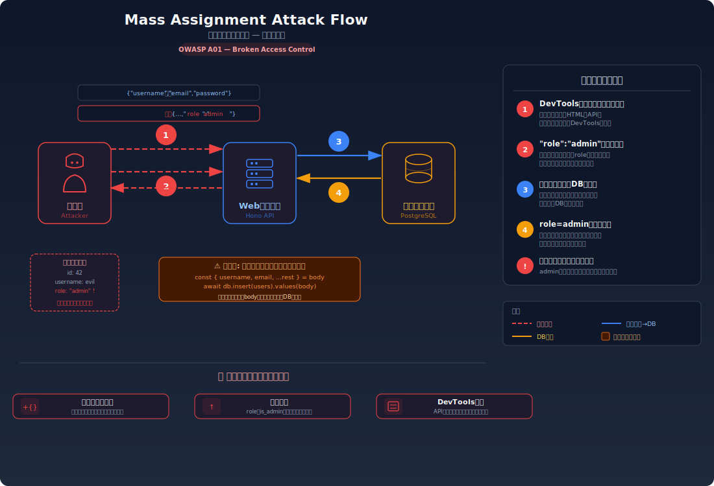
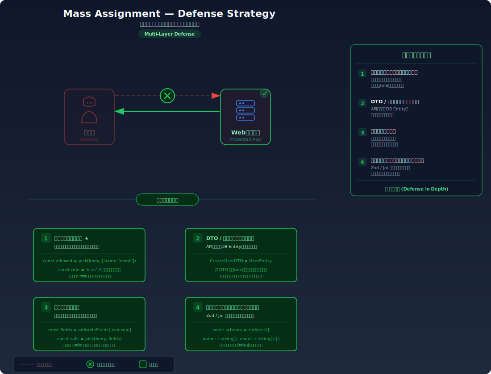

# Mass Assignment — リクエストに余計なフィールドを追加して権限を奪う

> ユーザー登録やプロフィール更新のAPIに、本来送るべきでないフィールド（例: `"role": "admin"`）を追加して送信するだけで、管理者権限の取得やデータの不正な変更ができてしまう脆弱性を学びます。

---

## 対象ラボ

| 項目 | 内容 |
|------|------|
| **概要** | APIがリクエストボディの全フィールドをそのままDBに保存するため、攻撃者が意図しないフィールド（`role`, `isAdmin` 等）を追加送信すると、それもそのまま反映されてしまう |
| **攻撃例** | ユーザー登録APIに `{"username":"hacker","password":"pass","role":"admin"}` を送信 |
| **技術スタック** | Hono API + PostgreSQL |
| **難易度** | ★★☆ 中級 |
| **前提知識** | HTTPリクエストの基本（POST/PUT）、JSON形式のリクエストボディ、REST APIの基本 |

---

## この脆弱性を理解するための前提

### API でのデータ更新の仕組み

WebアプリケーションのAPIは、クライアントからJSON形式でデータを受け取り、データベースに保存する。例えばユーザー登録の場合:

1. クライアントが登録フォームに名前・メール・パスワードを入力
2. フロントエンドがこれらのフィールドをJSON形式でAPIに送信
3. サーバーがリクエストボディを解析し、データベースに INSERT する

```
POST /api/register
Content-Type: application/json

{
  "username": "alice",
  "email": "alice@example.com",
  "password": "securePass123"
}
→ 201 Created: { "id": 4, "username": "alice", "role": "user" }
```

フロントエンドのフォームには `username`, `email`, `password` の3つしかないため、開発者は「この3つだけが送られてくる」と考える。

### どこに脆弱性が生まれるのか

問題は、サーバーがリクエストボディの **全フィールドをそのまま** データベース操作に使用する場合に発生する。フロントエンドのフォームには3つのフィールドしかなくても、攻撃者は DevTools や curl を使って任意のフィールドを追加できる。サーバーがそれを検証せずにそのまま使えば、`role` や `isAdmin` といった内部フィールドまで攻撃者が自由に設定できてしまう。

```typescript
// ⚠️ この部分が問題 — リクエストボディの全フィールドをそのままINSERTに使っている
app.post('/api/register', async (c) => {
  const body = await c.req.json();
  // body には攻撃者が追加した "role": "admin" も含まれる可能性がある
  const { username, email, password, role } = body;

  // role が指定されていればそのまま使われてしまう
  await pool.query(
    'INSERT INTO users (username, email, password, role) VALUES ($1, $2, $3, $4)',
    [username, email, password, role || 'user']
  );
  return c.json({ message: '登録完了' }, 201);
});
```

`role` フィールドはフロントエンドのフォームには存在しないが、攻撃者がリクエストに `"role": "admin"` を追加すれば、管理者として登録される。

---

## 攻撃の仕組み



### 攻撃のシナリオ

1. **攻撃者** が正規の登録フォームを観察し、APIの構造を把握する

   DevTools の Network タブで登録リクエストを確認し、エンドポイントとリクエスト形式を特定する。レスポンスに `role` フィールドが含まれていることで、このフィールドが存在することを知る。

2. **攻撃者** が curl や DevTools を使い、リクエストボディに `role` フィールドを追加して送信する

   ```
   POST /api/register
   Content-Type: application/json

   {
     "username": "hacker",
     "email": "hacker@evil.com",
     "password": "pass123",
     "role": "admin"
   }
   ```

   フロントエンドのフォームを経由せず、直接APIにリクエストを送信する。JSONには本来フォームに存在しない `role` フィールドが追加されている。

3. **サーバー** がリクエストボディの全フィールドをそのまま使用してデータベースに保存する

   サーバー側のコードはリクエストボディから `role` を含む全フィールドを取り出し、INSERT文に渡す。`role` フィールドのバリデーションがないため、攻撃者が指定した `"admin"` がそのまま保存される:

   ```sql
   INSERT INTO users (username, email, password, role)
   VALUES ('hacker', 'hacker@evil.com', 'pass123', 'admin')
   ```

4. **攻撃者** が管理者権限でシステムにアクセスする

   作成されたアカウントは `role: "admin"` を持つため、管理者限定の機能（ユーザー管理、データ閲覧、設定変更等）に完全にアクセスできる。

### なぜ成功するのか

| 条件 | 説明 |
|------|------|
| リクエストボディの無検証な受け入れ | サーバーがリクエストボディのフィールドを検証・フィルタリングせず、そのまま全てをデータベース操作に使用している |
| 内部フィールドの露出 | APIレスポンスやエラーメッセージに `role` 等の内部フィールドが含まれており、攻撃者がフィールド名を推測できる |
| フロントエンドへの依存 | 「フロントエンドのフォームにないフィールドは送られてこない」という前提に基づいており、サーバーサイドでの入力制御がない |

### 被害の範囲

- **機密性**: 管理者権限を取得することで、全ユーザーのデータ、システム設定、内部ログなど本来アクセスできない情報を閲覧できる
- **完全性**: 管理者として他ユーザーのデータ変更・削除、システム設定の改ざんが可能。また、プロフィール更新APIで `email` フィールドを他ユーザーのものに変更し、パスワードリセットによるアカウント乗っ取りも可能
- **可用性**: 管理者権限でユーザーの一括削除やシステム設定の破壊が行える

---

## 対策



### 根本原因

サーバーが **クライアントから送信されたデータをそのまま信頼** し、許可されたフィールドのみを抽出するフィルタリングを行っていないことが根本原因。フロントエンドのフォームは入力の「UI」であり、セキュリティの境界線ではない。

### 安全な実装

ホワイトリスト方式で、許可されたフィールドのみをリクエストボディから抽出する。これにより、攻撃者がどんなフィールドを追加しても、許可リストに含まれないフィールドは無視される。

```typescript
// ✅ ホワイトリスト方式 — 許可されたフィールドのみを抽出して使用
app.post('/api/register', async (c) => {
  const body = await c.req.json();

  // 許可するフィールドを明示的に指定（ホワイトリスト）
  // body に "role" や "isAdmin" が含まれていても無視される
  const username = body.username;
  const email = body.email;
  const password = body.password;

  // role は常にサーバーが設定する — クライアントから受け取らない
  await pool.query(
    'INSERT INTO users (username, email, password, role) VALUES ($1, $2, $3, $4)',
    [username, email, password, 'user']
  );
  return c.json({ message: '登録完了' }, 201);
});
```

`role` は常にサーバー側で `'user'` に固定されるため、攻撃者が `"role": "admin"` を送信しても一切反映されない。

#### 脆弱 vs 安全: コード比較

```diff
  app.post('/api/register', async (c) => {
    const body = await c.req.json();
-   // リクエストボディの全フィールドをそのまま使用
-   const { username, email, password, role } = body;
+   // 許可するフィールドのみ明示的に抽出
+   const username = body.username;
+   const email = body.email;
+   const password = body.password;

    await pool.query(
      'INSERT INTO users (username, email, password, role) VALUES ($1, $2, $3, $4)',
-     [username, email, password, role || 'user']
+     [username, email, password, 'user']  // role はサーバーが固定
    );
    return c.json({ message: '登録完了' }, 201);
  });
```

脆弱なコードではリクエストボディから `role` を含む全フィールドをデストラクチャリングし、そのままDBに渡している。安全なコードでは許可フィールドのみを明示的に取り出し、`role` はサーバーが固定値で設定する。

### その他の防御策

| 対策 | 種類 | 説明 |
|------|------|------|
| ホワイトリストによるフィールドフィルタリング | 根本対策 | 許可されたフィールドのみをリクエストボディから抽出する。これが最も効果的で必須の対策 |
| スキーマバリデーション (Zod/Joi等) | 根本対策 | リクエストボディのスキーマを定義し、未知のフィールドを自動的に除去する。TypeScriptとの親和性も高い |
| DTO (Data Transfer Object) パターン | 多層防御 | DBエンティティとAPIの入出力を分離し、内部フィールドがAPIレイヤーに露出しないようにする |
| レスポンスからの内部フィールド除外 | 多層防御 | APIレスポンスに `role`, `isAdmin` 等の内部フィールドを含めない。攻撃者のフィールド名推測を困難にする |
| 監査ログ | 検知 | `role` 等の重要フィールドの変更をログに記録し、不正な変更を検知する |

---

## ハンズオン手順

### Step 1: 脆弱バージョンで攻撃を体験

**ゴール**: ユーザー登録時に `role` フィールドを追加送信し、管理者として登録できることを確認する

1. 開発サーバーを起動する

   ```bash
   cd backend && pnpm dev
   ```

2. 正規の登録リクエストを確認する

   ```bash
   # 通常の登録（role フィールドなし）
   curl -X POST http://localhost:3000/api/labs/mass-assignment/vulnerable/register \
     -H "Content-Type: application/json" \
     -d '{"username": "normaluser", "email": "normal@example.com", "password": "pass123"}'
   ```

3. `role` フィールドを追加して管理者として登録する

   ```bash
   # role フィールドを追加（Mass Assignment 攻撃）
   curl -X POST http://localhost:3000/api/labs/mass-assignment/vulnerable/register \
     -H "Content-Type: application/json" \
     -d '{"username": "hacker", "email": "hacker@evil.com", "password": "pass123", "role": "admin"}'
   ```

4. 結果を確認する

   - 通常の登録では `role: "user"` が設定されている
   - `role` フィールドを追加した登録では `role: "admin"` が設定されている
   - **この結果が意味すること**: サーバーはリクエストボディの全フィールドをそのまま信頼しており、フロントエンドのフォームに存在しないフィールドも受け入れてしまう

### Step 2: 安全バージョンで防御を確認

**ゴール**: 同じ攻撃がフィールドフィルタリングにより失敗することを確認する

1. 安全なエンドポイントで同じ攻撃を試みる

   ```bash
   # 同じ攻撃を安全なバージョンに対して実行
   curl -X POST http://localhost:3000/api/labs/mass-assignment/secure/register \
     -H "Content-Type: application/json" \
     -d '{"username": "hacker2", "email": "hacker2@evil.com", "password": "pass123", "role": "admin"}'
   ```

2. 結果を確認する

   - `role` フィールドを追加しても、登録されたユーザーの role は `"user"` のまま
   - サーバーが許可されたフィールドのみを抽出し、`role` は無視されている

3. コードの差分を確認する

   - `backend/src/labs/step05-access-control/mass-assignment.ts` の脆弱版と安全版を比較
   - **どの行が違いを生んでいるか** に注目: リクエストボディからの取り出し方法

### 確認ポイント

以下を自分の言葉で説明できれば、このラボは完了です:

- [ ] Mass Assignment が発生するための条件は何か
- [ ] 攻撃者は何を送信し、サーバー内部でどう処理され、結果として何が起きるか
- [ ] 根本原因は「リクエストボディの処理」のどこにあるか（フロントエンドの制限がセキュリティにならない理由を説明できるか）
- [ ] ホワイトリスト方式は「なぜ」この攻撃を無効化するのか

---

## 実装メモ

| 項目 | パス |
|------|------|
| 脆弱エンドポイント (登録) | `/api/labs/mass-assignment/vulnerable/register` |
| 脆弱エンドポイント (更新) | `/api/labs/mass-assignment/vulnerable/users/:id` |
| 安全エンドポイント (登録) | `/api/labs/mass-assignment/secure/register` |
| 安全エンドポイント (更新) | `/api/labs/mass-assignment/secure/users/:id` |
| バックエンド | `backend/src/labs/step05-access-control/mass-assignment.ts` |
| フロントエンド | `frontend/src/features/step05-access-control/pages/MassAssignment.tsx` |
| DB | `docker/db/init.sql` の `users` テーブルに `role` カラムを追加 |

- 脆弱版では `req.body` の全フィールドをそのまま INSERT/UPDATE に使用する
- 安全版では許可フィールドのみを明示的に抽出する（ホワイトリスト方式）
- 登録と更新の両方のエンドポイントで脆弱性を体験できるようにする

---

## 現実世界での事例

| 年 | インシデント | 概要 |
|----|-------------|------|
| 2012 | GitHub | Ruby on Rails の Mass Assignment 脆弱性を利用して、攻撃者が任意のリポジトリの SSH 公開鍵を登録可能だった。Rails コミュニティ全体で Mass Assignment 対策が見直されるきっかけとなった |
| 2023 | 各種SaaS | APIのMass Assignment脆弱性により、一般ユーザーが管理者権限を取得するインシデントがバグバウンティプログラムで頻繁に報告されている |

---

## 関連ラボ

| ラボ | 関連性 |
|------|--------|
| [IDOR](./idor.md) | IDORで他ユーザーのデータにアクセスし、Mass Assignmentで権限を変更するという複合攻撃が可能 |
| [権限昇格](./privilege-escalation.md) | Mass Assignmentによる `role` フィールドの改ざんは、権限昇格の一手法である |
| [パストラバーサル](./path-traversal.md) | 同じ「クライアント入力を信頼しすぎる」パターンの別の脆弱性 |

---

## 参考資料

- [OWASP - Mass Assignment](https://cheatsheetseries.owasp.org/cheatsheets/Mass_Assignment_Cheat_Sheet.html)
- [CWE-915: Improperly Controlled Modification of Dynamically-Determined Object Attributes](https://cwe.mitre.org/data/definitions/915.html)
