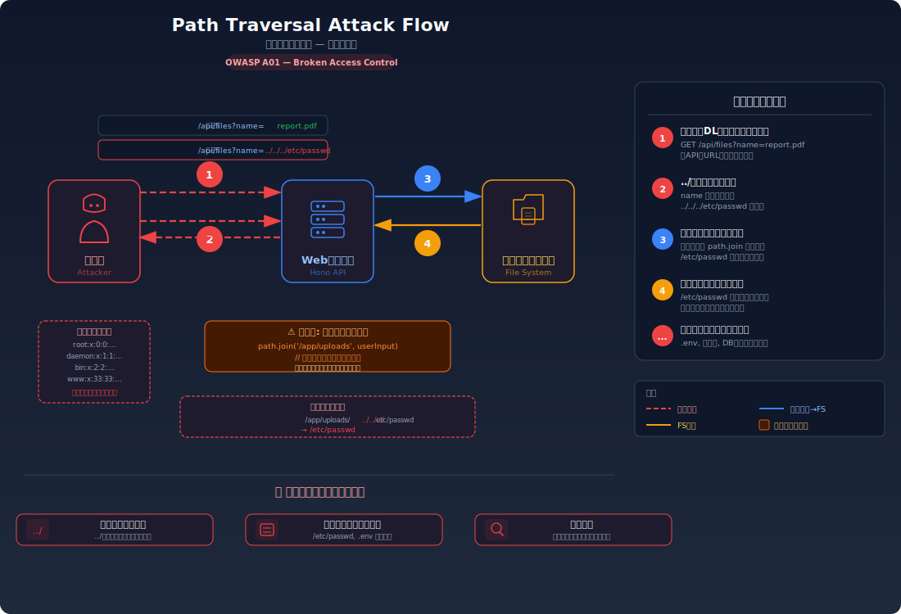
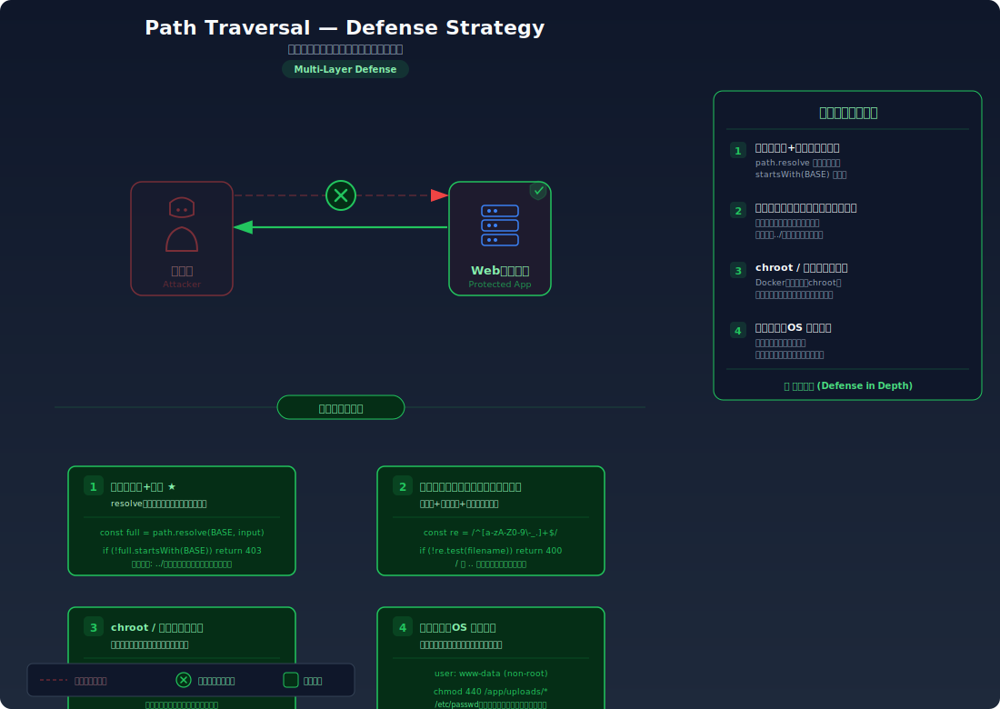

# Path Traversal — `../` でサーバーの秘密ファイルを読み取る

> ファイルを取得するAPIのパスに `../` を挿入することで、本来公開されていないサーバー上の任意のファイル（設定ファイル、パスワードファイル等）を読み取れてしまう脆弱性を学びます。

---

## 対象ラボ

| 項目 | 内容 |
|------|------|
| **概要** | ファイル配信エンドポイントがユーザー入力のファイル名をそのままファイルパスに結合しており、`../` を使って公開ディレクトリ外のファイルを読み取れる |
| **攻撃例** | `/api/files?name=../../../etc/passwd` |
| **技術スタック** | Hono API (ファイル配信エンドポイント) |
| **難易度** | ★☆☆ 入門 |
| **前提知識** | ファイルシステムのパス表記（絶対パス・相対パス）、`..` が親ディレクトリを指すこと、HTTPリクエストの基本 |

---

## この脆弱性を理解するための前提

### ファイル配信の仕組み

Webアプリケーションでは、ユーザーがアップロードしたファイルや静的リソースを配信するエンドポイントを持つことが多い。一般的な流れは以下の通り:

1. クライアントがファイル名を指定してリクエストを送信
2. サーバーが公開ディレクトリ（例: `/app/uploads/`）とファイル名を結合してパスを生成
3. 該当ファイルを読み込んでレスポンスとして返す

```
GET /api/files?name=report.pdf
→ サーバー内部: fs.readFile('/app/uploads/report.pdf')
→ 200 OK: [report.pdf の内容]
```

サーバーは「公開ディレクトリ配下のファイルだけが配信される」ことを前提としている。

### どこに脆弱性が生まれるのか

問題は、サーバーがファイル名の入力値を **そのままファイルパスに結合** する場合に発生する。`..` はファイルシステムにおいて「親ディレクトリ」を意味する特殊な表記であり、`../` を繰り返すことで公開ディレクトリの外に「脱出」できる。

```typescript
// ⚠️ この部分が問題 — ユーザー入力をそのままパスに結合している
app.get('/api/files', async (c) => {
  const fileName = c.req.query('name');

  // ユーザー入力をそのまま結合 — "../" で親ディレクトリに遡れてしまう
  const filePath = path.join('/app/uploads', fileName);
  const content = await fs.readFile(filePath, 'utf-8');
  return c.text(content);
});
```

`fileName` に `../../../etc/passwd` が入力されると、実際に解決されるパスは `/etc/passwd` となり、サーバーのパスワードファイルが読み取れてしまう。

---

## 攻撃の仕組み



### 攻撃のシナリオ

1. **攻撃者** がファイル配信エンドポイントを発見し、パラメータを観察する

   正規のファイルダウンロードリンク（例: `/api/files?name=report.pdf`）を見て、`name` パラメータでファイル名を指定していることを把握する。

2. **攻撃者** が `name` パラメータに `../` を含むパスを指定してリクエストを送信する

   ```
   GET /api/files?name=../../../etc/passwd
   ```

   `../../../etc/passwd` は公開ディレクトリ `/app/uploads/` から3階層上（ルートディレクトリ `/`）に遡り、そこから `/etc/passwd` を指定している。

3. **サーバー** がファイルパスを解決し、公開ディレクトリ外のファイルを読み込む

   サーバー内部では以下のパス解決が行われる:

   ```
   path.join('/app/uploads', '../../../etc/passwd')
   → '/app/uploads/../../../etc/passwd'
   → '/etc/passwd'  (正規化後)
   ```

   パスの検証がないため、`/etc/passwd` がそのまま読み込まれてレスポンスとして返される:

   ```
   root:x:0:0:root:/root:/bin/bash
   daemon:x:1:1:daemon:/usr/sbin:/usr/sbin/nologin
   ...
   ```

4. **攻撃者** がさまざまなファイルを順に読み取り、機密情報を収集する

   `/etc/passwd` で存在するユーザーを特定した後、環境変数ファイル（`.env`）、設定ファイル、SSH鍵、データベース接続情報などを順に狙う:

   ```
   GET /api/files?name=../../.env
   GET /api/files?name=../../../home/user/.ssh/id_rsa
   GET /api/files?name=../../config/database.yml
   ```

### なぜ成功するのか

| 条件 | 説明 |
|------|------|
| パス入力の未検証 | ユーザー入力に `../` が含まれていても検証・除去されず、そのままファイルパスに使用される |
| 公開ディレクトリの制限なし | 最終的に解決されたパスが公開ディレクトリ内に収まっているか（パストラバーサルが起きていないか）を検証していない |
| ファイルシステムのアクセス権限 | Webアプリケーションのプロセスがシステムファイルを読み取れる権限で動作している |

### 被害の範囲

- **機密性**: `/etc/passwd`（ユーザー一覧）、`.env`（API キーやDB接続情報）、SSH秘密鍵、アプリケーションのソースコードなど、サーバー上のあらゆるファイルが読み取られる。これらの情報はさらなる攻撃の足がかりとなる
- **完全性**: ファイル書き込みが可能なエンドポイント（アップロード機能等）にも同じ脆弱性がある場合、任意のファイルを上書きできる。例えばアプリケーションの設定ファイルや cron 設定を改ざんできる
- **可用性**: 重要なシステムファイルの改ざんや削除により、サーバーが動作不能になる可能性がある

---

## 対策



### 根本原因

ユーザー入力を **ファイルシステムのパスとしてそのまま使用** し、解決されたパスが許可されたディレクトリ内に収まっているかを検証していないことが根本原因。`../` はファイルシステムにおいて正当な表記であり、それ自体を「悪意のある入力」として検出するだけでは不十分。

### 安全な実装

最終的に解決されたパスが許可されたベースディレクトリ内に収まっていることを検証する。`path.resolve()` でパスを正規化した後、`startsWith()` でベースディレクトリからの逸脱を検出する。

```typescript
// ✅ パスの正規化 + ベースディレクトリの検証
import path from 'path';
import fs from 'fs/promises';

const BASE_DIR = path.resolve('/app/uploads');

app.get('/api/files', async (c) => {
  const fileName = c.req.query('name');
  if (!fileName) return c.json({ error: 'ファイル名が必要です' }, 400);

  // パスを正規化して実際の絶対パスに変換
  const resolvedPath = path.resolve(BASE_DIR, fileName);

  // 正規化後のパスがベースディレクトリ内に収まっているか検証
  // "../" で遡った場合、resolvedPath は BASE_DIR の外を指すため検出できる
  if (!resolvedPath.startsWith(BASE_DIR + path.sep)) {
    return c.json({ error: 'アクセスが拒否されました' }, 403);
  }

  const content = await fs.readFile(resolvedPath, 'utf-8');
  return c.text(content);
});
```

`../../../etc/passwd` が入力された場合、`path.resolve('/app/uploads', '../../../etc/passwd')` は `/etc/passwd` に解決される。これは `/app/uploads/` で始まらないため、403 エラーが返される。

#### 脆弱 vs 安全: コード比較

```diff
+ const BASE_DIR = path.resolve('/app/uploads');
+
  app.get('/api/files', async (c) => {
    const fileName = c.req.query('name');
-   const filePath = path.join('/app/uploads', fileName);
+   const resolvedPath = path.resolve(BASE_DIR, fileName);
+   if (!resolvedPath.startsWith(BASE_DIR + path.sep)) {
+     return c.json({ error: 'アクセスが拒否されました' }, 403);
+   }
-   const content = await fs.readFile(filePath, 'utf-8');
+   const content = await fs.readFile(resolvedPath, 'utf-8');
    return c.text(content);
  });
```

脆弱なコードではユーザー入力をそのまま `path.join()` に渡しており、`../` で公開ディレクトリ外に遡れる。安全なコードでは `path.resolve()` でパスを正規化した後、`startsWith()` でベースディレクトリ内に収まっているか検証する。

### その他の防御策

| 対策 | 種類 | 説明 |
|------|------|------|
| パスの正規化 + ベースディレクトリ検証 | 根本対策 | `path.resolve()` + `startsWith()` で、解決後のパスが許可されたディレクトリ内にあることを検証する。最も確実な対策 |
| ファイル名のバリデーション | 多層防御 | ファイル名に許可する文字を英数字・ハイフン・ドット等に制限する。`../` だけでなく null バイト等の特殊文字も排除できる |
| chroot / コンテナ化 | 多層防御 | アプリケーションのファイルシステムアクセスを特定のディレクトリに制限する。パストラバーサルが成功しても、アクセス可能なファイルが限定される |
| 最小権限のプロセス実行 | 多層防御 | Webアプリケーションを専用ユーザーで実行し、不要なファイルへの読み取り権限を与えない |
| WAFによるパターン検知 | 検知 | `../` を含むリクエストを検知・ブロックする。エンコーディング回避（`%2e%2e%2f`）にも対応が必要 |

---

## ハンズオン手順

### Step 1: 脆弱バージョンで攻撃を体験

**ゴール**: `../` を使って、公開ディレクトリ外のシステムファイルを読み取れることを確認する

1. 開発サーバーを起動する

   ```bash
   cd backend && pnpm dev
   ```

2. 正規のファイルダウンロードを確認する

   ```bash
   # 正常なファイル取得
   curl "http://localhost:3000/api/labs/path-traversal/vulnerable/files?name=sample.txt"
   ```

3. パストラバーサル攻撃を実行する

   ```bash
   # ../を使ってサーバーの /etc/passwd を読み取る
   curl "http://localhost:3000/api/labs/path-traversal/vulnerable/files?name=../../../etc/passwd"

   # 環境変数ファイルを読み取る
   curl "http://localhost:3000/api/labs/path-traversal/vulnerable/files?name=../../.env"
   ```

4. 結果を確認する

   - `/etc/passwd` の内容（ユーザー一覧）が表示される
   - `.env` ファイルにAPI キーやDB接続情報が含まれている場合、それも取得できる
   - **この結果が意味すること**: `../` によってファイルパスが公開ディレクトリの外に「脱出」し、サーバー上の任意のファイルにアクセスできてしまう

### Step 2: 安全バージョンで防御を確認

**ゴール**: 同じ攻撃がパス検証により失敗することを確認する

1. 安全なエンドポイントで同じ攻撃を試みる

   ```bash
   # 同じ攻撃を安全なバージョンに対して実行
   curl "http://localhost:3000/api/labs/path-traversal/secure/files?name=../../../etc/passwd"
   ```

2. 結果を確認する

   - `403 Forbidden` が返され、「アクセスが拒否されました」とエラーになる
   - 正規のファイル名（`sample.txt`）を指定した場合は正常にファイルが返される

3. コードの差分を確認する

   - `backend/src/labs/step05-access-control/path-traversal.ts` の脆弱版と安全版を比較
   - **どの行が違いを生んでいるか** に注目: `path.resolve()` + `startsWith()` による検証

### 確認ポイント

以下を自分の言葉で説明できれば、このラボは完了です:

- [ ] パストラバーサルが発生するための条件は何か
- [ ] `../../../etc/passwd` が入力されたとき、サーバー内部でパスがどう解決され、なぜシステムファイルにアクセスできるのか
- [ ] 根本原因は「パスの処理」のどこにあるか（`../` のフィルタリングだけでは不十分な理由を説明できるか）
- [ ] `path.resolve()` + `startsWith()` は「なぜ」この攻撃を無効化するのか

---

## 実装メモ

| 項目 | パス |
|------|------|
| 脆弱エンドポイント | `/api/labs/path-traversal/vulnerable/files` |
| 安全エンドポイント | `/api/labs/path-traversal/secure/files` |
| バックエンド | `backend/src/labs/step05-access-control/path-traversal.ts` |
| フロントエンド | `frontend/src/features/step05-access-control/pages/PathTraversal.tsx` |
| テスト用ファイル | `backend/uploads/` に配置 |

- 脆弱版ではユーザー入力を `path.join()` でそのまま結合する
- 安全版では `path.resolve()` + `startsWith()` でベースディレクトリ内に収まっているか検証する
- テスト用のサンプルファイルを `backend/uploads/` に複数配置する
- URLエンコーディング（`%2e%2e%2f`）によるバイパスも確認できるようにする

---

## 現実世界での事例

| 年 | インシデント | 概要 |
|----|-------------|------|
| 2020 | Citrix ADC (CVE-2019-19781) | パストラバーサル脆弱性により、認証なしでリモートコード実行が可能だった。世界中の企業のVPNゲートウェイが攻撃対象となった |
| 2021 | Apache HTTP Server (CVE-2021-41773) | パストラバーサル脆弱性により、Apache 2.4.49 で公開ディレクトリ外のファイルが読み取り可能だった。修正が不完全で 2.4.50 でも再度修正された |
| 2024 | 各種Webアプリケーション | ファイルダウンロード機能やファイル管理機能でパストラバーサル脆弱性が継続的に発見されている |

---

## 関連ラボ

| ラボ | 関連性 |
|------|--------|
| [ディレクトリリスティング](../step01-recon/directory-listing.md) | ディレクトリリスティングでファイル構造を把握した後、パストラバーサルで非公開ファイルにアクセスするという段階的な攻撃が可能 |
| [IDOR](./idor.md) | 同じ「サーバーがクライアント入力を信頼しすぎる」パターン。IDORがリソースIDの書き換えであるのに対し、パストラバーサルはファイルパスの書き換え |
| [OSコマンドインジェクション](../step02-injection/command-injection.md) | パストラバーサルで設定ファイルを読み取り、その情報を使ってコマンドインジェクションを行うという複合攻撃が可能 |

---

## 参考資料

- [OWASP - Path Traversal](https://owasp.org/www-community/attacks/Path_Traversal)
- [CWE-22: Improper Limitation of a Pathname to a Restricted Directory](https://cwe.mitre.org/data/definitions/22.html)
