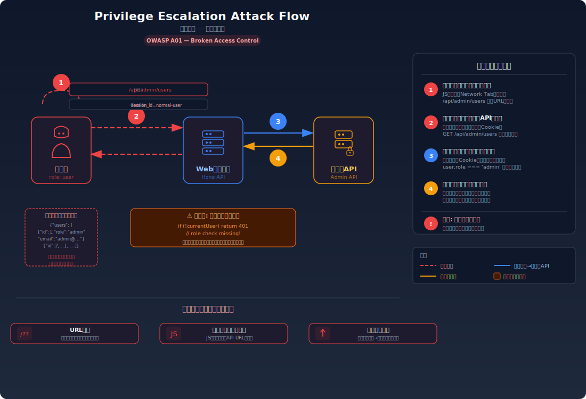
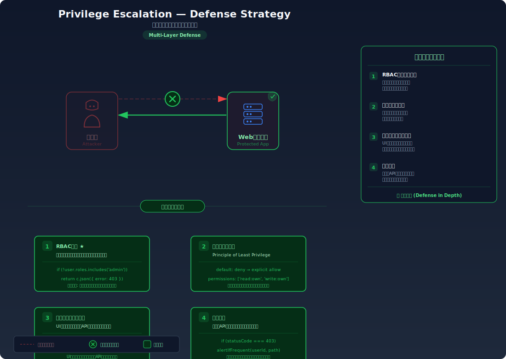

# Privilege Escalation — 一般ユーザーが管理者の操作を実行する

> 一般ユーザーのアカウントでログインしているのに、管理者だけが使えるはずの機能（ユーザー管理、設定変更等）にアクセスし、本来の権限を超えた操作を実行できてしまう脆弱性を学びます。

---

## 対象ラボ

| 項目 | 内容 |
|------|------|
| **概要** | 管理者限定のAPIエンドポイントがユーザーのロール（権限レベル）を検証していないため、一般ユーザーが直接リクエストを送ることで管理者操作を実行できる |
| **攻撃例** | 一般ユーザーのセッションで `POST /api/admin/users/delete` や `PUT /api/admin/settings` に直接リクエストを送信 |
| **技術スタック** | Hono API + セッション管理 + PostgreSQL |
| **難易度** | ★★☆ 中級 |
| **前提知識** | 認証と認可の違い、ロールベースアクセス制御（RBAC）の概念、HTTPリクエストの基本 |

---

## この脆弱性を理解するための前提

### ロールベースアクセス制御 (RBAC) の仕組み

多くのWebアプリケーションでは、ユーザーに「ロール（役割）」を割り当て、ロールに応じてアクセスできる機能を制限する。これをロールベースアクセス制御（RBAC）と呼ぶ:

1. ユーザーがログインすると、セッションにユーザーIDとロール（`user`, `admin` 等）が保存される
2. リクエストを受けたサーバーは、セッションからユーザーのロールを確認する
3. ロールに応じて、アクセスを許可するか拒否するかを判定する

```
一般ユーザー (role: "user")
  → GET /api/profile        → 200 OK（自分のプロフィール）
  → GET /api/admin/users    → 403 Forbidden（管理者専用）

管理者 (role: "admin")
  → GET /api/profile        → 200 OK（自分のプロフィール）
  → GET /api/admin/users    → 200 OK（全ユーザー一覧）
```

正しく実装されていれば、一般ユーザーが管理者ページのURLを直接入力しても、サーバー側でアクセスが拒否される。

### どこに脆弱性が生まれるのか

問題は、管理者用のエンドポイントが **フロントエンドのUI（ナビゲーションの非表示）だけで保護** されており、サーバーサイドでロールの検証を行っていない場合に発生する。管理者メニューがUIに表示されないだけで、URLを知っていれば誰でもアクセスできる状態になっている。

```typescript
// ⚠️ この部分が問題 — 認証はあるがロール（権限）の検証がない
app.get('/api/admin/users', async (c) => {
  const sessionId = getCookie(c, 'session_id');
  const currentUser = sessions.get(sessionId);
  if (!currentUser) return c.json({ error: '未認証' }, 401);

  // ログイン済みであれば誰でも管理者APIにアクセスできてしまう
  // currentUser.role の検証がない
  const users = await pool.query('SELECT id, username, email, role FROM users');
  return c.json(users.rows);
});
```

フロントエンドでは管理者メニューは `role === 'admin'` のユーザーにしか表示されないが、一般ユーザーが URL を直接叩けば、サーバーは何の検証もなくデータを返してしまう。

---

## 攻撃の仕組み



### 攻撃のシナリオ

1. **攻撃者** が一般ユーザーとしてログインし、アプリケーションの構造を調査する

   DevTools の Network タブで API リクエストを監視したり、JavaScript のソースコードを読んで管理者用のエンドポイント（`/api/admin/...`）のURLパターンを特定する。フロントエンドのルーティング設定やコンポーネントのソースから、管理者ページの存在を発見することも多い。

2. **攻撃者** が管理者用エンドポイントに一般ユーザーのセッションで直接リクエストを送信する

   ```
   GET /api/admin/users
   Cookie: session_id=normal-user-session
   ```

   UIには管理者メニューが表示されていないが、URL を知っていれば curl やブラウザのアドレスバーから直接アクセスできる。

3. **サーバー** がロールを検証せずにリクエストを処理する

   サーバーはセッション Cookie が有効（ログイン済み）であることだけを確認し、ユーザーのロールが `admin` であるかは検証しない。結果として、全ユーザーの一覧が返される:

   ```json
   [
     { "id": 1, "username": "admin", "email": "admin@example.com", "role": "admin" },
     { "id": 2, "username": "user1", "email": "user1@example.com", "role": "user" },
     { "id": 3, "username": "user2", "email": "user2@example.com", "role": "user" }
   ]
   ```

4. **攻撃者** がさらに強力な管理者操作を実行する

   ユーザー一覧の取得に成功したことで、管理者APIの認可が甘いことを確認。続いて、ユーザー削除やシステム設定変更などの操作も試行する:

   ```
   DELETE /api/admin/users/2
   Cookie: session_id=normal-user-session
   → 200 OK: { "message": "ユーザーを削除しました" }

   PUT /api/admin/settings
   Cookie: session_id=normal-user-session
   Content-Type: application/json
   { "maintenance_mode": true }
   → 200 OK: { "message": "設定を更新しました" }
   ```

### なぜ成功するのか

| 条件 | 説明 |
|------|------|
| サーバーサイドのロール検証の欠如 | 管理者用エンドポイントがユーザーのロールを検証せず、認証済みであれば誰でもアクセスできる |
| フロントエンドのみの表示制御 | 管理者メニューの非表示はUI上の制御に過ぎず、APIレベルのアクセス制御が行われていない |
| 予測可能なURL構造 | `/api/admin/...` のような命名規則から管理者用エンドポイントのURLが容易に推測できる |

### 被害の範囲

- **機密性**: 全ユーザーの個人情報、システム設定、内部ログ、統計データなど管理者だけがアクセスすべき情報が漏洩する
- **完全性**: ユーザーの追加・削除・権限変更、システム設定の改ざん、コンテンツの編集など、あらゆる管理者操作が実行可能。攻撃者が自分のロールを `admin` に変更すれば、永続的なアクセスを確保できる
- **可用性**: ユーザーの一括削除、メンテナンスモードの有効化、システム設定の破壊により、サービスを停止させられる

---

## 対策



### 根本原因

管理者用のエンドポイントが **フロントエンドの表示制御（UIの非表示）のみで保護** されており、サーバーサイドでユーザーのロールを検証するアクセス制御が実装されていないことが根本原因。フロントエンドの制御はユーザー体験（UX）のためのものであり、セキュリティの境界線ではない。

### 安全な実装

ミドルウェアパターンで、管理者用エンドポイントのグループに対してロール検証を一括適用する。各エンドポイントで個別にチェックするのではなく、ミドルウェアで統一的に制御することで、チェック漏れを防ぐ。

```typescript
// ✅ ロール検証ミドルウェア — 管理者権限を持つユーザーのみアクセスを許可
const requireAdmin = async (c: Context, next: Next) => {
  const sessionId = getCookie(c, 'session_id');
  const currentUser = sessions.get(sessionId);

  if (!currentUser) {
    return c.json({ error: '未認証' }, 401);
  }

  // ロールの検証 — admin 以外はアクセスを拒否
  if (currentUser.role !== 'admin') {
    return c.json({ error: '管理者権限が必要です' }, 403);
  }

  // コンテキストにユーザー情報を設定して次のハンドラに渡す
  c.set('currentUser', currentUser);
  await next();
};

// 管理者用ルートグループにミドルウェアを適用
const admin = new Hono();
admin.use('*', requireAdmin);

admin.get('/users', async (c) => {
  // ここに到達する時点で管理者権限が確認済み
  const users = await pool.query('SELECT id, username, email, role FROM users');
  return c.json(users.rows);
});

admin.delete('/users/:id', async (c) => {
  const targetId = c.req.param('id');
  await pool.query('DELETE FROM users WHERE id = $1', [targetId]);
  return c.json({ message: 'ユーザーを削除しました' });
});

app.route('/api/admin', admin);
```

一般ユーザーが `/api/admin/users` にアクセスすると、`requireAdmin` ミドルウェアが `currentUser.role !== 'admin'` を検出し、403 Forbidden を返す。個々のエンドポイントでロール検証を書き忘れるリスクがない。

#### 脆弱 vs 安全: コード比較

```diff
+ // ミドルウェアでロール検証を一括適用
+ const requireAdmin = async (c, next) => {
+   const currentUser = sessions.get(getCookie(c, 'session_id'));
+   if (!currentUser) return c.json({ error: '未認証' }, 401);
+   if (currentUser.role !== 'admin') {
+     return c.json({ error: '管理者権限が必要です' }, 403);
+   }
+   await next();
+ };
+
+ admin.use('*', requireAdmin);
+
  admin.get('/users', async (c) => {
-   const sessionId = getCookie(c, 'session_id');
-   const currentUser = sessions.get(sessionId);
-   if (!currentUser) return c.json({ error: '未認証' }, 401);
-   // ← ロール検証がない
    const users = await pool.query('SELECT id, username, email, role FROM users');
    return c.json(users.rows);
  });
```

脆弱なコードでは各エンドポイントで認証のみを確認し、ロールの検証がない。安全なコードではミドルウェアで全管理者エンドポイントに対してロール検証を一括適用している。

### その他の防御策

| 対策 | 種類 | 説明 |
|------|------|------|
| ミドルウェアによるロール検証 | 根本対策 | 管理者用ルートグループにミドルウェアを適用し、全エンドポイントでロールを検証する。チェック漏れを防ぐ最も効果的な対策 |
| 最小権限の原則 | 根本対策 | ユーザーには必要最小限の権限のみ付与する。不要な管理者権限は付与しない |
| フロントエンドとバックエンドの両方で制御 | 多層防御 | UIでの管理者メニュー非表示（UX向上）に加え、サーバーサイドでのアクセス制御（セキュリティ）を必ず実装する |
| アクセスログの記録 | 検知 | 管理者エンドポイントへのアクセスを全て記録し、一般ユーザーからの異常なアクセスを検知する |
| 多要素認証 (MFA) | 多層防御 | 管理者アカウントに MFA を必須にする。アカウント侵害による権限昇格リスクを軽減する |

---

## ハンズオン手順

### Step 1: 脆弱バージョンで攻撃を体験

**ゴール**: 一般ユーザーのセッションで、管理者用APIにアクセスし管理者操作を実行できることを確認する

1. 開発サーバーを起動する

   ```bash
   cd backend && pnpm dev
   ```

2. 一般ユーザーとしてログインする

   ```bash
   # 一般ユーザーでログイン
   curl -X POST http://localhost:3000/api/labs/privilege-escalation/vulnerable/login \
     -H "Content-Type: application/json" \
     -d '{"username": "user1", "password": "password1"}' \
     -c cookies.txt
   ```

3. 管理者用エンドポイントにアクセスする

   ```bash
   # 一般ユーザーのセッションで管理者APIにアクセス
   curl http://localhost:3000/api/labs/privilege-escalation/vulnerable/admin/users \
     -b cookies.txt

   # 管理者設定を変更
   curl -X PUT http://localhost:3000/api/labs/privilege-escalation/vulnerable/admin/settings \
     -H "Content-Type: application/json" \
     -b cookies.txt \
     -d '{"maintenance_mode": true}'
   ```

4. 結果を確認する

   - 一般ユーザーなのに全ユーザー一覧が取得でき、設定変更も成功する
   - DevTools で確認すると、リクエストには一般ユーザーのセッション Cookie のみが付いている
   - **この結果が意味すること**: サーバーは「ログイン済み」であることだけを確認し、「管理者であるか」は確認していない

### Step 2: 安全バージョンで防御を確認

**ゴール**: 同じ攻撃がロール検証により失敗することを確認する

1. 安全なエンドポイントで同じ攻撃を試みる

   ```bash
   # 一般ユーザーのセッションで安全な管理者APIにアクセス
   curl http://localhost:3000/api/labs/privilege-escalation/secure/admin/users \
     -b cookies.txt
   ```

2. 結果を確認する

   - `403 Forbidden` が返され、「管理者権限が必要です」とエラーになる
   - 管理者としてログインした場合のみ、正常にアクセスできることを確認する

3. コードの差分を確認する

   - `backend/src/labs/step05-access-control/privilege-escalation.ts` の脆弱版と安全版を比較
   - **どの行が違いを生んでいるか** に注目: `requireAdmin` ミドルウェアによるロール検証

### 確認ポイント

以下を自分の言葉で説明できれば、このラボは完了です:

- [ ] 権限昇格が発生するための条件は何か（水平方向のIDORとの違いを説明できるか）
- [ ] 一般ユーザーが管理者URLにアクセスしたとき、サーバー内部でどう処理され、なぜアクセスが許可されてしまうか
- [ ] 根本原因は「UIの表示制御とサーバーサイドの認可」のどこにあるか
- [ ] ミドルウェアによるロール検証は「なぜ」この攻撃を無効化するのか（各エンドポイントで個別にチェックするのと比べたメリットは何か）

---

## 実装メモ

| 項目 | パス |
|------|------|
| 脆弱エンドポイント (ユーザー一覧) | `/api/labs/privilege-escalation/vulnerable/admin/users` |
| 脆弱エンドポイント (設定変更) | `/api/labs/privilege-escalation/vulnerable/admin/settings` |
| 安全エンドポイント (ユーザー一覧) | `/api/labs/privilege-escalation/secure/admin/users` |
| 安全エンドポイント (設定変更) | `/api/labs/privilege-escalation/secure/admin/settings` |
| バックエンド | `backend/src/labs/step05-access-control/privilege-escalation.ts` |
| フロントエンド | `frontend/src/features/step05-access-control/pages/PrivilegeEscalation.tsx` |
| DB | `docker/db/init.sql` の `users` テーブル（`role` カラム）を使用 |

- 脆弱版では認証のみ行い、ロールの検証を行わない
- 安全版では `requireAdmin` ミドルウェアで全管理者エンドポイントにロール検証を適用
- テストデータに `admin` と `user` の2種類のロールを持つユーザーを用意する

---

## 現実世界での事例

| 年 | インシデント | 概要 |
|----|-------------|------|
| 2010 | AT&T / iPad | 管理者エンドポイントのアクセス制御不備により、約 11.4 万人の iPad ユーザーのメールアドレスが漏洩した |
| 2018 | 各種Webアプリケーション | OWASP Top 10 の A5（Broken Access Control）として、権限昇格やアクセス制御不備が最も一般的な脆弱性カテゴリの一つに挙げられている |
| 2023 | Microsoft Power Platform | 管理者APIへのアクセス制御不備により、低権限ユーザーが環境内の全データにアクセス可能だった |

---

## 関連ラボ

| ラボ | 関連性 |
|------|--------|
| [IDOR](./idor.md) | IDOR が水平方向（同じ権限レベルの他ユーザー）の認可不備であるのに対し、権限昇格は垂直方向（上位権限）の認可不備。どちらもアクセス制御の欠如が原因 |
| [Mass Assignment](./mass-assignment.md) | Mass Assignment で `role` フィールドを改ざんすることは、権限昇格の一手法。API経由でロールを変更し、永続的な管理者アクセスを得られる |
| [CSRF](../step04-session/csrf.md) | 管理者のブラウザに CSRF 攻撃を仕掛けることで、管理者権限の操作を攻撃者が間接的に実行するという複合攻撃が可能 |

---

## 参考資料

- [OWASP - Privilege Escalation](https://owasp.org/www-project-web-security-testing-guide/latest/4-Web_Application_Security_Testing/05-Authorization_Testing/03-Testing_for_Privilege_Escalation)
- [CWE-269: Improper Privilege Management](https://cwe.mitre.org/data/definitions/269.html)
- [CWE-862: Missing Authorization](https://cwe.mitre.org/data/definitions/862.html)
