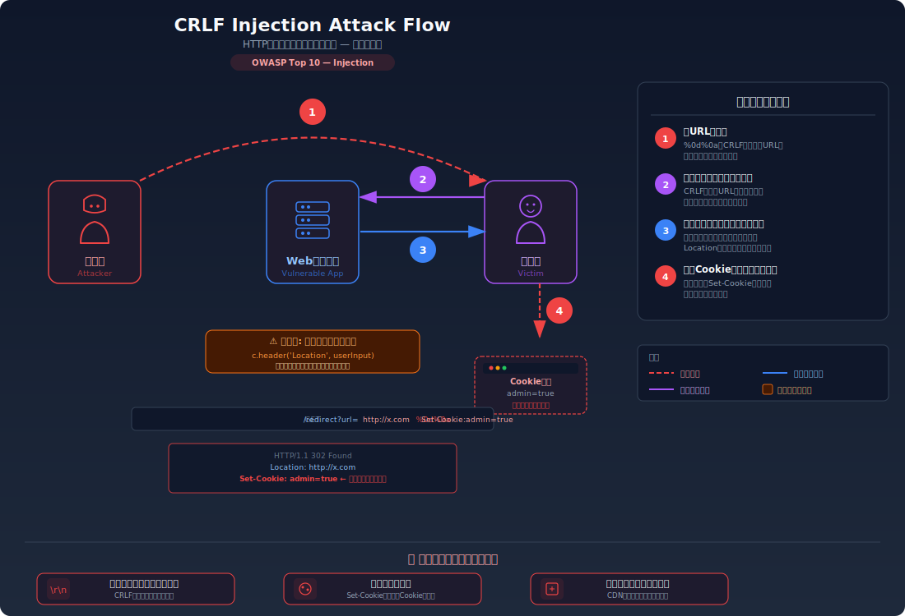
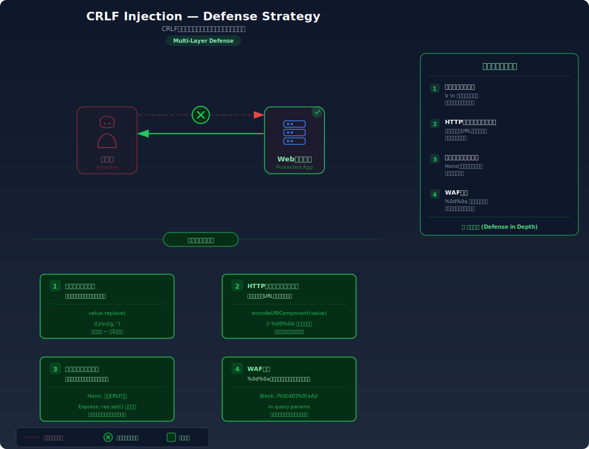

# CRLF Injection (HTTP Header Injection) — HTTPレスポンスヘッダーへの改行コード注入

> ユーザー入力がHTTPレスポンスヘッダーにそのまま含まれる場合、改行コード（`\r\n`）を注入することで任意のHTTPヘッダーやレスポンスボディを挿入できてしまう脆弱性を学びます。

---

## 対象ラボ

| 項目 | 内容 |
|------|------|
| **概要** | リダイレクトURLやカスタムヘッダーにユーザー入力を未検証で使用しているため、改行コード（`%0d%0a`）を注入してSet-Cookieや任意のヘッダーを追加できる |
| **攻撃例** | `/api/redirect?url=http://example.com%0d%0aSet-Cookie:admin=true` |
| **技術スタック** | Hono API |
| **難易度** | ★★☆ 中級 |
| **前提知識** | HTTPレスポンスの構造（ステータスライン・ヘッダー・ボディ）、URLエンコーディング、Cookie の仕組み |

---

## この脆弱性を理解するための前提

### HTTPレスポンスの構造

HTTPレスポンスは、ステータスライン、ヘッダー、空行（`\r\n\r\n`）、ボディの順に構成される。**ヘッダーとヘッダーの区切りは `\r\n`（CRLF: Carriage Return + Line Feed）** である。

```
HTTP/1.1 302 Found\r\n
Location: http://example.com\r\n
Content-Type: text/html\r\n
\r\n
<html>...</html>
```

つまりHTTPプロトコルでは `\r\n` がヘッダーの境界を示す制御文字として機能している。

### どこに脆弱性が生まれるのか

開発者がリダイレクト先URLやカスタムヘッダーの値にユーザー入力をそのまま使用する場合、攻撃者は入力に `\r\n` を含めることで、HTTPレスポンスの構造自体を操作できる。ヘッダーの区切りが改行コードに依存しているため、改行コードを注入するだけで新しいヘッダーを追加できてしまう。

```typescript
// ⚠️ この部分が問題 — ユーザー入力をヘッダーにそのまま設定
app.get('/api/redirect', (c) => {
  const url = c.req.query('url');

  // クエリパラメータの値を検証せずにLocationヘッダーに設定
  // → 改行コードが含まれていると追加ヘッダーが注入される
  c.header('Location', url!);
  return c.text('Redirecting...', 302);
});
```

---

## 攻撃の仕組み



### 攻撃のシナリオ

1. **攻撃者** が改行コードを含むURLを構築する

   `%0d%0a` はURLエンコードされた `\r\n`（CRLF）。これをリダイレクト先URLの末尾に付加し、その後に注入したいヘッダーを追記する。

   ```
   /api/redirect?url=http://example.com%0d%0aSet-Cookie:admin=true
   ```

2. **サーバー** がユーザー入力をそのままLocationヘッダーに設定する

   サーバーはURLパラメータの値を検証せずにHTTPレスポンスのLocationヘッダーにセットする。結果として生成されるHTTPレスポンスは以下のようになる:

   ```
   HTTP/1.1 302 Found\r\n
   Location: http://example.com\r\n
   Set-Cookie: admin=true\r\n
   \r\n
   Redirecting...
   ```

   `\r\n` が挿入されたことで、`Set-Cookie: admin=true` が正規のHTTPヘッダーとしてブラウザに解釈される。

3. **被害者のブラウザ** が注入されたヘッダーを処理する

   ブラウザはこのレスポンスを受け取ると、`Set-Cookie: admin=true` を正規のサーバー応答として処理し、Cookieを設定する。これにより攻撃者は被害者のブラウザに任意のCookieを設定できる。

### なぜ成功するのか

| 条件 | 説明 |
|------|------|
| ヘッダー値の未検証 | サーバーがユーザー入力に含まれる改行コード（`\r\n`）を除去・エスケープせずにHTTPヘッダーにそのまま設定する |
| HTTPプロトコルの構造 | HTTPヘッダーの区切りが `\r\n` に依存しているため、改行コードを注入するだけで新しいヘッダーを追加できる |
| URLデコードの処理順序 | `%0d%0a` がサーバー内部でデコードされ、実際の改行コードとしてHTTPレスポンスに含まれる |

### 被害の範囲

- **機密性**: 注入した `Set-Cookie` でセッション固定攻撃を行い、被害者を攻撃者が管理するセッションに誘導できる
- **完全性**: レスポンスボディも注入可能な場合（`\r\n\r\n` で空行を作る）、偽のHTMLページを返してフィッシング攻撃ができる
- **可用性**: キャッシュポイズニングにより、CDNやプロキシに汚染されたレスポンスを保存させ、他のユーザーにも影響を与える

---

## 対策



### 根本原因

サーバーが **ユーザー入力に含まれる制御文字（特に `\r` と `\n`）を検証・除去せずにHTTPヘッダーに設定** していることが根本原因。HTTPプロトコルではヘッダーの区切りとして改行コードが使われるため、入力値に改行コードが含まれるとレスポンスの構造を破壊できる。

### 安全な実装

ヘッダーに設定する値から改行コード（`\r` と `\n`）を除去する。これにより、攻撃者が改行コードを注入してもHTTPヘッダーの境界として機能しなくなる。

```typescript
// ✅ 改行コードを除去してからヘッダーに設定
app.get('/api/redirect', (c) => {
  const url = c.req.query('url');

  if (!url) {
    return c.json({ error: 'URL is required' }, 400);
  }

  // \r と \n を除去 — HTTPヘッダーインジェクションを防止
  const sanitizedUrl = url.replace(/[\r\n]/g, '');

  // さらにURLの形式を検証（ホワイトリスト方式が理想）
  try {
    const parsed = new URL(sanitizedUrl);
    if (!['http:', 'https:'].includes(parsed.protocol)) {
      return c.json({ error: '無効なURLです' }, 400);
    }
  } catch {
    return c.json({ error: '無効なURLです' }, 400);
  }

  c.header('Location', sanitizedUrl);
  return c.text('Redirecting...', 302);
});
```

#### 脆弱 vs 安全: コード比較

```diff
  app.get('/api/redirect', (c) => {
    const url = c.req.query('url');
-   c.header('Location', url!);
+   // 改行コードを除去してヘッダーインジェクションを防止
+   const sanitizedUrl = url!.replace(/[\r\n]/g, '');
+   c.header('Location', sanitizedUrl);
    return c.text('Redirecting...', 302);
  });
```

脆弱なコードではユーザー入力がそのままヘッダー値になるため、`\r\n` でヘッダーを追加できる。安全なコードでは改行コードを除去するため、注入された文字列は単一のヘッダー値の一部として扱われ、新しいヘッダーとして解釈されない。

### その他の防御策

| 対策 | 種類 | 説明 |
|------|------|------|
| 改行コードの除去 | 根本対策 | ヘッダーに設定する全ての値から `\r` と `\n` を除去する。これが最も効果的で必須 |
| URLのホワイトリスト検証 | 根本対策 | リダイレクト先を許可されたドメインのリストに限定し、任意のURLへのリダイレクトを防ぐ |
| フレームワークの組み込み保護 | 多層防御 | 多くのモダンフレームワーク（Hono含む）はヘッダー設定時に自動で改行コードを除去する。ただし全てのケースで保護されるとは限らないため、自前の検証も必要 |
| WAF | 検知 | `%0d%0a` パターンを含むリクエストを検知・遮断する |

---

## ハンズオン手順

### Step 1: 脆弱バージョンで攻撃を体験

**ゴール**: CRLFインジェクションでSet-Cookieヘッダーを注入できることを確認する

1. 開発サーバーを起動する

   ```bash
   cd backend && pnpm dev
   ```

2. 改行コードを含むリクエストを送信する

   ```bash
   # CRLFインジェクションでSet-Cookieヘッダーを注入
   curl -v "http://localhost:3000/api/labs/crlf-injection/vulnerable/redirect?url=http://example.com%0d%0aSet-Cookie:admin=true"
   ```

3. 結果を確認する

   - レスポンスヘッダーに `Set-Cookie: admin=true` が含まれる
   - `-v` オプションでHTTPヘッダーの全体を確認できる
   - **この結果が意味すること**: 改行コードがHTTPヘッダーの境界として解釈され、攻撃者が指定した任意のヘッダーがレスポンスに追加されている

### Step 2: 安全バージョンで防御を確認

**ゴール**: 同じ攻撃が改行コード除去により失敗することを確認する

1. 安全なエンドポイントで同じ攻撃を試みる

   ```bash
   curl -v "http://localhost:3000/api/labs/crlf-injection/secure/redirect?url=http://example.com%0d%0aSet-Cookie:admin=true"
   ```

2. 結果を確認する

   - `Set-Cookie: admin=true` がレスポンスヘッダーに含まれない
   - 改行コードが除去され、Location ヘッダーの値が単一の文字列として処理されている

3. コードの差分を確認する

   - `backend/src/labs/step06-server-side/crlf-injection.ts` の脆弱版と安全版を比較
   - **どの行が違いを生んでいるか** に注目: `.replace(/[\r\n]/g, '')` の改行コード除去

### 確認ポイント

以下を自分の言葉で説明できれば、このラボは完了です:

- [ ] CRLFインジェクションが発生するための条件は何か（HTTPの構造と改行コードの関係）
- [ ] 攻撃者は何を入力し、サーバー内部でどう処理され、HTTPレスポンスがどう変わるか
- [ ] この攻撃がセッション固定やキャッシュポイズニングにどう発展するか
- [ ] 安全な実装は「なぜ」この攻撃を無効化するのか（改行コード除去がHTTP構造をどう保護するか）

---

## 実装メモ

| 項目 | パス |
|------|------|
| 脆弱エンドポイント | `/api/labs/crlf-injection/vulnerable/redirect` |
| 安全エンドポイント | `/api/labs/crlf-injection/secure/redirect` |
| バックエンド | `backend/src/labs/step06-server-side/crlf-injection.ts` |
| フロントエンド | `frontend/src/features/step06-server-side/pages/CRLFInjection.tsx` |

- 脆弱版ではクエリパラメータの値をそのままLocationヘッダーに設定
- 安全版では改行コードを除去してからヘッダーに設定
- curlの `-v` オプションでレスポンスヘッダー全体を確認する手順を用意

---

## 現実世界での事例

| 年 | インシデント | 概要 |
|----|-------------|------|
| 2017 | Node.js HTTP Module | Node.jsのHTTPモジュールにCRLFインジェクション脆弱性（CVE-2016-5325）が発見された。HTTPヘッダーの値に改行コードが含まれる場合に正しく処理されず、レスポンス分割攻撃が可能だった |
| 2019 | Twitter | TwitterのリダイレクトエンドポイントでHTTPレスポンス分割が可能な脆弱性が発見され、バグバウンティで報告・修正された |

---

## 関連ラボ

| ラボ | 関連性 |
|------|--------|
| [XSS](../step02-injection/xss.md) | CRLFインジェクションでレスポンスボディを注入できる場合、XSSと同等の攻撃が可能。`\r\n\r\n` で空行を作り、その後に `<script>` を注入する |
| [セッション固定](../step04-session/session-fixation.md) | `Set-Cookie` ヘッダーの注入により、攻撃者が管理するセッションIDを被害者に強制的に使わせるセッション固定攻撃につながる |

---

## 参考資料

- [OWASP - HTTP Response Splitting](https://owasp.org/www-community/attacks/HTTP_Response_Splitting)
- [CWE-113: Improper Neutralization of CRLF Sequences in HTTP Headers](https://cwe.mitre.org/data/definitions/113.html)
