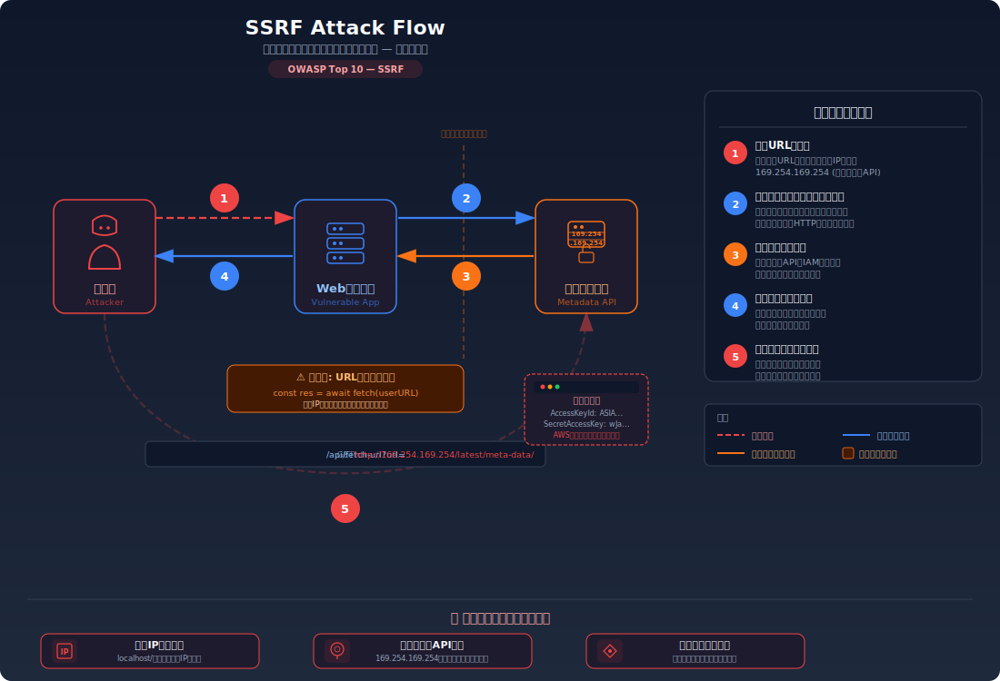
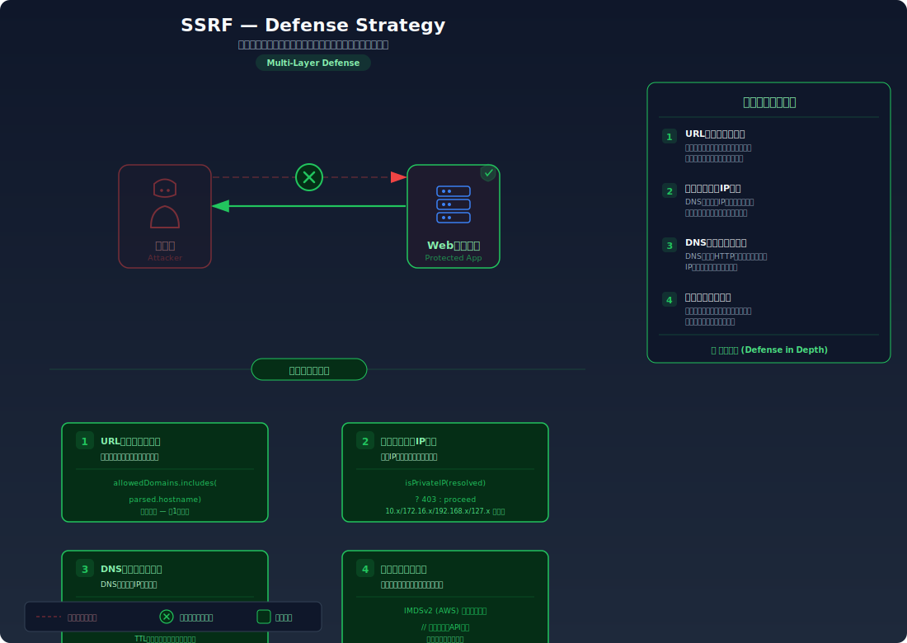

# SSRF (Server-Side Request Forgery) — サーバーを踏み台にした内部ネットワークへの不正アクセス

> サーバーにURLを指定してリクエストを送らせる機能を悪用し、外部からアクセスできない内部ネットワークのサービスやメタデータAPIにアクセスできてしまう脆弱性を学びます。

---

## 対象ラボ

| 項目 | 内容 |
|------|------|
| **概要** | URL取得機能がユーザー指定のURLを検証せずにサーバーからリクエストするため、`localhost` や内部IPを指定して内部サービス・クラウドメタデータにアクセスできる |
| **攻撃例** | `/api/fetch-url?url=http://169.254.169.254/latest/meta-data/` でAWSメタデータを取得 |
| **技術スタック** | Hono API (URL取得エンドポイント) |
| **難易度** | ★★☆ 中級 |
| **前提知識** | HTTPリクエストの基本、内部ネットワークとファイアウォールの概念、クラウド環境のメタデータサービス |

---

## この脆弱性を理解するための前提

### サーバーサイドでのURL取得の仕組み

Webアプリケーションには、ユーザーが指定したURLのコンテンツを取得する機能が存在する場合がある。例えばURLプレビュー、Webページのスクリーンショット、RSS/フィード取得、Webhook通知先の確認などである。

```
ユーザー → サーバー: 「このURLの内容を取得して」
サーバー → 外部サイト: HTTP GET https://example.com/page
外部サイト → サーバー: レスポンス（HTMLなど）
サーバー → ユーザー: 取得結果を返す
```

この仕組みでは、**サーバーがユーザーの代わりにHTTPリクエストを発行する**。つまりサーバーのネットワーク権限でリクエストが送信される。

### どこに脆弱性が生まれるのか

問題は、サーバーが **ユーザーから指定されたURLの宛先を検証しない** 場合に発生する。サーバーはファイアウォールの内側にあり、外部からはアクセスできない内部サービス（データベース、管理パネル、クラウドメタデータAPI等）にアクセスできる。攻撃者はこれを悪用し、サーバーを「踏み台」にして内部ネットワークを探索できる。

```typescript
// ⚠️ この部分が問題 — URLの宛先を検証していない
app.get('/api/fetch-url', async (c) => {
  const url = c.req.query('url');

  // ユーザー指定のURLにサーバーからリクエスト
  // → localhost や内部IPも指定可能
  const response = await fetch(url!);
  const body = await response.text();

  return c.json({ content: body });
});
```

---

## 攻撃の仕組み



### 攻撃のシナリオ

1. **攻撃者** が内部ネットワークを指すURLを指定する

   URL取得機能に `http://localhost:5432` や `http://169.254.169.254/latest/meta-data/` のような内部アドレスを指定する。これらはファイアウォールにより外部からは直接アクセスできないが、サーバー自身からはアクセス可能。

   ```bash
   curl "http://target.com/api/fetch-url?url=http://169.254.169.254/latest/meta-data/iam/security-credentials/"
   ```

2. **サーバー** が内部ネットワークにリクエストを送信する

   サーバーはURLの宛先を検証せず、自身のネットワーク権限でリクエストを発行する。ファイアウォールはサーバーからのリクエストを許可するため、内部サービスが応答する。

   ```
   サーバー (10.0.0.5) → メタデータAPI (169.254.169.254)
   → IAMロールの一時クレデンシャルが返される
   ```

3. **攻撃者** が内部サービスのレスポンスを取得する

   サーバーが内部サービスからのレスポンスをそのまま攻撃者に返すため、AWSの一時クレデンシャル、内部APIのレスポンス、管理パネルの情報などが取得できる。

   ```json
   {
     "content": "{\n  \"AccessKeyId\": \"ASIA...\",\n  \"SecretAccessKey\": \"wJalr...\",\n  \"Token\": \"FwoGZX...\"\n}"
   }
   ```

### なぜ成功するのか

| 条件 | 説明 |
|------|------|
| URL宛先の未検証 | サーバーがユーザー指定のURLの宛先（ホスト、IPアドレス、ポート）を検証せずにリクエストを発行する |
| サーバーのネットワーク権限 | サーバーはファイアウォールの内側にあり、内部サービスやクラウドメタデータAPIにアクセスできる。外部からは不可能なアクセスが可能 |
| レスポンスの返却 | サーバーが内部サービスからのレスポンスをそのまま攻撃者に返すため、内部情報が漏洩する |

### 被害の範囲

- **機密性**: クラウドメタデータから一時クレデンシャル（IAMロール）を取得され、AWSリソース全体にアクセスされる。内部APIから機密データが取得される
- **完全性**: 内部管理パネルにアクセスされ、設定変更やデータ改ざんが行われる可能性がある
- **可用性**: 内部サービスへの大量リクエストにより、内部システムの過負荷やクラッシュが発生する可能性がある

---

## 対策



### 根本原因

サーバーが **ユーザーから指定されたURLの宛先を検証せず、サーバー自身のネットワーク権限でリクエストを発行** していることが根本原因。サーバーは外部ユーザーのプロキシとして機能してはならず、リクエスト先を信頼できる外部サイトに限定する必要がある。

### 安全な実装

URLのホスト名を解決し、内部IPアドレス（プライベートIP、ループバック、リンクローカル等）へのリクエストを拒否する。さらに許可するプロトコルも `http` / `https` に限定する。

```typescript
// ✅ URLの宛先を検証し、内部ネットワークへのリクエストを拒否
import { isPrivateIP } from './utils.js';

app.get('/api/fetch-url', async (c) => {
  const url = c.req.query('url');

  if (!url) {
    return c.json({ error: 'URL is required' }, 400);
  }

  // プロトコルの検証 — http/https のみ許可
  const parsed = new URL(url);
  if (!['http:', 'https:'].includes(parsed.protocol)) {
    return c.json({ error: '許可されていないプロトコルです' }, 400);
  }

  // ホスト名をIPに解決し、プライベートIPを拒否
  const addresses = await dns.resolve4(parsed.hostname);
  if (addresses.some(isPrivateIP)) {
    return c.json({ error: '内部ネットワークへのアクセスは許可されていません' }, 403);
  }

  const response = await fetch(url);
  const body = await response.text();
  return c.json({ content: body });
});
```

#### 脆弱 vs 安全: コード比較

```diff
  app.get('/api/fetch-url', async (c) => {
    const url = c.req.query('url');
+   const parsed = new URL(url!);
+   if (!['http:', 'https:'].includes(parsed.protocol)) {
+     return c.json({ error: '許可されていないプロトコルです' }, 400);
+   }
+   const addresses = await dns.resolve4(parsed.hostname);
+   if (addresses.some(isPrivateIP)) {
+     return c.json({ error: '内部ネットワークへのアクセスは許可されていません' }, 403);
+   }
    const response = await fetch(url!);
    const body = await response.text();
    return c.json({ content: body });
  });
```

脆弱なコードではURLの宛先を一切検証しないため内部ネットワークにアクセスできる。安全なコードではプロトコル検証とIPアドレス検証を行い、プライベートIPへのリクエストを拒否する。

### その他の防御策

| 対策 | 種類 | 説明 |
|------|------|------|
| IPアドレスのブロックリスト | 根本対策 | プライベートIP（10.0.0.0/8、172.16.0.0/12、192.168.0.0/16）、ループバック（127.0.0.0/8）、リンクローカル（169.254.0.0/16）へのリクエストを拒否。これが最も効果的で必須 |
| URLホワイトリスト | 根本対策 | 許可するドメインのリストを管理し、それ以外へのリクエストを拒否する |
| プロトコル制限 | 多層防御 | `http` / `https` のみ許可し、`file://`、`gopher://`、`dict://` などのプロトコルを拒否する |
| IMDSv2 の使用（AWS） | 多層防御 | AWSメタデータサービスをIMDSv2に移行し、トークンベースのアクセスを要求する。単純なSSRFではメタデータにアクセスできなくなる |
| ネットワーク分離 | 検知 | サーバーからの外部リクエストを専用のプロキシ経由にし、アクセスログを監視する |

---

## ハンズオン手順

### Step 1: 脆弱バージョンで攻撃を体験

**ゴール**: SSRFで内部サービスにアクセスし、外部からは見えない情報を取得できることを確認する

1. 開発サーバーを起動する

   ```bash
   cd backend && pnpm dev
   ```

2. 内部アドレスを指定してリクエストを送信する

   ```bash
   # localhostの別ポートにアクセス
   curl "http://localhost:3000/api/labs/ssrf/vulnerable/fetch?url=http://localhost:5432"

   # メタデータAPIにアクセス（AWS環境の場合）
   curl "http://localhost:3000/api/labs/ssrf/vulnerable/fetch?url=http://169.254.169.254/latest/meta-data/"
   ```

3. 結果を確認する

   - 内部サービスからのレスポンスが返される
   - 外部からは直接アクセスできないはずの情報が取得できる
   - **この結果が意味すること**: サーバーのネットワーク権限を利用して、ファイアウォールの内側にあるサービスにアクセスできている

### Step 2: 安全バージョンで防御を確認

**ゴール**: 同じ攻撃がIPアドレス検証により失敗することを確認する

1. 安全なエンドポイントで同じ攻撃を試みる

   ```bash
   curl "http://localhost:3000/api/labs/ssrf/secure/fetch?url=http://localhost:5432"

   curl "http://localhost:3000/api/labs/ssrf/secure/fetch?url=http://169.254.169.254/latest/meta-data/"
   ```

2. 結果を確認する

   - `403 Forbidden` が返され、「内部ネットワークへのアクセスは許可されていません」とエラーになる
   - 外部のURLは正常に取得できることも確認する

3. コードの差分を確認する

   - `backend/src/labs/step06-server-side/ssrf.ts` の脆弱版と安全版を比較
   - **どの行が違いを生んでいるか** に注目: IPアドレスのプライベートIP検証

### 確認ポイント

以下を自分の言葉で説明できれば、このラボは完了です:

- [ ] SSRFが発生するための条件は何か（サーバーのネットワーク権限とURL検証の欠如）
- [ ] 攻撃者はどんなURLを指定し、サーバー内部でどう処理され、結果として何が起きるか
- [ ] クラウド環境でSSRFが特に危険な理由（メタデータAPIと一時クレデンシャル）
- [ ] 安全な実装は「なぜ」この攻撃を無効化するのか（IPアドレス検証の仕組み）

---

## 実装メモ

| 項目 | パス |
|------|------|
| 脆弱エンドポイント | `/api/labs/ssrf/vulnerable/fetch` |
| 安全エンドポイント | `/api/labs/ssrf/secure/fetch` |
| バックエンド | `backend/src/labs/step06-server-side/ssrf.ts` |
| フロントエンド | `frontend/src/features/step06-server-side/pages/SSRF.tsx` |

- 脆弱版ではURL宛先を検証せずにfetchを実行
- 安全版ではプロトコル検証 + DNS解決 + プライベートIP拒否
- テスト用に内部サービスを模したエンドポイント（`/internal/admin` 等）を用意

---

## 現実世界での事例

| 年 | インシデント | 概要 |
|----|-------------|------|
| 2019 | Capital One | SSRFを利用してAWSのメタデータAPI（169.254.169.254）から一時クレデンシャルを取得し、S3バケットにアクセス。1億人以上の顧客情報が漏洩した |
| 2021 | Microsoft Exchange (ProxyLogon) | Exchange ServerのSSRF脆弱性（CVE-2021-26855）を悪用し、内部のExchangeバックエンドにアクセス。認証バイパスと組み合わせてリモートコード実行が行われた |

---

## 関連ラボ

| ラボ | 関連性 |
|------|--------|
| [XXE](./xxe.md) | XXEの `SYSTEM` キーワードで `http://` を指定すると、SSRFと同等の攻撃が可能。XMLパーサーを経由したSSRF |
| [ファイルアップロード](./file-upload.md) | アップロードされたファイルのURL取得処理でSSRFが発生する場合がある（例: 画像URLを指定してサーバーがダウンロード） |

---

## 参考資料

- [OWASP - SSRF](https://owasp.org/www-community/attacks/Server_Side_Request_Forgery)
- [CWE-918: Server-Side Request Forgery](https://cwe.mitre.org/data/definitions/918.html)
