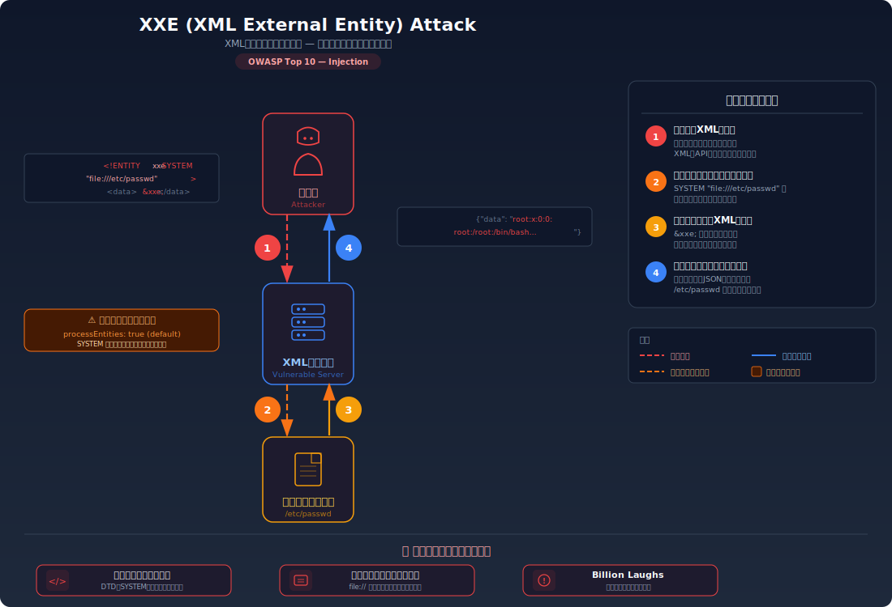
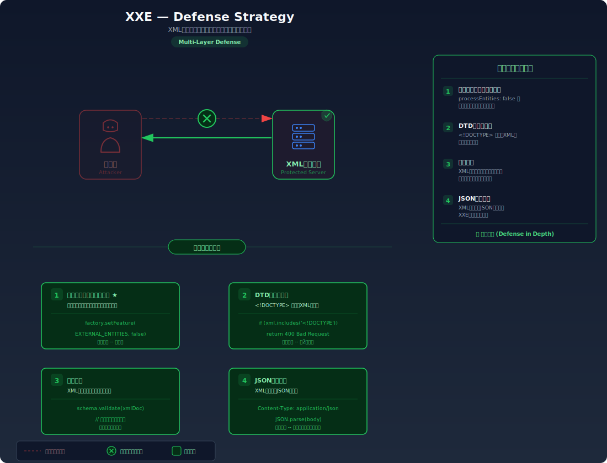

# XXE (XML External Entity) — XML外部エンティティによるファイル読み取り

> XMLデータを受け付けるAPIで外部エンティティの解決が有効になっていると、攻撃者がサーバー上の任意のファイル（`/etc/passwd` 等）を読み取れてしまう脆弱性を学びます。

---

## 対象ラボ

| 項目 | 内容 |
|------|------|
| **概要** | XMLパーサーが外部エンティティ（`<!ENTITY>`）を解決する設定になっているため、攻撃者が `file://` プロトコルでサーバー上のファイルを読み取れる |
| **攻撃例** | `<!DOCTYPE foo [<!ENTITY xxe SYSTEM "file:///etc/passwd">]><data>&xxe;</data>` |
| **技術スタック** | Hono API + XMLパーサー (fast-xml-parser) |
| **難易度** | ★★☆ 中級 |
| **前提知識** | XMLの基本構文、DTD（Document Type Definition）の概念、HTTPリクエストのContent-Type |

---

## この脆弱性を理解するための前提

### XML と DTD の仕組み

XML（eXtensible Markup Language）はデータ交換のためのマークアップ言語。XMLには **DTD（Document Type Definition）** という仕組みがあり、ドキュメント内で **エンティティ** を定義できる。エンティティは変数のようなもので、定義した値をドキュメント内で参照できる。

```xml
<?xml version="1.0"?>
<!-- 内部エンティティ: 文字列を変数のように定義 -->
<!DOCTYPE note [
  <!ENTITY company "Example Corp">
]>
<note>
  <to>管理者</to>
  <from>&company;</from>  <!-- "Example Corp" に展開される -->
</note>
```

さらに **外部エンティティ** を定義すると、`SYSTEM` キーワードでURLやファイルパスを指定し、外部リソースの内容をドキュメントに取り込むことができる。これは本来、共通のDTD定義を外部ファイルから読み込むための正規機能である。

### どこに脆弱性が生まれるのか

開発者がXML入力を受け付けるAPIを実装する際、XMLパーサーの **外部エンティティ解決がデフォルトで有効** になっている場合がある。攻撃者は外部エンティティに `file:///etc/passwd` のようなローカルファイルパスを指定し、パーサーにサーバー上のファイルを読み込ませることができる。

```typescript
// ⚠️ この部分が問題 — 外部エンティティの解決が有効なままXMLをパース
import { XMLParser } from 'fast-xml-parser';

app.post('/api/import', async (c) => {
  const xml = await c.req.text();

  // allowBooleanAttributes のみ設定し、外部エンティティを無効化していない
  const parser = new XMLParser({ allowBooleanAttributes: true });
  const result = parser.parse(xml);

  return c.json(result);
});
```

---

## 攻撃の仕組み



### 攻撃のシナリオ

1. **攻撃者** が外部エンティティを含むXMLを作成する

   通常のXMLデータの代わりに、DTDで `file://` プロトコルを使った外部エンティティを定義する。XMLの仕様上、これは正当な記法であるため、構文エラーにはならない。

   ```xml
   <?xml version="1.0"?>
   <!DOCTYPE foo [
     <!ENTITY xxe SYSTEM "file:///etc/passwd">
   ]>
   <import><data>&xxe;</data></import>
   ```

2. **サーバー** がXMLをパースし、外部エンティティを解決する

   XMLパーサーが `&xxe;` を見つけると、`SYSTEM` で指定された `file:///etc/passwd` の内容を読み取り、エンティティの値として展開する。結果として、サーバーのファイルシステムからファイル内容がXMLデータに埋め込まれる。

   ```json
   {
     "import": {
       "data": "root:x:0:0:root:/root:/bin/bash\ndaemon:x:1:1:..."
     }
   }
   ```

3. **攻撃者** がレスポンスからファイル内容を取得する

   サーバーはパース結果をJSONで返すため、攻撃者はレスポンスボディから `/etc/passwd` の内容をそのまま読み取れる。同じ手法で設定ファイル、環境変数、ソースコードなど任意のファイルを読み取れる。

### なぜ成功するのか

| 条件 | 説明 |
|------|------|
| 外部エンティティの解決が有効 | XMLパーサーが `SYSTEM` キーワードで指定されたURLやファイルパスを実際に解決してしまう。多くのパーサーではこれがデフォルト有効 |
| XMLの直接パース | サーバーがユーザーからのXML入力をそのままパーサーに渡し、DTD定義を含むXMLを拒否しない |
| パース結果のレスポンス返却 | パースしたデータをレスポンスに含めるため、読み取ったファイル内容が攻撃者に返される |

### 被害の範囲

- **機密性**: サーバー上の任意ファイル（`/etc/passwd`、設定ファイル、環境変数、秘密鍵、ソースコード）が読み取られる
- **完全性**: SSRF（Server-Side Request Forgery）と組み合わせて内部APIへのリクエストを送り、データを改ざんする可能性がある
- **可用性**: Billion Laughs Attack（再帰的エンティティ展開）によりメモリを枯渇させ、サーバーをクラッシュさせる

---

## 対策



### 根本原因

XMLパーサーが **外部エンティティの解決をデフォルトで許可** していることが根本原因。XMLの仕様上、外部エンティティは正規の機能だが、ユーザーからの入力をパースする用途では不要であり、無効化すべきである。

### 安全な実装

XMLパーサーの設定で外部エンティティの解決を明示的に無効化する。これにより、`<!ENTITY xxe SYSTEM "file:///...">` のような定義があっても、パーサーがファイルを読み取らなくなる。

```typescript
// ✅ 外部エンティティの解決を明示的に無効化
import { XMLParser } from 'fast-xml-parser';

app.post('/api/import', async (c) => {
  const xml = await c.req.text();

  const parser = new XMLParser({
    allowBooleanAttributes: true,
    // 外部エンティティの処理を無効化
    processEntities: false,
    // DTD内のエンティティ定義を無視
    htmlEntities: false,
  });
  const result = parser.parse(xml);

  return c.json(result);
});
```

#### 脆弱 vs 安全: コード比較

```diff
  const parser = new XMLParser({
    allowBooleanAttributes: true,
+   // 外部エンティティの処理を無効化
+   processEntities: false,
+   htmlEntities: false,
  });
```

脆弱なコードではパーサーがデフォルト設定のまま外部エンティティを解決する。安全なコードでは `processEntities: false` によりエンティティの展開自体を無効化し、外部ファイルの読み取りを不可能にしている。

### その他の防御策

| 対策 | 種類 | 説明 |
|------|------|------|
| 外部エンティティ無効化 | 根本対策 | XMLパーサーの設定で外部エンティティの解決を無効化する。これが最も効果的で必須 |
| DTD処理の完全無効化 | 根本対策 | DTD自体の処理を無効化し、`<!DOCTYPE>` を含むXMLを拒否する |
| JSONへの移行 | 根本対策 | XML の代わりに JSON を使用する。JSONにはエンティティの概念がないため、XXE は原理的に発生しない |
| 入力サイズ制限 | 多層防御 | XMLペイロードのサイズを制限し、Billion Laughs Attack によるメモリ枯渇を防ぐ |
| WAF | 検知 | `<!ENTITY` や `SYSTEM` を含むリクエストをパターンマッチで検知・遮断する |

---

## ハンズオン手順

### Step 1: 脆弱バージョンで攻撃を体験

**ゴール**: XXE攻撃でサーバー上の `/etc/passwd` ファイルを読み取れることを確認する

1. 開発サーバーを起動する

   ```bash
   cd backend && pnpm dev
   ```

2. XXEペイロードを含むXMLを送信する

   ```bash
   curl -X POST http://localhost:3000/api/labs/xxe/vulnerable/import \
     -H "Content-Type: application/xml" \
     -d '<?xml version="1.0"?>
   <!DOCTYPE foo [
     <!ENTITY xxe SYSTEM "file:///etc/passwd">
   ]>
   <import><data>&xxe;</data></import>'
   ```

3. 結果を確認する

   - レスポンスに `/etc/passwd` の内容が含まれる
   - `root:x:0:0:root:/root:/bin/bash` のようなシステムユーザー情報が表示される
   - **この結果が意味すること**: XMLパーサーが外部エンティティを解決し、サーバーのファイルシステムから直接ファイルを読み取っている

### Step 2: 安全バージョンで防御を確認

**ゴール**: 同じXXE攻撃が外部エンティティ無効化により失敗することを確認する

1. 安全なエンドポイントで同じ攻撃を試みる

   ```bash
   curl -X POST http://localhost:3000/api/labs/xxe/secure/import \
     -H "Content-Type: application/xml" \
     -d '<?xml version="1.0"?>
   <!DOCTYPE foo [
     <!ENTITY xxe SYSTEM "file:///etc/passwd">
   ]>
   <import><data>&xxe;</data></import>'
   ```

2. 結果を確認する

   - `&xxe;` がそのまま文字列として扱われるか、エラーが返される
   - `/etc/passwd` の内容は含まれない

3. コードの差分を確認する

   - `backend/src/labs/step06-server-side/xxe.ts` の脆弱版と安全版を比較
   - **どの行が違いを生んでいるか** に注目: `processEntities: false` の設定

### 確認ポイント

以下を自分の言葉で説明できれば、このラボは完了です:

- [ ] XXEが発生するための条件は何か（XMLのエンティティ機能とパーサー設定の関係）
- [ ] 攻撃者はどんなXMLを送り、パーサー内部でどう処理され、結果として何が起きるか
- [ ] なぜJSONではXXEが発生しないのか
- [ ] 安全な実装は「なぜ」この攻撃を無効化するのか（エンティティ処理の無効化がどう機能するか）

---

## 実装メモ

| 項目 | パス |
|------|------|
| 脆弱エンドポイント | `/api/labs/xxe/vulnerable/import` |
| 安全エンドポイント | `/api/labs/xxe/secure/import` |
| バックエンド | `backend/src/labs/step06-server-side/xxe.ts` |
| フロントエンド | `frontend/src/features/step06-server-side/pages/XXE.tsx` |

- XMLインポート機能を模したエンドポイントを用意
- 脆弱版ではXMLパーサーがデフォルト設定（外部エンティティ有効）
- 安全版では `processEntities: false` で外部エンティティを無効化
- テスト用のXMLペイロードをフロントエンドに用意しておく

---

## 現実世界での事例

| 年 | インシデント | 概要 |
|----|-------------|------|
| 2014 | Facebook | FacebookのCareerページでXXE脆弱性が発見され、サーバー上のファイル読み取りが可能だった。バグバウンティで$33,500が支払われた |
| 2018 | SAP | SAP NetWeaverのXMLパーサーにXXE脆弱性があり、内部システムの設定ファイルやクレデンシャルが読み取り可能だった（CVE-2018-2380） |

---

## 関連ラボ

| ラボ | 関連性 |
|------|--------|
| [SSRF](./ssrf.md) | XXEの `SYSTEM` キーワードで `http://` プロトコルを使うと、サーバーから内部ネットワークへのリクエストを送信でき、SSRFと同等の攻撃が可能 |
| [SQLインジェクション](../step02-injection/sql-injection.md) | XXEもSQLiも「ユーザー入力がコードとして解釈される」という共通の根本原因を持つ。XXEではXMLのDTD構文、SQLiではSQL構文 |

---

## 参考資料

- [OWASP - XXE](https://owasp.org/www-community/vulnerabilities/XML_External_Entity_(XXE)_Processing)
- [CWE-611: Improper Restriction of XML External Entity Reference](https://cwe.mitre.org/data/definitions/611.html)
