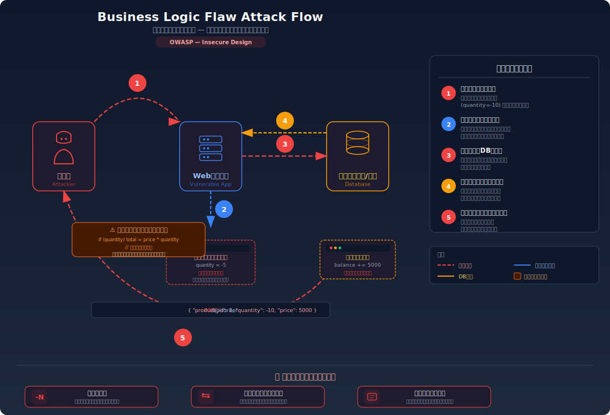
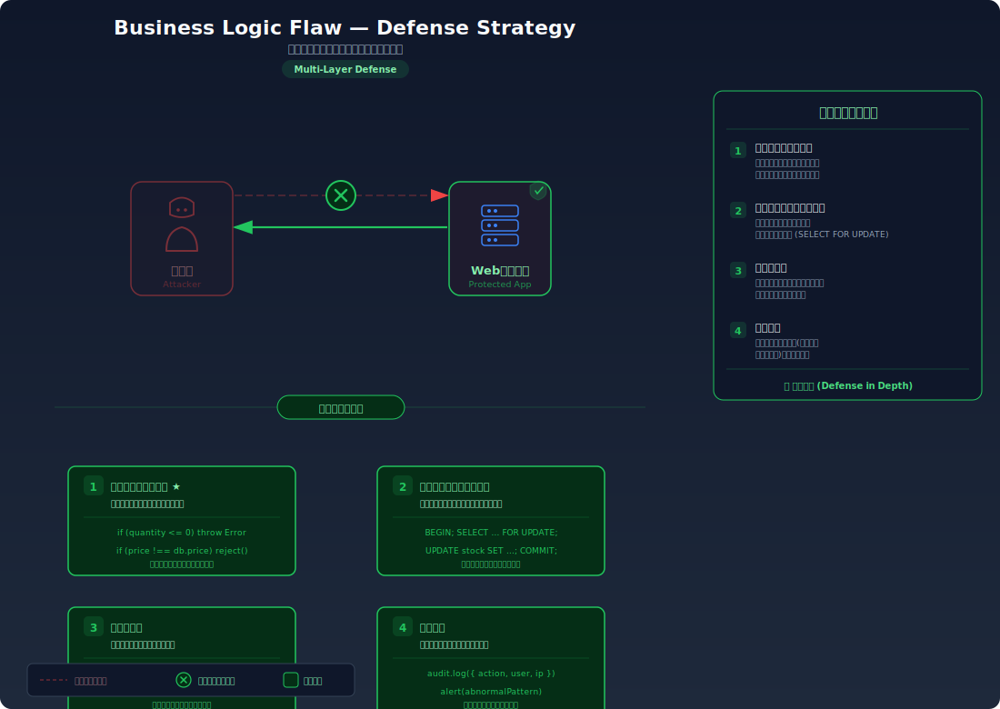

# Business Logic Flaws — アプリケーション固有のビジネスロジックに欠陥があり意図しない操作が可能

> 商品の価格を負の値にして残高を増やしたり、在庫チェックなしで在庫以上を注文できるなど、業務ルールの検証が不十分な問題です。

---

## 対象ラボ

| 項目 | 内容 |
|------|------|
| **概要** | 商品注文時の数量・価格チェックが不十分で、負の値や不正値を送信可能 |
| **攻撃例** | `{"quantity": -5, "price": 1000}` で残高が増加 |
| **技術スタック** | Hono API + PostgreSQL |
| **難易度** | ★★☆ 中級 |
| **前提知識** | REST API の基本、HTTP リクエストの構造 |

---

## この脆弱性を理解するための前提

### EC サイトの注文処理の仕組み

一般的な EC サイトでは、ユーザーが商品を購入するとき、以下の流れで処理が行われる:

1. ユーザーが商品を選び、数量を指定して「注文」ボタンを押す
2. サーバーが数量と単価から合計金額を算出する（合計 = 数量 × 単価）
3. ユーザーの残高から合計金額を差し引く（残高 = 残高 - 合計）
4. 注文レコードを作成し、在庫を減らす

```
注文リクエスト: { productId: 1, quantity: 3 }

サーバー側の処理:
  商品単価 = 1000円（DB から取得）
  合計 = 1000 × 3 = 3000円
  残高 = 10000 - 3000 = 7000円
  在庫 = 50 - 3 = 47個
```

この処理は、入力値（数量）が正の整数であること、単価がサーバー側で管理されていること、在庫が十分にあることを前提としている。

### どこに脆弱性が生まれるのか

問題は、サーバー側でクライアントから送信された値を **検証せずにそのまま計算に使っている** 場合に発生する。具体的には以下の条件が揃ったとき、業務ルールが破綻する:

- `quantity` が正の整数であることを検証していない（負の値やゼロが通る）
- `price`（単価）をクライアントから受け取り、DB の値と照合していない
- 在庫数量のチェックを行っていない

```typescript
// ⚠️ クライアントから送信された値をそのまま使用
app.post("/order", async (c) => {
  const { productId, quantity, price } = await c.req.json();
  const total = price * quantity; // 負の数量で total が負になる
  await db.query("UPDATE users SET balance = balance - $1", [total]);
  // balance - (-5000) = balance + 5000 → 残高が増える！
});
```

ここで `quantity` に `-5` が送信されると、`total = 1000 × (-5) = -5000` となる。SQL では `balance - (-5000)` は `balance + 5000` と等価なので、注文したはずなのに残高が **増加** してしまう。

---

## 攻撃の仕組み



### 攻撃のシナリオ

1. **攻撃者** が DevTools でリクエストを改ざんする --- 数量を `-5` に変更

   ブラウザの開発者ツール（DevTools）の Network タブやコンソールから、注文リクエストのボディを書き換える。フロントエンド側のバリデーション（`quantity > 0` のチェック等）は JavaScript で行われているだけなので、DevTools や curl を使えば簡単にバイパスできる。

   ```bash
   # 攻撃者が送信する改ざんされたリクエスト
   curl -X POST http://localhost:3000/api/labs/business-logic/vulnerable/order \
     -H "Content-Type: application/json" \
     -d '{"productId": 1, "quantity": -5, "price": 1000}'
   ```

2. **サーバー** が数量の正負をチェックせず計算する --- `total = 1000 × (-5) = -5000`

   サーバー側のコードはクライアントから受け取った `quantity` と `price` をそのまま乗算する。`quantity` が負の値であることを検証するロジックがないため、合計金額が負の値として計算される。

3. **データベース** に不正な値で更新クエリが実行される --- `balance - (-5000)` → `balance + 5000`

   SQL の `UPDATE users SET balance = balance - $1` に `total = -5000` が渡されると、`balance - (-5000)` すなわち `balance + 5000` が実行される。数学的に「負の値を引く」ことは「正の値を足す」ことと等しいため、残高が増加する。

4. **攻撃者の残高が不正に増加する**

   元の残高が 10,000 円だった場合、注文後の残高は 15,000 円になる。攻撃者は商品を受け取っていないが（数量が負なので出荷処理も破綻する）、残高だけが不正に増えた状態になる。この操作を繰り返すことで、残高を無限に増やすことが可能。

5. **在庫以上の数量注文も同様に可能**（在庫チェックなし）

   在庫が 10 個しかない商品に対して `quantity: 100` を送信しても、在庫チェックがないためそのまま注文が成立する。在庫が `-90` になるなど、データの整合性が完全に崩壊する。

### なぜ成功するのか

| 条件 | 説明 |
|------|------|
| サーバー側の入力値バリデーションがない | `quantity` が正の整数であること、`price` が DB の商品マスタと一致することを検証していない。フロントエンドのバリデーションだけに依存している |
| クライアント送信値をそのまま計算に使用 | 単価（`price`）をクライアントから受け取り、DB に格納された正規の価格と照合せずに使っている。攻撃者は価格を 0 や負の値に改ざんできる |
| 在庫チェックの欠如 | 注文前に在庫数量を確認していないため、在庫以上の数量を注文でき、在庫がマイナスになる |
| トランザクション制御の不備 | 残高の確認と更新が一つのトランザクション内で行われていないため、競合状態（レースコンディション）でも不正な注文が通る可能性がある |

### 被害の範囲

- **機密性**: 直接的な情報漏洩はないが、不正に増加させた残高で有料コンテンツや個人情報にアクセスできる可能性がある
- **完全性**: 残高・在庫・注文履歴といったビジネスデータの整合性が完全に破壊される。不正な残高増加により、実質的な金銭被害が発生する
- **可用性**: 在庫がマイナスになることで在庫管理システムが破綻し、正規ユーザーの注文処理に影響が出る。大量の不正注文によりシステム全体が不安定になる可能性がある

---

## 対策



### 根本原因

サーバー側で **ビジネスルール（業務ルール）の検証** を行っていないことが根本原因。Web アプリケーションでは、クライアントからの入力は常に改ざんされうるという前提で設計する必要がある。フロントエンドのバリデーションは UX の向上にはなるが、セキュリティの防御策にはならない。

具体的には以下の検証が欠けている:

- 数量が正の整数であること（`quantity > 0`）
- 単価がサーバー側の商品マスタと一致すること（クライアントの `price` を信頼しない）
- 在庫が注文数量以上であること
- 残高が合計金額以上であること

### 安全な実装

Zod によるスキーマバリデーション + DB 側の価格参照 + トランザクション制御を組み合わせて、ビジネスルールをサーバー側で厳密に検証する。

```typescript
import { z } from "zod";

// ✅ Zod でリクエストのスキーマを厳密に定義
const orderSchema = z.object({
  productId: z.number().int().positive(),
  quantity: z.number().int().positive(), // quantity > 0 を保証
});

app.post("/order", async (c) => {
  // ✅ バリデーション — 不正な値は早期にリジェクト
  const parsed = orderSchema.safeParse(await c.req.json());
  if (!parsed.success) {
    return c.json({ error: "入力値が不正です", details: parsed.error }, 400);
  }
  const { productId, quantity } = parsed.data;

  // ✅ トランザクションで一連の処理をアトミックに実行
  const client = await pool.connect();
  try {
    await client.query("BEGIN");

    // ✅ 商品情報を DB から取得（クライアントの price を信頼しない）
    const productResult = await client.query(
      "SELECT price, stock FROM products WHERE id = $1 FOR UPDATE",
      [productId]
    );
    const product = productResult.rows[0];
    if (!product) {
      await client.query("ROLLBACK");
      return c.json({ error: "商品が見つかりません" }, 404);
    }

    // ✅ 在庫チェック — 在庫不足なら注文を拒否
    if (product.stock < quantity) {
      await client.query("ROLLBACK");
      return c.json({ error: "在庫が不足しています" }, 400);
    }

    // ✅ DB の価格で合計を計算（改ざん不可能）
    const total = product.price * quantity;

    // ✅ 残高チェック — 残高不足なら注文を拒否
    const userResult = await client.query(
      "SELECT balance FROM users WHERE id = $1 FOR UPDATE",
      [userId]
    );
    if (userResult.rows[0].balance < total) {
      await client.query("ROLLBACK");
      return c.json({ error: "残高が不足しています" }, 400);
    }

    // ✅ 残高を減算し、在庫を減らす
    await client.query(
      "UPDATE users SET balance = balance - $1 WHERE id = $2",
      [total, userId]
    );
    await client.query(
      "UPDATE products SET stock = stock - $1 WHERE id = $2",
      [quantity, productId]
    );

    await client.query("COMMIT");
    return c.json({ message: "注文が完了しました", total });
  } catch (e) {
    await client.query("ROLLBACK");
    throw e;
  } finally {
    client.release();
  }
});
```

#### 脆弱 vs 安全: コード比較

```diff
  app.post("/order", async (c) => {
-   // ⚠️ クライアントの値をそのまま使用
-   const { productId, quantity, price } = await c.req.json();
-   const total = price * quantity;
-   await db.query("UPDATE users SET balance = balance - $1", [total]);
-   return c.json({ message: "注文完了" });
+   // ✅ Zod でバリデーション（quantity > 0 を保証）
+   const parsed = orderSchema.safeParse(await c.req.json());
+   if (!parsed.success) {
+     return c.json({ error: "入力値が不正です" }, 400);
+   }
+   const { productId, quantity } = parsed.data;
+
+   // ✅ トランザクション開始
+   const client = await pool.connect();
+   await client.query("BEGIN");
+
+   // ✅ DB から商品価格を取得（クライアントの price を使わない）
+   const product = (await client.query(
+     "SELECT price, stock FROM products WHERE id = $1 FOR UPDATE",
+     [productId]
+   )).rows[0];
+
+   // ✅ 在庫チェック
+   if (product.stock < quantity) {
+     await client.query("ROLLBACK");
+     return c.json({ error: "在庫が不足しています" }, 400);
+   }
+
+   // ✅ DB の価格で合計を計算
+   const total = product.price * quantity;
+
+   // ✅ 残高チェック + 更新 + 在庫更新
+   await client.query("UPDATE users SET balance = balance - $1 WHERE id = $2", [total, userId]);
+   await client.query("UPDATE products SET stock = stock - $1 WHERE id = $2", [quantity, productId]);
+   await client.query("COMMIT");
+   return c.json({ message: "注文が完了しました", total });
  });
```

脆弱なコードではクライアントから送信された `price` と `quantity` をそのまま計算に使用しており、負の値や不正な価格でもチェックなく処理されてしまう。安全なコードでは Zod で `quantity > 0` を保証し、価格は DB から取得し、在庫・残高をトランザクション内で検証してからのみ更新を実行する。

### その他の防御策

| 対策 | 種類 | 説明 |
|------|------|------|
| サーバー側バリデーション (Zod 等) | 根本対策 | 数量が正の整数であること、必須フィールドが存在することをスキーマレベルで保証する。フロントエンドのバリデーションは UX 向上のためであり、セキュリティ対策にはならない |
| DB からの価格参照 | 根本対策 | 単価をクライアントから受け取らず、サーバー側で商品マスタから取得する。改ざんの余地を根本的に排除する |
| 在庫・残高の事前チェック | 根本対策 | 注文処理の前に在庫数量と残高を確認し、不足している場合はリクエストを拒否する |
| トランザクション制御 (BEGIN / COMMIT) | 根本対策 | チェックと更新をアトミックに実行し、競合状態による不整合を防ぐ。`SELECT ... FOR UPDATE` で行ロックを取得する |
| DB 制約 (CHECK 制約) | 多層防御 | `CHECK (balance >= 0)` や `CHECK (stock >= 0)` をテーブルに設定し、アプリケーション層のバグがあってもデータの整合性を保つ |
| 監査ログ | 検知 | 全注文処理のログを記録し、異常なパターン（負の金額、高頻度の注文等）を検知するアラートを設定する |

---

## ハンズオン手順

### Step 1: 脆弱バージョンで攻撃を体験

**ゴール**: 負の数量を送信して残高を不正に増加させ、在庫以上の数量を注文できることを確認する

1. 開発サーバーを起動する

   ```bash
   cd backend && pnpm dev
   ```

2. まず正常な注文を送信して、現在の残高を確認する

   ```bash
   # 商品一覧と残高を確認
   curl http://localhost:3000/api/labs/business-logic/vulnerable/status
   ```

3. 数量を負の値にした注文リクエストを送信する

   ```bash
   # 脆弱なエンドポイントに負の数量で注文を送信
   curl -X POST http://localhost:3000/api/labs/business-logic/vulnerable/order \
     -H "Content-Type: application/json" \
     -d '{"productId": 1, "quantity": -5, "price": 1000}'
   ```

4. 結果を確認する

   - 注文が「成功」として処理されている
   - 残高が元の値より **増加** している（例: 10,000 円 → 15,000 円）
   - **この結果が意味すること**: `total = 1000 × (-5) = -5000` が計算され、`balance - (-5000) = balance + 5000` が実行された

5. 在庫以上の数量を注文する

   ```bash
   # 在庫が10個の商品に対して100個を注文
   curl -X POST http://localhost:3000/api/labs/business-logic/vulnerable/order \
     -H "Content-Type: application/json" \
     -d '{"productId": 1, "quantity": 100, "price": 1000}'
   ```

6. 結果を確認する

   - 在庫チェックがないため注文が成立してしまう
   - 在庫がマイナスになっている
   - **この結果が意味すること**: サーバー側に在庫数量の検証ロジックが存在しない

### Step 2: 安全バージョンで防御を確認

**ゴール**: 同じ攻撃がサーバー側のバリデーションにより拒否されることを確認する

1. 負の数量で注文を試みる

   ```bash
   # 安全なエンドポイントに負の数量で注文を送信
   curl -X POST http://localhost:3000/api/labs/business-logic/secure/order \
     -H "Content-Type: application/json" \
     -d '{"productId": 1, "quantity": -5, "price": 1000}'
   ```

2. 結果を確認する

   - `400 Bad Request` が返され、「入力値が不正です」とエラーになる
   - Zod のバリデーションにより `quantity` が正の整数でないことが検出されている
   - **残高は一切変更されていない**

3. 在庫以上の数量で注文を試みる

   ```bash
   # 安全なエンドポイントに在庫以上の数量で注文を送信
   curl -X POST http://localhost:3000/api/labs/business-logic/secure/order \
     -H "Content-Type: application/json" \
     -d '{"productId": 1, "quantity": 100}'
   ```

4. 結果を確認する

   - `400 Bad Request` が返され、「在庫が不足しています」とエラーになる
   - トランザクション内で在庫チェックが行われ、不足の場合は ROLLBACK されている

5. コードの差分を確認する

   - `backend/src/labs/step07-design/business-logic.ts` の脆弱版と安全版を比較
   - **どの行が違いを生んでいるか** に注目: Zod バリデーション、DB からの価格取得、在庫・残高チェック、トランザクション制御

### 確認ポイント

以下を自分の言葉で説明できれば、このラボは完了です:

- [ ] ビジネスロジックの欠陥が発生するための条件は何か（なぜフロントエンドのバリデーションだけでは不十分なのか）
- [ ] `quantity = -5` を送信したとき、サーバー内部でどのような計算が行われ、なぜ残高が増加するのか
- [ ] 単価をクライアントから受け取ることのリスクは何か（`price: 0` を送信したらどうなるか）
- [ ] トランザクション制御がないと、在庫チェックと在庫更新の間にどのような問題が起こりうるか
- [ ] DB の CHECK 制約 (`CHECK (balance >= 0)`) がアプリケーション層の防御と異なる役割を果たす理由

---

## 実装メモ

| 項目 | パス |
|------|------|
| 脆弱エンドポイント | `/api/labs/business-logic/vulnerable/order` |
| 安全エンドポイント | `/api/labs/business-logic/secure/order` |
| バックエンド | `backend/src/labs/step07-design/business-logic.ts` |
| フロントエンド | `frontend/src/features/step07-design/pages/BusinessLogic.tsx` |
| DB | `docker/db/init.sql` の `users`, `products` テーブルを使用 |

- 脆弱版ではクライアントの `quantity` と `price` をそのまま計算に使用し、バリデーションや在庫チェックを一切行わない
- 安全版では Zod でスキーマバリデーションを行い、価格は DB の商品マスタから取得し、在庫・残高をトランザクション内でチェックする
- `SELECT ... FOR UPDATE` で行ロックを取得し、同時注文による競合状態を防止する
- テストデータは `backend/src/db/seed.ts` で投入される商品・ユーザーデータを使用

---

## 現実世界での事例

| 年 | インシデント | 概要 |
|----|-------------|------|
| 2014 | Flexcoin (ビットコイン取引所) | 送金処理のレースコンディションを悪用され、残高チェックをバイパスして約 896 BTC（当時約 60 万ドル）が不正に引き出された。取引所は閉鎖に追い込まれた |
| 2017 | Uber (バグバウンティ報告) | 運賃計算ロジックに負の値を挿入することで、運賃を不正に操作できるバグが報告された。支払い金額が異常に低くなる、またはドライバーへの支払いが増加する可能性があった |
| 2019 | 各種 EC プラットフォーム | クーポンコードの適用回数制限がなく、同一クーポンを複数回適用して割引額を無限に増加させる攻撃が複数の EC サイトで報告された |

---

## 関連ラボ

| ラボ | 関連性 |
|------|--------|
| [署名なしデータの信頼](unsigned-data.md) | ビジネスロジックの欠陥と同様に、クライアントから送信されたデータ（Cookie、hidden フィールド等）をサーバー側で検証せずに信頼する問題。価格の改ざんは両方のラボに共通するテーマ |
| [レート制限なし](rate-limiting.md) | レート制限がない場合、ビジネスロジックの欠陥を自動化して大量の不正注文を短時間で実行できる。両方の対策を組み合わせることで防御が強化される |
| [レースコンディション](../step08-advanced/race-condition.md) | 在庫チェックと更新の間のタイミング差を突く攻撃。ビジネスロジックの欠陥の一形態であり、トランザクション制御による対策が共通する |

---

## 参考資料

- [OWASP - Business Logic Testing](https://owasp.org/www-project-web-security-testing-guide/latest/4-Web_Application_Security_Testing/10-Business_Logic_Testing/)
- [CWE-840: Business Logic Errors](https://cwe.mitre.org/data/definitions/840.html)
