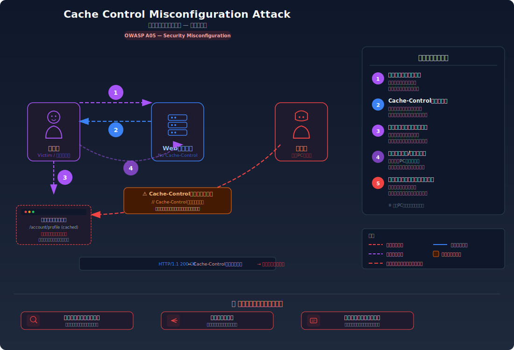
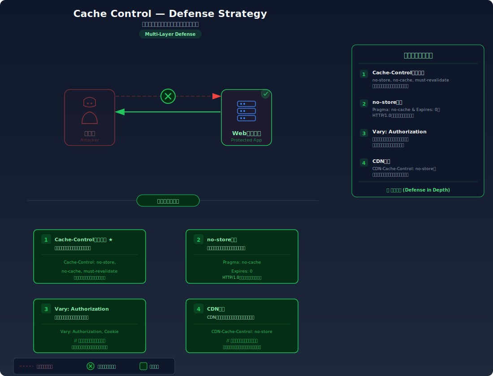

# Cache Control — キャッシュ制御の不備による情報漏洩

> 機密情報を含むレスポンスにキャッシュ制御ヘッダーが設定されていないため、ブラウザキャッシュや共有プロキシに機密データが残存し、他のユーザーやアプリケーションから閲覧可能になる問題です。

---

## 対象ラボ

| 項目 | 内容 |
|------|------|
| **概要** | マイページ等の機密レスポンスに `Cache-Control` ヘッダーが設定されておらず、ブラウザキャッシュや CDN/プロキシキャッシュに認証済みの個人情報が残存する |
| **攻撃例** | 共有 PC でログアウト後に「戻る」ボタンを押すと前のユーザーのマイページが表示される / CDN がキャッシュした認証済みレスポンスが別のユーザーに返される |
| **技術スタック** | Hono API |
| **難易度** | ★★☆ 中級 |
| **前提知識** | HTTP レスポンスヘッダーの基本、ブラウザキャッシュの概念、CDN/リバースプロキシの役割 |

---

## この脆弱性を理解するための前提

### HTTP キャッシュの仕組み

HTTP には、同じリソースへの繰り返しアクセスを高速化するためのキャッシュ機構が組み込まれている。サーバーがレスポンスヘッダーでキャッシュの扱い方を指示し、ブラウザや中間プロキシがそれに従ってレスポンスを保存・再利用する。

主なキャッシュ制御ヘッダーは以下の通り:

| ヘッダー | 役割 |
|----------|------|
| `Cache-Control` | キャッシュの動作を細かく制御する最も重要なヘッダー。`no-store`、`no-cache`、`private`、`max-age` 等のディレクティブを指定する |
| `Expires` | キャッシュの有効期限を日時で指定する（HTTP/1.0 由来）。`Cache-Control` が存在する場合はそちらが優先される |
| `ETag` | レスポンスの内容を識別するハッシュ値。ブラウザが `If-None-Match` ヘッダーで送信し、サーバーが内容の変更有無を判定する（条件付きリクエスト） |
| `Last-Modified` | リソースの最終更新日時。ブラウザが `If-Modified-Since` で送信し、サーバーが変更有無を判定する |

```
HTTP/1.1 200 OK
Cache-Control: private, max-age=0, no-cache, must-revalidate
Content-Type: application/json
ETag: "abc123"

{"name": "Alice", "email": "alice@example.com"}
```

上記のように `Cache-Control` が適切に設定されていれば、ブラウザは毎回サーバーに問い合わせを行い、古いキャッシュを勝手に表示することはない。

### ブラウザキャッシュと共有キャッシュの違い

HTTP キャッシュには2種類ある:

- **プライベートキャッシュ（ブラウザキャッシュ）**: 個々のブラウザがローカルに保存するキャッシュ。そのユーザーだけがアクセスする前提
- **共有キャッシュ（CDN / リバースプロキシ）**: 複数のユーザーからのリクエストを処理するサーバーが保存するキャッシュ。一度キャッシュされたレスポンスが他のユーザーにも返される可能性がある

```
[ブラウザ] → [CDN/プロキシ（共有キャッシュ）] → [オリジンサーバー]
              ↑ ここにキャッシュされた認証済み
                レスポンスが別ユーザーに返される危険
```

`Cache-Control: private` はブラウザキャッシュのみ許可し、共有キャッシュへの保存を禁止する。`Cache-Control: no-store` はブラウザキャッシュを含むすべてのキャッシュを禁止する。

### 「戻る」ボタンとキャッシュの関係

ブラウザの「戻る」ボタンは、ネットワークリクエストを送信せずに**ブラウザキャッシュ（back-forward cache, bfcache）** からページを復元する。`Cache-Control` ヘッダーが設定されていない場合、ブラウザは以前表示したページをそのままキャッシュから表示する。

これが問題になるのは共有 PC の場合:

1. ユーザー A がログインしてマイページを閲覧する
2. ユーザー A がログアウトする
3. ユーザー B が同じ PC でブラウザの「戻る」ボタンを押す
4. ブラウザキャッシュからユーザー A のマイページが表示される

ログアウト処理でセッションを無効化しても、ブラウザキャッシュにはレスポンスが残っているため、サーバーへの再問い合わせなしに表示されてしまう。

### どこに脆弱性が生まれるのか

機密情報を返すAPIが `Cache-Control` ヘッダーを一切設定していない場合、ブラウザや中間プロキシはデフォルトのキャッシュ動作に従ってレスポンスを保存する。多くのブラウザや CDN はキャッシュ制御ヘッダーが未指定のレスポンスをキャッシュ可能と判断する。

```typescript
// ⚠️ Cache-Control ヘッダーが未設定 — レスポンスがキャッシュされる
app.get("/profile", async (c) => {
  const user = await getCurrentUser(c);
  // 個人情報を含むレスポンスだが、キャッシュ制御の指示がない
  // ブラウザや CDN がこのレスポンスを保存し、再利用してしまう
  return c.json({
    name: user.name,
    email: user.email,
    address: user.address,
    phone: user.phone,
  });
});
```

このコードでは認証チェック自体は正しく行われているかもしれないが、サーバーがレスポンスの「キャッシュしてよいかどうか」をブラウザに伝えていない。結果として:

- ブラウザがレスポンスをディスクキャッシュに保存し、「戻る」ボタンで再表示される
- CDN やリバースプロキシがレスポンスをキャッシュし、別のユーザーに同じレスポンスを返す

---

## 攻撃の仕組み



### 攻撃のシナリオ

#### シナリオ 1: 共有 PC での「戻る」ボタンによる情報漏洩

1. **被害者（ユーザー A）** が共有 PC でログインし、マイページを閲覧する

   図書館やインターネットカフェ等の共有 PC でWebサービスにログインし、マイページ（名前、メールアドレス、住所、電話番号等の個人情報が表示されるページ）を閲覧する。

   ```
   GET /api/labs/cache-control/vulnerable/profile HTTP/1.1
   Cookie: session_id=abc123

   → HTTP/1.1 200 OK
     Content-Type: application/json
     （Cache-Control ヘッダーなし）

     {"name": "Alice", "email": "alice@example.com", "address": "東京都..."}
   ```

   サーバーは `Cache-Control` ヘッダーを返さないため、ブラウザはこのレスポンスをディスクキャッシュに保存する。

2. **被害者（ユーザー A）** がログアウトする

   ログアウト処理によりサーバー側のセッションは無効化される。しかし、ブラウザのディスクキャッシュに保存されたレスポンスは削除されない。

3. **攻撃者（次のユーザー B）** が同じ PC でブラウザの「戻る」ボタンを押す

   ブラウザは「戻る」操作時にネットワークリクエストを送信せず、ディスクキャッシュに保存された以前のレスポンスをそのまま表示する。`Cache-Control: no-store` が設定されていないため、ブラウザはキャッシュの利用を正当と判断する。

4. **攻撃者** がユーザー A の個人情報を閲覧する

   マイページがキャッシュから復元され、ユーザー A の名前、メールアドレス、住所、電話番号等がそのまま表示される。攻撃者は特別なツールを必要とせず、ブラウザの標準機能だけで情報を取得できる。

#### シナリオ 2: CDN/プロキシキャッシュによる他ユーザーへのレスポンス漏洩

1. **ユーザー A** がログイン済みの状態でマイページにアクセスする

   リクエストは CDN/リバースプロキシを経由してオリジンサーバーに到達し、ユーザー A の個人情報を含むレスポンスが返される。

   ```
   [ユーザー A] → [CDN] → [オリジンサーバー]
                  ↓
         レスポンスをキャッシュ（Cache-Control が未設定のため）
   ```

2. **CDN/プロキシ** が `Cache-Control` 未設定のレスポンスをキャッシュする

   `Cache-Control` ヘッダーが存在しない場合、CDN やリバースプロキシはヒューリスティック（経験則）に基づいてレスポンスをキャッシュすることがある。特に `200 OK` のレスポンスで `Cache-Control` が未指定の場合、`Last-Modified` ヘッダーの値から有効期限を推定してキャッシュする CDN が多い。

3. **ユーザー B**（別のユーザー）が同じ URL にアクセスする

   CDN はキャッシュヒットと判断し、オリジンサーバーに問い合わせることなく、キャッシュされたユーザー A のレスポンスをユーザー B に返す。

   ```
   [ユーザー B] → [CDN] → キャッシュヒット！
                  ↓
         ユーザー A のレスポンスをユーザー B に返す

   → HTTP/1.1 200 OK
     X-Cache: HIT
     Content-Type: application/json

     {"name": "Alice", "email": "alice@example.com", "address": "東京都..."}
   ```

4. **ユーザー B** がユーザー A の個人情報を閲覧する

   ユーザー B は自分のマイページを見るつもりだったが、CDN キャッシュによりユーザー A の個人情報が表示される。この問題は CDN のキャッシュが有効な間、同じ URL にアクセスするすべてのユーザーに影響する。

### なぜ成功するのか

| 条件 | 説明 |
|------|------|
| `Cache-Control` ヘッダーの未設定 | サーバーがレスポンスのキャッシュ可否を明示しないため、ブラウザや CDN がデフォルトの動作でキャッシュしてしまう |
| 機密データを含むレスポンス | プロフィール情報、メールアドレス、住所等の個人情報がレスポンスに含まれているため、キャッシュされると情報漏洩に直結する |
| 共有環境の利用 | 共有 PC ではブラウザキャッシュが他のユーザーにアクセス可能。CDN/プロキシ経由ではネットワーク上の全ユーザーが影響を受ける |
| ログアウトがキャッシュを消去しない | ログアウト処理はサーバー側のセッションを無効化するが、ブラウザのディスクキャッシュや CDN キャッシュには影響しない |

### 被害の範囲

- **機密性**: ユーザーの個人情報（氏名、メールアドレス、住所、電話番号、クレジットカード情報等）がキャッシュ経由で他者に閲覧される。CDN キャッシュの場合は影響範囲が広く、不特定多数のユーザーに機密情報が配信される可能性がある
- **完全性**: 直接的なデータ改ざんは発生しないが、漏洩した個人情報がフィッシング攻撃やソーシャルエンジニアリングに利用され、二次的な被害につながる
- **可用性**: サービス自体の可用性への直接的な影響は限定的だが、インシデント発覚後の CDN キャッシュパージや緊急対応によりサービス停止が必要になる場合がある

---

## 対策



### 根本原因

機密情報を含むレスポンスに対して、サーバーがキャッシュの禁止を明示的に指示していないこと。HTTP のキャッシュ機構はパフォーマンス最適化のために設計されており、指示がなければキャッシュを「許可」する方向に動作する。機密データを扱うエンドポイントでは、開発者が明示的に「このレスポンスはキャッシュしてはならない」とヘッダーで指示する必要がある。

### 安全な実装

機密情報を含むすべてのレスポンスに `Cache-Control: no-store, no-cache, must-revalidate, private` と `Pragma: no-cache` を設定する。

```typescript
// ✅ 機密レスポンスにキャッシュ禁止ヘッダーを設定
// no-store: レスポンスを一切キャッシュに保存しない（最も強力）
// no-cache: キャッシュを使用する前に必ずサーバーに問い合わせる
// must-revalidate: キャッシュ期限切れ後は必ずサーバーに再検証する
// private: 共有キャッシュ（CDN/プロキシ）への保存を禁止する
app.get("/profile", async (c) => {
  const user = await getCurrentUser(c);

  // キャッシュ制御ヘッダーを設定
  c.header("Cache-Control", "no-store, no-cache, must-revalidate, private");
  c.header("Pragma", "no-cache");   // HTTP/1.0 クライアントとの互換性
  c.header("Expires", "0");         // HTTP/1.0 プロキシとの互換性

  return c.json({
    name: user.name,
    email: user.email,
    address: user.address,
    phone: user.phone,
  });
});
```

**なぜ安全か**: `no-store` ディレクティブにより、ブラウザはレスポンスをディスクキャッシュに保存しない。「戻る」ボタンが押された場合、キャッシュにデータが存在しないため、ブラウザはサーバーに再リクエストを送信する。ログアウト後はセッションが無効なため認証エラーとなり、個人情報は表示されない。`private` ディレクティブにより、CDN やリバースプロキシはレスポンスをキャッシュに保存しないため、他のユーザーに認証済みレスポンスが返されることもない。

#### Cache-Control ディレクティブの使い分け

| ディレクティブ | 効果 | 用途 |
|----------------|------|------|
| `no-store` | レスポンスを一切保存しない | パスワード、個人情報、金融データ等の最高機密レスポンス |
| `no-cache` | 保存はするが使用前に必ずサーバーに問い合わせる | 頻繁に更新されるデータ、最新性が重要なレスポンス |
| `must-revalidate` | キャッシュ期限切れ後は必ず再検証する | `max-age` と組み合わせて使用 |
| `private` | 共有キャッシュへの保存を禁止 | ユーザー固有のレスポンス（プロフィール等） |
| `public` | 共有キャッシュへの保存を明示的に許可 | 静的アセット（CSS、JS、画像）等の共通リソース |

機密データには `no-store` と `private` を組み合わせるのが最も安全。`no-cache` だけでは条件付きリクエスト（`If-None-Match` / `If-Modified-Since`）による再検証が行われるものの、ブラウザのローカルストレージにデータが残る点に注意が必要。

#### ミドルウェアによる一括適用

認証が必要なすべてのエンドポイントに対して、ミドルウェアでキャッシュ制御ヘッダーを一括設定する方法が効率的かつ漏れを防げる。

```typescript
// ✅ 認証済みエンドポイント全体にキャッシュ禁止を一括適用
const noCacheMiddleware = async (c: Context, next: Next) => {
  await next();
  // レスポンスに機密データが含まれる可能性があるため、一律でキャッシュを禁止
  c.header("Cache-Control", "no-store, no-cache, must-revalidate, private");
  c.header("Pragma", "no-cache");
  c.header("Expires", "0");
};

// 認証が必要な全ルートに適用
app.use("/api/account/*", authMiddleware, noCacheMiddleware);
app.use("/api/profile/*", authMiddleware, noCacheMiddleware);
app.use("/api/settings/*", authMiddleware, noCacheMiddleware);
```

#### 脆弱 vs 安全: コード比較

```diff
  app.get("/profile", async (c) => {
    const user = await getCurrentUser(c);

+   // 機密レスポンスのキャッシュを禁止
+   c.header("Cache-Control", "no-store, no-cache, must-revalidate, private");
+   c.header("Pragma", "no-cache");
+   c.header("Expires", "0");

    return c.json({
      name: user.name,
      email: user.email,
      address: user.address,
      phone: user.phone,
    });
  });
```

脆弱なコードではレスポンスヘッダーにキャッシュ制御の指示が一切ないため、ブラウザや CDN がレスポンスを自由にキャッシュする。安全なコードでは3行のヘッダー追加により、ブラウザはレスポンスをディスクに保存しなくなり、CDN/プロキシもキャッシュしなくなる。この3行が「戻る」ボタンによる情報漏洩と CDN 経由の情報漏洩の両方を防止する。

### その他の防御策

| 対策 | 種類 | 説明 |
|------|------|------|
| `Cache-Control: no-store, private` の設定 | 根本対策 | 機密レスポンスのキャッシュを完全に禁止する。これが最も重要かつ必須の対策 |
| `Pragma: no-cache` + `Expires: 0` | 多層防御 | HTTP/1.0 準拠のプロキシやレガシークライアントとの互換性を確保する。`Cache-Control` を理解しない古いシステムへの対策 |
| CDN のキャッシュルール設定 | 多層防御 | CDN 側で認証済みレスポンス（`Authorization` ヘッダーや Cookie を含むリクエストへのレスポンス）をキャッシュしないルールを設定する |
| `Vary: Cookie` ヘッダー | 多層防御 | Cookie の値ごとにキャッシュを分離する。同じ URL でもユーザーごとに異なるキャッシュエントリが作成される |
| レスポンスヘッダーの監査 | 検知 | CI/CD パイプラインやセキュリティスキャナーで、機密エンドポイントの `Cache-Control` ヘッダーが正しく設定されているかを定期的に検証する |

---

## ハンズオン手順

### Step 1: 脆弱バージョンで攻撃を体験

**ゴール**: キャッシュ制御ヘッダーが未設定の状態で、レスポンスがキャッシュされていることを確認する

1. 開発サーバーを起動する

   ```bash
   cd backend && pnpm dev
   ```

2. 脆弱なエンドポイントのレスポンスヘッダーを確認する

   ```bash
   # レスポンスヘッダーだけを表示
   curl -I http://localhost:3000/api/labs/cache-control/vulnerable/profile \
     -H "Cookie: session_id=test-session"
   ```

3. レスポンスヘッダーを観察する

   - `Cache-Control` ヘッダーが存在しないことを確認する
   - `Pragma` ヘッダーが存在しないことを確認する
   - `Expires` ヘッダーが存在しないことを確認する
   - **この結果が意味すること**: ブラウザや CDN はこのレスポンスを自由にキャッシュできる状態

4. ブラウザで動作を確認する

   - ブラウザで `http://localhost:5173/labs/cache-control` にアクセスする
   - 脆弱バージョンのプロフィールページを表示する
   - DevTools の **Network** タブを開き、プロフィール API のレスポンスヘッダーを確認する
   - ページを離れてから「戻る」ボタンを押し、キャッシュからプロフィールが表示されることを確認する
   - Network タブで「戻る」操作時にネットワークリクエストが発生していないことを確認する（`(disk cache)` と表示される）

5. DevTools の Application タブでキャッシュを確認する

   - **Application** → **Cache Storage** または **Back/forward cache** セクションを確認する
   - レスポンスがキャッシュに保存されていることを確認する

### Step 2: 安全バージョンで防御を確認

**ゴール**: 同じアクセスパターンで、キャッシュ制御ヘッダーによりレスポンスがキャッシュされないことを確認する

1. 安全なエンドポイントのレスポンスヘッダーを確認する

   ```bash
   curl -I http://localhost:3000/api/labs/cache-control/secure/profile \
     -H "Cookie: session_id=test-session"
   ```

2. レスポンスヘッダーの違いを確認する

   - `Cache-Control: no-store, no-cache, must-revalidate, private` が設定されていることを確認する
   - `Pragma: no-cache` が設定されていることを確認する
   - `Expires: 0` が設定されていることを確認する

3. 脆弱バージョンと安全バージョンのヘッダーを並べて比較する

   ```bash
   # 脆弱バージョン
   echo "=== 脆弱バージョン ==="
   curl -sI http://localhost:3000/api/labs/cache-control/vulnerable/profile \
     -H "Cookie: session_id=test-session"

   echo ""

   # 安全バージョン
   echo "=== 安全バージョン ==="
   curl -sI http://localhost:3000/api/labs/cache-control/secure/profile \
     -H "Cookie: session_id=test-session"
   ```

4. ブラウザで安全バージョンの動作を確認する

   - 安全バージョンのプロフィールページを表示する
   - ページを離れてから「戻る」ボタンを押す
   - Network タブでサーバーへの再リクエストが発生していることを確認する（`(disk cache)` ではなく実際のリクエスト）
   - **この違いが意味すること**: `no-store` によりブラウザがレスポンスをキャッシュに保存しないため、毎回サーバーに問い合わせが行われる

5. コードの差分を確認する

   - `backend/src/labs/step07-design/cache-control.ts` の脆弱版と安全版を比較
   - **ヘッダー設定の3行** が攻撃を防いでいることに注目する

### 確認ポイント

以下を自分の言葉で説明できれば、このラボは完了です:

- [ ] `Cache-Control` ヘッダーが未設定の場合、ブラウザや CDN がどのようにレスポンスを扱うか
- [ ] 共有 PC で「戻る」ボタンにより情報漏洩が起きる仕組み（ログアウトがキャッシュを消去しない理由）
- [ ] `no-store` と `no-cache` の違い、それぞれがどのレベルのキャッシュに影響するか
- [ ] `private` ディレクティブが CDN キャッシュによる情報漏洩をどのように防ぐか
- [ ] `Pragma: no-cache` が必要な理由（HTTP/1.0 互換性）

---

## 実装メモ

| 項目 | パス |
|------|------|
| 脆弱エンドポイント | `/api/labs/cache-control/vulnerable/profile` |
| 安全エンドポイント | `/api/labs/cache-control/secure/profile` |
| バックエンド | `backend/src/labs/step07-design/cache-control.ts` |
| フロントエンド | `frontend/src/features/step07-design/pages/CacheControl.tsx` |

- 脆弱版: `Cache-Control` ヘッダーなし。プロフィール情報をそのまま返す。ブラウザや CDN がレスポンスをキャッシュ可能
- 安全版: `Cache-Control: no-store, no-cache, must-revalidate, private` + `Pragma: no-cache` + `Expires: 0` を付与
- 両バージョンともダミーのプロフィールデータ（名前、メールアドレス、住所、電話番号）を返す
- フロントエンドでは脆弱版と安全版のレスポンスヘッダーを並べて表示し、DevTools を使わなくてもヘッダーの違いを確認できるようにする

---

## 現実世界での事例

| 年 | インシデント | 概要 |
|----|-------------|------|
| 2019 | Cloudflare CDN バグによるキャッシュ汚染 | CDN の設定不備により、認証済みレスポンスがキャッシュされ、別のユーザーの個人情報が返されるインシデントが複数のサービスで発生した |
| 2017 | Cloudbleed | Cloudflare のリバースプロキシのバグにより、他サイトの HTML レスポンスに別リクエストのデータ（認証トークン、パスワード等）が混入し、検索エンジンのキャッシュにも保存された |

---

## 関連ラボ

| ラボ | 関連性 |
|------|--------|
| [HTTPでの機密データ送信](sensitive-data-http.md) | 通信経路でのデータ保護という観点で共通。本ラボはキャッシュによる残存、sensitive-data-http は平文通信による傍受が問題 |
| [セキュリティヘッダー](../step06-server-side/cors-misconfiguration.md) | HTTPレスポンスヘッダーの設定不備が脆弱性の原因となる点が共通。キャッシュ制御も CORS 設定もサーバー側のヘッダー管理の問題 |
| [セッションハイジャック](../step04-session/session-hijacking.md) | キャッシュに残存したセッション情報やプロフィールデータが、セッションハイジャックの足がかり（個人情報の収集）に利用される可能性がある |

---

## 参考資料

- [OWASP - Testing for Browser Cache Weaknesses](https://owasp.org/www-project-web-security-testing-guide/latest/4-Web_Application_Security_Testing/04-Authentication_Testing/06-Testing_for_Browser_Cache_Weaknesses)
- [CWE-524: Use of Cache Containing Sensitive Information](https://cwe.mitre.org/data/definitions/524.html)
- [CWE-525: Use of Web Browser Cache Containing Sensitive Information](https://cwe.mitre.org/data/definitions/525.html)
- [MDN - Cache-Control](https://developer.mozilla.org/ja/docs/Web/HTTP/Headers/Cache-Control)
- [MDN - HTTP caching](https://developer.mozilla.org/ja/docs/Web/HTTP/Caching)
- [OWASP - Session Management Cheat Sheet (Cache Control)](https://cheatsheetseries.owasp.org/cheatsheets/Session_Management_Cheat_Sheet.html#web-content-caching)
