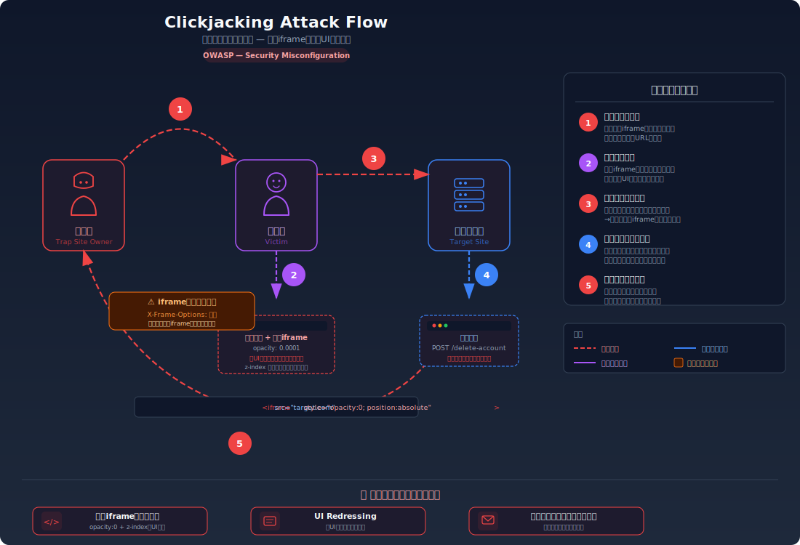
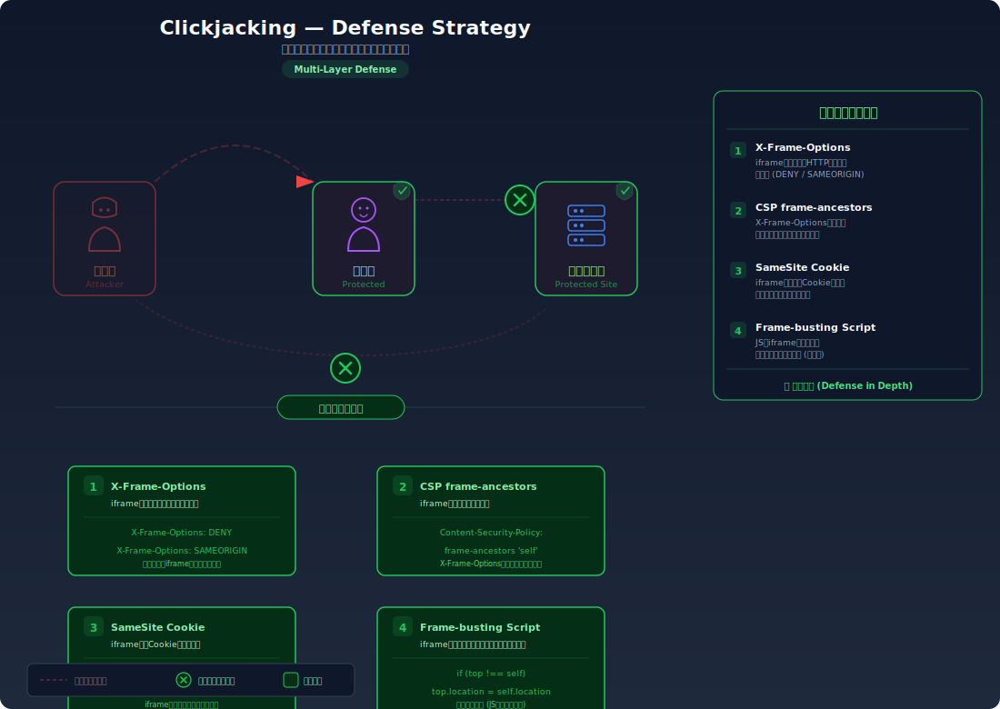

# Clickjacking — 透明iframeによるUI偽装でユーザーに意図しない操作をさせる攻撃

> 攻撃者が用意した罠ページに透明なiframeで正規サイトを重ね、ユーザーが偽のボタンをクリックすると、実際には正規サイト上のボタンが押されてしまう問題です。

---

## 対象ラボ

| 項目 | 内容 |
|------|------|
| **概要** | 正規サイトが iframe への埋め込みを許可しており、攻撃者が透明 iframe を重ねた罠ページで被害者に意図しないクリックをさせる |
| **攻撃例** | 「当選おめでとう」ボタンの裏に「アカウント削除」ボタンを配置し、被害者にクリックさせる |
| **技術スタック** | HTML + CSS (iframe) + Hono API |
| **難易度** | ★☆☆ 入門 |
| **前提知識** | HTML/CSS の基本（iframe, position, opacity, z-index）、HTTPレスポンスヘッダーの概念 |

---

## この脆弱性を理解するための前提

### iframe と Same-Origin Policy の仕組み

ブラウザは `<iframe>` を使って、あるページ内に別のページを埋め込むことができる。Same-Origin Policy により、異なるオリジンの iframe 内の DOM にはアクセスできないが、**iframe 自体の埋め込みはデフォルトで許可されている**。

```html
<!-- 正規サイトを iframe で埋め込む — デフォルトでは拒否されない -->
<iframe src="https://target-bank.com/transfer" width="500" height="300"></iframe>
```

ブラウザは iframe 内のページを完全に描画し、ユーザーのクリックイベントもそのまま iframe 内のページに伝達する。

### どこに脆弱性が生まれるのか

正規サイトが iframe への埋め込みを制限するヘッダー（`X-Frame-Options` や `CSP frame-ancestors`）を設定していない場合、攻撃者は正規サイトを透明な iframe として罠ページに重ねることができる。

```typescript
// ⚠️ X-Frame-Options ヘッダーが未設定
// どのサイトからでも iframe で読み込み可能
app.get("/settings/delete-account", (c) => {
  // このページが攻撃者の iframe に埋め込まれる
  return c.html(`
    <form method="POST" action="/api/delete-account">
      <button type="submit">アカウントを削除</button>
    </form>
  `);
});
```

```css
/* 攻撃者の罠ページ CSS */
iframe {
  position: absolute;
  top: 0; left: 0;
  width: 500px; height: 300px;
  opacity: 0.0001;   /* ⚠️ 透明にして見えなくする */
  z-index: 10;       /* ⚠️ 偽ボタンの上に配置 */
}
```

---

## 攻撃の仕組み



### 攻撃のシナリオ

1. **攻撃者** が透明 iframe 付きの罠ページを作成し、被害者に URL を送る

   罠ページには魅力的なUI（「当選おめでとう！賞品を受け取る」ボタン等）を表示し、その上に正規サイトの操作ページを透明 iframe で重ねる。iframe の `opacity` を `0.0001` に設定し、`z-index` で上に配置する。

2. **被害者** が罠ページにアクセスし、表示されたボタンをクリックする

   被害者には偽のUI（賞品受取ボタン等）だけが見え、透明な iframe の存在には気づかない。ブラウザは iframe 内のページを完全に描画しているため、クリックイベントは iframe 内の正規サイトのボタンに伝達される。

   ```html
   <!-- 被害者が見るもの: 偽のボタン -->
   <button style="position:absolute; top:100px; left:100px;">
     🎉 賞品を受け取る
   </button>
   <!-- 被害者に見えないもの: 透明な iframe 内の「削除」ボタン -->
   <iframe src="https://target.com/delete-account"
           style="opacity:0.0001; z-index:10; position:absolute;">
   </iframe>
   ```

3. **正規サイト** が被害者の認証 Cookie を使って操作を実行する

   被害者は正規サイトにログイン済みのため、ブラウザは自動的に Cookie を送信する。正規サイトは正当なリクエストと区別できず、アカウント削除や送金などの操作を実行してしまう。

   ```
   POST /api/delete-account HTTP/1.1
   Host: target.com
   Cookie: session=abc123   ← 自動送信される
   ```

### なぜ成功するのか

| 条件 | 説明 |
|------|------|
| iframe 埋め込み許可 | `X-Frame-Options` や `CSP frame-ancestors` が未設定で、正規サイトが iframe に読み込まれる |
| CSS による UI 偽装 | `opacity: 0` と `z-index` で iframe を透明化し、偽のボタンを下に配置できる |
| Cookie の自動送信 | ブラウザが iframe 内のリクエストにも Cookie を自動的に付与する |

### 被害の範囲

- **機密性**: 被害者の操作が攻撃者に把握される（例: SNSの「いいね」やフォロー操作）
- **完全性**: アカウント設定の変更、送金、データ削除など意図しない操作が実行される
- **可用性**: アカウント削除やパスワード変更によりサービスが利用不能になる

---

## 対策



### 根本原因

正規サイトが「自分のページを他サイトの iframe に埋め込むことを許可している」こと。ブラウザに対して iframe 埋め込みを拒否する指示を出していないことが問題。

### 安全な実装

`X-Frame-Options` ヘッダーまたは `CSP frame-ancestors` を設定し、iframe への埋め込みを拒否する。

```typescript
// ✅ X-Frame-Options で iframe 埋め込みを拒否
// 全レスポンスにヘッダーを付与するミドルウェア
app.use("*", async (c, next) => {
  await next();
  // DENY: 一切の iframe 埋め込みを禁止
  c.header("X-Frame-Options", "DENY");
  // CSP frame-ancestors: より柔軟な制御（X-Frame-Options の後継）
  c.header("Content-Security-Policy", "frame-ancestors 'self'");
});
```

**なぜ安全か**: ブラウザはレスポンスヘッダーを確認し、`X-Frame-Options: DENY` または `frame-ancestors 'self'` が設定されていれば iframe 内でのページ表示を拒否する。攻撃者の罠ページで iframe を読み込もうとしても、ブラウザがブロックするため攻撃が成立しない。

#### 脆弱 vs 安全: コード比較

```diff
  app.use("*", async (c, next) => {
    await next();
+   c.header("X-Frame-Options", "DENY");
+   c.header("Content-Security-Policy", "frame-ancestors 'self'");
  });
```

この2行のヘッダー追加により、ブラウザが iframe での表示をブロックする。攻撃者のページに透明 iframe を配置しても、正規サイトのコンテンツは一切表示されなくなる。

### その他の防御策

| 対策 | 種類 | 説明 |
|------|------|------|
| `X-Frame-Options: DENY` | 根本対策 | HTTPレスポンスヘッダーで iframe 埋め込みを完全に禁止する |
| `CSP frame-ancestors 'self'` | 根本対策 | X-Frame-Options の後継。オリジン単位で細かく制御可能 |
| `SameSite=Lax` Cookie | 多層防御 | iframe 内からの Cookie 送信を制限し、認証操作を阻止する |
| Frame-busting JS | 補助的 | `if (top !== self) top.location = self.location` でiframe 検知時にリダイレクト。ただし sandbox 属性で無効化可能 |

---

## ハンズオン手順

### Step 1: 脆弱バージョンで攻撃を体験

**ゴール**: 透明 iframe を使って被害者に意図しない操作をさせられることを確認する

1. 開発サーバーを起動する

2. 脆弱なエンドポイントのレスポンスヘッダーを確認する

   ```bash
   curl -I http://localhost:3000/api/labs/clickjacking/vulnerable/target
   ```

   - `X-Frame-Options` ヘッダーが存在しないことを確認する

3. 攻撃者用の罠ページにアクセスする

   ```bash
   # ブラウザで罠ページにアクセス
   open http://localhost:5173/labs/clickjacking
   ```

4. 罠ページの「当選おめでとう」ボタンをクリックする

   - ブラウザの DevTools で iframe の存在を確認する（Elements タブ）
   - iframe の `opacity` を変更して、透明な正規サイトが重なっていることを視覚的に確認する
   - **この結果が意味すること**: ユーザーは自分が何をクリックしたか全く認識できない

### Step 2: 安全バージョンで防御を確認

**ゴール**: `X-Frame-Options` ヘッダーにより iframe 埋め込みが拒否されることを確認する

1. 安全なエンドポイントのレスポンスヘッダーを確認する

   ```bash
   curl -I http://localhost:3000/api/labs/clickjacking/secure/target
   ```

   - `X-Frame-Options: DENY` が返ることを確認する

2. 同じ罠ページから安全なバージョンを読み込もうとする

   - ブラウザの DevTools Console に iframe のブロックエラーが表示されることを確認する
   - iframe 内のコンテンツが表示されないことを確認する

3. コードの差分を確認する

   - `backend/src/labs/clickjacking.ts` の脆弱版と安全版を比較
   - **ヘッダー1行の追加** が攻撃を完全に防いでいることに注目する

### 確認ポイント

以下を自分の言葉で説明できれば、このラボは完了です:

- [ ] クリックジャッキングが成立するための条件は何か（iframe 埋め込み許可 + CSS による透明化）
- [ ] 攻撃者は何を用意し、被害者のブラウザで何が起き、正規サイトで何が実行されるか
- [ ] `X-Frame-Options` と `CSP frame-ancestors` の違いと、それぞれの利点
- [ ] なぜ Frame-busting JS だけでは不十分なのか（`sandbox` 属性による無効化）

---

## 実装メモ

| 項目 | パス |
|------|------|
| 脆弱エンドポイント | `/api/labs/clickjacking/vulnerable/target` |
| 安全エンドポイント | `/api/labs/clickjacking/secure/target` |
| バックエンド | `backend/src/labs/step07-design/clickjacking.ts` |
| フロントエンド | `frontend/src/features/step07-design/pages/Clickjacking.tsx` |

- 脆弱版: `X-Frame-Options` なし。攻撃者用の罠HTMLページを `/vulnerable/trap` で提供
- 安全版: `X-Frame-Options: DENY` + `CSP frame-ancestors 'self'` をレスポンスに付与
- 攻撃デモ: フロントエンドに「罠ページ」コンポーネントを用意し、透明 iframe の挙動を視覚的に体験

---

## 現実世界での事例

| 年 | インシデント | 概要 |
|----|-------------|------|
| 2008 | Adobe Flash 設定ページ | 攻撃者が Adobe の設定ページを iframe に埋め込み、ユーザーの Web カメラとマイクを無断で有効化した |
| 2015 | Facebook 「いいね」ジャッキング | 透明 iframe で Facebook の「いいね」ボタンを重ね、ユーザーに意図しない「いいね」を押させる Likejacking が広く流行した |
| 2017 | Google OAuth 画面 | クリックジャッキングにより OAuth 同意画面のクリックを誘導し、第三者アプリへの権限付与を騙し取る攻撃が報告された |

---

## 関連ラボ

| ラボ | 関連性 |
|------|--------|
| [CSRF](../step04-session/csrf.md) | CSRF も被害者に意図しないリクエストを送らせる攻撃。クリックジャッキングは「クリック」を悪用し、CSRF は「リクエスト」を直接偽造する違いがある |
| [HTTPでの機密データ送信](sensitive-data-http.md) | セキュリティヘッダーの未設定が脆弱性の原因となる点が共通 |

---

## 参考資料

- [OWASP - Clickjacking](https://owasp.org/www-community/attacks/Clickjacking)
- [CWE-1021: Improper Restriction of Rendered UI Layers or Frames](https://cwe.mitre.org/data/definitions/1021.html)
- [MDN - X-Frame-Options](https://developer.mozilla.org/ja/docs/Web/HTTP/Headers/X-Frame-Options)
- [MDN - CSP frame-ancestors](https://developer.mozilla.org/ja/docs/Web/HTTP/Headers/Content-Security-Policy/frame-ancestors)
