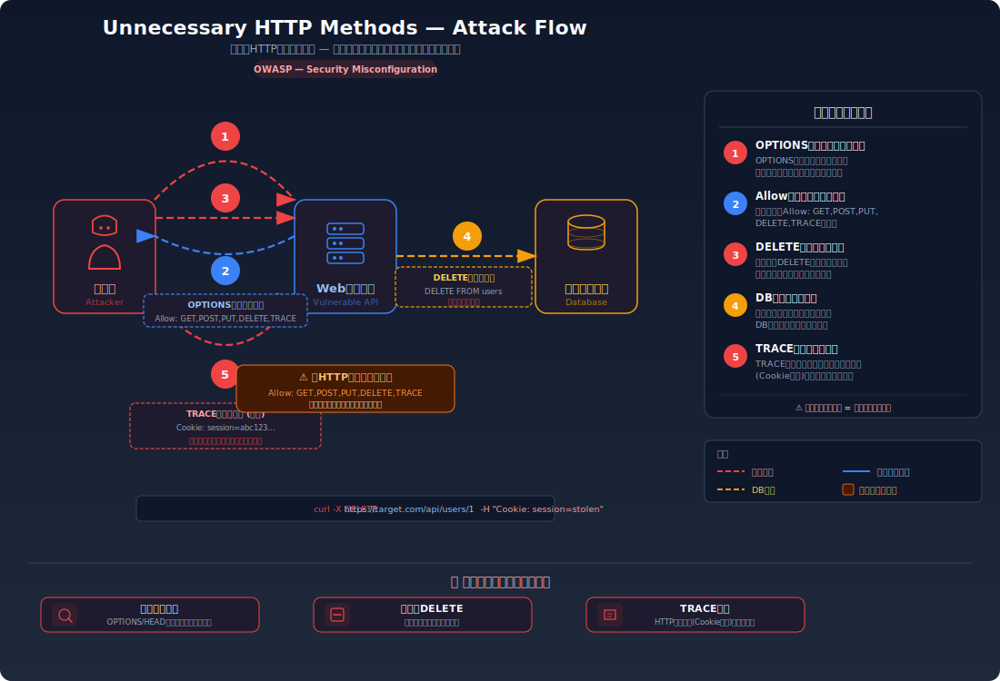
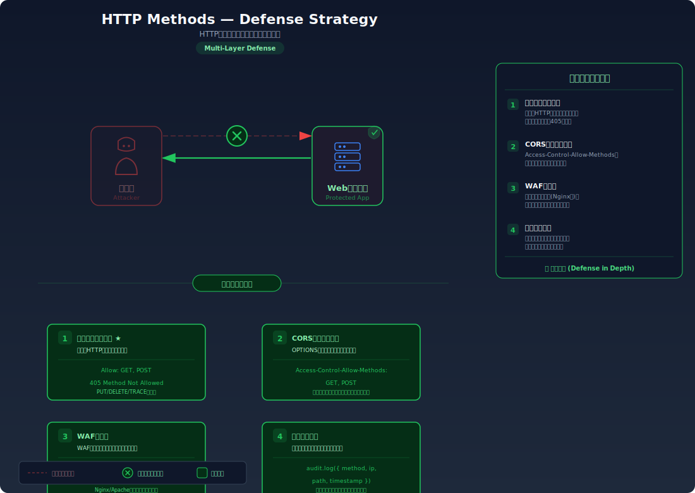

# Unnecessary HTTP Methods — 不要なHTTPメソッドが許可されておりリソースの不正操作が可能

> PUT/DELETE/TRACEなどのメソッドが制限なく受け付けられ、リソースの削除や情報漏洩が発生する問題です。

---

## 対象ラボ

| 項目 | 内容 |
|------|------|
| **概要** | API が全 HTTP メソッドを無制限に受け付けており、意図しないリソースの削除・上書き・情報漏洩が可能 |
| **攻撃例** | `curl -X DELETE /api/users/1` で他ユーザーのリソースを削除 |
| **技術スタック** | Hono API |
| **難易度** | ★☆☆ 入門 |
| **前提知識** | HTTP メソッド（GET, POST, PUT, DELETE, OPTIONS, TRACE）の基本的な役割と用途 |

---

## この脆弱性を理解するための前提

### HTTP メソッドの種類と用途

HTTP プロトコルでは、リクエストの目的を示すために複数のメソッドが定義されている。主要なメソッドとその用途は以下の通り:

| メソッド | 用途 | 一般的な使用場面 |
|----------|------|------------------|
| **GET** | リソースの取得 | ページ表示、データ一覧の取得 |
| **POST** | リソースの作成 | ユーザー登録、フォーム送信 |
| **PUT** | リソースの更新（全体置換） | プロフィール情報の更新 |
| **DELETE** | リソースの削除 | アカウント削除、投稿の削除 |
| **OPTIONS** | 対応メソッドの確認 | CORS プリフライトリクエスト |
| **TRACE** | デバッグ用エコーバック | 送信したリクエストをそのまま返す（本番では不要） |
| **PATCH** | リソースの部分更新 | 特定フィールドのみ変更 |

通常の Web アプリケーションでは、エンドポイントごとに必要なメソッドだけを許可する。たとえばユーザー情報の表示ページであれば GET のみ、新規登録フォームであれば POST のみを受け付けるのが適切な設計である。

### どこに脆弱性が生まれるのか

問題は、開発者がルーティングの定義で **全メソッドを一括で受け付ける** 設定にしている場合に発生する。Hono をはじめとする多くの Web フレームワークには、メソッドを限定せずにすべてのリクエストを処理する `app.all()` のような機能がある。これを安易に使うと、本来想定していないメソッド（DELETE, PUT, TRACE など）によるリクエストもハンドラが処理してしまう。

```typescript
// ⚠️ この部分が問題 — 全メソッドを無制限に受け付けている
app.all('/api/users/:id', async (c) => {
  const id = c.req.param('id');

  // GET でも DELETE でも TRACE でも同じハンドラが実行される
  // メソッドに応じた制御がないため、攻撃者は任意の操作が可能
  if (c.req.method === 'GET') {
    return c.json(await getUser(id));
  }
  if (c.req.method === 'DELETE') {
    // 認証・認可チェックなしで削除が実行される
    await deleteUser(id);
    return c.json({ message: '削除しました' });
  }
  if (c.req.method === 'PUT') {
    const body = await c.req.json();
    await updateUser(id, body);
    return c.json({ message: '更新しました' });
  }
  // TRACE — リクエストヘッダーをそのままレスポンスに返す
  if (c.req.method === 'TRACE') {
    return new Response(c.req.raw.headers.get('cookie') ?? '', {
      headers: { 'Content-Type': 'message/http' },
    });
  }
  return c.json({ error: 'Unknown method' }, 400);
});
```

この状態で OPTIONS リクエストを送ると、サーバーが対応している全メソッドがレスポンスに含まれる:

```
HTTP/1.1 200 OK
Allow: GET, POST, PUT, DELETE, OPTIONS, TRACE
```

攻撃者はこの情報をもとに、DELETE でリソースを削除したり、TRACE で Cookie 情報を窃取したりできる。

---

## 攻撃の仕組み



### 攻撃のシナリオ

1. **攻撃者** が OPTIONS リクエストで対応メソッドを調査する

   OPTIONS メソッドは、サーバーがそのエンドポイントでどのメソッドを受け付けるかを返す。攻撃者はまずこのリクエストで偵察を行う。

   ```bash
   curl -X OPTIONS http://localhost:3000/api/labs/http-methods/vulnerable/users/1 -i
   ```

2. **サーバー** が全メソッドを返す

   レスポンスの `Allow` ヘッダーに、GET だけでなく PUT, DELETE, TRACE など本来不要なメソッドが含まれている。攻撃者は「このエンドポイントは DELETE や TRACE も受け付ける」と判断できる。

   ```
   HTTP/1.1 200 OK
   Allow: GET, POST, PUT, DELETE, OPTIONS, TRACE
   ```

3. **攻撃者** が DELETE リクエストで他ユーザーのリソースを削除する

   認証・認可チェックがないため、ID を指定するだけで任意のユーザーのデータを削除できてしまう。

   ```bash
   curl -X DELETE http://localhost:3000/api/labs/http-methods/vulnerable/users/1
   # → { "message": "ユーザー ID:1 を削除しました" }
   ```

4. **攻撃者** が TRACE リクエストで HTTP ヘッダー（Cookie 含む）を窃取する

   TRACE メソッドはリクエストをそのままエコーバックするため、リクエストに含まれる Cookie やカスタムヘッダーがレスポンスに露出する。XSS と組み合わせると、`HttpOnly` 属性付きの Cookie もスクリプト経由で取得可能になる（Cross-Site Tracing: XST 攻撃）。

   ```bash
   curl -X TRACE http://localhost:3000/api/labs/http-methods/vulnerable/users/1 \
     -H "Cookie: session_id=secret123"
   # → Cookie: session_id=secret123 がレスポンスに含まれる
   ```

5. **攻撃者** が PUT リクエストで他ユーザーのデータを上書きする

   PUT メソッドでリソース全体を置き換えることで、他ユーザーのプロフィール情報やメールアドレスを攻撃者の管理するものに変更できる。

   ```bash
   curl -X PUT http://localhost:3000/api/labs/http-methods/vulnerable/users/1 \
     -H "Content-Type: application/json" \
     -d '{"username": "attacker", "email": "attacker@evil.com"}'
   # → { "message": "ユーザー ID:1 を更新しました" }
   ```

### なぜ成功するのか

| 条件 | 説明 |
|------|------|
| 全メソッドの無制限な許可 | `app.all()` により GET, POST, PUT, DELETE, TRACE などすべてのメソッドがハンドラに到達する。必要なメソッドだけを許可するルーティングになっていない |
| メソッドに応じた認証・認可の欠如 | DELETE や PUT のような破壊的操作に対して、リクエスト元のユーザーが操作権限を持つかの確認がない |
| TRACE メソッドの有効化 | 本番環境で不要な TRACE メソッドが有効なままになっており、リクエストヘッダーの情報漏洩経路となっている |
| OPTIONS レスポンスでの情報公開 | 対応メソッド一覧が攻撃者に公開され、攻撃対象のメソッドを容易に特定できる |

### 被害の範囲

- **機密性**: TRACE メソッドによりリクエストヘッダーがエコーバックされ、セッション Cookie や認証トークンなどの機密情報が漏洩する。XSS と組み合わせた XST 攻撃では `HttpOnly` Cookie も窃取可能
- **完全性**: DELETE メソッドによるリソースの不正削除、PUT メソッドによるデータの改ざん・上書きが可能。管理者ユーザーの情報を書き換えてアカウントを乗っ取ることもできる
- **可用性**: 重要なリソースの削除やデータの破壊により、サービスの正常な運用が不可能になる

---

## 対策



### 根本原因

エンドポイントが **本来必要としないHTTPメソッドまで無制限に受け付けている** ことが根本原因。Web フレームワークの `app.all()` を安易に使用し、メソッドごとの適切なルーティング定義と認証・認可チェックを怠っている。

### 安全な実装

各エンドポイントで必要なメソッドだけを明示的に定義する。Hono では `app.get()`, `app.post()` などメソッド別のルーティング関数を使うことで、許可するメソッドを厳密に制御できる。加えて、TRACE メソッドは無効化し、すべての状態変更操作に認証・認可チェックを組み込む。

```typescript
// ✅ 必要なメソッドのみ明示的に許可し、認証・認可チェックを実装
const app = new Hono();

// GET のみ許可 — ユーザー情報の取得
app.get('/api/users/:id', async (c) => {
  const id = c.req.param('id');
  const user = await getUser(id);
  if (!user) return c.json({ error: 'ユーザーが見つかりません' }, 404);
  return c.json(user);
});

// POST のみ許可 — ユーザーの新規作成（認証必須）
app.post('/api/users', authMiddleware, async (c) => {
  const body = await c.req.json();
  const user = await createUser(body);
  return c.json(user, 201);
});

// DELETE は管理者のみ許可 — 認証 + 認可チェック
app.delete('/api/users/:id', authMiddleware, adminOnly, async (c) => {
  const id = c.req.param('id');
  await deleteUser(id);
  return c.json({ message: '削除しました' });
});

// TRACE は一切受け付けない
// PUT, PATCH 等も必要な場合のみ明示的に定義する

// 未定義のメソッドには 405 Method Not Allowed を返す
app.all('/api/users/*', (c) => {
  return c.json({ error: '許可されていないメソッドです' }, 405);
});
```

#### 脆弱 vs 安全: コード比較

```diff
- // ⚠️ 全メソッドを無制限に受け付け
- app.all('/api/users/:id', async (c) => {
-   const id = c.req.param('id');
-   if (c.req.method === 'GET') {
-     return c.json(await getUser(id));
-   }
-   if (c.req.method === 'DELETE') {
-     await deleteUser(id);
-     return c.json({ message: '削除しました' });
-   }
-   if (c.req.method === 'TRACE') {
-     return new Response(c.req.raw.headers.get('cookie') ?? '');
-   }
-   // ... 全メソッドが認証なしで処理される
- });
+ // ✅ 必要なメソッドのみ許可 + 認証・認可チェック
+ app.get('/api/users/:id', async (c) => {
+   const id = c.req.param('id');
+   return c.json(await getUser(id));
+ });
+
+ app.delete('/api/users/:id', authMiddleware, adminOnly, async (c) => {
+   const id = c.req.param('id');
+   await deleteUser(id);
+   return c.json({ message: '削除しました' });
+ });
+
+ // 未定義のメソッドは 405 を返す
+ app.all('/api/users/*', (c) => {
+   return c.json({ error: '許可されていないメソッドです' }, 405);
+ });
```

脆弱なコードでは `app.all()` により全メソッドが単一のハンドラで処理され、認証・認可のチェックもない。安全なコードでは `app.get()`, `app.delete()` でメソッドを限定し、破壊的操作には認証ミドルウェアと管理者権限チェックを適用している。未定義のメソッドに対しては 405 Method Not Allowed を返すことで、不要なメソッドが処理されることを防いでいる。

### その他の防御策

| 対策 | 種類 | 説明 |
|------|------|------|
| メソッド別ルーティング | 根本対策 | `app.get()`, `app.post()` 等でエンドポイントごとに必要なメソッドだけを定義する。これが最も基本的で効果的な対策 |
| TRACE メソッドの無効化 | 根本対策 | TRACE はデバッグ目的のメソッドであり、本番環境では必ず無効化する。XST 攻撃の防止に直結する |
| 認証・認可ミドルウェア | 根本対策 | 状態変更を伴うメソッド（POST, PUT, DELETE）には認証チェックを必須とし、リソース所有者または管理者のみ操作を許可する |
| 405 Method Not Allowed | 多層防御 | 未許可メソッドに対して 405 を返し、`Allow` ヘッダーで許可メソッドのみを提示する。攻撃者への情報漏洩を最小限にする |
| Web サーバー設定 | 多層防御 | Nginx や Apache の設定レベルで不要なメソッド（TRACE, OPTIONS 等）を拒否する。アプリケーション層の前段でブロックできる |

---

## ハンズオン手順

### Step 1: 脆弱バージョンで攻撃を体験

**ゴール**: 不要なメソッドを使ってリソースの削除・情報取得が成功することを確認する

1. 開発サーバーを起動する

   ```bash
   cd backend && pnpm dev
   ```

2. OPTIONS リクエストで対応メソッドを偵察する

   ```bash
   curl -X OPTIONS http://localhost:3000/api/labs/http-methods/vulnerable/users/1 -i
   ```

3. 結果を確認する

   - `Allow` ヘッダーに `GET, POST, PUT, DELETE, OPTIONS, TRACE` が含まれている
   - **この結果が意味すること**: このエンドポイントが本来不要なメソッドまで受け付けていることが攻撃者に露見する

4. DELETE リクエストでリソースを削除する

   ```bash
   curl -X DELETE http://localhost:3000/api/labs/http-methods/vulnerable/users/1
   ```

5. 結果を確認する

   - `{ "message": "ユーザー ID:1 を削除しました" }` が返される
   - 認証なしで他ユーザーのリソースが削除できてしまっている

6. TRACE リクエストで Cookie 情報を窃取する

   ```bash
   curl -X TRACE http://localhost:3000/api/labs/http-methods/vulnerable/users/1 \
     -H "Cookie: session_id=secret-session-value"
   ```

7. 結果を確認する

   - レスポンスに `Cookie: session_id=secret-session-value` がそのまま含まれている
   - **この結果が意味すること**: TRACE のエコーバック機能により、リクエストヘッダーの機密情報がレスポンスに露出する

8. PUT リクエストで他ユーザーのデータを上書きする

   ```bash
   curl -X PUT http://localhost:3000/api/labs/http-methods/vulnerable/users/1 \
     -H "Content-Type: application/json" \
     -d '{"username": "attacker", "email": "attacker@evil.com"}'
   ```

9. 結果を確認する

   - ユーザー ID:1 のデータが攻撃者の情報に書き換えられている

### Step 2: 安全バージョンで防御を確認

**ゴール**: 不要なメソッドが拒否され、認証・認可なしでは操作が失敗することを確認する

1. OPTIONS リクエストで安全版の対応メソッドを確認する

   ```bash
   curl -X OPTIONS http://localhost:3000/api/labs/http-methods/secure/users/1 -i
   ```

2. 結果を確認する

   - `Allow` ヘッダーに `GET` のみが含まれている
   - TRACE, DELETE, PUT などの不要なメソッドが除外されている

3. DELETE リクエストを試みる

   ```bash
   curl -X DELETE http://localhost:3000/api/labs/http-methods/secure/users/1 -i
   ```

4. 結果を確認する

   - `405 Method Not Allowed` が返される
   - リソースは削除されていない

5. TRACE リクエストを試みる

   ```bash
   curl -X TRACE http://localhost:3000/api/labs/http-methods/secure/users/1 \
     -H "Cookie: session_id=secret-session-value" -i
   ```

6. 結果を確認する

   - `405 Method Not Allowed` が返され、Cookie 情報はレスポンスに含まれていない

7. コードの差分を確認する

   - `backend/src/labs/step07-design/http-methods.ts` の脆弱版と安全版を比較
   - **どの行が違いを生んでいるか** に注目: `app.all()` → `app.get()` + 認証ミドルウェア

### 確認ポイント

以下を自分の言葉で説明できれば、このラボは完了です:

- [ ] `app.all()` と `app.get()` の違いは何か。なぜ `app.all()` が危険なのか
- [ ] TRACE メソッドがなぜ本番環境で無効化すべきなのか（XST 攻撃の仕組みを説明できるか）
- [ ] OPTIONS レスポンスの `Allow` ヘッダーが攻撃者にとってどのような情報になるか
- [ ] メソッド制限だけでは不十分な理由は何か（認証・認可が必要な理由を説明できるか）

---

## 実装メモ

| 項目 | パス |
|------|------|
| 脆弱エンドポイント | `/api/labs/http-methods/vulnerable/users/:id` |
| 安全エンドポイント | `/api/labs/http-methods/secure/users/:id` |
| バックエンド | `backend/src/labs/step07-design/http-methods.ts` |
| フロントエンド | `frontend/src/features/step07-design/pages/HttpMethods.tsx` |

- 脆弱版では `app.all()` で全メソッドを受け付け、認証・認可チェックを行わない
- 安全版では `app.get()` で GET のみ許可し、DELETE は管理者のみ + 認証必須に制限する
- TRACE メソッドは安全版で完全に無効化する
- OPTIONS レスポンスの `Allow` ヘッダーも安全版では必要最小限のメソッドのみ返す

---

## 現実世界での事例

| 年 | インシデント | 概要 |
|----|-------------|------|
| 2003 | Apache Struts (TRACE) | TRACE メソッドが有効なままの Web サーバーで、XST（Cross-Site Tracing）攻撃により `HttpOnly` Cookie が窃取可能であることが実証された |
| 2009 | IIS WebDAV (PUT/DELETE) | Microsoft IIS の WebDAV 拡張が不適切に設定されており、PUT メソッドで Web シェルをアップロードされ、サーバーが完全に制御された事例が多数報告された |
| 2017 | REST API 設計の不備 | 複数の SaaS 製品で、管理用 API エンドポイントが DELETE メソッドを認証なしで受け付けていたことが発覚し、外部からのリソース削除が可能だった |

---

## 関連ラボ

| ラボ | 関連性 |
|------|--------|
| [ビジネスロジックの欠陥](business-logic.md) | メソッド制限とビジネスロジックの検証は共に「意図しない操作を防ぐ」設計の問題。メソッド制限はリクエストレベル、ビジネスロジックはアプリケーションレベルの防御 |
| [署名なしデータの信頼](unsigned-data.md) | クライアントからのリクエストを無条件に信頼する点で共通。メソッド制限ではリクエストの種類、署名なしデータではリクエストの内容が検証されていない |

---

## 参考資料

- [OWASP - Test HTTP Methods](https://owasp.org/www-project-web-security-testing-guide/latest/4-Web_Application_Security_Testing/02-Configuration_and_Deployment_Management_Testing/06-Test_HTTP_Methods)
- [CWE-749: Exposed Dangerous Method or Function](https://cwe.mitre.org/data/definitions/749.html)
