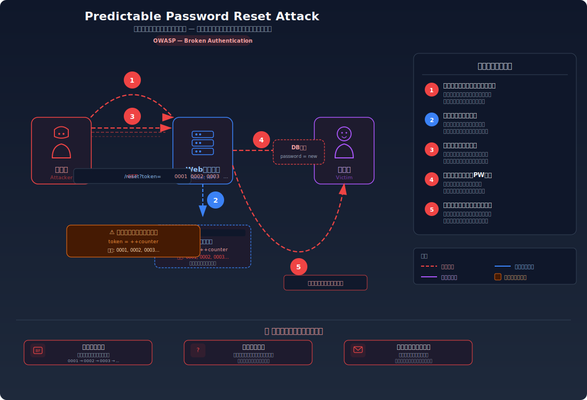
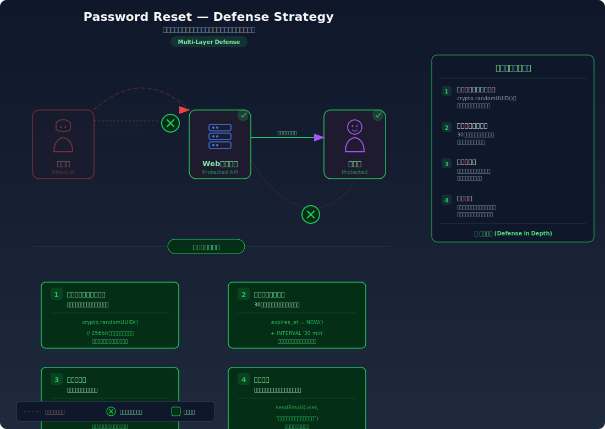

# Predictable Password Reset Token — パスワードリセットトークンが推測可能でアカウントを乗っ取れる

> パスワードリセット用のトークンが連番や短い数値で生成され、攻撃者が総当たりで他人のリセットトークンを推測できてしまう問題です。

---

## 対象ラボ

| 項目 | 内容 |
|------|------|
| **概要** | パスワードリセットトークンが連番（0001, 0002...）で推測可能 |
| **攻撃例** | `/api/reset?token=0001` → 0002 → 0003 と総当たり |
| **技術スタック** | Hono API + PostgreSQL |
| **難易度** | ★★☆ 中級 |
| **前提知識** | パスワードリセットフローの基本、トークンの概念 |

---

## この脆弱性を理解するための前提

### パスワードリセットの正常なフロー

Web アプリケーションにおけるパスワードリセットは、一般的に以下の流れで動作する:

1. **ユーザー** がパスワードを忘れたことを申告し、リセットを要求する
2. **サーバー** がリセット用のトークン（一時的な秘密の値）を生成し、ユーザーのメールアドレスにリセットリンクを送信する
3. **ユーザー** がメール内のリンクをクリックし、トークンをサーバーに送信する
4. **サーバー** がトークンの正当性を検証し、新しいパスワードの設定を許可する

```
POST /api/reset-request
  body: { "email": "alice@example.com" }
→ サーバーがトークンを生成しDBに保存、メールでリセットリンクを送信

GET /api/reset?token=a8f3e2...（メール内のリンク）
→ トークンが一致すれば新パスワード設定フォームを表示

POST /api/reset-password
  body: { "token": "a8f3e2...", "newPassword": "newSecurePass123" }
→ トークンを検証してパスワードを更新
```

この仕組みのセキュリティは、**トークンが本人のメールにしか届かないこと** と **トークンが第三者に推測できないこと** の2つの前提に依存している。

### どこに脆弱性が生まれるのか

問題は、トークンの生成方法が予測可能な場合に発生する。開発者が手軽に実装しようとして、連番（`0001`, `0002`, `0003`...）やタイムスタンプ（`Date.now()`）をトークンとして使用してしまうと、攻撃者はトークンの値を推測・列挙できてしまう。メールにアクセスせずとも、正しいトークンを当てるだけでパスワードをリセットできるため、アカウント乗っ取りが可能になる。

```typescript
// ⚠️ この部分が問題 — トークンが連番で推測可能
let counter = 0;
app.post("/reset-request", async (c) => {
  counter++;
  const token = String(counter).padStart(4, "0"); // 0001, 0002, 0003...
  await db.query(
    "INSERT INTO reset_tokens(token, user_id) VALUES($1, $2)",
    [token, userId]
  );
  // メール送信（省略）
});
```

ここで攻撃者がリセット要求を1回行い、自分に届いたトークンが `0042` だと分かれば、直前の `0041` や直後の `0043` が他のユーザーのトークンであることは容易に推測できる。あるいは `0001` から `9999` まで総当たりしても、わずか1万回の試行で全トークンを網羅できる。

同様に、`Date.now()` を使用した場合も、リクエスト時刻が分かれば前後のミリ秒を探索するだけでトークンを特定できてしまう。

```typescript
// ⚠️ タイムスタンプベースのトークンも推測可能
const token = String(Date.now()); // 例: "1708012345678"
// → 攻撃者がリクエスト時刻を把握していれば、前後数秒の範囲を探索するだけで特定可能
```

---

## 攻撃の仕組み



### 攻撃のシナリオ

1. **攻撃者** がターゲット（被害者）のメールアドレスを指定してパスワードリセットをリクエストする

   攻撃者はターゲットのメールアドレスさえ知っていればよい。リセット要求自体は認証不要で誰でも送信できる。サーバーは被害者のメールアドレスに対してリセットトークンを生成する。

   ```bash
   curl -X POST http://localhost:3000/api/labs/password-reset/vulnerable/reset-request \
     -H "Content-Type: application/json" \
     -d '{"email": "victim@example.com"}'
   ```

2. **サーバー** が連番トークンを生成してDBに保存する

   サーバーは内部カウンターをインクリメントし、`0042` のような連番トークンを生成する。このトークンは被害者のメールに送信されるが、攻撃者はメールの内容を見ることはできない。

3. **攻撃者** がトークンを総当たりで推測する

   攻撃者は `0001` から `9999` までのトークンを順番に試す。連番トークンの空間はわずか1万通りしかなく、自動化スクリプトを使えば数分で全パターンを網羅できる。

   ```bash
   # 0001〜9999を順番に試す自動化スクリプト
   for i in $(seq -w 1 9999); do
     result=$(curl -s -o /dev/null -w "%{http_code}" \
       "http://localhost:3000/api/labs/password-reset/vulnerable/reset?token=$i")
     if [ "$result" = "200" ]; then
       echo "有効なトークン発見: $i"
     fi
   done
   ```

4. **攻撃者** が発見した有効なトークンで被害者のパスワードを変更する

   正しいトークンが見つかれば、攻撃者はそのトークンを使って新しいパスワードを設定する。サーバーはトークンが正しければリクエストを受け入れるため、誰がトークンを送信したかは区別できない。

   ```bash
   curl -X POST http://localhost:3000/api/labs/password-reset/vulnerable/reset-password \
     -H "Content-Type: application/json" \
     -d '{"token": "0042", "newPassword": "attackerPassword123"}'
   ```

5. **攻撃者** が変更後のパスワードでログインし、被害者のアカウントを乗っ取る

   被害者はパスワードが変更されたことに気づかない。次回ログインしようとしたときに初めて異変に気づくが、すでにアカウントは攻撃者の支配下にある。

### なぜ成功するのか

| 条件 | 説明 |
|------|------|
| トークンの予測可能性 | 連番やタイムスタンプなど、規則性のある値がトークンとして使用されているため、攻撃者が次の値や前後の値を容易に推測できる |
| 探索空間の狭さ | 4桁の連番は1万通り、タイムスタンプも前後数秒の範囲に絞れるため、総当たりが現実的な時間で完了する |
| レート制限の欠如 | リセットトークンの検証エンドポイントに試行回数の制限がないため、高速な総当たりが可能 |
| トークンの有効期限なし | トークンが無期限に有効な場合、攻撃者は時間をかけて総当たりを実行できる |

### 被害の範囲

- **機密性**: 攻撃者がパスワードを変更してアカウントを乗っ取ることで、被害者の個人情報、メッセージ、ファイルなどプライベートなデータに不正アクセスできる
- **完全性**: 乗っ取ったアカウントを使って、被害者になりすました投稿・送金・設定変更などの操作が可能。被害者の評判や信用を損なう行為もできる
- **可用性**: パスワード変更やアカウント削除により、正規ユーザーがサービスを利用できなくなる。大量のリセットリクエストによるメールシステムの負荷も問題になりうる

---

## 対策



### 根本原因

トークンの生成に **暗号論的に安全な乱数** を使用していないことが根本原因。連番やタイムスタンプには規則性があり、攻撃者がパターンを特定して推測できてしまう。「メールでしか届かないから安全」という前提は、トークンが推測可能であれば成り立たない。

### 安全な実装

暗号論的に安全な乱数生成器（`crypto.randomUUID()` や `crypto.randomBytes()`）を使用してトークンを生成すると、トークンの値は予測不可能になる。UUID v4 の場合、約 `2^122` 通り（約 5.3 × 10^36）のパターンがあり、総当たりは事実上不可能。

さらに、トークンに **有効期限**（30分など）を設定し、**使用済みトークンを無効化** することで、攻撃の時間的余地を大幅に制限する。

```typescript
import { randomUUID } from "crypto";

// ✅ 暗号論的に安全なランダムトークン + 有効期限 + 使用済み無効化
app.post("/reset-request", async (c) => {
  const { email } = await c.req.json();
  const user = await db.query("SELECT id FROM users WHERE email = $1", [email]);
  if (user.rows.length === 0) {
    // ユーザーが存在しない場合も同じレスポンスを返す（列挙防止）
    return c.json({ message: "リセットメールを送信しました" });
  }

  // crypto.randomUUID() で推測不可能なトークンを生成
  const token = randomUUID(); // 例: "f47ac10b-58cc-4372-a567-0e02b2c3d479"

  // 有効期限を30分に設定
  const expiresAt = new Date(Date.now() + 30 * 60 * 1000);

  await db.query(
    "INSERT INTO reset_tokens(token, user_id, expires_at, used) VALUES($1, $2, $3, false)",
    [token, user.rows[0].id, expiresAt]
  );

  // メール送信（省略）
  return c.json({ message: "リセットメールを送信しました" });
});

app.post("/reset-password", async (c) => {
  const { token, newPassword } = await c.req.json();

  // トークンの検証: 存在確認 + 有効期限 + 未使用
  const result = await db.query(
    "SELECT user_id FROM reset_tokens WHERE token = $1 AND expires_at > NOW() AND used = false",
    [token]
  );

  if (result.rows.length === 0) {
    return c.json({ error: "無効または期限切れのトークンです" }, 400);
  }

  // パスワードを更新
  await db.query("UPDATE users SET password = $1 WHERE id = $2", [
    hashedPassword, // 実際にはbcrypt等でハッシュ化する
    result.rows[0].user_id,
  ]);

  // 使用済みに設定（再利用防止）
  await db.query("UPDATE reset_tokens SET used = true WHERE token = $1", [token]);

  return c.json({ message: "パスワードを変更しました" });
});
```

#### 脆弱 vs 安全: コード比較

```diff
- let counter = 0;
  app.post("/reset-request", async (c) => {
-   counter++;
-   const token = String(counter).padStart(4, "0"); // ⚠️ 連番: 推測可能
+   const token = randomUUID(); // ✅ 暗号論的に安全な乱数: 推測不可能
+   const expiresAt = new Date(Date.now() + 30 * 60 * 1000); // ✅ 30分の有効期限
    await db.query(
-     "INSERT INTO reset_tokens(token, user_id) VALUES($1, $2)",
-     [token, userId]
+     "INSERT INTO reset_tokens(token, user_id, expires_at, used) VALUES($1, $2, $3, false)",
+     [token, userId, expiresAt]
    );
  });

  app.post("/reset-password", async (c) => {
    const { token, newPassword } = await c.req.json();
    const result = await db.query(
-     "SELECT user_id FROM reset_tokens WHERE token = $1",
+     "SELECT user_id FROM reset_tokens WHERE token = $1 AND expires_at > NOW() AND used = false",
      [token]
    );
    // ...パスワード更新処理...
+   // ✅ 使用済みに設定して再利用を防止
+   await db.query("UPDATE reset_tokens SET used = true WHERE token = $1", [token]);
  });
```

脆弱なコードでは `++counter` による連番がトークンとして使用されており、4桁の数字空間しかないため総当たりが容易。安全なコードでは `crypto.randomUUID()` による予測不可能なトークンを使用し、有効期限と使用済みフラグにより攻撃の時間的余地も排除している。

### その他の防御策

| 対策 | 種類 | 説明 |
|------|------|------|
| 暗号論的に安全なトークン生成 | 根本対策 | `crypto.randomUUID()` や `crypto.randomBytes(32)` を使用し、予測不可能なトークンを生成する。最も重要で必須の対策 |
| トークンの有効期限 | 根本対策 | トークンに30分程度の有効期限を設定し、期限切れトークンを拒否する。攻撃者が総当たりに使える時間を制限する |
| 使用済みトークンの無効化 | 根本対策 | トークンを一度使用したら即座に無効化する。トークンの再利用を防止する |
| レート制限 | 多層防御 | リセットトークン検証エンドポイントに試行回数の制限を設ける。短時間の大量リクエストをブロックすることで、万一トークンの強度が不足していても総当たりを困難にする |
| アカウントロックアウト | 多層防御 | 同一トークンに対する連続失敗時にアカウントへのリセット操作を一時的にロックする |
| ユーザー列挙の防止 | 多層防御 | 存在しないメールアドレスに対しても「リセットメールを送信しました」と同じレスポンスを返す。攻撃者が有効なメールアドレスを特定するのを防ぐ |

---

## ハンズオン手順

### Step 1: 脆弱バージョンで攻撃を体験

**ゴール**: 連番トークンを総当たりして、他人のアカウントのパスワードをリセットできることを確認する

1. 開発サーバーを起動する

   ```bash
   cd backend && pnpm dev
   ```

2. まず自分のアカウントでリセットを要求し、トークンのパターンを確認する

   ```bash
   # 自分のアカウントでリセットを要求
   curl -X POST http://localhost:3000/api/labs/password-reset/vulnerable/reset-request \
     -H "Content-Type: application/json" \
     -d '{"email": "attacker@example.com"}'
   ```

   レスポンスまたはDB内のトークンを確認し、連番であることを把握する（例: `0005`）。

3. ターゲットのパスワードリセットを要求する

   ```bash
   # ターゲットのリセットを要求（トークンはターゲットのメールに届くが、攻撃者はメールを見ない）
   curl -X POST http://localhost:3000/api/labs/password-reset/vulnerable/reset-request \
     -H "Content-Type: application/json" \
     -d '{"email": "victim@example.com"}'
   ```

4. 連番トークンを総当たりする

   ```bash
   # 0001〜0100の範囲で総当たり（実際のラボではトークンの範囲は小さい）
   for i in $(seq -w 1 100); do
     result=$(curl -s http://localhost:3000/api/labs/password-reset/vulnerable/reset?token=$i)
     if echo "$result" | grep -q "valid"; then
       echo "有効なトークン発見: $i"
     fi
   done
   ```

5. 発見したトークンで被害者のパスワードを変更する

   ```bash
   curl -X POST http://localhost:3000/api/labs/password-reset/vulnerable/reset-password \
     -H "Content-Type: application/json" \
     -d '{"token": "0006", "newPassword": "attackerPassword123"}'
   ```

6. 結果を確認する

   - 被害者のパスワードが `attackerPassword123` に変更されている
   - 攻撃者は被害者のメールにアクセスすることなく、トークンの推測だけでリセットに成功した
   - **この結果が意味すること**: トークンの推測可能性が「メール経由でのみ本人に届く」というセキュリティの前提を完全に無効化している

### Step 2: 安全バージョンで防御を確認

**ゴール**: 同じ総当たり攻撃が暗号論的に安全なトークンにより失敗することを確認する

1. 安全なエンドポイントでリセットを要求する

   ```bash
   curl -X POST http://localhost:3000/api/labs/password-reset/secure/reset-request \
     -H "Content-Type: application/json" \
     -d '{"email": "victim@example.com"}'
   ```

2. 総当たりを試みる（UUID の空間は広すぎて成功しない）

   ```bash
   # 連番での総当たりは無意味
   curl -s http://localhost:3000/api/labs/password-reset/secure/reset?token=0001
   # → "無効なトークンです"

   # ランダムなUUIDを試しても当たらない
   curl -s http://localhost:3000/api/labs/password-reset/secure/reset?token=550e8400-e29b-41d4-a716-446655440000
   # → "無効なトークンです"
   ```

3. 有効期限の動作を確認する

   - 正規のトークンを取得し、30分以上経過後に使用を試みる
   - 期限切れのトークンが拒否されることを確認する

4. コードの差分を確認する

   - `backend/src/labs/step07-design/password-reset.ts` の脆弱版と安全版を比較
   - **どの行が違いを生んでいるか** に注目: `++counter` → `randomUUID()`、有効期限の追加、使用済みフラグの追加

### 確認ポイント

以下を自分の言葉で説明できれば、このラボは完了です:

- [ ] 連番トークンがなぜ危険なのか（総当たりに必要な試行回数を具体的に説明できるか）
- [ ] `crypto.randomUUID()` が生成するトークンの空間の大きさと、総当たりが非現実的である理由を説明できるか
- [ ] 有効期限と使用済み無効化がそれぞれどのような攻撃を防ぐのか
- [ ] トークンが安全でもレート制限が必要な理由を説明できるか（多層防御の考え方）

---

## 実装メモ

| 項目 | パス |
|------|------|
| 脆弱エンドポイント (リセット要求) | `/api/labs/password-reset/vulnerable/reset-request` |
| 脆弱エンドポイント (トークン検証) | `/api/labs/password-reset/vulnerable/reset` |
| 脆弱エンドポイント (パスワード変更) | `/api/labs/password-reset/vulnerable/reset-password` |
| 安全エンドポイント (リセット要求) | `/api/labs/password-reset/secure/reset-request` |
| 安全エンドポイント (トークン検証) | `/api/labs/password-reset/secure/reset` |
| 安全エンドポイント (パスワード変更) | `/api/labs/password-reset/secure/reset-password` |
| バックエンド | `backend/src/labs/step07-design/password-reset.ts` |
| フロントエンド | `frontend/src/features/step07-design/pages/PasswordReset.tsx` |
| DB | `docker/db/init.sql` の `users`, `reset_tokens` テーブルを使用 |

- 脆弱版では `++counter` による連番をトークンとして使用し、有効期限を設けない
- 安全版では `crypto.randomUUID()` による暗号論的に安全なトークンを使用し、30分の有効期限と使用済みフラグを持つ
- リセットトークンテーブルには `token`, `user_id`, `expires_at`, `used` カラムが必要
- ユーザー列挙を防ぐため、存在しないメールアドレスに対しても同一のレスポンスを返す

---

## 現実世界での事例

| 年 | インシデント | 概要 |
|----|-------------|------|
| 2012 | GitHub | パスワードリセット機能で弱い乱数生成器が使用されており、攻撃者がトークンを推測してアカウントを乗っ取れる脆弱性が報告された。GitHub はトークン生成ロジックを修正して対応した |
| 2014 | Snapchat | 電話番号の列挙が可能な API と組み合わせて、パスワードリセット機能を悪用するアカウント乗っ取り手法が報告された。460万件のユーザー情報が漏洩する事態に発展した |

---

## 関連ラボ

| ラボ | 関連性 |
|------|--------|
| [レート制限なし](rate-limiting.md) | リセットトークン検証にレート制限がなければ、たとえトークンの空間が多少広くても総当たりが現実的になる。推測可能なトークンとレート制限の欠如は組み合わさると被害が拡大する |
| [署名なしデータ](unsigned-data.md) | トークンに署名がない場合、攻撃者がトークンを改ざんしてユーザー ID を書き換える攻撃が可能になる。「クライアントから送られたデータを検証なしに信頼する」という共通のパターン |

---

## 参考資料

- [OWASP - Forgot Password Cheat Sheet](https://cheatsheetseries.owasp.org/cheatsheets/Forgot_Password_Cheat_Sheet.html)
- [CWE-640: Weak Password Recovery Mechanism for Forgotten Password](https://cwe.mitre.org/data/definitions/640.html)
